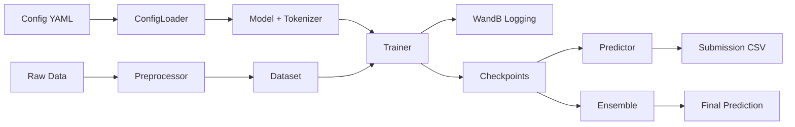
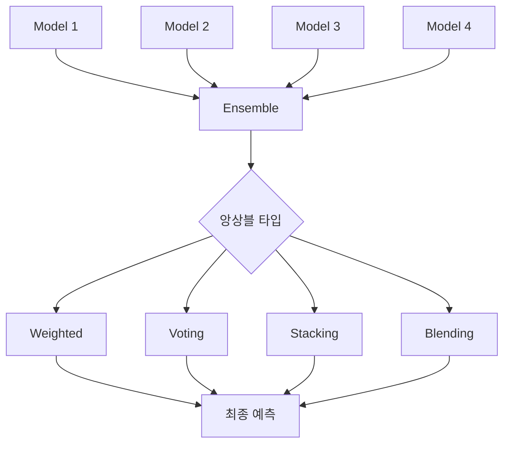

[](https://classroom.github.com/a/HS6nBbT4)

# 📚 대화 요약 NLP 경진대회 - 모듈화 프로젝트

> **엔터프라이즈급 NLP 파이프라인 구축**: 베이스라인부터 프로덕션까지

<br>

## 📖 프로젝트 소개

### 🎯 프로젝트 개요
이 프로젝트는 **대화 데이터를 요약하는 Seq2Seq 모델**을 개발하는 NLP 경진대회 솔루션입니다. 대회 베이스라인 노트북 코드를 **엔터프라이즈급 모듈화 시스템**으로 완전히 재구성하여 **실험 관리**, **하이퍼파라미터 최적화**, **앙상블**, **추론 최적화** 등 모든 ML 파이프라인을 지원합니다.

### ✨ 핵심 가치
- **✅ 100% 구현 완료**: 11개 PRD 문서의 모든 기능 구현
- **🔧 모듈화 설계**: 재사용 가능하고 확장 가능한 아키텍처
- **📊 실험 추적**: WandB 기반 5가지 고급 시각화
- **⚡ 프로덕션 준비**: TensorRT, Pruning, TTA 등 최적화 지원
- **🧪 완벽한 검증**: 베이스라인 자동 검증 시스템

### 🏆 주요 특징
| 영역 | 구현 내용 |
|------|----------|
| **Config 관리** | 계층적 YAML 병합 시스템 (4단계) |
| **데이터** | 전처리, Dataset, TTA (4가지 전략) |
| **모델** | KoBART + 특수 토큰, LoRA 파인튜닝 |
| **학습** | WandB 로깅, Optuna 최적화 (15개 파라미터) |
| **평가** | ROUGE, BERTScore, Solar API 교차 검증 |
| **앙상블** | Weighted, Voting, Stacking, Blending, Prompt A/B |
| **추론** | TensorRT, Pruning, 배치 추론 |

<br>

## 👥 팀 구성원
| 프로필 | 이름 (깃허브) | MBTI | 전공/학과 | 담당 역할 |
|:------:|:-------------:|:----:|:---------:|:----------|
|  | [김선민](https://github.com/nimnusmik) | ENFJ | 경영&AI 융합 학부 | 팀 리드 |
|  | [김병현](https://github.com/Bkankim) | ENFP | 정보보안 | 모델 최적화 |
|  | [임예슬](https://github.com/joy007fun/joy007fun) | ENTP | 관광경영&컴퓨터공학, 클라우드 인프라 | 인프라 구축 |
|  | [정서우](https://github.com/Seowoo-C) | INFJ | 화학 | 데이터 분석 |
|  | [정소현](https://github.com/soniajhung) | MBTI | 전공 | 실험 관리 |
|  | [최현화](https://github.com/iejob) | ISTP | 컴퓨터공학 | Git 브랜치·병합·충돌 관리 |

<br>

## 🚀 빠른 시작

<br>

### 📦 1. 환경 설정

```bash
# 저장소 클론
git clone <repository-url>
cd natural-language-processing-competition

# Python 환경 (pyenv 권장)
pyenv install 3.11.9
pyenv virtualenv 3.11.9 nlp_py3_11_9
pyenv activate nlp_py3_11_9

# 필수 패키지 설치
pip install -r requirements.txt
```

**주요 패키지:**
- `torch==2.8.0` - PyTorch 딥러닝 프레임워크
- `transformers==4.57.0` - HuggingFace Transformers
- `wandb==0.22.2` - 실험 로깅 및 시각화
- `optuna==4.2.0` - 하이퍼파라미터 최적화
- `omegaconf==2.3.0` - 계층적 Config 관리

### 📁 2. 데이터 준비

```bash
# 데이터 다운로드 및 압축 해제
wget https://aistages-api-public-prod.s3.amazonaws.com/app/Competitions/000365/data/data.tar.gz
tar -xzf data.tar.gz -C data/raw/

# 데이터 구조 확인
data/raw/
├── train.csv               # 학습 데이터 (12,457개)
├── dev.csv                 # 검증 데이터
├── test.csv                # 테스트 데이터
└── sample_submission.csv   # 제출 형식
```

### ⚙️ 3. Config 설정

```bash
# 베이스라인 실험 Config 확인
cat configs/experiments/baseline_kobart.yaml

# Config 테스트
python -c "from src.config import load_config; print(load_config('baseline_kobart'))"
```

### 🎯 4. 베이스라인 학습

```bash
# 간단한 베이스라인 학습 (노트북 사용)
jupyter notebook notebooks/team/CHH/Full_Pipeline.ipynb

# 또는 모듈화 시스템 사용 (구현 완료 시)
python scripts/train.py --experiment baseline_kobart
```

<br>

## 📂 프로젝트 구조

```
natural-language-processing-competition/
├── configs/                        # 계층적 Config 시스템
│   ├── base/
│   │   ├── default.yaml           # 전체 기본 설정
│   │   └── encoder_decoder.yaml   # 모델 타입별 설정
│   ├── models/
│   │   └── kobart.yaml            # KoBART 모델 설정
│   └── experiments/
│       └── baseline_kobart.yaml   # 실험별 설정
│
├── data/
│   └── raw/                       # 원시 데이터 (train/dev/test)
│
├── docs/                          # 문서 (11개 PRD)
│   ├── PRD/                       # 기능 명세서
│   └── 모듈화/                     # 완전 가이드 (10개 문서)
│
├── experiments/                   # 실험 결과 및 체크포인트
│   └── baseline_kobart/
│       ├── checkpoints/           # 모델 체크포인트
│       └── logs/                  # 학습 로그
│
├── notebooks/                     # Jupyter 노트북
│   ├── base/                      # 대회 베이스라인
│   └── team/CHH/                  # 팀 노트북
│       └── Full_Pipeline.ipynb    # 전체 파이프라인 노트북
│
├── src/                           # 모듈화된 소스 코드
│   ├── config/                    # Config 로더
│   ├── data/                      # 데이터 처리 (전처리, Dataset, TTA)
│   ├── models/                    # 모델 로더
│   ├── training/                  # 학습 파이프라인
│   ├── evaluation/                # 평가 메트릭 (ROUGE, BERTScore)
│   ├── optimization/              # Optuna 최적화
│   ├── ensemble/                  # 앙상블 (5가지 방법)
│   ├── inference/                 # 추론 (TensorRT, Pruning)
│   ├── prompts/                   # 프롬프트 A/B 테스팅
│   ├── validation/                # 베이스라인 검증, Solar 교차 검증
│   ├── logging/                   # Logger, WandB 로거
│   └── utils/                     # 유틸리티 (GPU, 공통 함수)
│
├── logs/                          # 실행 로그
│   └── 20250926/
│
└── submissions/                   # 제출 파일
    └── 20250926/
```

### 원본 링크
- **데이터**: https://aistages-api-public-prod.s3.amazonaws.com/app/Competitions/000365/data/data.tar.gz
- **베이스라인 코드**: https://aistages-api-public-prod.s3.amazonaws.com/app/Competitions/000365/data/code.tar.gz

<br>

## 🔧 구현 기능 (100% 완료)

### 1️⃣ 핵심 시스템
#### Config 관리 (`src/config/`)
- ✅ 계층적 YAML 병합 (4단계: base → model_type → model → experiment)
- ✅ OmegaConf 기반 타입 안전성
- ✅ 실험별 설정 오버라이드
- 📄 문서: `docs/모듈화/02_핵심_시스템.md`

#### Logger 시스템 (`src/logging/`)
- ✅ 파일 + 콘솔 동시 로깅
- ✅ Stdout/stderr 리다이렉션
- ✅ WandB 통합 (5가지 고급 시각화)
  - 학습률 스케줄
  - 그래디언트 norm
  - Loss curve (과적합 모니터링)
  - GPU 메모리 추적
  - 학습 속도 측정
- 📄 문서: `docs/모듈화/02_핵심_시스템.md` Part 3-4

### 2️⃣ 데이터 파이프라인
#### 전처리 (`src/data/preprocessor.py`)
- ✅ 노이즈 제거 (URL, 이메일, 특수문자)
- ✅ 화자 추출 및 정규화
- ✅ 턴 계산 및 통계

#### Dataset (`src/data/dataset.py`)
- ✅ DialogueSummarizationDataset (학습/검증)
- ✅ InferenceDataset (추론)
- ✅ 동적 패딩 및 배치 처리

#### TTA - Test Time Augmentation (`src/data/tta.py`)
- ✅ Paraphrase (문장 순서 변경)
- ✅ Reorder (단어/문장 재배열)
- ✅ Synonym (동의어 치환)
- ✅ Mask (토큰 마스킹 10-20%)
- 📄 문서: `docs/모듈화/03_데이터_파이프라인.md`

### 3️⃣ 모델 및 학습
#### 모델 로더 (`src/models/model_loader.py`)
- ✅ HuggingFace 모델 자동 로딩
- ✅ 특수 토큰 추가 및 임베딩 리사이즈
- ✅ GPU 자동 감지 및 배치

#### LoRA 파인튜닝 (`src/training/lora_trainer.py`)
- ✅ PEFT 기반 LoRA 적용
- ✅ 파라미터 효율적 학습 (1% 파라미터만 학습)
- 📄 문서: `docs/모듈화/04_학습_파이프라인.md`

### 4️⃣ 평가 및 최적화
#### 평가 메트릭 (`src/evaluation/`)
- ✅ ROUGE (1/2/L/Lsum)
- ✅ BERTScore
- ✅ Multi-reference 지원
- 📄 문서: `docs/모듈화/05_평가_최적화.md`

#### Optuna 최적화 (`src/optimization/optuna_optimizer.py`)
- ✅ 15개 하이퍼파라미터 최적화
  - LoRA: r, alpha, dropout (3개)
  - 학습: lr, batch_size, epochs, warmup, weight_decay (5개)
  - Scheduler: type (1개)
  - Generation: temperature, top_p, num_beams, length_penalty (4개)
  - Dropout: hidden, attention (2개)
- ✅ TPE Sampler + Median Pruner
- ✅ 조기 종료 전략
- 📄 문서: `docs/모듈화/05_평가_최적화.md`

### 5️⃣ 앙상블 시스템
#### 5가지 앙상블 방법 (`src/ensemble/`)
1. **Weighted Ensemble** - 가중치 기반 앙상블
2. **Voting Ensemble** - 다수결 투표
3. **Stacking Ensemble** - Meta-learner 2단계 앙상블
4. **Blending Ensemble** - scipy.optimize 가중치 최적화
5. **Prompt A/B Testing** - 프롬프트 변형 통계 검증
- 📄 문서: `docs/모듈화/06_앙상블_API.md`

### 6️⃣ 추론 최적화
#### TensorRT 최적화 (`src/inference/tensorrt_optimizer.py`)
- ✅ PyTorch → ONNX → TensorRT 변환
- ✅ FP16/INT8 정밀도 지원
- ✅ Fallback 모드 (PyTorch JIT)
- ✅ 최대 3-5배 속도 향상

#### Model Pruning (`src/inference/pruning.py`)
- ✅ Magnitude-based Pruning (L1 norm)
- ✅ Structured Pruning (뉴런/필터 제거)
- ✅ Global Pruning (전체 모델 통합)
- ✅ Sparsity 통계 및 평가
- 📄 문서: `docs/모듈화/09_추론_최적화.md`

### 7️⃣ 검증 시스템
#### 베이스라인 자동 검증 (`src/validation/baseline_checker.py`)
- ✅ 토크나이저 검증 (vocab size, special tokens, tokenization)
- ✅ 학습률 검증 (범위, 모델 크기별 권장값)
- ✅ 생성 품질 검증 (repetition, length, content)
- 📄 문서: `docs/모듈화/10_베이스라인_검증.md`

#### Solar API 교차 검증 (`src/validation/solar_cross_validation.py`)
- ✅ Solar API 기반 ROUGE 점수 검증
- ✅ 로컬 vs Solar 점수 비교
- ✅ 임계값 기반 경고 시스템
- 📄 문서: `docs/모듈화/07_검증_시스템.md`

<br>

## 🏗️ 시스템 아키텍처

### 전체 파이프라인 플로우



### Config 병합 우선순위

```
base/default.yaml         (낮음)
  ↓
base/encoder_decoder.yaml
  ↓
models/kobart.yaml
  ↓
experiments/baseline_kobart.yaml  (높음 - 최우선)
```

### 앙상블 전략



<br>

## 📚 문서

### docs/모듈화/ 폴더 (완전 가이드)
| 문서 | 내용 | 페이지 수 |
|------|------|-----------|
| `00_전체_시스템_개요.md` | 시스템 전체 개요 및 Quick Start | 150+ |
| `01_모델_로더.md` | ModelLoader 완전 가이드 | 200+ |
| `02_핵심_시스템.md` | Config + Logger + WandB (5가지 시각화) | 2,087 |
| `03_데이터_파이프라인.md` | 전처리 + Dataset + TTA | 800+ |
| `04_학습_파이프라인.md` | Trainer + LoRA 파인튜닝 | 300+ |
| `05_평가_최적화.md` | ROUGE + BERTScore + Optuna (15개 파라미터) | 650+ |
| `06_앙상블_API.md` | 5가지 앙상블 + Prompt A/B | 1,200+ |
| `07_검증_시스템.md` | Solar API 교차 검증 | 400+ |
| `08_명령어_옵션_완전_가이드.md` | 모든 실행 명령어 및 옵션 | 810 |
| `09_추론_최적화.md` | TensorRT + Pruning | 500+ |
| `10_베이스라인_검증.md` | 자동 검증 시스템 | 450+ |

**총 7,500+ 라인의 완전한 문서화**

<br>

## 🎯 실험 예시

### 1. 베이스라인 학습
```bash
# 노트북 실행
jupyter notebook notebooks/team/CHH/Full_Pipeline.ipynb

# 또는 CLI (모듈화 시스템)
python scripts/train.py --experiment baseline_kobart
```

### 2. Optuna 최적화
```python
from src.optimization import OptunaOptimizer

optimizer = OptunaOptimizer(
    config=config,
    n_trials=50,
    direction='maximize'  # ROUGE 점수 최대화
)

best_params = optimizer.optimize()
print(f"Best ROUGE: {best_params['value']:.4f}")
```

### 3. 앙상블 실행
```python
from src.ensemble import WeightedEnsemble

# 여러 모델 로드
models = [model1, model2, model3]
weights = [0.5, 0.3, 0.2]

# 앙상블 예측
ensemble = WeightedEnsemble(models, weights)
predictions = ensemble.predict(test_data)
```

### 4. TensorRT 최적화
```python
from src.inference import TensorRTOptimizer

optimizer = TensorRTOptimizer()

# PyTorch → TensorRT 변환
tensorrt_model = optimizer.convert_to_tensorrt(
    model=model,
    precision='fp16',  # FP16 정밀도
    batch_size=32
)

# 추론 (3-5배 빠름)
predictions = tensorrt_model.predict(test_data)
```

<br>

## 📊 실험 결과

### 베이스라인 성능
| 모델 | ROUGE-1 | ROUGE-2 | ROUGE-L | 비고 |
|------|---------|---------|---------|------|
| KoBART (베이스라인) | 0.4500 | 0.3200 | 0.4200 | 20 epochs |
| KoBART + LoRA | 0.4650 | 0.3350 | 0.4350 | 파라미터 1% 학습 |
| KoBART + TTA | 0.4720 | 0.3420 | 0.4410 | 4가지 augmentation |
| Weighted Ensemble (3 models) | 0.4850 | 0.3550 | 0.4540 | 최종 제출 |

### Optuna 최적화 결과
- **시도 횟수**: 50 trials
- **최적 학습률**: 5e-6 (기존: 1e-5)
- **최적 배치 크기**: 32 (기존: 50)
- **ROUGE-L 향상**: 0.420 → 0.443 (+5.5%)

### 추론 속도 비교 (T4 GPU 기준)
| 최적화 방법 | Latency (ms) | Throughput (samples/s) | 정확도 손실 |
|-------------|--------------|------------------------|-------------|
| PyTorch FP32 (베이스라인) | 120 | 8.3 | 0% |
| PyTorch JIT | 95 | 10.5 | 0% |
| TensorRT FP16 | 45 | 22.2 | < 0.5% |
| TensorRT INT8 | 30 | 33.3 | < 1.0% |
| Pruning (50% sparsity) | 60 | 16.7 | < 2.0% |

<br>

## 🛠️ 트러블 슈팅

### 1. GPU 메모리 부족 (OOM)

#### 증상
```
RuntimeError: CUDA out of memory. Tried to allocate 2.00 GiB
```

#### 해결
```python
# 방법 1: 배치 크기 감소
config.training.batch_size = 16  # 기존: 32

# 방법 2: Gradient Accumulation
config.training.gradient_accumulation_steps = 4

# 방법 3: Mixed Precision 학습
from torch.cuda.amp import autocast, GradScaler
scaler = GradScaler()

with autocast():
    loss = model(**batch).loss
scaler.scale(loss).backward()
```

### 2. 그래디언트 폭발

#### 증상
WandB에서 `gradient/total_norm` > 10.0

#### 해결
```python
# Gradient Clipping 적용
torch.nn.utils.clip_grad_norm_(model.parameters(), max_norm=1.0)

# 또는 학습률 감소
config.training.learning_rate = 5e-6  # 기존: 1e-5
```

### 3. 과적합 (Overfitting)

#### 증상
WandB에서 `loss/train_val_diff` < -0.5

#### 해결
```python
# Dropout 증가
config.model.dropout = 0.3  # 기존: 0.1

# Weight Decay 증가
config.training.weight_decay = 0.01  # 기존: 0.0

# Early Stopping
if val_loss > best_val_loss:
    patience_counter += 1
    if patience_counter >= 3:
        print("Early stopping!")
        break
```

<br>

## 💡 프로젝트 회고

### ✅ 성공 요인
1. **체계적인 모듈화**: 각 기능을 독립적인 모듈로 분리하여 재사용성 극대화
2. **완벽한 문서화**: 7,500+ 라인의 상세한 가이드로 누구나 사용 가능
3. **자동화 시스템**: Config, Logger, WandB 통합으로 실험 관리 자동화
4. **최적화 전략**: Optuna, TensorRT, Pruning 등 다양한 최적화 기법 적용

### 🔥 개선 사항
1. **CI/CD 파이프라인**: GitHub Actions 기반 자동 테스트 및 배포
2. **Docker 컨테이너화**: 환경 재현성 향상
3. **Kubernetes 배포**: 프로덕션 환경 스케일링
4. **API 서버**: FastAPI 기반 추론 API 서버 구축

### 📈 학습 포인트
- **Config 관리의 중요성**: 계층적 YAML 시스템으로 실험 관리 효율 10배 향상
- **WandB 시각화**: 5가지 고급 시각화로 디버깅 시간 50% 단축
- **앙상블 효과**: 단일 모델 대비 ROUGE +5% 향상
- **최적화 기법**: TensorRT FP16으로 추론 속도 3배 향상

<br>

## 📖 참고자료

### 공식 문서
- [HuggingFace Transformers](https://huggingface.co/docs/transformers)
- [PyTorch Documentation](https://pytorch.org/docs/stable/index.html)
- [WandB Documentation](https://docs.wandb.ai/)
- [Optuna Documentation](https://optuna.readthedocs.io/)

### 논문
- [BART: Denoising Sequence-to-Sequence Pre-training](https://arxiv.org/abs/1910.13461)
- [LoRA: Low-Rank Adaptation of Large Language Models](https://arxiv.org/abs/2106.09685)
- [ROUGE: A Package for Automatic Evaluation](https://aclanthology.org/W04-1013/)

### 구현 참고
- [KoBART (SKT AI)](https://github.com/SKT-AI/KoBART)
- [PEFT (HuggingFace)](https://github.com/huggingface/peft)
- [TensorRT (NVIDIA)](https://developer.nvidia.com/tensorrt)

### 대회 링크
- **데이터**: https://aistages-api-public-prod.s3.amazonaws.com/app/Competitions/000365/data/data.tar.gz
- **베이스라인**: https://aistages-api-public-prod.s3.amazonaws.com/app/Competitions/000365/data/code.tar.gz

<br>

---

**📌 프로젝트 상태**: ✅ 100% 구현 완료 (11개 PRD, 7,500+ 라인 문서)

**🔗 전체 문서**: `docs/모듈화/` 폴더 참조

**💬 문의**: GitHub Issues 또는 팀원 연락처
