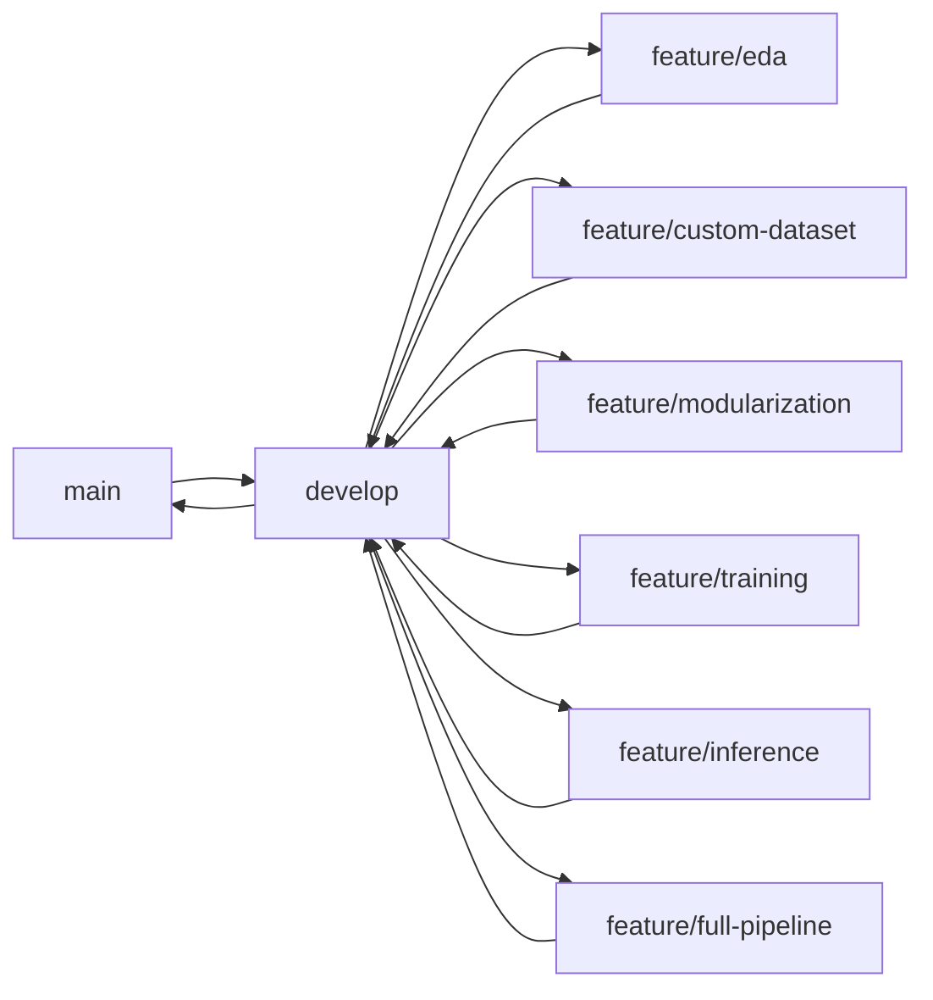

# 🌿 Git 브랜치 전략

## 현재 브랜치 구조
```
main                    # 메인 브랜치 (최종 코드)
├── develop            # 개발 통합 브랜치
├── feature/eda        # EDA 작업 브랜치 (현재 위치)
├── feature/custom-dataset  # 커스텀 데이터셋 구성
├── feature/modularization  # 코드 모듈화 작업
├── feature/training       # 모델 학습 개선
├── feature/inference      # 추론 최적화
└── feature/full-pipeline  # 전체 파이프라인 구축
```

## 브랜치별 작업 계획

### 🔍 feature/eda (현재 브랜치)
**담당 작업**: 탐색적 데이터 분석
- [ ] 데이터 통계 분석
  - 대화 길이 분포
  - 참여자 수 분포
  - 토픽별 분포
- [ ] 텍스트 분석
  - 단어 빈도 분석
  - 특수 토큰 분석
  - 노이즈 패턴 파악
- [ ] 시각화
  - 워드클라우드
  - 분포 그래프
  - 상관관계 분석

### 📦 feature/custom-dataset
**담당 작업**: 데이터셋 전처리 및 증강
- [ ] 데이터 전처리
  - 노이즈 제거 (\\n, <br> 등)
  - 특수 토큰 정규화
  - 텍스트 정제
- [ ] 데이터 증강
  - 패러프레이징
  - 백트랜슬레이션
  - 문장 순서 변경
- [ ] 데이터 로더 구현
  - 효율적인 배치 처리
  - 캐싱 메커니즘

### 🔧 feature/modularization
**담당 작업**: 코드 모듈화
- [ ] 데이터 모듈
  - DataLoader 클래스
  - Preprocessor 클래스
  - Augmentation 클래스
- [ ] 모델 모듈
  - BaseModel 클래스
  - BARTModel 클래스
  - T5Model 클래스
- [ ] 유틸리티 모듈
  - Config 관리
  - Logger 설정
  - Metrics 계산

### 🚂 feature/training
**담당 작업**: 학습 프로세스 개선
- [ ] 학습 전략
  - Learning Rate Scheduler
  - Early Stopping
  - Gradient Accumulation
  - Mixed Precision Training
- [ ] 하이퍼파라미터 튜닝
  - Optuna 활용 (100+ trials)
  - 단계적 최적화
  - 병렬 실행
- [ ] 모델 실험
  - SOLAR-10.7B (최우선)
  - Polyglot-Ko-12.8B
  - KULLM-v2
  - K-Fold 교차 검증
  - 다중 모델 앙상블

### 🎯 feature/inference
**담당 작업**: 추론 최적화
- [ ] 추론 속도 개선
  - Batch 추론
  - Model Quantization (4bit/8bit)
  - LoRA/QLoRA 최적화
- [ ] TTA (Text Test Augmentation)
  - 패러프레이징
  - 순서 변경
  - 동의어 치환
- [ ] 앙상블
  - 5-모델 앙상블
  - Weighted Voting
  - Stacking

### 🔄 feature/full-pipeline
**담당 작업**: 전체 파이프라인 통합
- [ ] End-to-End 파이프라인
  - 데이터 로드
  - 전처리
  - 학습
  - 평가
  - 추론
  - 제출
- [ ] 자동화 스크립트
  - 실험 관리
  - 결과 추적
  - 성능 비교

## 추가 권장 브랜치

### 🆕 feature/experiment-tracking
**담당 작업**: 실험 추적 및 관리
- MLflow 설정
- WandB 연동
- 실험 결과 자동 기록

### 🆕 feature/api-integration
**담당 작업**: 외부 API 통합
- Solar API 최적화
- OpenAI API 실험 (무료 크레딧)
- Prompt Engineering

### 🆕 feature/post-processing
**담당 작업**: 후처리 최적화
- 규칙 기반 후처리
- 문법 교정
- 요약문 품질 개선

## 브랜치 워크플로우



## 커밋 컨벤션
- `feat:` 새로운 기능 추가
- `fix:` 버그 수정
- `docs:` 문서 수정
- `style:` 코드 포맷팅
- `refactor:` 코드 리팩토링
- `test:` 테스트 코드
- `chore:` 빌드, 패키지 관련

## 머지 규칙
1. develop 브랜치로 PR 생성
2. 코드 리뷰 진행
3. 테스트 통과 확인
4. develop 머지
5. 주기적으로 main 브랜치 업데이트