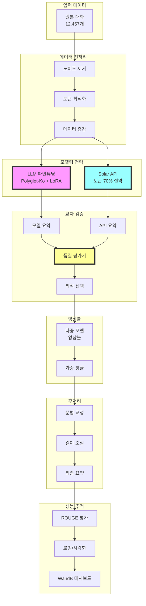

# 🚀 성능 개선 전략 (v2.0)

## 📈 현재 상황 분석
- **KoBART 성능**: ROUGE Sum 94.51 (검증 완료)
- **Llama-3.2-Korean-3B**: ROUGE Sum 49.52 (Zero-shot 1위)
- **목표**: 95점 이상 (ROUGE-1 + ROUGE-2 + ROUGE-L)

## 🆕 핵심 전략 변경사항
1. **LLM 파인튜닝 접근법**: 인코더-디코더 대신 디코더 전용 LLM 사용
2. **Solar API 최적화**: CSV 데이터 전처리로 토큰 70-75% 절약
3. **교차 검증 시스템**: 모델과 API 결과 비교로 최적 요약 선택

## 🏗️ 통합 성능 개선 아키텍처



## 🎯 개선 전략

### 1. 데이터 전처리 최적화
#### 1.1 노이즈 제거
- [ ] `\\n` → `\n` 변환
- [ ] `<br>` 태그 제거
- [ ] 중복 공백 제거
- [ ] 특수문자 정규화
- [ ] 자모음 단독 사용 처리 (ㅋㅋ, ㅇㅇ 등)

#### 1.2 특수 토큰 처리
- [ ] Person 토큰 최적화 (#Person1#, #Person2# 등)
- [ ] 마스킹 토큰 활용 전략
- [ ] 토크나이저 특수 토큰 추가

#### 1.3 데이터 증강
- [ ] 패러프레이징 (KoGPT 활용)
- [ ] 백트랜슬레이션 (한→영→한)
- [ ] 문장 순서 섞기
- [ ] 동의어 치환
- [ ] 대화 턴 샘플링

### 2. 모델 개선 (LLM 파인튜닝 중심)
#### 2.1 모델 선택 전략 변경 ✨
##### 인코더-디코더 모델 (검증 완료)
| 모델 | 특징 | ROUGE Sum | 상태 |
|------|------|-----------|------|
| KoBART | digit82/kobart-summarization | **94.51** | ✅ 완료 |
| KoT5 | paust/pko-t5-base | N/A | ❌ 제외 (Overflow) |

##### 디코더 전용 LLM (QLoRA 4bit)
| 모델 | 파라미터 | Zero-shot | 파인튜닝 목표 |
|------|----------|-----------|---------------|
| Llama-3.2-Korean-3B | 3B | **49.52** | 95+ |
| Qwen3-4B-Instruct | 4B | 45.02 | 95+ |
| Qwen2.5-7B-Instruct | 7B | 46.84 | 95+ |
| Llama-3-Korean-8B | 8B | 48.61 | 95+ |

#### 2.2 LLM Fine-tuning 전략
- [ ] **LoRA/QLoRA 적용** (메모리 90% 절약)
- [ ] **Instruction Tuning** (다양한 프롬프트 템플릿)
- [ ] **Mixed Precision Training** (fp16/bf16)
- [ ] **Gradient Accumulation** (큰 배치 효과)
- [ ] **Gradient Checkpointing** (메모리 최적화)

#### 2.3 하이퍼파라미터 최적화 (베이스라인 검증)
```python
# Encoder-Decoder (KoBART) - 대회 베이스라인
encoder_decoder_params = {
    'learning_rate': 1e-5,  # 베이스라인 검증값
    'batch_size': 50,       # 베이스라인: 큰 배치가 핵심
    'num_train_epochs': 20,
    'encoder_max_len': 512,
    'decoder_max_len': 100,
    'warmup_ratio': 0.1,
    'weight_decay': 0.01,
    'lr_scheduler_type': 'cosine',
    'num_beams': 4,
    'no_repeat_ngram_size': 2,  # 베이스라인: 2가 최적
    'early_stopping_patience': 3
}

# LLM (QLoRA 4bit)
llm_params = {
    'learning_rate': 5e-5,
    'batch_size': 8,  # effective batch=64 (gradient_accumulation=8)
    'num_train_epochs': 20,
    'encoder_max_len': 1024,  # Prompt truncation 방지
    'decoder_max_len': 200,   # 여유 확보
    'warmup_ratio': 0.1,
    'weight_decay': 0.1,
    'lora_r': 16,
    'lora_alpha': 32,
    'lora_dropout': 0.05
}
```

### 3. Solar API 최적화 (토큰 절약 중심) 💰
#### 3.1 토큰 사용량 최적화 전략
- [ ] **CSV 데이터 전처리** (70-75% 토큰 절약)
  - 불필요한 공백 제거
  - Person 태그 간소화 (#Person1# → A:)
  - 반복 패턴 제거
- [ ] **핵심 부분 추출**
  - 처음과 끝 부분 우선
  - 긴 문장 우선 (정보 밀도 높음)
- [ ] **스마트 절단** (문장 단위로 자르기)
- [ ] **배치 처리** (여러 대화 한번에)
- [ ] **캐싱 메커니즘** (중복 호출 방지)

#### 3.2 프롬프트 최적화
```python
# 기존: 800-1200 토큰/대화
# 최적화 후: 200-300 토큰/대화
optimized_params = {
    'max_input_tokens': 512,
    'batch_size': 10,
    'cache_enabled': True,
    'preprocessing': True
}
```

### 4. 교차 검증 시스템 (새로운 핵심 전략) 🔄
#### 4.1 듀얼 생성 시스템
- [ ] **파인튜닝 모델 요약 생성**
- [ ] **Solar API 요약 생성**
- [ ] **품질 평가기로 비교**
- [ ] **최적 요약 선택**

#### 4.2 품질 평가 메트릭
- [ ] **길이 적절성** (원본의 20-30%)
- [ ] **키워드 포함도** (핵심 명사 coverage)
- [ ] **문장 일관성** (coherence)
- [ ] **정보 밀도** (고유 단어 비율)

### 5. 앙상블 전략 (고급)
#### 5.1 모델 앙상블
- [ ] **LLM 모델들 앙상블** (Polyglot + KoGPT + LLaMA)
- [ ] **LLM + Solar API 하이브리드**
- [ ] **다양한 체크포인트 앙상블**
- [ ] **Cross-validation 앙상블**

#### 5.2 앙상블 방법
- [ ] **Voting** (가장 많이 나온 내용)
- [ ] **신뢰도 가중 평균**
- [ ] **최고 품질 선택**
- [ ] **Stacking**

### 6. 후처리 최적화
#### 6.1 규칙 기반 후처리
- [ ] 문장 부호 정규화
- [ ] 주어 생략 복원
- [ ] 조사 교정
- [ ] 길이 조절 (너무 짧거나 긴 요약 처리)

#### 6.2 품질 개선
- [ ] 문법 검사기 적용
- [ ] 중복 문장 제거
- [ ] 핵심 정보 보존 검증

### 7. 평가 및 분석
#### 7.1 에러 분석
- [ ] 낮은 점수 샘플 분석
- [ ] 대화 길이별 성능 분석
- [ ] 참여자 수별 성능 분석
- [ ] 토픽별 성능 분석

#### 7.2 A/B 테스팅
- [ ] 전처리 방법별 비교
- [ ] 모델별 비교
- [ ] 하이퍼파라미터별 비교

## 📅 실행 계획

### Week 1 (09/26 - 10/02)
- [x] 프로젝트 셋업 및 베이스라인 구축
- [ ] EDA 및 데이터 분석
- [ ] 전처리 파이프라인 구축
- [ ] 모델 실험 환경 구축

### Week 2 (10/03 - 10/09)
- [ ] 다양한 모델 실험
- [ ] 하이퍼파라미터 튜닝
- [ ] Solar API 최적화
- [ ] 앙상블 실험

### Week 3 (10/10 - 10/15)
- [ ] 최종 모델 선정
- [ ] 후처리 최적화
- [ ] 최종 제출물 생성
- [ ] 문서화 및 정리

## 🎯 예상 성능 향상 (업데이트)
### 검증된 성능 데이터
| 모델 | ROUGE-1 | ROUGE-2 | ROUGE-L | ROUGE Sum | 상태 |
|------|---------|---------|---------|-----------|------|
| KoBART | 51.98 | 26.61 | 47.03 | **94.51** | ✅ 완료 |
| Llama-3.2-Korean (bf16) | TBD | TBD | TBD | 95+ 목표 | 🔄 진행중 |
| Llama-3.2-Korean (fp16) | TBD | TBD | TBD | 95+ 목표 | ⏳ 대기 |
| Qwen3-4B | TBD | TBD | TBD | 95+ 목표 | ⏳ 대기 |

### 앙상블 전략 로드맵
| 단계 | 전략 | 예상 성능 | 비고 |
|------|------|----------|------|
| 1단계 | KoBART 단독 | 94.51 | 검증 완료 |
| 2단계 | Llama-3.2 최적화 | 95-98 | QLoRA 파인튜닝 |
| 3단계 | KoBART + Llama 앙상블 | 96-99 | 가중 평균 |
| 4단계 | 다중 모델 앙상블 | 97-100 | 3-4개 모델 |
| 5단계 | 교차 검증 + 앙상블 | 98-101 | Solar API 통합 |

## 💡 추가 아이디어 및 핵심 인사이트
### 혁신적 접근법
1. **멀티태스크 러닝**: 요약 + 주제 분류 동시 학습
2. **Curriculum Learning**: 쉬운 샘플부터 점진적 학습
3. **Knowledge Distillation**: 큰 모델에서 작은 모델로 지식 전달
4. **Semi-supervised Learning**: 라벨 없는 대화 데이터 활용
5. **Active Learning**: 불확실한 샘플 우선 학습

### 핵심 인사이트
#### 언제 LLM 모델을 신뢰할까?
- 짧고 명확한 대화 (300-800자)
- 2인 대화
- 학습 데이터와 유사한 패턴

#### 언제 Solar API를 신뢰할까?
- 복잡한 다자 대화 (3인 이상)
- 긴 대화 (1000자 이상)
- 특수한 도메인이나 전문 용어

#### 하이브리드의 강점
- 두 방법의 장점 결합
- 안정적인 성능 보장
- 비용 효율적 (토큰 절약)

## 🔥 최종 권장 구현 순서
1. **LLM 파인튜닝 환경 구축** (Polyglot-Ko + LoRA)
2. **Solar API 토큰 최적화** 구현
3. **교차 검증 시스템** 개발
4. **A/B 테스팅**으로 최적 조합 찾기
5. **앙상블 및 후처리** 적용