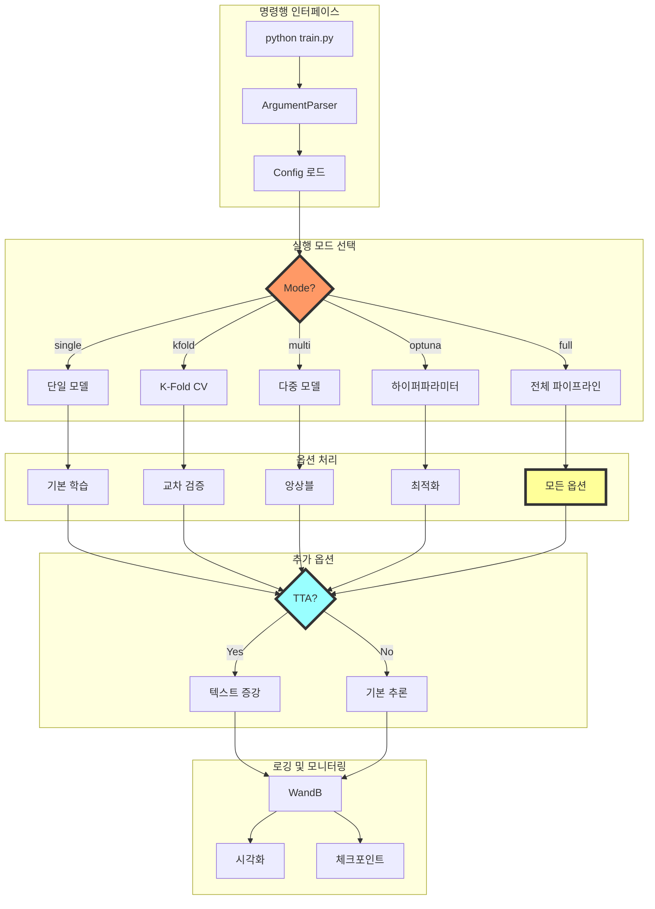
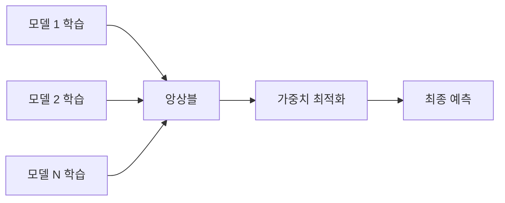
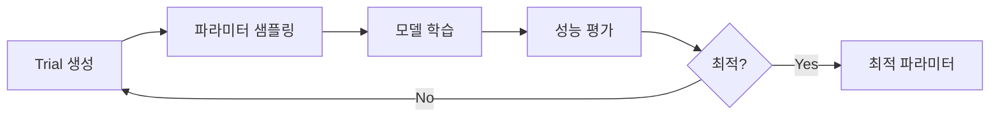

# ⚙️ 통합 실행 옵션 시스템

## 🎯 개요
컴퓨터 비전 프로젝트에서 검증된 유연한 실행 옵션 시스템을 NLP 대화 요약 태스크에 최적화하여 적용

## 🏗️ 실행 시스템 아키텍처



## 🚀 메인 실행 스크립트

### train.py - 통합 실행 인터페이스
```python
#!/usr/bin/env python3
"""
NLP 대화 요약 통합 학습 스크립트
컴퓨터 비전 프로젝트 구조를 NLP에 최적화
"""

import argparse
import os
import sys
from pathlib import Path

# 프로젝트 경로 추가
sys.path.append(str(Path(__file__).parent))

from src.logging import Logger, WandBLogger
from src.utils.gpu_optimization import team_gpu_check, auto_batch_size
from src.utils.config import load_config, set_seed
from src.utils.visualizations import create_training_visualizations

from src.trainers import (
    SingleModelTrainer,
    KFoldTrainer,
    MultiModelEnsembleTrainer,
    OptunaOptimizer,
    FullPipelineTrainer
)

def parse_arguments():
    """명령행 인자 파싱"""
    parser = argparse.ArgumentParser(
        description='NLP 대화 요약 모델 학습 - 유연한 실행 옵션',
        formatter_class=argparse.RawDescriptionHelpFormatter
    )

    # ==================== 기본 설정 ====================
    parser.add_argument(
        '--mode',
        type=str,
        default='single',
        choices=['single', 'kfold', 'multi_model', 'optuna', 'full'],
        help='''실행 모드 선택:
        single: 단일 모델 학습 (빠른 실험)
        kfold: K-Fold 교차 검증 (안정성)
        multi_model: 다중 모델 앙상블 (성능)
        optuna: 하이퍼파라미터 최적화 (자동화)
        full: 전체 파이프라인 (최종 제출)'''
    )

    parser.add_argument(
        '--config',
        type=str,
        default='configs/train_config.yaml',
        help='설정 파일 경로'
    )

    parser.add_argument(
        '--experiment_name',
        type=str,
        default=None,
        help='실험명 (자동 생성: {mode}_{model}_{timestamp})'
    )

    # ==================== 모델 선택 ====================
    parser.add_argument(
        '--models',
        type=str,
        nargs='+',
        default=['solar-10.7b'],
        choices=[
            'solar-10.7b',
            'polyglot-ko-12.8b',
            'kullm-v2',
            'koalpaca',
            'ldcc-solar',
            'all'  # 모든 모델
        ],
        help='사용할 모델 (multi_model 모드에서 여러 개 선택 가능)'
    )

    parser.add_argument(
        '--use_lora',
        action='store_true',
        help='LoRA 사용 (메모리 절약)'
    )

    parser.add_argument(
        '--lora_r',
        type=int,
        default=16,
        help='LoRA rank'
    )

    # ==================== 학습 설정 ====================
    parser.add_argument(
        '--epochs',
        type=int,
        default=3,
        help='에폭 수'
    )

    parser.add_argument(
        '--batch_size',
        type=int,
        default=None,
        help='배치 크기 (None: 자동 탐색)'
    )

    parser.add_argument(
        '--learning_rate',
        type=float,
        default=2e-5,
        help='학습률'
    )

    parser.add_argument(
        '--gradient_accumulation_steps',
        type=int,
        default=1,
        help='Gradient accumulation steps'
    )

    # ==================== K-Fold 설정 ====================
    parser.add_argument(
        '--k_folds',
        type=int,
        default=5,
        help='K-Fold 수 (kfold 모드)'
    )

    parser.add_argument(
        '--fold_seed',
        type=int,
        default=42,
        help='Fold 분할 시드'
    )

    # ==================== 앙상블 설정 ====================
    parser.add_argument(
        '--ensemble_strategy',
        type=str,
        default='weighted_avg',
        choices=[
            'averaging',
            'weighted_avg',
            'majority_vote',
            'stacking',
            'blending',
            'rouge_weighted'
        ],
        help='앙상블 전략'
    )

    parser.add_argument(
        '--ensemble_weights',
        type=float,
        nargs='+',
        default=None,
        help='모델별 가중치 (자동 최적화 가능)'
    )

    # ==================== TTA 설정 ====================
    parser.add_argument(
        '--use_tta',
        action='store_true',
        help='Test Time Augmentation 사용'
    )

    parser.add_argument(
        '--tta_strategies',
        type=str,
        nargs='+',
        default=['paraphrase'],
        choices=['paraphrase', 'reorder', 'synonym', 'mask'],
        help='TTA 전략'
    )

    parser.add_argument(
        '--tta_num_aug',
        type=int,
        default=3,
        help='TTA 증강 수'
    )

    # ==================== Optuna 설정 ====================
    parser.add_argument(
        '--optuna_trials',
        type=int,
        default=100,
        help='Optuna 시도 횟수'
    )

    parser.add_argument(
        '--optuna_timeout',
        type=int,
        default=7200,
        help='Optuna 제한 시간 (초)'
    )

    parser.add_argument(
        '--optuna_sampler',
        type=str,
        default='tpe',
        choices=['tpe', 'gp', 'random', 'cmaes'],
        help='Optuna 샘플러'
    )

    parser.add_argument(
        '--optuna_pruner',
        type=str,
        default='median',
        choices=['median', 'percentile', 'hyperband'],
        help='Optuna 가지치기'
    )

    parser.add_argument(
        '--optuna_n_jobs',
        type=int,
        default=1,
        help='병렬 실행 수'
    )

    # ==================== 생성 설정 ====================
    parser.add_argument(
        '--temperature',
        type=float,
        default=0.5,
        help='생성 temperature'
    )

    parser.add_argument(
        '--top_p',
        type=float,
        default=0.9,
        help='Top-p (nucleus) sampling'
    )

    parser.add_argument(
        '--num_beams',
        type=int,
        default=4,
        help='Beam search 크기'
    )

    parser.add_argument(
        '--max_new_tokens',
        type=int,
        default=100,
        help='최대 생성 토큰'
    )

    # ==================== 로깅 및 모니터링 ====================
    parser.add_argument(
        '--use_wandb',
        action='store_true',
        help='WandB 사용'
    )

    parser.add_argument(
        '--wandb_project',
        type=str,
        default='dialogue-summarization',
        help='WandB 프로젝트명'
    )

    parser.add_argument(
        '--log_level',
        type=str,
        default='INFO',
        choices=['DEBUG', 'INFO', 'WARNING', 'ERROR'],
        help='로그 레벨'
    )

    parser.add_argument(
        '--save_visualizations',
        action='store_true',
        help='시각화 저장'
    )

    # ==================== 기타 옵션 ====================
    parser.add_argument(
        '--seed',
        type=int,
        default=42,
        help='랜덤 시드'
    )

    parser.add_argument(
        '--gpu_check',
        action='store_true',
        help='GPU 호환성 체크'
    )

    parser.add_argument(
        '--auto_batch',
        action='store_true',
        help='자동 배치 크기 탐색'
    )

    parser.add_argument(
        '--debug',
        action='store_true',
        help='디버그 모드 (적은 데이터)'
    )

    parser.add_argument(
        '--resume_from',
        type=str,
        default=None,
        help='체크포인트에서 재개'
    )

    return parser.parse_args()

def setup_environment(args):
    """환경 설정"""
    # 시드 설정
    set_seed(args.seed)

    # GPU 체크
    if args.gpu_check:
        print("=" * 50)
        team_gpu_check.check_gpu_compatibility()
        print("=" * 50)

    # 자동 배치 크기
    if args.auto_batch and args.batch_size is None:
        print("🔍 최적 배치 크기 탐색 중...")
        args.batch_size = auto_batch_size.find_optimal_batch_size(
            model_name=args.models[0],
            max_length=1024
        )
        print(f"✅ 최적 배치 크기: {args.batch_size}")

    # 실험명 자동 생성
    if args.experiment_name is None:
        from datetime import datetime
        timestamp = datetime.now().strftime("%Y%m%d_%H%M%S")
        model_name = args.models[0].replace('-', '_')
        args.experiment_name = f"{args.mode}_{model_name}_{timestamp}"

    # 출력 디렉토리 생성
    output_dir = Path(f"experiments/{args.experiment_name}")
    output_dir.mkdir(parents=True, exist_ok=True)
    args.output_dir = str(output_dir)

    # 로거 설정
    logger = Logger(
        log_path=output_dir / "train.log",
        print_also=True
    )
    logger.start_redirect()

    # WandB 설정
    wandb_logger = None
    if args.use_wandb:
        wandb_logger = WandBLogger(
            project_name=args.wandb_project,
            experiment_name=args.experiment_name,
            config=vars(args)
        )

    return logger, wandb_logger

def get_trainer(args, logger, wandb_logger):
    """모드에 따른 Trainer 선택"""
    trainer_map = {
        'single': SingleModelTrainer,
        'kfold': KFoldTrainer,
        'multi_model': MultiModelEnsembleTrainer,
        'optuna': OptunaOptimizer,
        'full': FullPipelineTrainer
    }

    trainer_class = trainer_map[args.mode]
    return trainer_class(args, logger, wandb_logger)

def main():
    """메인 실행 함수"""
    # 인자 파싱
    args = parse_arguments()

    print("=" * 50)
    print("🚀 NLP 대화 요약 학습 시작")
    print(f"📋 실행 모드: {args.mode}")
    print(f"🤖 모델: {', '.join(args.models)}")
    print("=" * 50)

    # 환경 설정
    logger, wandb_logger = setup_environment(args)

    try:
        # Trainer 생성
        trainer = get_trainer(args, logger, wandb_logger)

        # 학습 실행
        print(f"\n📊 {args.mode.upper()} 모드 실행 중...")
        results = trainer.train()

        # 결과 저장
        trainer.save_results(results)

        # 시각화
        if args.save_visualizations:
            print("\n📈 시각화 생성 중...")
            create_training_visualizations(
                fold_results=results,
                model_name=args.models[0],
                output_dir=args.output_dir
            )

        print("\n✅ 학습 완료!")
        print(f"📁 결과 저장: {args.output_dir}")

        # 최종 성능 출력
        if 'best_rouge' in results:
            print(f"🏆 최고 ROUGE-F1: {results['best_rouge']:.4f}")

    except Exception as e:
        logger.write(f"❌ 오류 발생: {e}", print_error=True)
        raise

    finally:
        # 정리
        logger.stop_redirect()
        logger.close()
        if wandb_logger:
            wandb_logger.finish()

if __name__ == "__main__":
    main()
```

## 📋 실행 예시 모음

### 1. 빠른 실험 모드
```bash
# 단일 모델 빠른 테스트
python train.py \
    --mode single \
    --models solar-10.7b \
    --epochs 1 \
    --debug

# LoRA로 메모리 절약
python train.py \
    --mode single \
    --models polyglot-ko-12.8b \
    --use_lora \
    --lora_r 8 \
    --epochs 3
```

### 2. 안정적 검증 모드
```bash
# 5-Fold 교차 검증
python train.py \
    --mode kfold \
    --models solar-10.7b \
    --k_folds 5 \
    --epochs 5 \
    --use_wandb

# 3-Fold + TTA
python train.py \
    --mode kfold \
    --models kullm-v2 \
    --k_folds 3 \
    --use_tta \
    --tta_strategies paraphrase reorder
```

### 3. 고성능 앙상블 모드
```bash
# 3개 모델 앙상블
python train.py \
    --mode multi_model \
    --models solar-10.7b polyglot-ko-12.8b kullm-v2 \
    --ensemble_strategy weighted_avg \
    --epochs 5

# 5개 모델 + TTA 앙상블
python train.py \
    --mode multi_model \
    --models all \
    --ensemble_strategy stacking \
    --use_tta \
    --tta_num_aug 5
```

### 4. 자동 최적화 모드
```bash
# Optuna 기본 최적화
python train.py \
    --mode optuna \
    --models solar-10.7b \
    --optuna_trials 50 \
    --optuna_timeout 3600

# 병렬 Optuna (4 GPU)
python train.py \
    --mode optuna \
    --models polyglot-ko-12.8b \
    --optuna_trials 200 \
    --optuna_n_jobs 4 \
    --optuna_sampler tpe
```

### 5. 풀 파이프라인 (대회 최종)
```bash
# 모든 옵션 활성화
python train.py \
    --mode full \
    --models all \
    --k_folds 5 \
    --ensemble_strategy stacking \
    --use_tta \
    --tta_strategies paraphrase reorder synonym \
    --optuna_trials 100 \
    --use_wandb \
    --save_visualizations
```

## 🎨 Config 파일 시스템

### configs/train_config.yaml
```yaml
# 기본 설정
experiment:
  name: ${experiment_name}
  seed: 42
  output_dir: experiments/${experiment_name}

# 데이터 설정
data:
  train_path: data/raw/train.csv
  dev_path: data/raw/dev.csv
  test_path: data/raw/test.csv
  max_length: 1024
  preprocessing:
    remove_noise: true
    simplify_tokens: true
    augmentation:
      enable: false
      strategies: []

# 모델 설정
model:
  name: ${model_name}
  use_lora: false
  lora_config:
    r: 16
    alpha: 32
    dropout: 0.1
  quantization:
    use_8bit: false
    use_4bit: false

# 학습 설정
training:
  epochs: 3
  batch_size: 8
  learning_rate: 2e-5
  gradient_accumulation_steps: 1
  warmup_ratio: 0.1
  weight_decay: 0.01
  scheduler: cosine
  fp16: true

# 생성 설정
generation:
  max_new_tokens: 100  # 최적값: 100 (99.6% 완성도 달성)
  min_new_tokens: 30
  temperature: 0.5
  top_p: 0.9
  num_beams: 4
  repetition_penalty: 1.5  # 최적값: 1.5 (적절한 억제)
  no_repeat_ngram_size: 3  # 최적값: 3 (반복 방지)
  length_penalty: 1.0

# 평가 설정
evaluation:
  metrics:
    - rouge
    - bleu
  save_predictions: true

# 로깅 설정
logging:
  level: INFO
  use_wandb: false
  wandb_project: dialogue-summarization
  save_checkpoints: true
  checkpoint_interval: 1000
```

## 🔄 모드별 실행 흐름

### Single Mode 흐름


### K-Fold Mode 흐름


### Multi-Model Mode 흐름


### Optuna Mode 흐름


## 📊 결과 저장 구조

```
experiments/
└── {experiment_name}/
    ├── train.log                 # 학습 로그
    ├── config.yaml               # 실행 설정
    ├── checkpoints/              # 모델 체크포인트
    │   ├── best_model.pt
    │   └── fold_*/
    ├── predictions/              # 예측 결과
    │   ├── train_predictions.csv
    │   └── test_predictions.csv
    ├── visualizations/           # 시각화
    │   ├── 01_fold_f1_performance.png
    │   ├── 02_fold_accuracy_comparison.png
    │   └── ...
    ├── optuna/                   # Optuna 결과
    │   ├── study.db
    │   └── best_params.json
    └── results.json             # 최종 결과
```

## 💡 실행 팁

### 메모리 관리
```bash
# GPU 메모리 부족 시
--use_lora --lora_r 8
--gradient_accumulation_steps 4
--batch_size 4

# 자동 배치 크기 탐색
--auto_batch --gpu_check
```

### 실험 관리
```bash
# 실험 재개
--resume_from experiments/previous_exp/checkpoints/last.pt

# 디버그 모드 (빠른 테스트)
--debug --epochs 1 --optuna_trials 5
```

### 성능 최적화
```bash
# Mixed Precision
--fp16

# 병렬 처리
--optuna_n_jobs 4

# 캐싱 활용
--use_cache
```

## 🏆 추천 실행 순서

### 대회 제출용 최적 프로세스
```bash
# 1단계: 빠른 실험으로 모델 선택
python train.py --mode single --models all --epochs 1 --debug

# 2단계: 최고 모델로 하이퍼파라미터 최적화
python train.py --mode optuna --models solar-10.7b --optuna_trials 100

# 3단계: 최적 파라미터로 K-Fold 검증
python train.py --mode kfold --k_folds 5 --config best_config.yaml

# 4단계: 상위 3개 모델 앙상블
python train.py --mode multi_model --models top3 --ensemble_strategy stacking

# 5단계: 최종 제출 (풀 파이프라인 + TTA)
python train.py --mode full --use_tta --save_visualizations
```