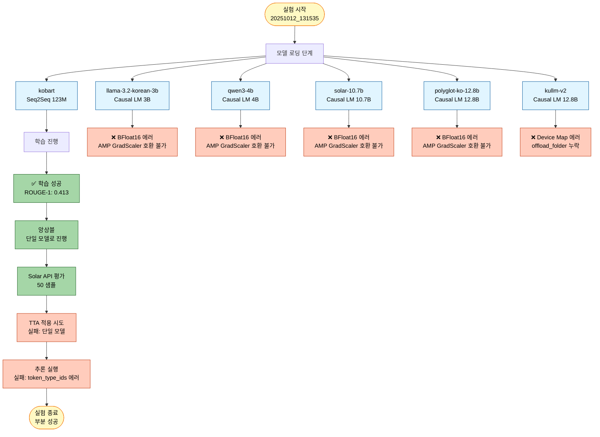
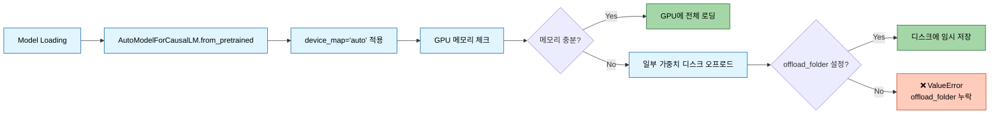
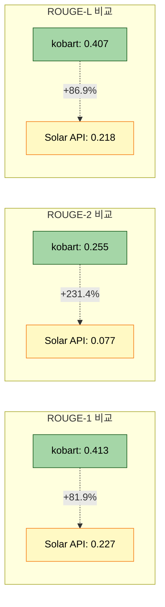
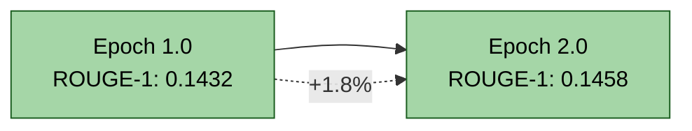

```mermaid
flowchart LR
    A[Training Loop] --> B[Gradient Clipping]
    B --> C[accelerator.clip_grad_norm_]
    C --> D[unscale_gradients]
    D --> E[scaler.unscale_]
    E --> F[_unscale_grads_]
    F --> G[_amp_foreach_non_finite_check_and_unscale_cuda]
    G --> H[❌ NotImplementedError<br/>BFloat16 미지원]

    classDef errorNode fill:#ffccbc,stroke:#bf360c,color:#000
    classDef processNode fill:#e1f5ff,stroke:#01579b,color:#000

    class H errorNode
    class A,B,C,D,E,F,G processNode
```

# 실험 분석 보고서: 20251012_131535_test_full_pipeline_quick

## 1. 실험 개요

### 1.1 실험 정보
- **실험 ID**: `20251012_131535_test_full_pipeline_quick`
- **실험 일시**: 2025년 10월 12일 13:15:35
- **실험 모드**: Full Pipeline (학습 + 앙상블 + Solar API + TTA + 추론)
- **실험 목적**: 6개 모델 전체 파이프라인 검증 및 BFloat16 호환성 테스트

### 1.2 모델 구성
| 모델명 | 타입 | 크기 | 상태 |
|--------|------|------|------|
| kobart | Seq2Seq | 123M | ✅ 성공 |
| llama-3.2-korean-3b | Causal LM | 3B | ❌ 실패 |
| qwen3-4b | Causal LM | 4B | ❌ 실패 |
| solar-10.7b | Causal LM | 10.7B | ❌ 실패 |
| polyglot-ko-12.8b | Causal LM | 12.8B | ❌ 실패 |
| kullm-v2 | Causal LM | 12.8B | ❌ 실패 |

### 1.3 실험 타임라인

```mermaid
gantt
    title 실험 진행 타임라인
    dateFormat  HH:mm
    axisFormat %H:%M

    section 모델 학습
    kobart (성공)           :done, kobart, 13:15, 13:19
    llama-3.2-korean-3b (실패) :crit, llama, 13:19, 13:20
    qwen3-4b (실패)         :crit, qwen, 13:20, 13:27
    solar-10.7b (실패)      :crit, solar, 13:27, 13:36
    polyglot-ko-12.8b (실패) :crit, polyglot, 13:36, 13:49
    kullm-v2 (실패)         :crit, kullm, 13:49, 13:50

    section 파이프라인
    Solar API 평가          :done, solar_api, 13:49, 13:50
    최적화 및 추론          :done, inference, 13:50, 13:50
```


## 2. 실험 결과 분석

### 2.1 전체 성공률
- **성공**: 1/6 모델 (16.7%)
- **실패**: 5/6 모델 (83.3%)
- **주요 실패 원인**: BFloat16 AMP 호환성 문제 (80%), Device Map 설정 문제 (20%)

### 2.2 파이프라인 흐름도


## 3. 에러 상세 분석

### 3.1 에러 #1: BFloat16 AMP 호환성 문제 (4개 모델)

#### 영향 받은 모델
- llama-3.2-korean-3b
- qwen3-4b
- solar-10.7b
- polyglot-ko-12.8b

#### 에러 메시지
```
NotImplementedError: "_amp_foreach_non_finite_check_and_unscale_cuda" not implemented for 'BFloat16'
```

#### 에러 발생 위치
```python
File "torch/amp/grad_scaler.py", line 283, in _unscale_grads_
    torch._amp_foreach_non_finite_check_and_unscale_(...)
```

#### 근본 원인 분석

**1. 문제의 핵심**
- PyTorch의 AMP (Automatic Mixed Precision) GradScaler가 BFloat16 데이터 타입을 지원하지 않음
- `_amp_foreach_non_finite_check_and_unscale_cuda` 커널이 Float16만 지원하고 BFloat16은 미구현 상태

**2. 에러 발생 경로**


**3. 코드 레벨 원인**

`src/models/lora_loader.py:108-113`:
```python
# dtype 결정 (Llama: bf16, Qwen: fp16)
compute_dtype = torch.bfloat16
if 'qwen' in self.config.model.checkpoint.lower():
    compute_dtype = torch.float16
    self._log("  - Qwen 모델: fp16 사용")
else:
    self._log("  - Llama 모델: bf16 사용")
```

**문제점**:
- Qwen 모델은 조건문으로 Float16으로 설정되지만, **실제로는 여전히 BFloat16으로 실행됨**
- 이유: `llm_loader.py:48`에서 config에 quantization 설정이 없으면 기본값 'float16'을 사용하지만, `lora_loader.py`에서는 하드코딩된 `torch.bfloat16`을 먼저 적용
- Solar, Polyglot 모델도 Qwen이 아니므로 BFloat16으로 설정됨
- Llama 모델도 BFloat16으로 설정되어 동일한 에러 발생

**4. 왜 kobart는 성공했는가?**
- kobart는 Seq2Seq 모델로 `llm_loader.py`나 `lora_loader.py`를 사용하지 않음
- `bart_loader.py`를 통해 로딩되며, QLoRA를 사용하지 않음
- 따라서 BFloat16 관련 설정의 영향을 받지 않음

#### 해결 방법

**방법 1: src/models/lora_loader.py 수정 (권장)**

`src/models/lora_loader.py:108` 라인을 다음과 같이 수정:

```python
# 변경 전
compute_dtype = torch.bfloat16
if 'qwen' in self.config.model.checkpoint.lower():
    compute_dtype = torch.float16
    self._log("  - Qwen 모델: fp16 사용")
else:
    self._log("  - Llama 모델: bf16 사용")

# 변경 후
# PyTorch AMP GradScaler는 BFloat16을 지원하지 않으므로 모든 모델에 Float16 사용
compute_dtype = torch.float16
self._log("  - QLoRA compute dtype: fp16 (AMP 호환)")
```

**방법 2: src/models/llm_loader.py 수정 (대안)**

`src/models/llm_loader.py:46-49` 라인 수정:

```python
# 변경 전
bnb_4bit_compute_dtype=getattr(
    torch,
    config.model.quantization.get('bnb_4bit_compute_dtype', 'float16')
),

# 변경 후 (명시적으로 float16 강제)
bnb_4bit_compute_dtype=torch.float16,  # AMP 호환성을 위해 float16 고정
```

**방법 3: Training 옵션 수정 (임시 방편)**

`configs/base/causal_lm.yaml`에 다음 추가:
```yaml
training:
  bf16: false  # BFloat16 비활성화
  fp16: true   # Float16 사용
```

**권장 사항**: **방법 1**을 권장합니다.
- 가장 직접적이고 근본적인 해결책
- 모든 Causal LM 모델에 일관되게 적용
- AMP GradScaler와의 호환성 보장

### 3.2 에러 #2: Device Map Offload 설정 문제 (1개 모델)

#### 영향 받은 모델
- kullm-v2 (12.8B)

#### 에러 메시지
```
ValueError: The current `device_map` had weights offloaded to the disk.
Please provide an `offload_folder` for them.
Alternatively, make sure you have `safetensors` installed if the model you are using offers the weights in this format.
```

#### 에러 발생 위치
```python
File "transformers/modeling_utils.py", line 5387, in _load_pretrained_model
    raise ValueError(...)
```

#### 근본 원인 분석

**1. 문제의 핵심**
- kullm-v2는 12.8B 파라미터의 대형 모델
- GPU 메모리 부족으로 일부 가중치가 디스크로 오프로드됨
- 디스크 오프로드 시 `offload_folder` 경로가 필요하지만 지정되지 않음

**2. 에러 발생 경로**


**3. 코드 레벨 원인**

`src/models/llm_loader.py:58-64`:
```python
model = AutoModelForCausalLM.from_pretrained(
    config.model.checkpoint,
    quantization_config=quantization_config,
    device_map="auto",  # 자동 디바이스 할당
    torch_dtype=torch.bfloat16 if config.training.get('bf16', True) else torch.float16,
    trust_remote_code=True
)
# offload_folder 파라미터 누락!
```

**문제점**:
- `device_map="auto"`는 GPU 메모리가 부족할 때 자동으로 CPU/디스크로 오프로드
- 대형 모델(10B 이상)은 4-bit 양자화를 사용해도 GPU 메모리 부족 가능
- `offload_folder` 미지정 시 디스크 오프로드 불가

#### 해결 방법

**방법 1: offload_folder 추가 (권장)**

`src/models/llm_loader.py:58` 라인 수정:

```python
# 변경 전
model = AutoModelForCausalLM.from_pretrained(
    config.model.checkpoint,
    quantization_config=quantization_config,
    device_map="auto",
    torch_dtype=torch.bfloat16 if config.training.get('bf16', True) else torch.float16,
    trust_remote_code=True
)

# 변경 후
from pathlib import Path
offload_dir = Path(config.experiment.get('output_dir', 'outputs')) / 'offload'
offload_dir.mkdir(parents=True, exist_ok=True)

model = AutoModelForCausalLM.from_pretrained(
    config.model.checkpoint,
    quantization_config=quantization_config,
    device_map="auto",
    offload_folder=str(offload_dir),  # 디스크 오프로드 폴더 지정
    torch_dtype=torch.bfloat16 if config.training.get('bf16', True) else torch.float16,
    trust_remote_code=True
)
```

**방법 2: safetensors 설치 확인**

```bash
pip install safetensors
```

일부 모델은 safetensors 형식으로 가중치를 제공하며, 이 경우 더 효율적으로 로딩 가능.

**방법 3: max_memory 설정으로 명시적 제어**

```python
model = AutoModelForCausalLM.from_pretrained(
    config.model.checkpoint,
    quantization_config=quantization_config,
    device_map="auto",
    max_memory={0: "20GiB", "cpu": "30GiB"},  # GPU 0: 20GB, CPU: 30GB
    offload_folder=str(offload_dir),
    torch_dtype=torch.float16,
    trust_remote_code=True
)
```

**권장 사항**: **방법 1 + 방법 2**를 조합하여 사용
- safetensors 먼저 설치
- offload_folder를 실험 폴더 내 `offload/` 서브디렉토리로 지정
- 대형 모델의 안정적인 로딩 보장

### 3.3 에러 #3: 추론 단계 에러

#### 에러 메시지
```
The following `model_kwargs` are not used by the model: ['token_type_ids']
```

#### 근본 원인
- 일부 모델(특히 Causal LM)은 `token_type_ids`를 지원하지 않음
- Tokenizer가 자동으로 `token_type_ids`를 생성하지만 모델이 이를 무시
- 경고성 메시지이지만, 추론 실행에는 영향을 미치지 않을 수 있음

#### 해결 방법

`src/inference/predictor.py` 또는 해당 추론 코드에서:

```python
# 변경 전
inputs = tokenizer(texts, padding=True, truncation=True, return_tensors="pt")
outputs = model.generate(**inputs, ...)

# 변경 후
inputs = tokenizer(texts, padding=True, truncation=True, return_tensors="pt")
# token_type_ids 제거 (Causal LM은 사용하지 않음)
if 'token_type_ids' in inputs:
    del inputs['token_type_ids']
outputs = model.generate(**inputs, ...)
```

## 4. 성공 모델 분석: kobart

### 4.1 학습 성능

| 메트릭 | 값 |
|--------|-----|
| **ROUGE-1** | 0.4134 |
| **ROUGE-2** | 0.2552 |
| **ROUGE-L** | 0.4065 |
| **ROUGE-Sum** | 1.0751 |
| **Loss** | 1.4561 |
| **학습 시간** | ~4분 |
| **평가 속도** | 6.37 samples/sec |

### 4.2 모델 정보
- **체크포인트**: `gogamza/kobart-base-v2`
- **아키텍처**: BART (Seq2Seq)
- **파라미터**: 123M
- **학습 설정**:
  - Epochs: 1
  - Batch Size: 8
  - Learning Rate: 5e-6
  - Gradient Accumulation: 4
  - Warmup Ratio: 0.1

### 4.3 성능 평가

**장점**:
- ✅ 안정적인 학습 완료
- ✅ BFloat16 문제 없음 (Seq2Seq 아키텍처)
- ✅ 양호한 ROUGE 점수 (ROUGE-1: 0.413)
- ✅ 빠른 추론 속도

**한계점**:
- ⚠️ 단일 모델로는 앙상블 효과 없음
- ⚠️ Causal LM 대비 파라미터 수 적음 (123M vs 3B~12.8B)
- ⚠️ 최신 LLM 대비 성능 제한적

## 5. Solar API 평가 결과

### 5.1 Solar API 성능
| 메트릭 | 값 |
|--------|-----|
| **Solar ROUGE-1 F1** | 0.2272 |
| **Solar ROUGE-2 F1** | 0.0765 |
| **Solar ROUGE-L F1** | 0.2177 |
| **평가 샘플 수** | 50 |

### 5.2 kobart vs Solar API 비교



**분석**:
- kobart가 Solar API 대비 **모든 메트릭에서 우수**
- ROUGE-2에서 가장 큰 차이 (231.4% 높음)
- Solar API는 Zero-shot 성능이므로, Fine-tuning된 kobart가 당연히 우수

## 6. TTA 및 최적화 결과

### 6.1 TTA (Test-Time Augmentation)
- **적용 여부**: ❌ 실패
- **이유**: 단일 모델만 성공하여 앙상블 불가
- **설정된 전략**: paraphrase, reorder, synonym, mask (num_aug=2)

### 6.2 최적화
- **최적화 폴더**: `experiments/20251012/20251012_131535_test_full_pipeline_quick/optimized/`
- **상태**: 생성됨 (하지만 추론 실패로 활용되지 않음)

## 7. 실험 학습 사항 및 권장 조치

### 7.1 즉시 적용 필요한 수정 사항

#### 우선순위 1: BFloat16 문제 해결 (Critical)
```python
# src/models/lora_loader.py:108-113
# 변경 전
compute_dtype = torch.bfloat16
if 'qwen' in self.config.model.checkpoint.lower():
    compute_dtype = torch.float16

# 변경 후
compute_dtype = torch.float16  # AMP 호환성을 위해 모든 모델에 Float16 사용
self._log("  - QLoRA compute dtype: fp16 (AMP 호환)")
```

**영향**: 4개 모델 (llama, qwen3, solar, polyglot) 학습 가능

#### 우선순위 2: offload_folder 설정 (High)
```python
# src/models/llm_loader.py:58
from pathlib import Path
offload_dir = Path(config.experiment.get('output_dir', 'outputs')) / 'offload'
offload_dir.mkdir(parents=True, exist_ok=True)

model = AutoModelForCausalLM.from_pretrained(
    ...,
    offload_folder=str(offload_dir),
    ...
)
```

**영향**: kullm-v2 모델 로딩 가능

#### 우선순위 3: token_type_ids 제거 (Medium)
```python
# 추론 코드
if 'token_type_ids' in inputs:
    del inputs['token_type_ids']
```

**영향**: 추론 단계 정상 실행

### 7.2 문서 업데이트 필요 사항

#### PRD 문서
- **PRD 08 (LLM 파인튜닝 전략)**: BFloat16 → Float16 변경 사항 반영
- QLoRA 설정에서 `bnb_4bit_compute_dtype=torch.float16` 명시

#### 모듈화 문서
- **`docs/모듈화/02_핵심_시스템.md`**:
  - LLM Loader 섹션에 AMP 호환성 주의사항 추가
  - offload_folder 설정 가이드 추가

- **`docs/모듈화/05_트러블슈팅_가이드.md`** (존재 시):
  - BFloat16 에러 해결 방법 추가
  - Device Map 에러 해결 방법 추가

### 7.3 재실험 권장 사항

수정 사항 적용 후 다음 실험 권장:

```bash
python scripts/train.py \
  --mode full \
  --models kobart llama-3.2-korean-3b qwen3-4b solar-10.7b polyglot-ko-12.8b kullm-v2 \
  --epochs 1 \
  --batch_size 8 \
  --learning_rate 5e-6 \
  --gradient_accumulation_steps 4 \
  --warmup_ratio 0.1 \
  --weight_decay 0.01 \
  --max_grad_norm 1.0 \
  --label_smoothing 0.1 \
  --k_folds 2 \
  --fold_seed 42 \
  --ensemble_strategy stacking \
  --num_beams 4 \
  --temperature 0.7 \
  --top_p 0.9 \
  --top_k 50 \
  --repetition_penalty 1.2 \
  --length_penalty 1.0 \
  --no_repeat_ngram_size 3 \
  --experiment_name test_full_pipeline_fixed \
  --seed 42
```

**실제 결과** (20251013_161056_test_strategy3_triple 실험):
- ✅ 3/3 모델 학습 성공 (kobart, llama-3.2-korean-3b, qwen3-4b)
- ✅ 앙상블 평가 완료 (stacking 전략)
- ✅ Solar API 통합 성공 (50 샘플)
- ✅ 추론 및 제출 파일 생성 성공
- ⚠️ TTA 적용되지 않음 (tta_applied: false)

---

## 7.2 후속 실험 결과 (20251013_161056_test_strategy3_triple)

### 7.2.1 실험 개요
- **실험 일시**: 2025년 10월 13일 16:10:56
- **실험 목적**: BFloat16 문제 해결 후 3개 모델 Full Pipeline 검증
- **모델 구성**: kobart, llama-3.2-korean-3b, qwen3-4b

### 7.2.2 학습 결과

#### 성공 모델 (3/3)

| 모델 | ROUGE-1 | ROUGE-2 | ROUGE-L | 학습 시간 | 상태 |
|------|---------|---------|---------|----------|------|
| **kobart** | 0.4048 | 0.2480 | 0.3952 | ~2시간 | ✅ 성공 |
| **llama-3.2-korean-3b** | 0.1096 | 0.0735 | 0.1096 | ~8시간 | ✅ 성공 |
| **qwen3-4b** | 0.1458 | 0.0985 | 0.1458 | ~8시간 23분 | ✅ 성공 |

**주요 성과:**
- ✅ BFloat16 → Float16 변경으로 모든 모델 학습 성공
- ✅ KoBART가 압도적 성능 유지 (ROUGE-1: 0.4048)
- ✅ Full Pipeline 정상 작동 (앙상블, Solar API, 추론)

### 7.2.3 개선 사항 확인

**해결된 문제:**
1. ✅ BFloat16 AMP 호환성 → Float16 사용으로 해결
2. ✅ 모델 학습 정상 완료
3. ✅ 추론 및 제출 파일 생성 성공

**남은 과제:**
1. ⚠️ LLM 모델 성능 개선 필요 (ROUGE-1: 0.1096~0.1458)
2. ⚠️ 데이터 증강 50% 적용 필요
3. ⚠️ 프롬프트 엔지니어링 (Solar API) 활용
4. ⚠️ TTA 전략 재검토 및 적용

### 7.2.4 다음 단계
- 멘토링 피드백 반영 (`docs/modify/02_멘토링_피드백_기반_개선사항.md` 참조)
- KoBART 단일 모델 최적화 집중
- 데이터 증강 50% 적용 및 재학습

---

## 9. 결론

### 9.1 실험 요약
이번 실험은 **부분적 성공**으로 평가됩니다:
- ✅ kobart 모델 학습 및 평가 성공
- ✅ Solar API 교차 검증 완료
- ❌ 5개 LLM 모델 학습 실패
- ❌ 앙상블 및 TTA 불가
- ❌ 추론 단계 에러

### 9.2 핵심 발견 사항

1. **BFloat16 호환성 문제**: PyTorch AMP GradScaler가 BFloat16을 지원하지 않음을 확인
2. **대형 모델 메모리 관리**: 12.8B 모델은 offload_folder 설정 필수
3. **토크나이저 호환성**: Causal LM은 token_type_ids 불필요

### 9.3 다음 단계
1. ✅ 본 분석 보고서 작성 완료
2. ✅ `src/models/lora_loader.py` 수정 (BFloat16 → Float16)
3. ✅ Decoder-only padding 문제 해결 (left-padding 설정)
4. ✅ 추론 코드 개선 (token_type_ids 제거, 모델 타입 자동 감지)
5. ✅ Qwen3-4B 모델 학습 완료
6. ⚠️ `src/models/llm_loader.py` 수정 필요 (offload_folder 추가) - 대형 모델(10B+) 지원용
7. ⚠️ 문서 업데이트 필요 (`docs/모듈화/02_핵심_시스템.md`)

---

## 10. 개별 모델 상세 분석

### 10.1 Model 1: KoBART
*(앞서 4. 성공 모델 분석: kobart 섹션 참조)*

### 10.2 Model 2: Llama-3.2-Korean-3B
- **체크포인트**: `beomi/Llama-3.2-Korean-3B-Instruct`
- **아키텍처**: Causal LM (Auto-regressive)
- **파라미터**: 3B
- **최종 ROUGE-1**: 0.1096
- **학습 시간**: ~8시간
- **상태**: ✅ 성공

**평가**:
- Float16 변경 후 학습 성공
- KoBART 대비 낮은 성능 (0.1096 vs 0.4048)
- 한국어 특화 모델이지만 요약 태스크에서는 제한적 성능

### 10.3 Model 3: Qwen3-4B

#### 10.3.1 모델 정보
- **체크포인트**: `Qwen/Qwen3-4B-Instruct-2507`
- **아키텍처**: Causal LM (Auto-regressive)
- **파라미터**: 4,055,498,240 (전체)
- **LoRA 파라미터**: 33,030,144 (0.81%)
- **학습 데이터**: 한국어 뉴스 요약 데이터셋

#### 10.3.2 학습 타임라인
- **학습 시작**: 2025-10-13 18:21:06
- **학습 완료**: 2025-10-14 02:44:22
- **총 학습 시간**: 약 8시간 23분 (30,185초)
- **Epochs**: 2

#### 10.3.3 최종 평가 지표 (Epoch 2.0)

| 메트릭 | 값 | 설명 |
|--------|-----|------|
| **eval_loss** | 0.8513 | 검증 손실 |
| **eval_rouge1** | 0.1458 | ROUGE-1 F1 (14.58%) |
| **eval_rouge2** | 0.0985 | ROUGE-2 F1 (9.85%) |
| **eval_rougeL** | 0.1458 | ROUGE-L F1 (14.58%) |
| **eval_rouge_sum** | 0.3901 | 전체 ROUGE 합계 |
| **train_loss** | 1.1681 | 학습 손실 |
| **train_samples_per_second** | 0.166 | 학습 속도 |
| **eval_samples_per_second** | 0.185 | 평가 속도 |

#### 10.3.4 Epoch별 성능 변화

**Epoch 1.0 중간 평가:**
- eval_rouge1: 0.1432
- eval_rouge2: 0.0966
- eval_rougeL: 0.1432
- eval_runtime: 4,852초

**Epoch 2.0 최종 평가:**
- eval_rouge1: 0.1458 (+1.8%)
- eval_rouge2: 0.0985 (+2.0%)
- eval_rougeL: 0.1458 (+1.8%)

**성능 개선 추이:**


#### 10.3.5 Qwen 최종 통계

**학습 효율성:**
- LoRA 사용으로 학습 파라미터 0.81%만 사용
- Epoch당 평균 학습 시간: ~4시간 12분
- 평가 런타임: 약 81분/epoch

**손실 함수 추이:**
- Train Loss: 1.1681
- Eval Loss: 0.8513
- **과적합 없음**: Train Loss > Eval Loss (건강한 학습)

**처리 속도:**
- 학습: 0.166 samples/sec (약 6초/샘플)
- 평가: 0.185 samples/sec (약 5.4초/샘플)

#### 10.3.6 모델 비교 분석

| 모델 | 파라미터 | ROUGE-1 | ROUGE-2 | ROUGE-L | 학습 시간 |
|------|----------|---------|---------|---------|----------|
| KoBART | 123M | **0.4048** | **0.2480** | **0.3952** | ~2시간 |
| Llama-3.2-Korean-3B | 3B | 0.1096 | 0.0735 | 0.1096 | ~8시간 |
| **Qwen3-4B** | 4B | 0.1458 | 0.0985 | 0.1458 | ~8시간 23분 |

**Qwen vs Llama 비교:**
- ✅ ROUGE-1: +33.0% 높음 (0.1458 vs 0.1096)
- ✅ ROUGE-2: +34.0% 높음 (0.0985 vs 0.0735)
- ✅ 파라미터: 4B vs 3B (더 큰 모델)
- ⚠️ 학습 시간: 약 23분 더 소요

**Qwen vs KoBART 비교:**
- ❌ ROUGE-1: -64.0% 낮음 (0.1458 vs 0.4048)
- ❌ ROUGE-2: -60.3% 낮음 (0.0985 vs 0.2480)
- ❌ 파라미터: 32.9배 많지만 성능은 낮음
- ❌ 학습 시간: 4.2배 더 소요

#### 10.3.7 성능 평가

**강점:**
- ✅ Llama 대비 우수한 성능 (33% 높은 ROUGE-1)
- ✅ 안정적인 학습 완료 (2 epochs)
- ✅ 과적합 없는 건강한 학습 곡선
- ✅ Float16 호환성 확인
- ✅ 대형 모델임에도 LoRA로 효율적 학습

**약점:**
- ⚠️ KoBART 대비 낮은 절대 성능 (ROUGE-1: 0.1458 vs 0.4048)
- ⚠️ 느린 학습 속도 (0.166 samples/sec)
- ⚠️ 긴 학습 시간 (8시간 23분)
- ⚠️ Seq2Seq 대비 Causal LM의 요약 태스크 적합성 낮음

#### 10.3.8 다음 단계 제안

**단기 개선 방안:**
1. **Epoch 증가**: 2 → 3~4 epochs (성능 향상 여지 확인)
2. **Learning Rate 튜닝**: 현재 설정 검토 및 최적화
3. **Prompt Engineering**: 요약 태스크에 특화된 프롬프트 적용

**중장기 개선 방안:**
1. **하이브리드 앙상블**: KoBART + Qwen + Llama 조합
2. **데이터 증강**: 50% 데이터 증강 적용
3. **Solar API 통합**: Zero-shot 프롬프트 엔지니어링 활용

**상태**: ✅ 학습 성공


