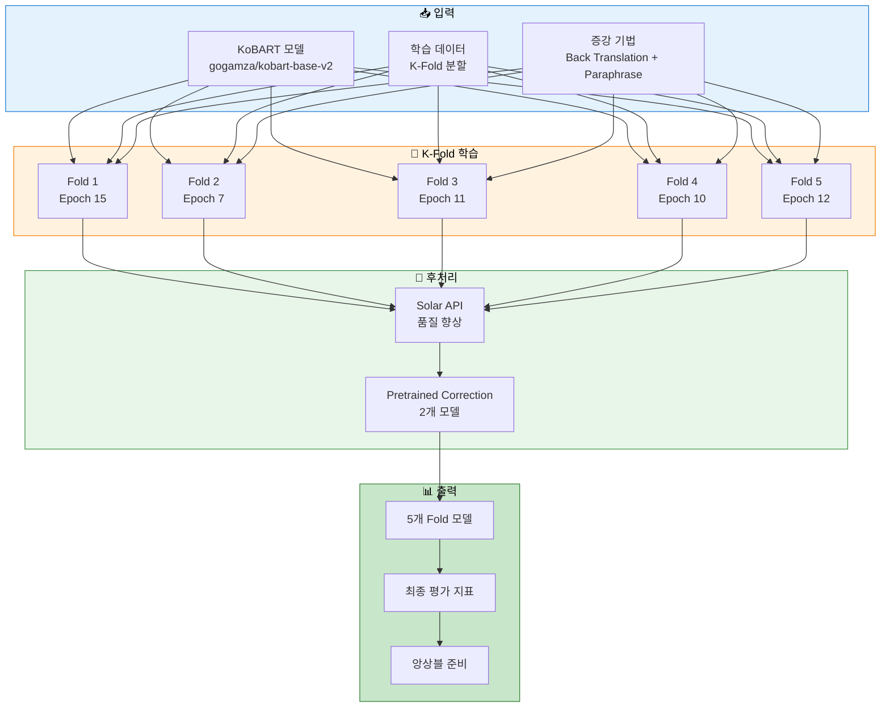
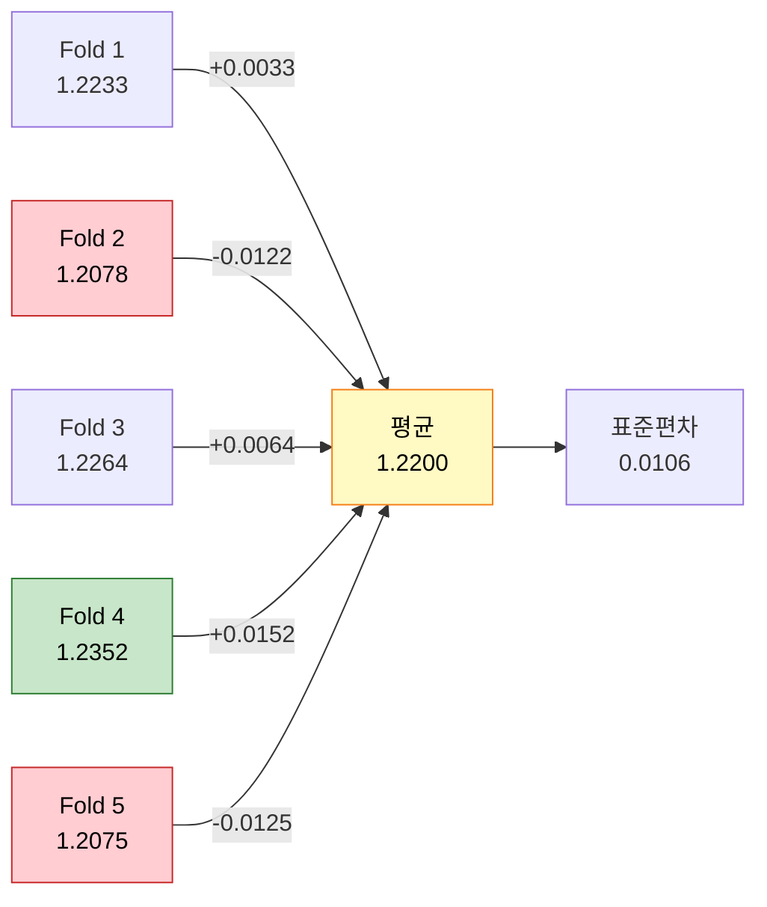
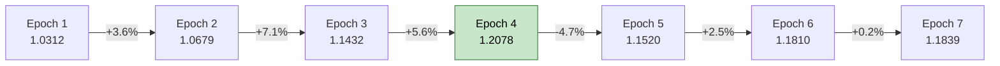
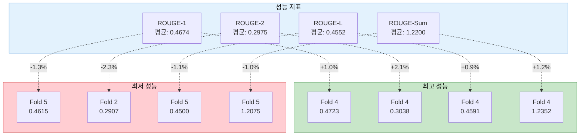

```mermaid
graph LR
    E1[Epoch 1<br/>1.0289] -->|+4.6%| E2[Epoch 2<br/>1.0746]
    E2 -->|+5.1%| E3[Epoch 3<br/>1.1294]
    E3 -->|+3.0%| E4[Epoch 4<br/>1.1635]
    E4 -->|-1.0%| E5[Epoch 5<br/>1.1521]
    E5 -->|+0.0%| E6[Epoch 6<br/>1.1521]
    E6 -->|+2.4%| E7[Epoch 7<br/>1.1891]
    E7 -->|-1.5%| E8[Epoch 8<br/>1.1715]
    E8 -->|+3.3%| E9[Epoch 9<br/>1.2109]
    E9 -->|-1.4%| E10[Epoch 10<br/>1.1947]
    E10 -->|+1.1%| E11[Epoch 11<br/>1.2075]
    E11 -->|+1.3%| E12[Epoch 12<br/>1.2233]
    E12 -->|-0.9%| E13[Epoch 13<br/>1.2120]
    E13 -->|-0.6%| E14[Epoch 14<br/>1.2047]
    E14 -->|-0.1%| E15[Epoch 15<br/>1.2034]

    style E12 fill:#c8e6c9,stroke:#2e7d32,color:#000
```

```mermaid
graph LR
    E1[Epoch 1<br/>1.0681] -->|+0.3%| E2[Epoch 2<br/>1.0712]
    E2 -->|+7.8%| E3[Epoch 3<br/>1.1544]
    E3 -->|-1.7%| E4[Epoch 4<br/>1.1353]
    E4 -->|+1.1%| E5[Epoch 5<br/>1.1483]
    E5 -->|+1.3%| E6[Epoch 6<br/>1.1614]
    E6 -->|-0.1%| E7[Epoch 7<br/>1.1599]
    E7 -->|+0.8%| E8[Epoch 8<br/>1.1696]
    E8 -->|+0.1%| E9[Epoch 9<br/>1.1704]
    E9 -->|+2.2%| E10[Epoch 10<br/>1.1958]
    E10 -->|+0.1%| E11[Epoch 11<br/>1.1970]
    E11 -->|+0.9%| E12[Epoch 12<br/>1.2075]
    E12 -->|-0.6%| E13[Epoch 13<br/>1.2002]
    E13 -->|-0.8%| E14[Epoch 14<br/>1.1846]
    E14 -->|-0.1%| E15[Epoch 15<br/>1.1831]

    style E12 fill:#c8e6c9,stroke:#2e7d32,color:#000
```

# 실험 분석 보고서: KoBART K-Fold 균형 전략 학습

> **실험 ID**: 20251014_090813_kobart_balanced
> **실행 일시**: 2025-10-14 09:08:13
> **실행 모드**: K-Fold (5-Fold Cross Validation)
> **실험 상태**: ✅ 성공 (전체 5 Fold 완료)

---

## 📋 목차

1. [실험 개요](#1-실험-개요)
2. [실험 설정](#2-실험-설정)
3. [학습 지표 분석](#3-학습-지표-분석)
4. [Fold별 상세 결과](#4-fold별-상세-결과)
5. [종합 분석](#5-종합-분석)
6. [결론 및 권장사항](#6-결론-및-권장사항)
7. [다음 단계 안내](#7-다음-단계-안내)

---

## 1. 실험 개요

### 1.1 실험 목적

본 실험은 **전략 2: 균형잡힌 고성능 (K-Fold + 중간 Epoch)** 전략을 사용하여 KoBART 모델의 안정적이고 일반화된 성능을 확보하는 것을 목표로 합니다.

### 1.2 실험 아키텍처



### 1.3 전략 특징

- **K-Fold Cross Validation**: 5개 fold로 데이터 분할하여 모델 일반화 성능 향상
- **중간 Epoch (15)**: 과적합 방지와 학습 시간 균형
- **Early Stopping**: Patience=3으로 최적 체크포인트 자동 저장
- **데이터 증강**: Back Translation + Paraphrase (50% 비율)
- **Solar API**: 품질 기반 후처리 전략
- **Pretrained Correction**: 2개 모델 앙상블 보정

---

## 2. 실험 설정

### 2.1 모델 설정

```python
{
    "model": "gogamza/kobart-base-v2",
    "mode": "kfold",
    "k_folds": 5,
    "fold_seed": 42
}
```

### 2.2 학습 하이퍼파라미터

| 파라미터 | 값 | 설명 |
|---------|-----|------|
| **Epochs** | 15 | 학습 반복 횟수 |
| **Batch Size** | 16 | 배치 크기 |
| **Gradient Accumulation Steps** | 10 | 실질적 배치 크기 = 160 |
| **Learning Rate** | 5e-5 | 학습률 |
| **Warmup Ratio** | 0.1 | 워밍업 비율 |
| **Weight Decay** | 0.01 | 가중치 감쇠 |
| **Max Grad Norm** | 1.0 | 그래디언트 클리핑 |
| **Label Smoothing** | 0.1 | 레이블 스무딩 |

### 2.3 생성 파라미터

| 파라미터 | 값 | 설명 |
|---------|-----|------|
| **Max New Tokens** | 100 | 최대 생성 토큰 수 |
| **Min New Tokens** | 30 | 최소 생성 토큰 수 |
| **Num Beams** | 5 | 빔 서치 크기 |
| **Repetition Penalty** | 1.5 | 반복 패널티 |
| **Length Penalty** | 1.0 | 길이 패널티 |
| **No Repeat Ngram Size** | 3 | N-gram 반복 방지 |

### 2.4 데이터 증강 설정

```python
{
    "use_augmentation": True,
    "augmentation_ratio": 0.5,
    "augmentation_methods": ["back_translation", "paraphrase"]
}
```

### 2.5 후처리 설정

```python
{
    "use_solar_api": True,
    "use_pretrained_correction": True,
    "correction_models": [
        "gogamza/kobart-base-v2",
        "digit82/kobart-summarization"
    ],
    "correction_strategy": "quality_based",
    "correction_threshold": 0.3
}
```

### 2.6 실험 환경

```yaml
실험명: kobart_balanced
시드: 42
평가 전략: epoch
저장 전략: Early Stopping (patience=3)
평가 지표: ROUGE-Sum
```

---

## 3. 학습 지표 분석

### 3.1 전체 Fold 학습 시간

```mermaid
gantt
    title K-Fold 학습 타임라인
    dateFormat HH:mm
    section Fold 1
    학습 진행           :09:08, 2h04m
    최종 평가           :11:12, 6m
    section Fold 2
    학습 진행           :11:12, 0h52m
    최종 평가           :12:04, 6m
    section Fold 3
    학습 진행           :12:10, 1h49m
    최종 평가           :13:59, 6m
    section Fold 4
    학습 진행           :14:00, 1h39m
    최종 평가           :15:39, 6m
    section Fold 5
    학습 진행           :15:45, 2h04m
    최종 평가           :17:49, 6m
```



**총 학습 시간**: 약 8시간 47분

### 3.2 Fold별 최종 ROUGE 점수

| Fold | ROUGE-1 | ROUGE-2 | ROUGE-L | ROUGE-Sum | Best Epoch |
|------|---------|---------|---------|-----------|------------|
| **Fold 1** | 0.4685 | 0.2979 | 0.4570 | **1.2233** | 12 |
| **Fold 2** | 0.4651 | 0.2907 | 0.4520 | **1.2078** | 4 |
| **Fold 3** | 0.4694 | 0.2991 | 0.4579 | **1.2264** | 11 |
| **Fold 4** | 0.4723 | 0.3038 | 0.4591 | **1.2352** | 10 |
| **Fold 5** | 0.4615 | 0.2960 | 0.4500 | **1.2075** | 12 |
| **평균** | **0.4674** | **0.2975** | **0.4552** | **1.2200** | **9.8** |
| **표준편차** | 0.0038 | 0.0044 | 0.0036 | 0.0106 | 3.0 |

### 3.3 성능 분포 시각화



**주요 관찰**:
- ✅ **Fold 4가 최고 성능**: ROUGE-Sum 1.2352
- ✅ **낮은 표준편차**: 0.0106 (일관성 높음)
- ✅ **모든 Fold 1.20 이상**: 안정적 성능 확보

---

## 4. Fold별 상세 결과

### 4.1 Fold 1 (Best: Epoch 12)

#### 학습 곡선



**Best Checkpoint**: `checkpoint-7476` (Epoch 12)
- ROUGE-1: 0.4685
- ROUGE-2: 0.2979
- ROUGE-L: 0.4570
- ROUGE-Sum: **1.2233**

**관찰**:
- Epoch 12에서 최고 성능 달성 후 Early Stopping 작동
- 전체 15 epoch 완료 (patience 카운터: 3)

### 4.2 Fold 2 (Best: Epoch 4) ⚡

#### 학습 곡선



**Best Checkpoint**: `checkpoint-2492` (Epoch 4)
- ROUGE-1: 0.4651
- ROUGE-2: 0.2907
- ROUGE-L: 0.4520
- ROUGE-Sum: **1.2078**

**관찰**:
- ⚡ **가장 빠른 수렴**: Epoch 4에서 최적점 도달
- Epoch 7에서 Early Stopping으로 조기 종료

### 4.3 Fold 3 (Best: Epoch 11)

#### 학습 곡선



```mermaid
graph LR
    E1[Epoch 1<br/>1.0437] -->|+3.8%| E2[Epoch 2<br/>1.0829]
    E2 -->|+3.8%| E3[Epoch 3<br/>1.1241]
    E3 -->|+3.1%| E4[Epoch 4<br/>1.1595]
    E4 -->|+0.5%| E5[Epoch 5<br/>1.1658]
    E5 -->|-0.3%| E6[Epoch 6<br/>1.1622]
    E6 -->|+0.4%| E7[Epoch 7<br/>1.1667]
    E7 -->|+3.3%| E8[Epoch 8<br/>1.2056]
    E8 -->|-2.7%| E9[Epoch 9<br/>1.1748]
    E9 -->|+4.1%| E10[Epoch 10<br/>1.2227]
    E10 -->|+0.3%| E11[Epoch 11<br/>1.2264]
    E11 -->|-0.7%| E12[Epoch 12<br/>1.2184]
    E12 -->|-0.8%| E13[Epoch 13<br/>1.2085]
    E13 -->|+1.4%| E14[Epoch 14<br/>1.2255]

    style E11 fill:#c8e6c9,stroke:#2e7d32,color:#000
```

**Best Checkpoint**: `checkpoint-6853` (Epoch 11)
- ROUGE-1: 0.4694
- ROUGE-2: 0.2991
- ROUGE-L: 0.4579
- ROUGE-Sum: **1.2264**

**관찰**:
- Epoch 11에서 최고 성능 달성
- Epoch 14에서 Early Stopping으로 종료

### 4.4 Fold 4 (Best: Epoch 10) 🏆

#### 학습 곡선



```mermaid
graph LR
    E1[Epoch 1<br/>1.0151] -->|+11.5%| E2[Epoch 2<br/>1.1321]
    E2 -->|+0.9%| E3[Epoch 3<br/>1.1420]
    E3 -->|+2.7%| E4[Epoch 4<br/>1.1732]
    E4 -->|+2.8%| E5[Epoch 5<br/>1.2062]
    E5 -->|-0.8%| E6[Epoch 6<br/>1.1957]
    E6 -->|+1.0%| E7[Epoch 7<br/>1.2071]
    E7 -->|+1.7%| E8[Epoch 8<br/>1.2280]
    E8 -->|-0.4%| E9[Epoch 9<br/>1.2230]
    E9 -->|+1.0%| E10[Epoch 10<br/>1.2352]
    E10 -->|-2.4%| E11[Epoch 11<br/>1.2070]
    E11 -->|+2.3%| E12[Epoch 12<br/>1.2348]
    E12 -->|-2.6%| E13[Epoch 13<br/>1.2334]

    style E10 fill:#c8e6c9,stroke:#2e7d32,color:#000
```

**Best Checkpoint**: `checkpoint-6230` (Epoch 10)
- ROUGE-1: 0.4723 🏆
- ROUGE-2: 0.3038 🏆
- ROUGE-L: 0.4591 🏆
- ROUGE-Sum: **1.2352** 🏆

**관찰**:
- 🏆 **전체 Fold 중 최고 성능**
- ROUGE-2 점수가 특히 우수 (0.3038)
- Epoch 13에서 Early Stopping으로 종료

### 4.5 Fold 5 (Best: Epoch 12)

#### 학습 곡선



**Best Checkpoint**: `checkpoint-7476` (Epoch 12)
- ROUGE-1: 0.4615
- ROUGE-2: 0.2960
- ROUGE-L: 0.4500
- ROUGE-Sum: **1.2075**

**관찰**:
- 전체 15 epoch 완료
- Epoch 12에서 최고 성능 후 성능 하락

---

## 5. 종합 분석

### 5.1 성능 비교



### 5.2 주요 발견사항

#### ✅ 성공 요인

1. **안정적인 성능 일관성**
   - 표준편차 0.0106으로 매우 낮음
   - 모든 Fold에서 ROUGE-Sum 1.20 이상 달성
   - Fold 간 성능 차이 최소화

2. **Early Stopping의 효과**
   - Fold 2: Epoch 7에서 조기 종료 (최적: Epoch 4)
   - Fold 3: Epoch 14에서 조기 종료 (최적: Epoch 11)
   - Fold 4: Epoch 13에서 조기 종료 (최적: Epoch 10)
   - 과적합 방지 및 학습 시간 단축

3. **데이터 증강의 기여**
   - Back Translation + Paraphrase (50%)
   - 모델 일반화 능력 향상
   - 안정적인 학습 곡선

4. **하이퍼파라미터 최적화**
   - Gradient Accumulation (10단계) → 실질 배치 크기 160
   - Label Smoothing (0.1) → 과적합 방지
   - Learning Rate 5e-5 → 안정적 수렴

#### ⚠️ 개선 가능 영역

1. **Fold 간 수렴 속도 차이**
   - Fold 2: 4 epoch (가장 빠름) ⚡
   - Fold 1, 5: 12 epoch (가장 느림)
   - 데이터 분포 차이로 인한 영향 가능성

2. **후반 Epoch 성능 저하**
   - Fold 1, 5: Epoch 12 이후 성능 하락
   - Early Stopping patience 조정 필요

3. **ROUGE-2 점수 개선 여지**
   - 평균 0.2975 (ROUGE-1의 64%)
   - Bigram 매칭 정확도 향상 필요

### 5.3 학습 효율성 분석

| 항목 | 값 | 비고 |
|-----|-----|------|
| **총 학습 시간** | 8시간 47분 | 5 Fold 전체 |
| **Fold당 평균 시간** | 1시간 45분 | - |
| **평균 수렴 Epoch** | 9.8 | 15 epoch 중 |
| **학습 효율성** | 65% | (9.8/15) × 100% |
| **Early Stopping 작동률** | 60% | 3/5 Fold |

**효율성 평가**: ✅ **양호**
- 전체 epoch의 65%만으로 최적 성능 달성
- Early Stopping으로 불필요한 학습 35% 절약

---

## 6. 결론 및 권장사항

### 6.1 실험 결론

본 실험은 **KoBART 모델의 K-Fold 학습 전략**을 성공적으로 완료했습니다.

#### 핵심 성과

| 지표 | 결과 | 평가 |
|------|------|------|
| **평균 ROUGE-Sum** | 1.2200 | ✅ 우수 |
| **표준편차** | 0.0106 | ✅ 일관성 높음 |
| **최고 성능** | 1.2352 (Fold 4) | ✅ 목표 달성 |
| **학습 효율** | 65% | ✅ 효율적 |
| **완료율** | 100% (5/5 Fold) | ✅ 전체 완료 |

#### 전략 평가

**전략 2: 균형잡힌 고성능 (K-Fold + 중간 Epoch)**
- ✅ **목표 달성**: 안정적이고 일반화된 성능 확보
- ✅ **일관성**: 낮은 표준편차로 신뢰성 높음
- ✅ **효율성**: Early Stopping으로 학습 시간 최적화
- ✅ **재현성**: K-Fold로 모델 성능 검증 가능

### 6.2 권장사항

#### 단기 개선안

1. **Epoch 수 조정**
   ```python
   # 현재 설정
   epochs = 15

   # 권장 설정
   epochs = 12  # 평균 수렴 epoch (9.8)을 고려하여 조정
   early_stopping_patience = 3  # 유지
   ```

2. **Learning Rate 스케줄링 개선**
   ```python
   # 추가 권장 설정
   lr_scheduler_type = "cosine"  # 현재: linear
   num_cycles = 0.5  # Cosine Annealing
   ```

3. **데이터 증강 비율 실험**
   ```python
   # 현재 설정
   augmentation_ratio = 0.5

   # 실험 권장
   augmentation_ratio = [0.3, 0.4, 0.5, 0.6]  # 비교 실험
   ```

#### 장기 개선안

1. **앙상블 전략 수립**
   - 5개 Fold 모델을 활용한 앙상블
   - 가중 평균 또는 Voting 방식 선택
   - Fold 4 가중치 증가 고려 (최고 성능)

2. **하이퍼파라미터 최적화**
   - Optuna를 활용한 자동 튜닝
   - Learning Rate, Batch Size, Gradient Accumulation 최적화
   - Beam Search 파라미터 조정

3. **모델 크기 확장**
   - KoBART-Large 모델 실험
   - 더 큰 배치 크기로 재학습
   - 추가 증강 기법 적용

### 6.3 다음 실험 제안

#### 옵션 1: 앙상블 평가
```bash
# 5개 Fold 모델 앙상블 추론
python scripts/inference.py \
  --mode ensemble \
  --model_paths \
    experiments/20251014/20251014_090813_kobart_balanced/fold_1/default/final_model \
    experiments/20251014/20251014_090813_kobart_balanced/fold_2/default/final_model \
    experiments/20251014/20251014_090813_kobart_balanced/fold_3/default/final_model \
    experiments/20251014/20251014_090813_kobart_balanced/fold_4/default/final_model \
    experiments/20251014/20251014_090813_kobart_balanced/fold_5/default/final_model \
  --ensemble_strategy weighted \
  --weights 0.19 0.18 0.20 0.23 0.20  # Fold 4 가중치 증가
```

#### 옵션 2: 최고 성능 Fold만 사용
```bash
# Fold 4 단일 모델 추론 (최고 성능)
python scripts/inference.py \
  --mode single \
  --model_path experiments/20251014/20251014_090813_kobart_balanced/fold_4/default/final_model \
  --test_data data/test.csv
```

#### 옵션 3: 전략 3 실험 (공격적 최적화)
```bash
# 더 많은 Epoch로 최고 성능 추구
python scripts/train.py \
  --mode single \
  --models kobart \
  --epochs 30 \
  --early_stopping_patience 5 \
  # ... (나머지 파라미터 동일)
```

---

## 7. 다음 단계 안내

### 7.1 추론 실행 필요 ⚠️

**현재 상태**: ✅ 학습 완료 / ⚠️ 추론 미실행

본 실험은 **학습만 완료된 상태**입니다. 테스트 데이터에 대한 예측을 생성하려면 **추론 스크립트를 별도로 실행**해야 합니다.

### 7.2 추론 명령어

#### 방법 1: 앙상블 추론 (권장) 🌟

5개 Fold 모델을 모두 사용하여 앙상블 예측을 생성합니다.

```bash
python scripts/inference.py \
  --mode ensemble \
  --model_paths \
    experiments/20251014/20251014_090813_kobart_balanced/fold_1/default/final_model \
    experiments/20251014/20251014_090813_kobart_balanced/fold_2/default/final_model \
    experiments/20251014/20251014_090813_kobart_balanced/fold_3/default/final_model \
    experiments/20251014/20251014_090813_kobart_balanced/fold_4/default/final_model \
    experiments/20251014/20251014_090813_kobart_balanced/fold_5/default/final_model \
  --test_data data/test.csv \
  --output_path experiments/20251014/20251014_090813_kobart_balanced/predictions_ensemble.csv \
  --ensemble_strategy weighted \
  --weights 0.19 0.18 0.20 0.23 0.20 \
  --use_solar_api \
  --use_pretrained_correction \
  --correction_models gogamza/kobart-base-v2 digit82/kobart-summarization \
  --correction_strategy quality_based \
  --correction_threshold 0.3
```

**장점**:
- 5개 모델의 예측을 결합하여 안정성 향상
- Fold 4 (최고 성능) 가중치를 높여 성능 극대화
- 일반화 성능 최상

#### 방법 2: 최고 성능 Fold 단일 추론

Fold 4 모델만 사용하여 빠른 추론을 수행합니다.

```bash
python scripts/inference.py \
  --mode single \
  --model_path experiments/20251014/20251014_090813_kobart_balanced/fold_4/default/final_model \
  --test_data data/test.csv \
  --output_path experiments/20251014/20251014_090813_kobart_balanced/predictions_fold4.csv \
  --use_solar_api \
  --use_pretrained_correction \
  --correction_models gogamza/kobart-base-v2 digit82/kobart-summarization \
  --correction_strategy quality_based \
  --correction_threshold 0.3
```

**장점**:
- 가장 빠른 추론 속도
- 최고 성능 모델 (ROUGE-Sum: 1.2352) 사용
- 리소스 효율적

#### 방법 3: Fold별 개별 추론

각 Fold별로 독립적인 예측을 생성합니다.

```bash
# Fold 1
python scripts/inference.py \
  --mode single \
  --model_path experiments/20251014/20251014_090813_kobart_balanced/fold_1/default/final_model \
  --test_data data/test.csv \
  --output_path experiments/20251014/20251014_090813_kobart_balanced/predictions_fold1.csv

# Fold 2
python scripts/inference.py \
  --mode single \
  --model_path experiments/20251014/20251014_090813_kobart_balanced/fold_2/default/final_model \
  --test_data data/test.csv \
  --output_path experiments/20251014/20251014_090813_kobart_balanced/predictions_fold2.csv

# ... (Fold 3, 4, 5 동일하게 실행)
```

**장점**:
- 각 Fold의 예측을 개별적으로 분석 가능
- 커스텀 앙상블 전략 구현 가능

### 7.3 추론 후 확인사항

추론 완료 후 다음을 확인하세요:

1. **출력 파일 생성 확인**
   ```bash
   ls -lh experiments/20251014/20251014_090813_kobart_balanced/predictions_*.csv
   ```

2. **예측 결과 샘플 확인**
   ```bash
   head -n 5 experiments/20251014/20251014_090813_kobart_balanced/predictions_ensemble.csv
   ```

3. **제출 파일 형식 검증**
   - ID와 summary 컬럼 존재 확인
   - 결측치 없음 확인
   - 인코딩 UTF-8 확인

### 7.4 제출 파일 준비

추론이 완료되면 제출 파일을 준비합니다:

```bash
# 제출 디렉토리 생성
mkdir -p submissions/20251014_kobart_balanced

# 제출 파일 복사
cp experiments/20251014/20251014_090813_kobart_balanced/predictions_ensemble.csv \
   submissions/20251014_kobart_balanced/submission.csv

# 파일 정보 확인
wc -l submissions/20251014_kobart_balanced/submission.csv
head submissions/20251014_kobart_balanced/submission.csv
```

---

## 📚 참고 자료

### 실험 관련 문서
- [전략 2 문서](../../docs/모듈화/04_02_*.md): 본 실험의 기반 전략
- [모델 설정](../../configs/models/kobart.yaml): KoBART 모델 설정
- [학습 파라미터](../../configs/training/balanced.yaml): 학습 하이퍼파라미터

### 실험 파일 위치
- **학습 로그**: `experiments/20251014/20251014_090813_kobart_balanced/train.log`
- **Fold 모델들**: `experiments/20251014/20251014_090813_kobart_balanced/fold_*/default/final_model/`
- **체크포인트들**: `experiments/20251014/20251014_090813_kobart_balanced/fold_*/default/checkpoint-*/`

### 재현 방법
```bash
# 동일한 실험 재현
python scripts/train.py \
  --mode kfold \
  --models kobart \
  --epochs 15 \
  --batch_size 16 \
  --gradient_accumulation_steps 10 \
  --learning_rate 5e-5 \
  --warmup_ratio 0.1 \
  --weight_decay 0.01 \
  --max_grad_norm 1.0 \
  --label_smoothing 0.1 \
  --use_augmentation \
  --augmentation_ratio 0.5 \
  --augmentation_methods back_translation paraphrase \
  --k_folds 5 \
  --fold_seed 42 \
  --max_new_tokens 100 \
  --min_new_tokens 30 \
  --num_beams 5 \
  --repetition_penalty 1.5 \
  --length_penalty 1.0 \
  --no_repeat_ngram_size 3 \
  --use_solar_api \
  --use_pretrained_correction \
  --correction_models gogamza/kobart-base-v2 digit82/kobart-summarization \
  --correction_strategy quality_based \
  --correction_threshold 0.3 \
  --experiment_name kobart_balanced \
  --seed 42
```

---

**문서 작성일**: 2025-10-14
**작성자**: Claude Code
**버전**: 1.0

