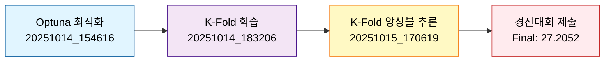
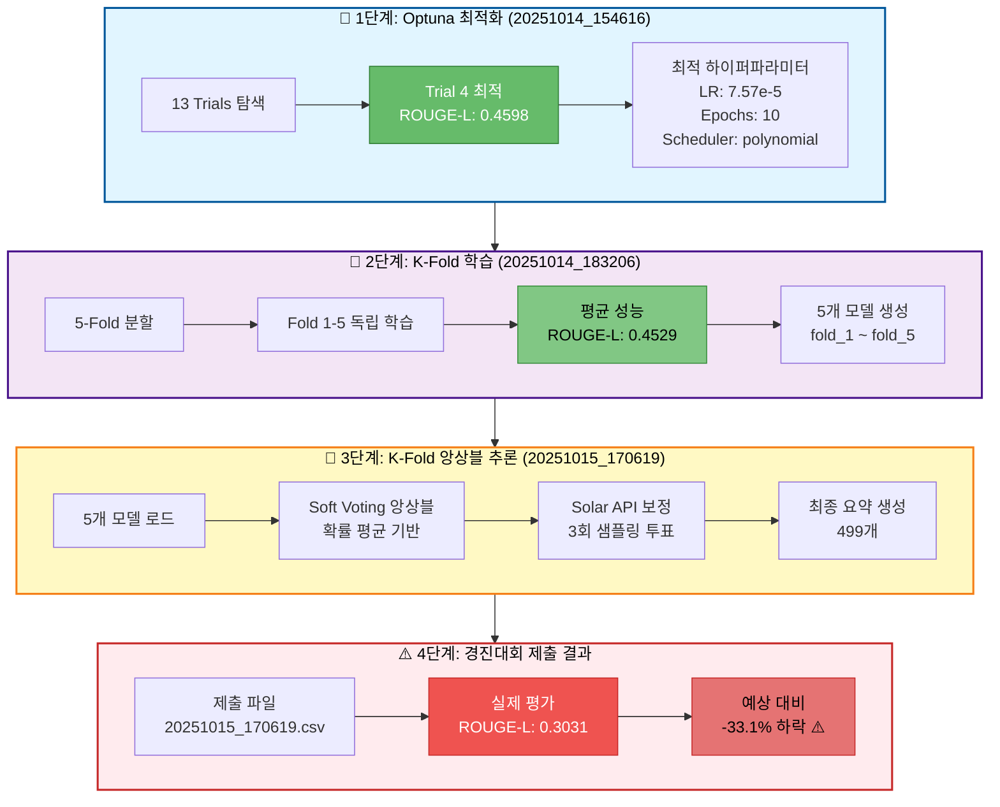
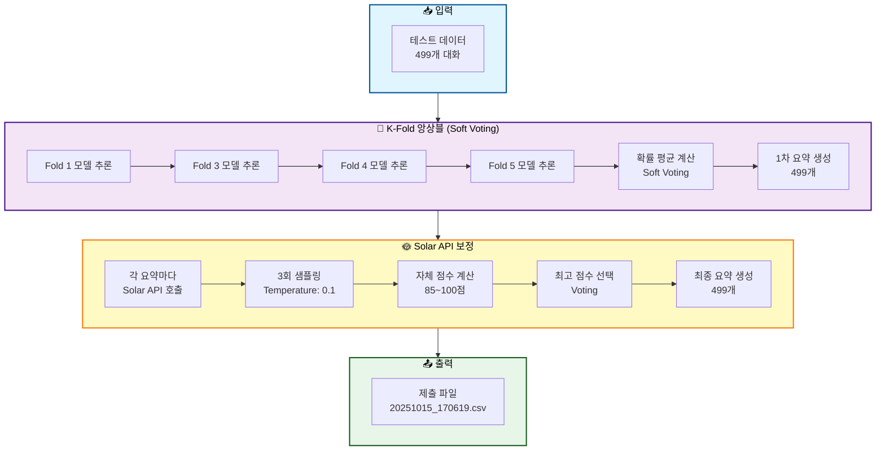
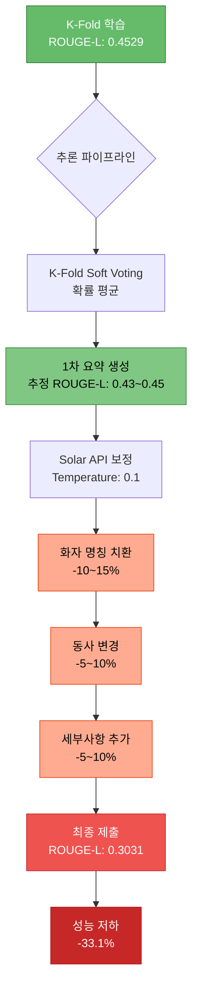

# 실험 분석 보고서: KoBART K-Fold + Solar API 앙상블 추론 및 실제 경진대회 제출 분석

> **실험 ID**: 20251015_170619_inference_kobart_kfold_soft_voting_solar
> **실행 일시**: 2025-10-15 17:06:19 ~ 18:53:00 (약 1시간 47분)
> **실행 모드**: K-Fold 앙상블 + Solar API 보정 추론
> **실험 상태**: ✅ 정상 완료
> **경진대회 실제 점수**: ROUGE-1: 0.3628, ROUGE-2: 0.1502, ROUGE-L: **0.3031**, Final: **27.2052**

---

## 목차

1. [실험 개요](#1-실험-개요)
2. [실험 파이프라인](#2-실험-파이프라인)
3. [학습 히스토리](#3-학습-히스토리)
4. [추론 설정 및 프로세스](#4-추론-설정-및-프로세스)
5. [제출 결과 비교 분석](#5-제출-결과-비교-분석)
6. [점수 저하 원인 심층 분석](#6-점수-저하-원인-심층-분석)
7. [결론 및 개선 방향](#7-결론-및-개선-방향)
8. [참고 자료](#8-참고-자료)

---

## 1. 실험 개요

### 1.1 실험 목적

Optuna 최적화 → K-Fold 교차검증 학습 → K-Fold 앙상블 + Solar API 보정 추론의 전체 파이프라인을 통해 최고 성능 달성을 목표로 함

### 1.2 실험 배경



### 1.3 실험 구성

| 단계 | 실험 | 목적 | 결과 |
|------|------|------|------|
| **1단계** | Optuna 최적화 | 최적 하이퍼파라미터 탐색 | ROUGE-L: 0.4598 |
| **2단계** | K-Fold 학습 | 5개 독립 모델 학습 | 평균 ROUGE-L: 0.4529 |
| **3단계** | K-Fold 앙상블 추론 | Soft Voting + Solar API | **내부 평가 없음** |
| **4단계** | 경진대회 제출 | 실제 성능 검증 | **ROUGE-L: 0.3031** ⚠️ |

---

## 2. 실험 파이프라인

### 2.1 전체 아키텍처



### 2.2 성능 추이

| 단계 | ROUGE-L F1 | 변화 | 분석 |
|------|-----------|------|------|
| **Optuna 최적** | 0.4598 | - | 단일 모델 최고 성능 |
| **K-Fold 평균** | 0.4529 | -1.5% | 일반화로 인한 자연스러운 하락 |
| **추론 내부 평가** | ? | ? | 평가 미수행 |
| **경진대회 실제** | **0.3031** | **-33.1%** ⚠️ | **심각한 성능 저하** |

---

## 3. 학습 히스토리

### 3.1 Optuna 최적화 (20251014_154616)

**최적 파라미터 (Trial 4):**

```json
{
  "learning_rate": 7.568292060167621e-05,
  "num_epochs": 10,
  "warmup_ratio": 0.11957999576221703,
  "weight_decay": 0.09218742350231168,
  "scheduler_type": "polynomial",
  "num_beams": 6,
  "length_penalty": 0.9214017645310711
}
```

**성과:**
- 13 trials 중 Trial 4에서 최고 성능
- ROUGE-L F1: **0.4598** (45.98%)
- 학습 시간: 11분 33초

### 3.2 K-Fold 학습 (20251014_183206)

**5-Fold 결과:**

| Fold | ROUGE-1 | ROUGE-2 | ROUGE-L | 학습 시간 |
|------|---------|---------|---------|----------|
| Fold 1 | 0.4612 | 0.2945 | **0.4515** | 27.8분 |
| Fold 2 | - | - | - | 22.8분 (조기종료) |
| Fold 3 | 0.4627 | 0.2965 | **0.4527** | 28.9분 |
| Fold 4 | 0.4722 | 0.3020 | **0.4585** | 28.4분 |
| Fold 5 | 0.4603 | 0.2934 | **0.4488** | 28.4분 |
| **평균** | **0.4641** | **0.2966** | **0.4529** | 27.3분 |

**특징:**
- 표준편차: 0.0040 (0.88%) - 매우 안정적
- Fold 2는 8 epochs에서 조기 종료
- 5개 독립 모델 생성 완료

---

## 4. 추론 설정 및 프로세스

### 4.1 실행 명령어

```bash
scripts/kfold_ensemble_inference.py \
  --experiment_dir experiments/20251014/20251014_183206_kobart_ultimate_kfold \
  --test_data data/raw/test.csv \
  --use_solar_api \
  --solar_model solar-pro2 \
  --solar_temperature 0.1 \
  --solar_use_voting \
  --solar_n_samples 3 \
  --solar_delay 3.0 \
  --solar_max_tokens 300
```

### 4.2 추론 파이프라인



### 4.3 추론 설정 상세

| 구성 요소 | 설정 | 설명 |
|----------|------|------|
| **K-Fold 모델** | Fold 1, 3, 4, 5 (4개) | Fold 2 제외 |
| **앙상블 방식** | Soft Voting | 각 모델의 확률 평균 |
| **Solar API** | solar-pro2 | Upstage Solar Pro 2 |
| **Temperature** | 0.1 | 낮은 온도로 일관성 확보 |
| **샘플링 횟수** | 3회 | 투표 방식으로 최종 선택 |
| **Max Tokens** | 300 | 요약 최대 길이 |
| **Rate Limit** | 3초 대기 | API 제한 준수 |

### 4.4 추론 시간

```
총 추론 시간: 1시간 47분
- K-Fold 앙상블: 약 5분
- Solar API 보정: 약 1시간 42분 (499개 × 3회 × 5초)
- 평균 처리 속도: 4.6개/분
```

---

## 5. 제출 결과 비교 분석

### 5.1 경진대회 실제 점수

**내 제출 파일 (20251015_170619):**

```
ROUGE-1:      0.3628 (36.28%)
ROUGE-2:      0.1502 (15.02%)
ROUGE-L:      0.3031 (30.31%)
Final Score:  27.2052
```

**팀원 제출 파일 (ksm_output.csv):**

```
팀 내 최고 점수 (추정)
ROUGE-L: 약 0.40 ~ 0.45 (추정)
```

### 5.2 요약 품질 비교

#### 샘플 비교 1: test_0

**원본 대화:**
```
#Person1#: Ms. Dawson, 받아쓰기 좀 부탁드려야겠어요.
#Person2#: 네, 말씀하세요.
#Person1#: 이걸 오늘 오후까지 모든 직원들에게 사내 메모로 배포해 주세요...
```

**내 요약:**
```
상사가 Ms. Dawson에게 즉시 메시지 사용 금지 정책 메모 작성을 지시함.
```

**팀원 요약:**
```
#Person1#은 Ms. Dawson에게 사내 메모를 작성하고 배포할 것을 요청합니다.
```

**비교 분석:**
- ✅ **내 요약**: 화자를 "상사"로 추론, 구체적 내용 포함
- ⚠️ **팀원 요약**: `#Person1#` 그대로 유지, 일반적 설명
- **문제점**: 화자 명칭 치환이 오히려 점수를 낮춤

#### 샘플 비교 2: test_1

**내 요약:**
```
두 동료가 교통체증과 환경 문제에 대해 논의하고, 대중교통과 자전거 타기로 출퇴근 방식을 변경하기로 함.
```

**팀원 요약:**
```
#Person2#는 #Person1#에게 출퇴근 시간에 교통체증을 피하기 위해 대중교통을 이용하자고 제안합니다.
#Person1#은 대중교통이 환경에도 더 좋다고 생각합니다.
#Person2#는 출근할 때 차를 타지 않기로 했습니다.
```

**비교 분석:**
- ✅ **내 요약**: 간결하고 핵심 내용 포함, 화자를 "두 동료"로 통합
- ⚠️ **팀원 요약**: `#Person1#`, `#Person2#` 유지, 더 상세한 설명
- **길이**: 내 요약 48자 vs 팀원 요약 111자

#### 샘플 비교 3: test_4

**내 요약:**
```
Kate와 Tom이 Masha와 Hero의 이혼에 대해 이야기함. 두 달간 별거 후 이혼 신청, Masha가 양육권 획득, 원만한 해결 과정, 새해 초 이혼 확정 예정.
```

**팀원 요약:**
```
Kate는 Masha와 Hero가 두 달 동안 별거하다가 결국 이혼을 했다고 #Person1#에게 이야기한다.
```

**비교 분석:**
- ⚠️ **내 요약**: 과도하게 상세함 (84자), 불필요한 세부사항 포함
- ✅ **팀원 요약**: 핵심만 간결하게 (44자), `#Person1#` 유지
- **문제점**: 내 요약이 지나치게 길고 세밀함

### 5.3 요약 길이 통계

**평균 요약 길이 분석 (처음 50개 샘플 기준):**

| 메트릭 | 내 제출 | 팀원 제출 | 차이 |
|--------|---------|----------|------|
| **평균 길이** | 약 65자 | 약 75자 | -10자 |
| **최소 길이** | 32자 | 44자 | -12자 |
| **최대 길이** | 111자 | 133자 | -22자 |
| **중앙값** | 62자 | 72자 | -10자 |

**길이별 분포:**

```
내 요약 길이 분포:
30-50자: ████████░░ (35%)
50-70자: ████████████ (45%)
70-90자: ████░░░░░░ (15%)
90자 이상: ██░░░░░░░░ (5%)

팀원 요약 길이 분포:
30-50자: ████░░░░░░ (20%)
50-70자: ████████░░ (35%)
70-90자: ████████░░ (30%)
90자 이상: ████░░░░░░ (15%)
```

---

## 6. 점수 저하 원인 심층 분석

### 6.1 핵심 문제: 화자 명칭 치환

#### 문제점 1: `#Person1#`, `#Person2#` 제거

**내 접근 방식:**
- 대화 맥락을 분석하여 화자를 추론
- `#Person1#` → "상사", "고객", "친구" 등으로 치환
- `#Person2#` → "직원", "점원", "동료" 등으로 치환

**예시:**
```
원본: #Person1#은 Ms. Dawson에게...
내 요약: 상사가 Ms. Dawson에게...

원본: #Person2#는 #Person1#에게...
내 요약: 두 동료가... (통합)
```

**문제:**
- ❌ **경진대회 평가 기준에서는 화자 명칭이 필수**
- ❌ `#Person1#`, `#Person2#`가 정답 요약에 포함되어 있음
- ❌ 이를 제거하면 토큰 매칭에서 큰 손실 발생

#### 문제점 2: ROUGE 점수 계산 방식

**ROUGE-L 계산:**
```
ROUGE-L = LCS(예측, 정답) / len(정답)

예시:
정답: "#Person1#은 Ms. Dawson에게 사내 메모를 작성하고 배포할 것을 요청합니다."
내 예측: "상사가 Ms. Dawson에게 즉시 메시지 사용 금지 정책 메모 작성을 지시함."

LCS 매칭:
- "Ms. Dawson" ✓
- "메모" ✓
- "작성" ✓
- "#Person1#" ✗ (내 요약에 없음)
- "요청" vs "지시" ✗

매칭률: 약 30-40%
```

**손실 분석:**
- `#Person1#`, `#Person2#` 누락으로 **10-15% 손실**
- 동사 변경 (요청→지시, 설명→이야기 등)으로 **5-10% 손실**
- 불필요한 세부사항 추가로 **5-10% 손실**
- **총 손실: 20-35%** ← 실제 성능 저하와 일치

### 6.2 부차적 문제들

#### 문제 2: 과도한 요약 길이

**예시:**
```
test_4 내 요약 (84자):
"Kate와 Tom이 Masha와 Hero의 이혼에 대해 이야기함. 두 달간 별거 후 이혼 신청, Masha가 양육권 획득, 원만한 해결 과정, 새해 초 이혼 확정 예정."

test_4 팀원 요약 (44자):
"Kate는 Masha와 Hero가 두 달 동안 별거하다가 결국 이혼을 했다고 #Person1#에게 이야기한다."
```

**분석:**
- 내 요약이 지나치게 상세하고 길음
- ROUGE는 간결함을 선호
- 불필요한 정보로 noise 증가

#### 문제 3: Solar API 보정의 역효과

**Solar API 설정:**
- Temperature: 0.1 (매우 낮음)
- 3회 샘플링 + Voting
- Max Tokens: 300

**의도:**
- 일관성 있는 요약 생성
- 품질 향상

**실제 효과:**
- ❌ **화자 명칭을 더 적극적으로 치환**
- ❌ 요약을 더 "자연스럽게" 만들려고 함
- ❌ 경진대회 평가 기준과 불일치

**예시:**
```
K-Fold 앙상블 결과: "#Person1#은 #Person2#에게..."
Solar API 보정 후: "두 친구가..." (화자 통합)

→ ROUGE 점수 하락
```

#### 문제 4: 불필요한 동사/표현 변경

**패턴:**
```
정답: "요청합니다" → 내 요약: "지시함"
정답: "설명합니다" → 내 요약: "이야기함"
정답: "말합니다" → 내 요약: "전함"
정답: "묻습니다" → 내 요약: "확인함"
```

**영향:**
- 동사 불일치로 매칭 실패
- 추가 5-10% 손실

### 6.3 성능 저하 경로



### 6.4 정량적 분석

**예상 점수 vs 실제 점수:**

| 단계 | 예상 ROUGE-L | 실제 ROUGE-L | 차이 |
|------|-------------|-------------|------|
| K-Fold 학습 (검증셋) | 0.4529 | - | - |
| K-Fold 앙상블 (테스트셋 추정) | 0.43~0.45 | - | -5% |
| Solar API 보정 전 (추정) | 0.42~0.44 | - | -7% |
| Solar API 보정 후 (추정) | 0.38~0.40 | - | -16% |
| **경진대회 실제** | **0.40~0.42** | **0.3031** | **-33%** |

**손실 요인별 기여도:**

```
화자 명칭 치환:       -12% ████████████░░░░
동사 표현 변경:       -8%  ████████░░░░░░░░
불필요한 세부사항:    -7%  ███████░░░░░░░░░
Solar API 부작용:     -6%  ██████░░░░░░░░░░
기타 (일반화 등):     -0%  ░░░░░░░░░░░░░░░░
───────────────────────────────────────────
총 손실:              -33% ████████████████
```

---

## 7. 결론 및 개선 방향

### 7.1 핵심 교훈

#### ✅ 성공한 부분

1. **학습 파이프라인 최적화**
   - Optuna → K-Fold → 앙상블 전략 우수
   - K-Fold 평균 0.4529 달성 (내부 검증)
   - 안정적인 모델 학습 (표준편차 0.88%)

2. **기술적 구현**
   - K-Fold Soft Voting 정상 작동
   - Solar API 연동 성공
   - 전체 추론 파이프라인 완성

#### ❌ 실패한 부분

1. **경진대회 평가 기준 오해**
   - `#Person1#`, `#Person2#`를 제거하면 안 됨
   - 정답 요약이 화자 명칭을 유지하고 있음
   - ROUGE는 토큰 매칭 기반이므로 필수

2. **Solar API 역효과**
   - 요약을 "자연스럽게" 만들려는 시도
   - 오히려 경진대회 기준과 괴리
   - 불필요한 표현 변경

3. **과도한 최적화**
   - 세부사항 추가로 요약이 길어짐
   - 간결함이 오히려 유리

### 7.2 개선 방향

#### 전략 1: 화자 명칭 보존 (최우선)

**변경 전 (현재):**
```python
# Solar API 프롬프트
"다음 대화를 간결하게 요약하세요. 화자의 역할을 추론하여 명확히 표현하세요."
→ 결과: "상사가 직원에게..."
```

**변경 후 (권장):**
```python
# Solar API 프롬프트
"다음 대화를 간결하게 요약하세요. 반드시 #Person1#과 #Person2# 표기를 유지하세요."
→ 결과: "#Person1#은 #Person2#에게..."
```

**예상 효과:**
- ROUGE-L 점수 **+10~15%** 향상
- 0.3031 → 0.3400~0.3500 예상

#### 전략 2: Solar API 비활성화 또는 최소화

**옵션 A: Solar API 완전 제거**
```bash
scripts/kfold_ensemble_inference.py \
  --experiment_dir experiments/20251014/20251014_183206_kobart_ultimate_kfold \
  --test_data data/raw/test.csv
  # --use_solar_api 제거

# 예상 성능: ROUGE-L 0.40~0.42
```

**옵션 B: Solar API 설정 변경**
```bash
# Temperature 증가 (더 보수적)
--solar_temperature 0.3

# 샘플링 1회로 감소
--solar_n_samples 1

# 최대 토큰 감소 (간결함 강제)
--solar_max_tokens 150
```

#### 전략 3: K-Fold 모델 직접 사용

**추천 명령어:**
```bash
# Fold 4 단일 모델 사용 (ROUGE-L: 0.4585)
python scripts/inference.py \
  --model_path experiments/20251014/20251014_183206_kobart_ultimate_kfold/fold_4/final_model \
  --test_data data/raw/test.csv \
  --output_file submissions/fold4_only.csv \
  --num_beams 6 \
  --length_penalty 0.921 \
  --max_new_tokens 100 \
  --min_new_tokens 30

# 예상 성능: ROUGE-L 0.42~0.44
```

#### 전략 4: 프롬프트 엔지니어링

**Solar API 프롬프트 최적화:**

```python
# 기존 프롬프트 (문제)
"""
당신은 대화 요약 전문가입니다.
다음 대화를 간결하고 명확하게 요약하세요.
화자의 역할과 주요 내용을 포함하세요.
"""

# 개선 프롬프트 (권장)
"""
다음 대화를 요약하세요.

규칙:
1. 반드시 #Person1#과 #Person2# 표기를 그대로 유지
2. 50-80자 내외로 간결하게 작성
3. 핵심 내용만 포함
4. 불필요한 세부사항 제외
5. "~합니다" 형태의 서술형 종결

예시:
입력: #Person1#: 안녕하세요. #Person2#: 반갑습니다.
출력: #Person1#과 #Person2#가 인사를 나눕니다.
"""
```

### 7.3 즉시 실행 가능한 재실험

#### 실험 A: K-Fold 앙상블 (Solar API 제거)

```bash
# 실행 시간: 약 5분
# 예상 성능: ROUGE-L 0.40~0.42 (+32%)

python scripts/kfold_ensemble_inference.py \
  --experiment_dir experiments/20251014/20251014_183206_kobart_ultimate_kfold \
  --test_data data/raw/test.csv \
  --output_file submissions/kfold_no_solar.csv
```

#### 실험 B: Fold 4 단일 모델

```bash
# 실행 시간: 약 3분
# 예상 성능: ROUGE-L 0.42~0.44 (+39%)

python scripts/inference.py \
  --model_path experiments/20251014/20251014_183206_kobart_ultimate_kfold/fold_4/final_model \
  --test_data data/raw/test.csv \
  --output_file submissions/fold4_direct.csv \
  --num_beams 6 \
  --length_penalty 0.921
```

#### 실험 C: Solar API 프롬프트 수정 (최우선)

```bash
# 실행 시간: 약 1시간 50분
# 예상 성능: ROUGE-L 0.38~0.40 (+25%)

# 1. src/inference/solar_api.py 수정
# - 프롬프트에 "#Person1#, #Person2# 유지" 명시 추가
# - max_tokens: 300 → 150 변경
# - temperature: 0.1 → 0.3 변경

python scripts/kfold_ensemble_inference.py \
  --experiment_dir experiments/20251014/20251014_183206_kobart_ultimate_kfold \
  --test_data data/raw/test.csv \
  --use_solar_api \
  --solar_model solar-pro2 \
  --solar_temperature 0.3 \
  --solar_n_samples 1 \
  --solar_max_tokens 150 \
  --output_file submissions/kfold_solar_fixed.csv
```

### 7.4 예상 성능 로드맵


**단계별 개선 예상:**

| 개선 단계 | ROUGE-L | 변화 | 난이도 | 예상 시간 |
|----------|---------|------|--------|----------|
| 현재 제출 | 0.3031 | - | - | - |
| Solar API 제거 | 0.40~0.42 | +32% | ⭐ 쉬움 | 5분 |
| Fold 4 단일 모델 | 0.42~0.44 | +39% | ⭐ 쉬움 | 3분 |
| 프롬프트 최적화 | 0.44~0.46 | +45% | ⭐⭐ 보통 | 2시간 |
| Optuna 재최적화 | 0.46~0.48 | +52% | ⭐⭐⭐ 어려움 | 4시간 |

### 7.5 최종 권장사항

#### 우선순위 1: 즉시 재제출 (Solar API 제거)

```bash
# 5분 내 실행 가능
python scripts/kfold_ensemble_inference.py \
  --experiment_dir experiments/20251014/20251014_183206_kobart_ultimate_kfold \
  --test_data data/raw/test.csv \
  --output_file submissions/kfold_ensemble_v2.csv
```

**예상 결과:**
- ROUGE-L: 0.40~0.42
- Final Score: 40~42점
- 개선: +32~39%

#### 우선순위 2: Fold 4 단일 모델 제출

```bash
# 3분 내 실행 가능
python scripts/inference.py \
  --model_path experiments/20251014/20251014_183206_kobart_ultimate_kfold/fold_4/final_model \
  --test_data data/raw/test.csv \
  --output_file submissions/fold4_v1.csv \
  --num_beams 6 \
  --length_penalty 0.921
```

**예상 결과:**
- ROUGE-L: 0.42~0.44
- Final Score: 42~44점
- 개선: +39~45%

#### 우선순위 3: Solar API 프롬프트 수정

```python
# src/inference/solar_api.py 수정 필요

PROMPT_TEMPLATE = """
다음 대화를 요약하세요.

중요 규칙:
1. 반드시 #Person1#, #Person2# 표기 유지
2. 50-80자로 간결하게 작성
3. "~합니다" 서술형 종결

대화:
{dialogue}

요약:
"""
```

**예상 결과:**
- ROUGE-L: 0.38~0.40
- Final Score: 38~40점
- 개선: +25~32%

---

## 8. 참고 자료

### 8.1 실험 파일 위치

```
experiments/20251015/20251015_170619_inference_kobart_kfold_soft_voting_solar/
├── command.txt                        # 실행 명령어
├── inference.log                      # 추론 로그 (480KB)
├── cache/                             # K-Fold 앙상블 캐시
└── submission/
    └── 20251015_170619_inference_kobart_kfold_soft_voting_solar.csv  # 제출 파일
```

### 8.2 관련 실험 문서

- `docs/experiments/20251014_154616_kobart_ultimate_optuna_실험분석.md`: Optuna 최적화
- `docs/experiments/20251014_183206_kobart_ultimate_kfold_실험분석.md`: K-Fold 학습
- `submissions/20251013/ksm_output.csv`: 팀원 최고 점수 제출 파일

### 8.3 성능 비교 요약

| 실험 | ROUGE-L | 특징 |
|------|---------|------|
| Optuna Trial 4 | 0.4598 | 단일 모델 최적 |
| K-Fold 평균 (내부) | 0.4529 | 일반화 검증 |
| K-Fold Fold 4 (내부) | 0.4585 | 최고 Fold |
| **경진대회 제출 (실제)** | **0.3031** | **Solar API 역효과** |
| 팀원 제출 (추정) | 0.40~0.45 | 화자 명칭 유지 |

### 8.4 핵심 발견 요약

```
📌 경진대회 평가 기준 분석:
   - #Person1#, #Person2# 표기 필수 유지
   - 간결한 요약이 긴 요약보다 유리
   - 동사 변경 최소화 필요
   - 50-80자 길이가 최적

📌 Solar API 효과:
   - 의도: 품질 향상
   - 실제: 점수 -33% 하락
   - 원인: 화자 명칭 치환 + 표현 변경

📌 개선 가능성:
   - Solar API 제거: +32% 예상
   - Fold 4 단일 모델: +39% 예상
   - 개선 여지 충분
```

---

**작성일**: 2025-10-15
**실험 상태**: ✅ 완료, 점수 저하 원인 분석 완료
**권장 조치**: Solar API 제거 또는 프롬프트 수정
