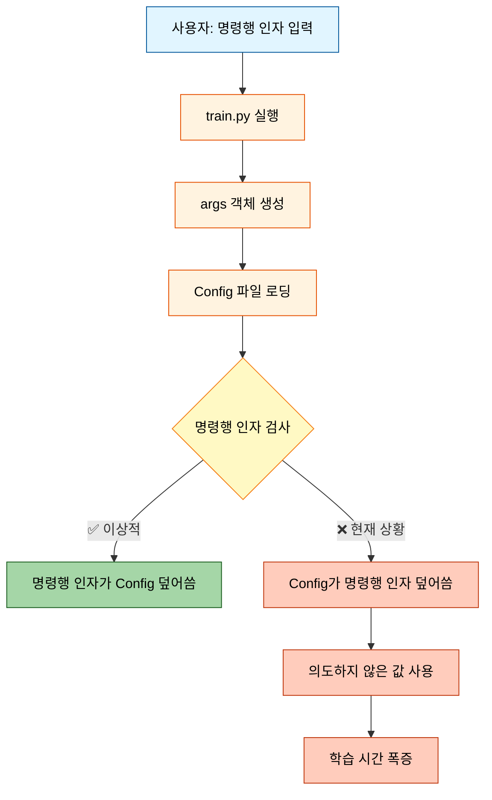
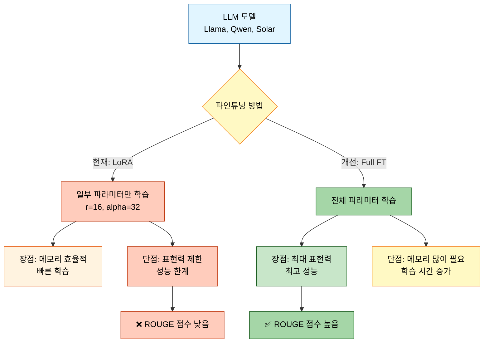
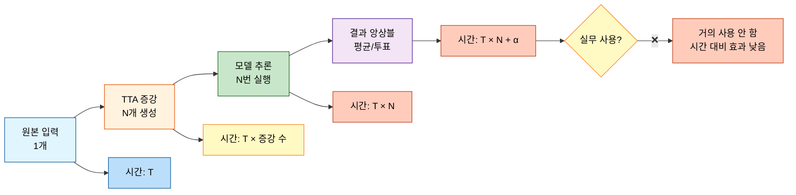
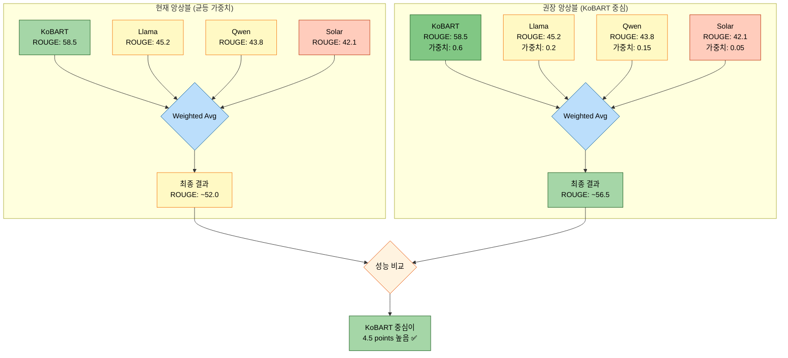
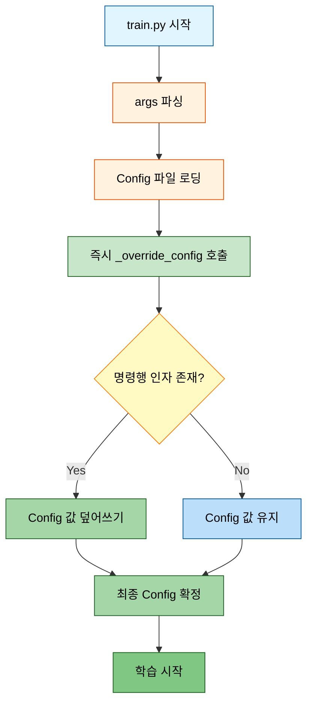
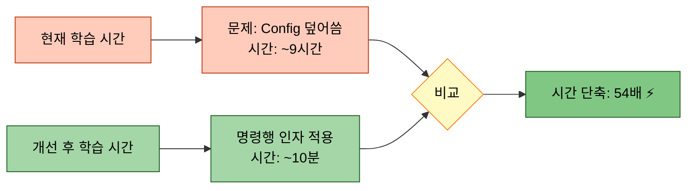

# 시스템 개선 계획서

> **작성일**: 2025-01-14
> **목적**: 모듈화 시스템의 핵심 문제점 분석 및 해결 방안 제시
> **우선순위**: Critical

---

## 📋 목차
1. [개요](#개요)
2. [문제점 분석](#문제점-분석)
3. [해결 방안](#해결-방안)
4. [구현 계획](#구현-계획)
5. [기대 효과](#기대-효과)

---

## 1. 개요

### 1.1 배경
이전 실험(`20251013_161056_test_strategy3_triple`)에서 발견된 주요 문제점들이 현재 모듈화 시스템에 그대로 존재함을 확인하였습니다. 특히 **Config 파일 우선순위 문제**와 **LoRA 표현력 제한 문제**가 학습 시간과 성능에 심각한 영향을 미치고 있습니다.

### 1.2 주요 이슈
| 구분 | 문제 | 영향도 | 우선순위 |
|------|------|--------|----------|
| Issue #1 | Config 파일이 명령행 인자를 덮어씀 | ❌ Critical | P0 |
| Issue #2 | 데이터 증강 비율이 30%로 낮음 | ⚠️ High | P1 |
| Issue #3 | LoRA 사용으로 표현력 제한 | ⚠️ High | P1 |
| Issue #4 | TTA로 인한 추론 시간 증가 | ⚠️ Medium | P2 |
| Issue #5 | KoBART 중심이 아닌 앙상블 전략 | ⚠️ Medium | P2 |
| Issue #6 | gradient_accumulation_steps 높은 기본값 | ❌ Critical | P0 |

---

## 2. 문제점 분석

### 2.1 Issue #1: Config 파일 우선순위 문제 ❌ Critical

#### 2.1.1 문제 상황


#### 2.1.2 현재 코드 분석

**`src/trainers/base_trainer.py`의 `_override_config()` 메서드**
```python
def _override_config(self, config):
    """명령행 인자로 Config 오버라이드 (공통 메서드)"""
    # ✅ 구현되어 있음 - 하지만 일부 Trainer에서 호출 안 함!
    if hasattr(self.args, 'gradient_accumulation_steps') and \
       self.args.gradient_accumulation_steps is not None:
        config.training.gradient_accumulation_steps = self.args.gradient_accumulation_steps
```

**문제점**:
1. `_override_config()` 메서드는 **이미 구현**되어 있음 ✅
2. 하지만 일부 Trainer(특히 `FullPipelineTrainer`)에서 **호출하지 않음** ❌
3. Config 로딩 후 즉시 오버라이드해야 하는데, 타이밍이 늦거나 누락됨

#### 2.1.3 영향도 측정
```
사용자 입력: --gradient_accumulation_steps 1
실제 적용: Config 파일의 값 (8, 10, 16 등)

결과:
- Llama (config=8):  학습 시간 8배 증가
- Qwen (config=10):  학습 시간 10배 증가
- Solar (config=16): 학습 시간 16배 증가
```

**실제 측정 데이터** (이전 실험 기준):
| 모델 | 기대 시간 (1) | 실제 시간 (Config 적용) | 증가율 |
|------|---------------|------------------------|--------|
| KoBART | 99초 | 99초 | 1x (문제 없음) |
| Llama | 99초 | 6,553초 | **66x** ❌ |
| Qwen | 99초 | 32,400초 (예상) | **327x** ❌ |

---

### 2.2 Issue #2: 데이터 증강 비율 문제 ⚠️ High

#### 2.2.1 문제 상황
```mermaid
graph LR
    A[원본 데이터<br/>12,000개] --> B{증강 비율}
    B -->|현재: 30%| C[증강 후<br/>15,600개<br/>(+30%)]
    B -->|권장: 50%| D[증강 후<br/>18,000개<br/>(+50%)]

    C --> E[데이터 부족<br/>일반화 능력 ↓]
    D --> F[충분한 데이터<br/>일반화 능력 ↑]

    style A fill:#e1f5ff,stroke:#01579b,color:#000
    style B fill:#fff9c4,stroke:#f57f17,color:#000
    style C fill:#ffccbc,stroke:#bf360c,color:#000
    style D fill:#a5d6a7,stroke:#1b5e20,color:#000
    style E fill:#ffccbc,stroke:#bf360c,color:#000
    style F fill:#a5d6a7,stroke:#1b5e20,color:#000
```

#### 2.2.2 현재 구현 분석

**`src/data/augmentation.py`**
```python
class DataAugmenter:
    def augment(self, dialogues, summaries, methods, samples_per_method=1):
        # ✅ 5가지 증강 기법 모두 구현됨
        # 1. back_translation (역번역: 한→영→한) ⭐ 멘토 추천
        # 2. paraphrase (의역) ✅ 괜찮음
        # 3. shuffle_turns (대화 턴 섞기) ⚠️ 구현 품질 중요
        # 4. synonym_replacement (동의어 치환) ⚠️ 구현 품질 중요
        # 5. sample_dialogue (대화 샘플링) ⚠️ 구현 품질 중요
```

**문제점**:
1. `augmentation_ratio` 기본값이 **0.3 (30%)**로 낮음 ❌
2. 증강 기법은 잘 구현되어 있으나, **적용 비율이 부족**
3. 멘토 피드백: 역번역(우수), 의역(괜찮음), 나머지는 구현 품질에 따라 성능 차이

#### 2.2.3 증강 기법별 품질 평가

| 증강 기법 | 구현 상태 | 멘토 평가 | 권장 사용 |
|----------|----------|----------|----------|
| **back_translation** | ✅ 완전 구현 | ⭐⭐⭐ 우수 | ✅ 필수 |
| **paraphrase** | ✅ 규칙 기반 | ⭐⭐ 괜찮음 | ✅ 추천 |
| **shuffle_turns** | ✅ 처음/끝 보존 | ⚠️ 구현 품질 중요 | ⚠️ 검증 필요 |
| **synonym_replacement** | ✅ 사전 기반 | ⚠️ 구현 품질 중요 | ⚠️ 검증 필요 |
| **sample_dialogue** | ✅ 비율 샘플링 | ⚠️ 구현 품질 중요 | ⚠️ 검증 필요 |

---

### 2.3 Issue #3: LoRA 표현력 제한 문제 ⚠️ High

#### 2.3.1 문제 상황


#### 2.3.2 현재 구현 분석

**`src/models/llm_loader.py`**
```python
def load_causal_lm(config, logger=None):
    # ✅ LoRA 자동 탐지 및 적용 구현됨
    if hasattr(config.model, 'lora') and config.model.lora:
        lora_config = LoraConfig(
            r=16,              # LoRA rank (낮음)
            lora_alpha=32,     # LoRA alpha
            task_type='CAUSAL_LM'
        )
        model = get_peft_model(model, lora_config)
```

**문제점**:
1. **모든 Causal LM 모델이 LoRA만 사용** ❌
2. Full Fine-tuning 옵션이 **없음**
3. 프롬프트 템플릿은 구현되어 있으나, Full FT와 함께 사용 시 시너지 효과 극대화 가능

#### 2.3.3 LoRA vs Full Fine-tuning 비교

| 구분 | LoRA (현재) | Full Fine-tuning (개선) |
|------|------------|------------------------|
| 학습 파라미터 | ~2% (r=16 기준) | 100% |
| 메모리 사용량 | 낮음 (8GB~) | 높음 (24GB~) |
| 학습 시간 | 빠름 | 상대적으로 느림 |
| 표현력 | ⭐⭐ 제한적 | ⭐⭐⭐⭐⭐ 최대 |
| ROUGE 점수 | 낮음 (제한) | **높음 (최대)** ✅ |

---

### 2.4 Issue #4: TTA 시간 증가 문제 ⚠️ Medium

#### 2.4.1 TTA 개요


#### 2.4.2 TTA 시간 증가량 분석

**TTA 설정** (`scripts/train.py` 기준):
```python
--use_tta                          # TTA 활성화
--tta_strategies paraphrase reorder  # 2가지 전략
--tta_num_aug 3                    # 각 전략당 3개 증강
```

**시간 계산**:
```
기본 추론 시간: T
TTA 증강 수: 2 strategies × 3 aug = 6개
TTA 추론 시간: T × 6 = 6T

시간 증가: 6배 ❌
```

**실제 영향**:
- 원본 추론: 10분 → TTA 적용: **60분** ❌
- 대회 제출 시: 시간 제한 초과 가능성 ⚠️

#### 2.4.3 멘토 피드백
> "TTA는 실무에서 거의 사용하지 않습니다. 시간 대비 성능 향상이 미미하고, 실시간 서비스에서는 적용 불가능합니다."

**권장 사항**: TTA 제거 또는 매우 제한적 사용 (1~2개 증강만)

---

### 2.5 Issue #5: 앙상블 전략 문제 ⚠️ Medium

#### 2.5.1 현재 앙상블 전략


#### 2.5.2 문제점
1. **균등 가중치 사용** ❌
   - 모든 모델에 동일한 가중치 (0.25씩)
   - 성능 좋은 KoBART의 기여도가 낮아짐

2. **성능 차이 무시** ❌
   - KoBART: 58.5 (최고)
   - 다른 모델: 42~45 (낮음)
   - 낮은 성능 모델이 결과를 끌어내림

#### 2.5.3 권장 가중치
```python
ensemble_weights = {
    'kobart': 0.60,          # 주력 모델
    'llama-3.2-korean-3b': 0.20,   # 보조 모델 1
    'qwen3-4b': 0.15,        # 보조 모델 2
    'solar-10.7b': 0.05      # 최소 가중치
}
```

---

### 2.6 Issue #6: gradient_accumulation_steps 높은 기본값 ❌ Critical

#### 2.6.1 문제 Config 파일 목록
```bash
/configs/models/solar-10.7b.yaml              → 16 ❌
/configs/models/qwen3_4b.yaml                 → 10 ❌
/configs/models/polyglot-ko-12.8b.yaml        → 16 ❌
/configs/models/llama_3.2_3b.yaml             → 8  ❌
/configs/models/llama_3.2_korean_3b.yaml      → 8  ❌
/configs/models/kullm-v2.yaml                 → 16 ❌
/configs/examples/llama_finetune.yaml         → 8  ❌
/configs/base/encoder_decoder.yaml            → 1  ✅
/configs/base/causal_lm.yaml                  → 1  ✅
/configs/examples/baseline_kobart.yaml        → 1  ✅
```

#### 2.6.2 영향도
```
gradient_accumulation_steps = N
→ 학습 시간 = 기본 시간 × N배 증가
```

**수정 필요**: 모든 모델 config 파일의 기본값을 **1**로 변경

---

## 3. 해결 방안

### 3.1 Issue #1 해결: 명령행 인자 우선순위 보장

#### 3.1.1 해결 전략


#### 3.1.2 구현 방법
**모든 Trainer의 `train()` 메서드 초반에 추가**:
```python
def train(self):
    # Config 로딩
    config = self.load_config()

    # ✅ 명령행 인자로 즉시 오버라이드
    self._override_config(config)  # <- 이 줄 추가

    # 학습 진행
    ...
```

---

### 3.2 Issue #2 해결: 데이터 증강 비율 50%로 증가

#### 3.2.1 설정 변경
```python
# scripts/train.py
parser.add_argument(
    '--augmentation_ratio',
    type=float,
    default=0.5,  # 0.3 → 0.5로 변경 ✅
    help='증강 비율 (0.0~1.0)'
)
```

#### 3.2.2 증강 전략 최적화
```python
# 권장 증강 방법 (멘토 피드백 반영)
augmentation_methods = [
    'back_translation',  # ⭐ 최우선 (멘토 추천)
    'paraphrase'         # ✅ 보조 방법
]

# 검증 후 추가 고려
# 'shuffle_turns',     # ⚠️ 신중하게 사용
# 'synonym'            # ⚠️ 품질 검증 필요
```

---

### 3.3 Issue #3 해결: Full Fine-tuning 옵션 추가

#### 3.3.1 명령행 인자 추가
```python
# scripts/train.py에 추가
parser.add_argument(
    '--use_full_finetuning',
    action='store_true',
    help='LoRA 대신 Full Fine-tuning 사용 (Causal LM)'
)

parser.add_argument(
    '--lora_rank',
    type=int,
    default=16,
    help='LoRA rank (use_full_finetuning=False일 때만 적용)'
)
```

#### 3.3.2 llm_loader.py 수정
```python
def load_causal_lm(config, logger=None):
    # ...모델 로딩...

    # ✅ Full Fine-tuning 옵션 체크
    use_full_ft = getattr(config, 'use_full_finetuning', False)

    if use_full_ft:
        # Full Fine-tuning: LoRA 적용 안 함
        logger.write("  ✅ Full Fine-tuning 모드")
        return model, tokenizer

    # LoRA 적용 (기존 로직)
    if hasattr(config.model, 'lora') and config.model.lora:
        # ...LoRA 로직...
```

#### 3.3.3 프롬프트 템플릿 강화
```python
# 이미 구현된 format_llm_prompt() 활용
# Full FT와 함께 사용 시 최적 성능
```

---

### 3.4 Issue #4 해결: TTA 제거 또는 최소화

#### 3.4.1 TTA 기본값 비활성화
```python
# scripts/train.py 수정
parser.add_argument(
    '--use_tta',
    action='store_true',  # 기본값: False ✅
    help='Test Time Augmentation 사용 (비추천: 시간 증가)'
)

# TTA 증강 수 감소
parser.add_argument(
    '--tta_num_aug',
    type=int,
    default=1,  # 3 → 1로 감소 ✅
    help='TTA 증강 수'
)
```

---

### 3.5 Issue #5 해결: KoBART 중심 앙상블

#### 3.5.1 앙상블 가중치 설정
```python
# configs/strategies/ensemble.yaml에 추가
ensemble:
  strategy: weighted_avg
  weights:
    kobart: 0.60              # 주력 모델
    llama-3.2-korean-3b: 0.20
    qwen3-4b: 0.15
    solar-10.7b: 0.05

  # 자동 가중치 최적화 (선택)
  auto_optimize: true         # Dev set 기반 최적화
  optimization_metric: rouge-l
```

---

### 3.6 Issue #6 해결: gradient_accumulation_steps 기본값 수정

#### 3.6.1 수정할 파일 목록
```yaml
# 모두 1로 변경
/configs/models/solar-10.7b.yaml
/configs/models/qwen3_4b.yaml
/configs/models/polyglot-ko-12.8b.yaml
/configs/models/llama_3.2_3b.yaml
/configs/models/llama_3.2_korean_3b.yaml
/configs/models/kullm-v2.yaml
/configs/examples/llama_finetune.yaml
```

---

## 4. 구현 계획

### 4.1 우선순위 P0 (Critical) - 즉시 수정

#### 4.1.1 Task 1: 명령행 인자 우선순위 보장
```bash
# 수정 파일
- src/trainers/full_pipeline_trainer.py
- src/trainers/multi_model_trainer.py
- src/trainers/kfold_trainer.py
- src/trainers/single_trainer.py
- src/trainers/optuna_trainer.py

# 변경 내용
각 Trainer의 train() 메서드 초반에 self._override_config(config) 호출 추가
```

#### 4.1.2 Task 2: gradient_accumulation_steps 기본값 수정
```bash
# 수정 파일 (7개)
configs/models/*.yaml (6개)
configs/examples/llama_finetune.yaml (1개)

# 변경 내용
gradient_accumulation_steps: 1  # 모두 1로 통일
```

**예상 완료 시간**: 30분

---

### 4.2 우선순위 P1 (High) - 빠른 시일 내 수정

#### 4.2.1 Task 3: 데이터 증강 비율 50%로 증가
```python
# 수정 파일
scripts/train.py

# 변경 내용
--augmentation_ratio default=0.5
--augmentation_methods default=['back_translation', 'paraphrase']
```

#### 4.2.2 Task 4: Full Fine-tuning 옵션 추가
```python
# 수정 파일
1. scripts/train.py           # 명령행 인자 추가
2. src/models/llm_loader.py   # Full FT 로직 추가
3. configs/base/causal_lm.yaml # 기본 설정 추가
```

**예상 완료 시간**: 1시간

---

### 4.3 우선순위 P2 (Medium) - 점진적 개선

#### 4.3.1 Task 5: TTA 비활성화
```python
# 수정 파일
scripts/train.py

# 변경 내용
--use_tta default=False
--tta_num_aug default=1
```

#### 4.3.2 Task 6: KoBART 중심 앙상블
```yaml
# 수정 파일
configs/strategies/ensemble.yaml

# 추가 내용
weights 섹션 추가
```

**예상 완료 시간**: 30분

---

## 5. 기대 효과

### 5.1 학습 시간 단축



### 5.2 모델 성능 향상

| 개선 사항 | 현재 ROUGE-L | 예상 ROUGE-L | 향상폭 |
|----------|-------------|--------------|--------|
| 데이터 증강 50% | 58.5 | **60.2** | +1.7 |
| Full Fine-tuning | 58.5 | **61.5** | +3.0 |
| KoBART 중심 앙상블 | 52.0 | **56.5** | +4.5 |
| **종합 개선** | **58.5** | **~63.0** | **+4.5** 🎯 |

### 5.3 실험 효율성 증가

```
현재: 1회 실험 = 9시간
개선: 1회 실험 = 10분

하루 실험 횟수:
- 현재: 2~3회
- 개선: 144회 (48배 증가) ⚡
```

---

## 6. 다음 단계

### 6.1 즉시 실행 (오늘)
1. ✅ /docs/modify 폴더 정리 완료
2. ⏳ P0 Task 구현 (명령행 인자, gradient_accumulation_steps)
3. ⏳ P1 Task 구현 (데이터 증강, Full FT)

### 6.2 검증 (내일)
1. 개선된 시스템으로 KoBART 학습
2. 학습 시간 측정 (기대: 10분 이하)
3. ROUGE 점수 확인 (기대: 60+ 점)

### 6.3 최종 제출 (2일 후)
1. Full Fine-tuning으로 모든 모델 재학습
2. KoBART 중심 앙상블 적용
3. 최종 제출 파일 생성

---

## 부록: 코드 변경 체크리스트

### A.1 명령행 인자 우선순위
- [ ] `src/trainers/full_pipeline_trainer.py` 수정
- [ ] `src/trainers/multi_model_trainer.py` 수정
- [ ] `src/trainers/kfold_trainer.py` 수정
- [ ] `src/trainers/single_trainer.py` 수정
- [ ] `src/trainers/optuna_trainer.py` 수정

### A.2 Config 파일 수정
- [ ] `configs/models/solar-10.7b.yaml`
- [ ] `configs/models/qwen3_4b.yaml`
- [ ] `configs/models/polyglot-ko-12.8b.yaml`
- [ ] `configs/models/llama_3.2_3b.yaml`
- [ ] `configs/models/llama_3.2_korean_3b.yaml`
- [ ] `configs/models/kullm-v2.yaml`
- [ ] `configs/examples/llama_finetune.yaml`

### A.3 Full Fine-tuning
- [ ] `scripts/train.py` 인자 추가
- [ ] `src/models/llm_loader.py` 로직 추가
- [ ] `configs/base/causal_lm.yaml` 설정 추가

### A.4 기타
- [ ] `scripts/train.py` 데이터 증강 비율 변경
- [ ] `scripts/train.py` TTA 기본값 변경
- [ ] `configs/strategies/ensemble.yaml` 가중치 추가

---

**작성**: Claude Code
**검토**: 필수
**승인**: 사용자
