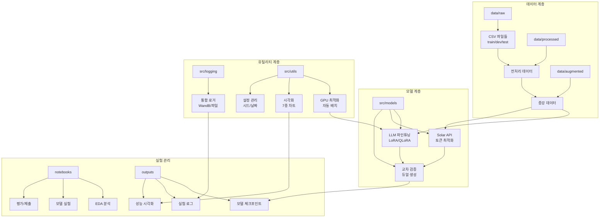
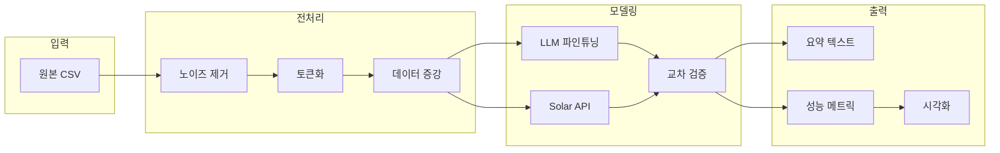

# 📂 프로젝트 디렉토리 구조

## 🏗️ 시스템 아키텍처



## 📁 디렉토리 상세 구조

```
natural-language-processing-competition/
│
├── 📁 configs/                    # 설정 파일
│   ├── config.yaml               # 기본 설정
│   ├── train_config.yaml         # 학습 설정
│   └── inference_config.yaml     # 추론 설정
│
├── 📁 data/                       # 데이터 저장소
│   ├── raw/                      # 원본 데이터
│   │   ├── train.csv             # 학습 데이터 (12,457개)
│   │   ├── dev.csv               # 검증 데이터 (499개)
│   │   ├── test.csv              # 테스트 데이터 (250개)
│   │   └── sample_submission.csv # 제출 샘플
│   ├── processed/                 # 전처리된 데이터
│   │   ├── train_cleaned.csv     # 노이즈 제거
│   │   ├── train_tokenized.pkl   # 토큰화 데이터
│   │   └── vocab.json            # 어휘 사전
│   └── augmented/                 # 증강 데이터
│       ├── backtranslated/       # 역번역 데이터
│       └── paraphrased/          # 패러프레이징
│
├── 📁 docs/                       # 문서
│   ├── 대회 소개 및 규칙/        # 대회 PDF 문서
│   └── PRD/                      # 프로젝트 계획 문서
│       ├── README.md
│       ├── 01_프로젝트_개요.md
│       ├── 02_프로젝트_구조.md   # (현재 문서)
│       ├── 03_브랜치_전략.md
│       ├── 04_성능_개선_전략.md
│       ├── 05_실험_추적_관리.md
│       ├── 06_기술_요구사항.md
│       ├── 07_리스크_관리.md
│       ├── 08_LLM_파인튜닝_전략.md
│       ├── 09_Solar_API_최적화.md
│       ├── 10_교차_검증_시스템.md
│       └── 11_로깅_및_모니터링_시스템.md
│
├── 📁 notebooks/                  # 실험 노트북
│   ├── base/                     # 베이스라인
│   │   ├── baseline.ipynb        # BART 베이스라인
│   │   ├── solar_api.ipynb       # Solar API 테스트
│   │   ├── models/               # 모델 저장
│   │   └── submissions/          # 제출 파일
│   └── experiments/              # 실험 노트북
│       ├── 01_eda/               # 탐색적 데이터 분석
│       ├── 02_preprocessing/     # 전처리 실험
│       ├── 03_llm_finetuning/    # LLM 파인튜닝
│       ├── 04_solar_optimization/ # API 최적화
│       ├── 05_cross_validation/  # 교차 검증
│       └── 06_ensemble/          # 앙상블
│
├── 📁 src/                        # 소스 코드 (모듈화)
│   ├── __init__.py
│   │
│   ├── 📁 data/                  # 데이터 처리
│   │   ├── __init__.py
│   │   ├── loader.py             # 데이터 로더
│   │   ├── preprocessor.py      # 전처리기
│   │   ├── augmentation.py      # 데이터 증강
│   │   └── tokenizer.py         # 토크나이저
│   │
│   ├── 📁 models/                # 모델 정의
│   │   ├── __init__.py
│   │   ├── llm_finetuning.py    # LLM 파인튜닝 (LoRA)
│   │   ├── solar_api.py         # Solar API 래퍼
│   │   ├── cross_validator.py   # 교차 검증 시스템
│   │   └── ensemble.py          # 앙상블 모델
│   │
│   ├── 📁 training/              # 학습 관련
│   │   ├── __init__.py
│   │   ├── trainer.py           # 학습 루프
│   │   ├── optimizer.py         # 최적화기
│   │   └── scheduler.py         # 학습률 스케줄러
│   │
│   ├── 📁 evaluation/            # 평가 도구
│   │   ├── __init__.py
│   │   ├── metrics.py           # ROUGE, BLEU 등
│   │   └── evaluator.py         # 평가기
│   │
│   ├── 📁 logging/               # 로깅 시스템 ✨
│   │   ├── __init__.py
│   │   ├── logger.py            # 통합 로거
│   │   ├── wandb_logger.py     # WandB 연동
│   │   └── notebook_logger.py  # 노트북 전용
│   │
│   └── 📁 utils/                 # 유틸리티 ✨
│       ├── __init__.py
│       ├── 📁 config/           # 설정 관리
│       │   ├── __init__.py
│       │   ├── seed.py          # 시드 고정
│       │   └── update_config_dates.py
│       ├── 📁 core/             # 핵심 유틸
│       │   ├── __init__.py
│       │   └── common.py
│       ├── 📁 gpu_optimization/  # GPU 최적화 ✨
│       │   ├── __init__.py
│       │   ├── team_gpu_check.py       # GPU 체크
│       │   ├── auto_batch_size.py      # 자동 배치
│       │   └── auto_batch_size_fixed.py
│       └── 📁 visualizations/    # 시각화 ✨
│           ├── __init__.py
│           ├── base_visualizer.py      # 기본 클래스
│           ├── training_viz.py         # 학습 시각화
│           ├── inference_viz.py        # 추론 시각화
│           ├── optimization_viz.py     # 최적화 시각화
│           └── output_manager.py       # 출력 관리
│
├── 📁 experiments/                # 실험 관리
│   ├── exp001_baseline/          # 베이스라인
│   ├── exp002_llm_lora/         # LoRA 파인튜닝
│   ├── exp003_solar_optimized/  # Solar 최적화
│   ├── exp004_cross_validation/ # 교차 검증
│   └── exp005_final_ensemble/   # 최종 앙상블
│
├── 📁 outputs/                    # 출력 디렉토리
│   ├── models/                   # 학습된 모델
│   ├── logs/                     # 실험 로그
│   ├── visualizations/           # 생성된 차트
│   └── submissions/              # 제출 파일
│
└── 📁 logs/                       # 로그 파일
    ├── training/                  # 학습 로그
    ├── inference/                 # 추론 로그
    └── errors/                    # 에러 로그
```

## 🔄 데이터 흐름도



## 📋 파일 명명 규칙

### 🐍 Python 파일
- **모듈**: `snake_case.py` (예: `data_loader.py`)
- **클래스**: `PascalCase` (예: `class DataLoader`)
- **함수**: `snake_case` (예: `def load_data()`)

### 📓 노트북 파일
- **실험**: `exp{번호}_{설명}.ipynb`
- 예: `exp001_baseline_bart.ipynb`

### 💾 데이터 파일
- **전처리**: `{원본명}_processed.{확장자}`
- **증강**: `{원본명}_augmented_{방법}.{확장자}`
- 예: `train_processed.csv`, `train_augmented_backtrans.csv`

### 📊 출력 파일
- **모델**: `model_{알고리즘}_{날짜}_{버전}.pt`
- **로그**: `{작업}_{날짜}_{시간}.log`
- **제출**: `submission_{날짜}_{버전}.csv`

## 🚀 빠른 시작 가이드

### 1. 환경 설정
```bash
# 프로젝트 루트로 이동
cd natural-language-processing-competition/

# GPU 체크
python src/utils/gpu_optimization/team_gpu_check.py

# 최적 배치 크기 찾기
python src/utils/gpu_optimization/auto_batch_size.py
```

### 2. 데이터 전처리
```python
from src.data import DataLoader, Preprocessor

# 데이터 로드
loader = DataLoader('data/raw/train.csv')
data = loader.load()

# 전처리
preprocessor = Preprocessor()
clean_data = preprocessor.clean(data)
```

### 3. 실험 실행
```python
from src.logging import Logger
from src.models import LLMFineTuner

# 로거 초기화
logger = Logger('logs/experiment.log')
logger.start_redirect()

# 모델 학습
model = LLMFineTuner(config)
model.train(clean_data)
```

### 4. 시각화 생성
```python
from src.utils.visualizations import create_training_visualizations

# 학습 결과 시각화
create_training_visualizations(
    fold_results=results,
    model_name='LLM-LoRA',
    output_dir='outputs/visualizations'
)
```

## 📝 주의사항

### ⚠️ 중요 디렉토리
- **data/raw/**: 원본 데이터 수정 금지
- **docs/PRD/**: 팀 합의 후 수정
- **experiments/**: 실험별 독립 관리

### 🔒 Git 무시 파일
- `*.log` - 로그 파일
- `*.pkl` - 피클 파일
- `__pycache__/` - 파이썬 캐시
- `.ipynb_checkpoints/` - 노트북 체크포인트
- `wandb/` - WandB 로컬 파일

### 💾 대용량 파일
- 모델 파일은 Git LFS 사용
- 100MB 이상 파일은 Google Drive 활용
- 체크포인트는 주기적으로 정리