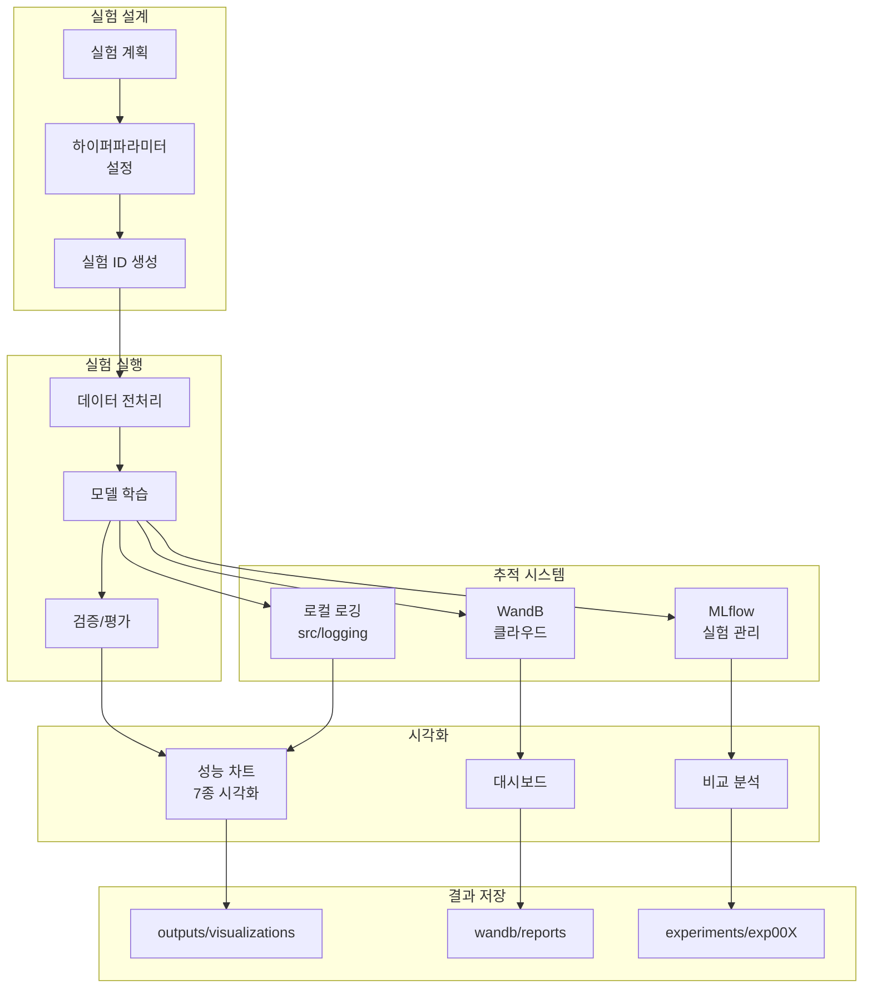

# 📊 실험 추적 및 관리

## 🏗️ 실험 관리 시스템 아키텍처



## 🔬 실험 명명 규칙
```
exp{번호}_{모델}_{전처리}_{특징}
예: exp001_bart_baseline
    exp002_t5_augmented
    exp003_bart_ensemble
```

## 📋 실험 템플릿

### 실험 정보
```yaml
experiment_id: exp001
model: KoBART
dataset: baseline
preprocessing:
  - noise_removal
  - special_token
augmentation:
  - none
hyperparameters:
  learning_rate: 1e-5
  batch_size: 32
  epochs: 20
  max_length: 512
```

### 실험 결과
```yaml
metrics:
  rouge_1_f1: 0.00
  rouge_2_f1: 0.00
  rouge_l_f1: 0.00
  average: 0.00
training_time: 00:00
inference_time: 00:00
best_checkpoint: checkpoint-000
notes: ""
```

## 📊 실험 추적 테이블

| ID | 모델 | 전처리 | 증강 | LR | BS | ROUGE-1 | ROUGE-2 | ROUGE-L | AVG | 비고 |
|----|------|--------|------|----|----|---------|---------|---------|-----|------|
| exp001 | KoBART | baseline | X | 1e-5 | 50 | 47.12 | - | - | 47.12 | 베이스라인 |
| exp002 | Solar API | baseline | X | - | - | ~10 | - | - | ~10 | 초기 테스트 |
| exp003 | | | | | | | | | | |
| exp004 | | | | | | | | | | |
| exp005 | | | | | | | | | | |

## 🛠️ 실험 관리 도구

### WandB 설정
```python
wandb_config = {
    'entity': 'team_name',
    'project': 'dialogue-summarization',
    'name': 'exp001_bart_baseline',
    'config': {
        'model': 'KoBART',
        'learning_rate': 1e-5,
        'batch_size': 32,
        'epochs': 20
    }
}
```

### MLflow 설정
```python
mlflow.set_experiment('dialogue_summarization')
mlflow.start_run(run_name='exp001_bart_baseline')
mlflow.log_params({
    'model': 'KoBART',
    'learning_rate': 1e-5,
    'batch_size': 32
})
mlflow.log_metrics({
    'rouge_1_f1': 0.4712,
    'rouge_2_f1': 0.0,
    'rouge_l_f1': 0.0
})
```

## 📈 성능 비교 차트

### 모델별 성능
```
KoBART    : ████████████████████ 47.12
T5        : ███████████████      35.00 (예상)
GPT       : ████████████         30.00 (예상)
Solar API : ████                 10.00
```

### 전처리별 성능
```
Baseline     : ████████████████████ 47.12
Noise Remove : █████████████████████ 50.00 (예상)
Augmented    : ██████████████████████ 52.00 (예상)
```

## 🔍 실험 체크리스트

### 데이터 실험
- [ ] 원본 데이터
- [ ] 노이즈 제거
- [ ] 특수 토큰 정규화
- [ ] 패러프레이징
- [ ] 백트랜슬레이션
- [ ] 문장 순서 변경

### 모델 실험
- [x] KoBART (베이스라인)
- [ ] KoT5
- [ ] mT5
- [ ] KoGPT
- [ ] Polyglot-Ko
- [x] Solar API

### 하이퍼파라미터 실험
- [ ] Learning Rate: [1e-5, 3e-5, 5e-5]
- [ ] Batch Size: [16, 32, 64]
- [ ] Max Length: [512, 768, 1024]
- [ ] Warmup Ratio: [0.0, 0.1, 0.2]
- [ ] Weight Decay: [0.0, 0.01, 0.1]

### 앙상블 실험
- [ ] 단일 모델 최고 성능
- [ ] 2개 모델 앙상블
- [ ] 3개 모델 앙상블
- [ ] 5-fold 앙상블

## 📝 실험 노트

### 성공 사례
1. **exp001**: 베이스라인 구축 성공 (47.12)
2.

### 실패 사례
1.

### 인사이트
1. **데이터 노이즈**: \\n, <br> 태그 등이 성능에 영향
2. **대화 길이**: 긴 대화일수록 요약 품질 저하
3. **참여자 수**: 참여자가 많을수록 요약 난이도 증가

## 🎯 다음 실험 우선순위

### 높음
1. 노이즈 제거 전처리
2. KoT5 모델 실험
3. 하이퍼파라미터 튜닝

### 중간
1. 데이터 증강
2. mT5 모델 실험
3. 앙상블 초기 실험

### 낮음
1. 후처리 최적화
2. API 파라미터 세부 튜닝
3. 추가 모델 실험