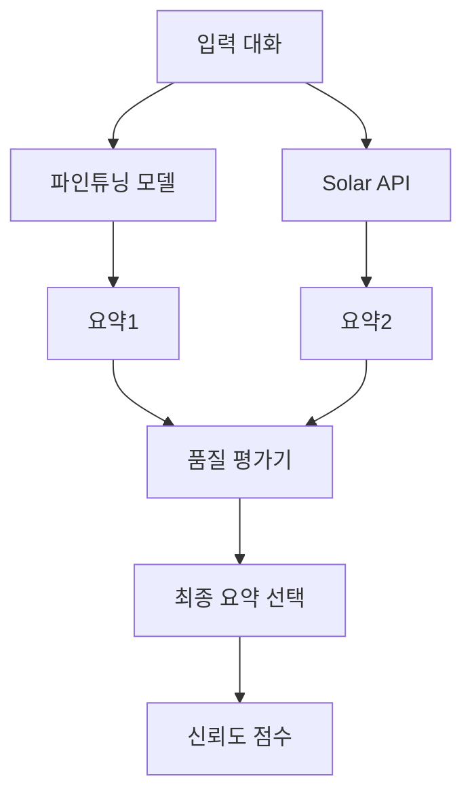

# 🔄 교차 검증 시스템 설계

## 🎯 핵심 개념
**모델 학습 결과 + Solar API 결과를 비교하여 최적의 요약 선택**

팀원의 아이디어: 두 가지 접근 방식의 결과를 비교 분석하여 더 나은 요약을 선택하고, 이를 통해 정답률 향상

## 🏗️ 시스템 아키텍처



## 💡 구현 전략

### 1. 듀얼 생성 시스템
```python
class DualSummarizationSystem:
    def __init__(self, finetuned_model, solar_api):
        self.model = finetuned_model
        self.api = solar_api
        self.evaluator = QualityEvaluator()

    def generate_summaries(self, dialogue):
        """
        두 가지 방법으로 요약 생성
        """
        # 1. 파인튜닝 모델로 생성
        model_summary = self.model.generate_summary(dialogue)
        model_confidence = self.model.get_confidence_score()

        # 2. Solar API로 생성
        api_summary = self.api.generate_summary(dialogue)
        api_confidence = 0.85  # API는 일반적으로 안정적

        return {
            'model': {
                'summary': model_summary,
                'confidence': model_confidence
            },
            'api': {
                'summary': api_summary,
                'confidence': api_confidence
            }
        }

    def select_best_summary(self, summaries, dialogue):
        """
        최적의 요약 선택
        """
        model_score = self.evaluator.evaluate(
            summaries['model']['summary'],
            dialogue
        )
        api_score = self.evaluator.evaluate(
            summaries['api']['summary'],
            dialogue
        )

        # 가중치 적용
        model_final = model_score * summaries['model']['confidence']
        api_final = api_score * summaries['api']['confidence']

        if model_final > api_final:
            return summaries['model']['summary']
        else:
            return summaries['api']['summary']
```

### 2. 품질 평가기 (Quality Evaluator)
```python
class QualityEvaluator:
    def __init__(self):
        self.criteria = {
            'length_ratio': 0.2,      # 요약 길이 적절성
            'keyword_coverage': 0.3,   # 핵심 키워드 포함
            'coherence': 0.25,         # 문장 일관성
            'information_density': 0.25 # 정보 밀도
        }

    def evaluate(self, summary, dialogue):
        """
        요약 품질 종합 평가
        """
        scores = {
            'length_ratio': self.check_length_ratio(summary, dialogue),
            'keyword_coverage': self.check_keyword_coverage(summary, dialogue),
            'coherence': self.check_coherence(summary),
            'information_density': self.check_information_density(summary)
        }

        # 가중 평균
        total_score = sum(
            score * self.criteria[metric]
            for metric, score in scores.items()
        )
        return total_score

    def check_length_ratio(self, summary, dialogue):
        """
        요약 길이 적절성 (이상적: 원본의 20-30%)
        """
        ratio = len(summary) / len(dialogue)
        if 0.2 <= ratio <= 0.3:
            return 1.0
        elif 0.15 <= ratio <= 0.35:
            return 0.8
        else:
            return 0.5

    def check_keyword_coverage(self, summary, dialogue):
        """
        핵심 키워드 포함도
        """
        from konlpy.tag import Okt
        okt = Okt()

        # 명사 추출
        dialogue_nouns = set(okt.nouns(dialogue))
        summary_nouns = set(okt.nouns(summary))

        # 중요 명사 (빈도 기반)
        important_nouns = self.get_important_words(dialogue_nouns)

        # Coverage 계산
        coverage = len(summary_nouns & important_nouns) / len(important_nouns)
        return min(coverage * 1.2, 1.0)  # 최대 1.0

    def check_coherence(self, summary):
        """
        문장 일관성 체크
        """
        sentences = summary.split('.')
        if len(sentences) < 2:
            return 0.8

        # 문장 간 연결성 체크
        coherence_score = 0
        for i in range(len(sentences) - 1):
            if self.has_connection(sentences[i], sentences[i+1]):
                coherence_score += 1

        return coherence_score / (len(sentences) - 1)

    def check_information_density(self, summary):
        """
        정보 밀도 측정
        """
        # 단어 수 대비 고유 단어 비율
        words = summary.split()
        unique_words = set(words)

        density = len(unique_words) / len(words)
        return min(density * 1.5, 1.0)
```

### 3. 앙상블 전략
```python
class EnsembleSummarizer:
    def __init__(self, models_list, solar_api):
        self.models = models_list  # 여러 파인튜닝 모델
        self.api = solar_api
        self.combiner = SummaryCombiner()

    def generate_ensemble_summary(self, dialogue):
        """
        앙상블 요약 생성
        """
        all_summaries = []

        # 1. 모든 모델에서 요약 생성
        for model in self.models:
            summary = model.generate_summary(dialogue)
            all_summaries.append({
                'text': summary,
                'source': f'model_{model.name}',
                'confidence': model.confidence
            })

        # 2. Solar API 요약 추가
        api_summary = self.api.generate_summary(dialogue)
        all_summaries.append({
            'text': api_summary,
            'source': 'solar_api',
            'confidence': 0.9
        })

        # 3. 최적 조합 선택
        best_combination = self.combiner.find_best_combination(
            all_summaries,
            dialogue
        )

        return best_combination

class SummaryCombiner:
    def find_best_combination(self, summaries, dialogue):
        """
        여러 요약 중 최적 조합 찾기
        """
        # 전략 1: Voting (가장 많이 나온 내용)
        common_sentences = self.extract_common_sentences(summaries)

        # 전략 2: 신뢰도 가중 평균
        weighted_summary = self.weighted_combination(summaries)

        # 전략 3: 최고 품질 선택
        best_single = self.select_best_single(summaries, dialogue)

        # 최종 선택
        candidates = [common_sentences, weighted_summary, best_single]
        return self.select_final(candidates, dialogue)

    def extract_common_sentences(self, summaries):
        """
        공통 문장 추출 (Voting)
        """
        from collections import Counter

        all_sentences = []
        for s in summaries:
            sentences = s['text'].split('.')
            all_sentences.extend(sentences)

        # 가장 자주 나온 문장들
        counter = Counter(all_sentences)
        common = counter.most_common(3)

        return '. '.join([sent for sent, _ in common]) + '.'

    def weighted_combination(self, summaries):
        """
        신뢰도 기반 가중 조합
        """
        # 각 요약을 문장 단위로 분리
        sentence_pool = []
        for s in summaries:
            sentences = s['text'].split('.')
            for sent in sentences:
                sentence_pool.append({
                    'text': sent,
                    'confidence': s['confidence']
                })

        # 신뢰도 높은 순으로 정렬
        sorted_pool = sorted(
            sentence_pool,
            key=lambda x: x['confidence'],
            reverse=True
        )

        # 상위 문장 선택 (중복 제거)
        selected = []
        seen = set()
        for item in sorted_pool:
            if item['text'] not in seen:
                selected.append(item['text'])
                seen.add(item['text'])
                if len(selected) >= 3:
                    break

        return '. '.join(selected) + '.'
```

### 4. 신뢰도 점수 시스템
```python
class ConfidenceScoring:
    def __init__(self):
        self.history = []  # 과거 성능 기록

    def calculate_model_confidence(self, model, dialogue):
        """
        모델 신뢰도 계산
        """
        factors = {
            'dialogue_length': self.length_factor(dialogue),
            'speaker_count': self.speaker_factor(dialogue),
            'model_perplexity': self.perplexity_factor(model),
            'historical_performance': self.history_factor(model)
        }

        # 가중 평균
        weights = {
            'dialogue_length': 0.2,
            'speaker_count': 0.2,
            'model_perplexity': 0.3,
            'historical_performance': 0.3
        }

        confidence = sum(
            factors[k] * weights[k]
            for k in factors
        )
        return confidence

    def length_factor(self, dialogue):
        """
        대화 길이에 따른 신뢰도
        """
        length = len(dialogue)
        if 300 <= length <= 800:  # 이상적인 길이
            return 1.0
        elif length < 300:  # 너무 짧음
            return 0.8
        else:  # 너무 긺
            return 0.6

    def speaker_factor(self, dialogue):
        """
        화자 수에 따른 신뢰도
        """
        speakers = len(set(re.findall(r'#Person\d+#', dialogue)))
        if speakers == 2:  # 이상적
            return 1.0
        elif speakers == 3:
            return 0.9
        else:  # 4명 이상
            return 0.7

    def update_history(self, model_name, score):
        """
        성능 이력 업데이트
        """
        self.history.append({
            'model': model_name,
            'score': score,
            'timestamp': time.time()
        })
```

### 5. A/B 테스팅 프레임워크
```python
class ABTestingFramework:
    def __init__(self):
        self.results = {
            'model_only': [],
            'api_only': [],
            'hybrid': []
        }

    def run_test(self, test_data, model, api):
        """
        A/B 테스트 실행
        """
        dual_system = DualSummarizationSystem(model, api)

        for dialogue, gold_summary in test_data:
            # 세 가지 방법으로 생성
            model_summary = model.generate_summary(dialogue)
            api_summary = api.generate_summary(dialogue)
            hybrid_summary = dual_system.select_best_summary(
                dialogue
            )

            # 성능 평가
            model_score = self.evaluate_rouge(model_summary, gold_summary)
            api_score = self.evaluate_rouge(api_summary, gold_summary)
            hybrid_score = self.evaluate_rouge(hybrid_summary, gold_summary)

            # 결과 저장
            self.results['model_only'].append(model_score)
            self.results['api_only'].append(api_score)
            self.results['hybrid'].append(hybrid_score)

        # 통계 분석
        return self.analyze_results()

    def analyze_results(self):
        """
        통계적 분석
        """
        import numpy as np
        from scipy import stats

        analysis = {}
        for method in self.results:
            scores = self.results[method]
            analysis[method] = {
                'mean': np.mean(scores),
                'std': np.std(scores),
                'median': np.median(scores),
                'confidence_interval': stats.t.interval(
                    0.95,
                    len(scores)-1,
                    loc=np.mean(scores),
                    scale=stats.sem(scores)
                )
            }

        # 방법 간 비교
        analysis['comparison'] = {
            'model_vs_api': stats.ttest_ind(
                self.results['model_only'],
                self.results['api_only']
            ),
            'hybrid_vs_best': self.compare_hybrid()
        }

        return analysis
```

## 📊 성능 비교 예상

| 방법 | ROUGE-F1 | 안정성 | 비용 |
|------|----------|--------|------|
| Model Only | 55-60 | 중간 | 낮음 |
| API Only | 50-55 | 높음 | 높음 |
| Hybrid (교차검증) | 60-65 | 높음 | 중간 |
| Ensemble | 63-68 | 매우 높음 | 높음 |

## 🚀 구현 로드맵

### Phase 1: 기본 시스템 구축
1. 듀얼 생성 시스템 구현
2. 품질 평가기 개발
3. 기본 선택 알고리즘

### Phase 2: 고도화
1. 신뢰도 점수 시스템
2. 앙상블 전략 구현
3. A/B 테스팅 프레임워크

### Phase 3: 최적화
1. 하이퍼파라미터 튜닝
2. 가중치 최적화
3. 실시간 학습 메커니즘

## 💡 핵심 인사이트

### 언제 모델을 신뢰할까?
- 짧고 명확한 대화
- 2인 대화
- 학습 데이터와 유사한 패턴

### 언제 API를 신뢰할까?
- 복잡한 다자 대화
- 긴 대화
- 특수한 도메인

### 하이브리드의 강점
- 두 방법의 장점 결합
- 안정적인 성능
- 비용 효율적