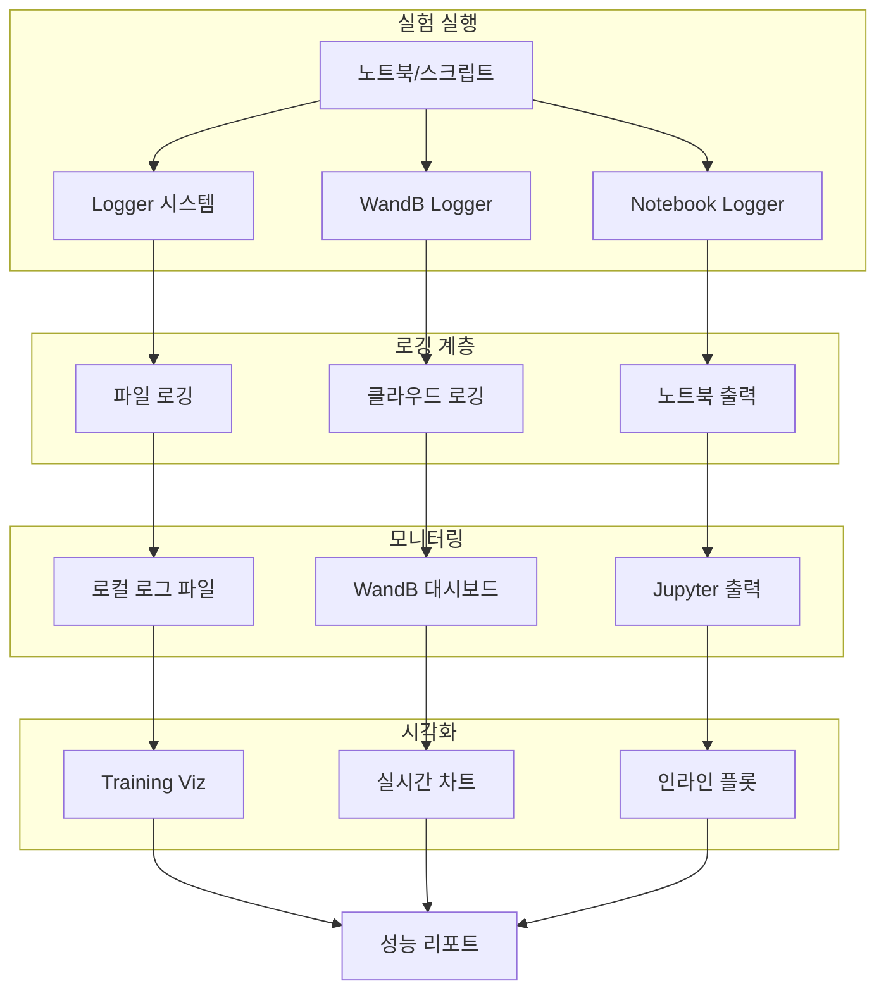
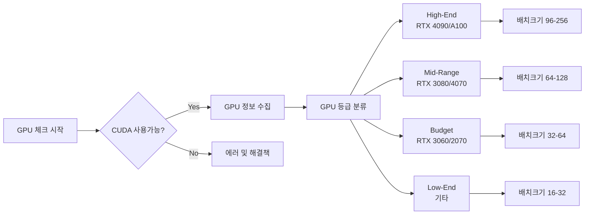
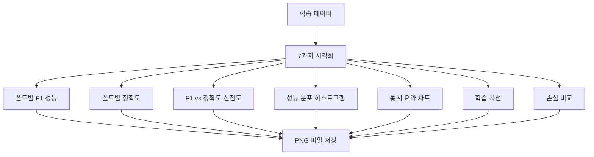

# 📊 로깅 및 모니터링 시스템

## 🎯 개요
프로젝트 전반의 실험 과정, 성능 지표, GPU 사용량 등을 체계적으로 추적하고 시각화하는 통합 시스템

## 🏗️ 시스템 아키텍처



## 💡 핵심 기능

### 1. 통합 로거 시스템 (src/logging/logger.py)
```python
class Logger:
    """
    모든 출력을 파일과 콘솔에 동시 기록
    타임스탬프 자동 추가
    """
    def __init__(self, log_path: str, print_also: bool = True):
        # 로그 파일 생성
        # stdout/stderr 리디렉션
        # tqdm 호환성 지원
```

#### 주요 기능
- ✅ **자동 타임스탬프**: 모든 로그에 시간 정보 추가
- ✅ **이중 출력**: 파일과 콘솔 동시 출력
- ✅ **에러 하이라이팅**: 에러 메시지 빨간색 표시
- ✅ **tqdm 호환**: 프로그레스 바와 로깅 충돌 방지
- ✅ **자동 플러시**: 실시간 로그 확인 가능

### 2. WandB 통합 (src/logging/wandb_logger.py)
```python
class WandBLogger:
    """
    Weights & Biases 플랫폼 통합
    실시간 실험 추적 및 비교
    """
    def __init__(self, project_name: str, config: dict):
        # WandB 초기화
        # 하이퍼파라미터 로깅
        # 메트릭 추적
```

#### 추적 항목
- 📈 학습 손실 (train/val loss)
- 📊 성능 메트릭 (ROUGE, BLEU)
- 🎯 하이퍼파라미터
- 🖼️ 시각화 이미지
- 📝 모델 체크포인트

### 3. 노트북 로거 (src/logging/notebook_logger.py)
```python
class NotebookLogger:
    """
    Jupyter 노트북 전용 로거
    인라인 시각화 지원
    """
    def log_with_plot(self, message: str, data: dict):
        # 메시지 출력
        # 인라인 차트 생성
        # 진행률 표시
```

## 🖥️ GPU 최적화 및 모니터링

### 1. GPU 호환성 체크 (team_gpu_check.py)



### 2. 자동 배치 크기 최적화 (auto_batch_size.py)
```python
def find_optimal_batch_size(model, device):
    """
    OOM 없이 최대 배치 크기 자동 탐색
    """
    # Binary search로 최적값 탐색
    # 95% 안전 계수 적용
    # GPU 메모리 모니터링
```

#### 최적화 전략
| GPU 등급 | 메모리 | 권장 배치 | Gradient Acc. |
|---------|--------|----------|---------------|
| High-End | 24GB+ | 96-256 | 1 |
| Mid-Range | 12-16GB | 64-128 | 2 |
| Budget | 8-12GB | 32-64 | 3-4 |
| Low-End | 6-8GB | 16-32 | 6-8 |

## 📊 시각화 시스템

### 1. 학습 시각화 (training_viz.py)



생성되는 차트:
1. `01_fold_f1_performance.png` - 폴드별 F1 점수
2. `02_fold_accuracy_comparison.png` - 폴드별 정확도
3. `03_f1_vs_accuracy_scatter.png` - 상관관계 분석
4. `04_performance_distribution.png` - 분포 히스토그램
5. `05_performance_statistics.png` - 통계 요약
6. `06_training_history.png` - 학습 곡선
7. `07_loss_comparison.png` - 과적합 탐지

### 2. 추론 시각화 (inference_viz.py)
- 예측 결과 분포
- 신뢰도 점수 분석
- 샘플별 성능 비교
- 에러 케이스 분석

### 3. 최적화 시각화 (optimization_viz.py)
- 하이퍼파라미터 영향도
- 학습률 스케줄링
- 배치 크기 vs 성능
- GPU 메모리 사용량

## 🔧 통합 방법

### 1. 프로젝트 초기화
```python
from src.logging import Logger, WandBLogger
from src.utils.gpu_optimization import team_gpu_check

# 1. GPU 환경 체크
team_gpu_check.check_gpu_compatibility()

# 2. 로거 초기화
logger = Logger('logs/train.log')
logger.start_redirect()  # stdout/stderr 리디렉션

# 3. WandB 초기화
wandb_logger = WandBLogger(
    project_name='dialogue-summarization',
    config=config
)
```

### 2. 학습 중 로깅
```python
# 에폭별 로깅
for epoch in range(num_epochs):
    # 학습
    train_loss = train_one_epoch()
    val_loss, val_rouge = validate()

    # 로깅
    logger.write(f"Epoch {epoch}: train_loss={train_loss:.4f}")
    wandb_logger.log({
        'train_loss': train_loss,
        'val_loss': val_loss,
        'val_rouge': val_rouge
    })
```

### 3. 시각화 생성
```python
from src.utils.visualizations import create_training_visualizations

# 학습 완료 후
create_training_visualizations(
    fold_results=results,
    model_name='LLM-FineTuned',
    output_dir='outputs/visualizations',
    history_data=training_history
)
```

## 📋 사용 시나리오

### 시나리오 1: 노트북 실험
```python
# notebooks/experiments/llm_finetuning.ipynb
from src.logging import NotebookLogger

nb_logger = NotebookLogger()
nb_logger.start_experiment('LLM 파인튜닝 실험')

# 실험 진행...
nb_logger.log_metric('rouge_f1', 0.65)
nb_logger.create_inline_plot(losses, 'Training Loss')
```

### 시나리오 2: 분산 학습
```python
# 여러 GPU에서 학습
from src.utils.gpu_optimization import auto_batch_size

optimal_batch = auto_batch_size.find_optimal_batch_size(
    model, device, safe_factor=0.95
)
print(f"최적 배치 크기: {optimal_batch}")
```

### 시나리오 3: 실험 비교
```python
# WandB 대시보드에서 실험 비교
wandb_logger.log_summary({
    'best_rouge': best_score,
    'best_epoch': best_epoch,
    'total_time': total_time
})
```

## 🚀 예상 효과

### 실험 관리 개선
- ✅ 모든 실험 자동 기록
- ✅ 재현 가능한 결과
- ✅ 실시간 모니터링
- ✅ 체계적인 비교 분석

### GPU 활용도 향상
- ✅ 자동 최적 배치 크기
- ✅ OOM 에러 방지
- ✅ GPU별 맞춤 설정
- ✅ 95% 메모리 활용

### 디버깅 효율화
- ✅ 상세한 로그 기록
- ✅ 에러 추적 용이
- ✅ 성능 병목 발견
- ✅ 과적합 조기 탐지

## 📝 체크리스트

### 실험 시작 전
- [ ] GPU 호환성 체크 실행
- [ ] 로그 디렉토리 생성
- [ ] WandB 프로젝트 설정
- [ ] 배치 크기 최적화

### 실험 중
- [ ] 에폭별 메트릭 로깅
- [ ] 체크포인트 저장
- [ ] 메모리 사용량 모니터링
- [ ] 중간 시각화 확인

### 실험 후
- [ ] 최종 시각화 생성
- [ ] 로그 파일 백업
- [ ] WandB 리포트 작성
- [ ] 결과 문서화

## 💡 팁

### 로깅 베스트 프랙티스
1. **구조화된 로그**: JSON 형식으로 저장
2. **적절한 로그 레벨**: DEBUG, INFO, WARNING, ERROR
3. **의미있는 메시지**: 컨텍스트 포함
4. **주기적 플러시**: 실시간 확인

### GPU 최적화 팁
1. **Mixed Precision**: fp16 사용으로 메모리 50% 절약
2. **Gradient Checkpointing**: 메모리 vs 속도 트레이드오프
3. **데이터 로더 최적화**: num_workers, pin_memory
4. **캐싱 활용**: 자주 사용하는 데이터 메모리에 유지