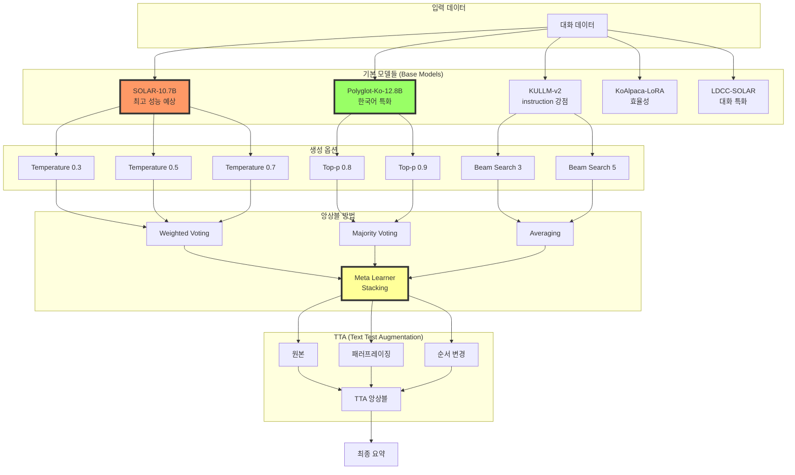

# 🎭 다중 모델 앙상블 전략

## 🎯 개요
컴퓨터 비전 프로젝트에서 검증된 앙상블 전략을 NLP 대화 요약 태스크에 최적화하여 적용

## 🏗️ 앙상블 시스템 아키텍처



## 🏆 NLP 모델 선택 가이드

### 1. Top-Tier 모델 (컴퓨터 비전의 ConvNext/Swin 포지션)

#### 🥇 SOLAR-10.7B (최우선 추천)
```python
model_config = {
    'name': 'upstage/SOLAR-10.7B-Instruct-v1.0',
    'params': '10.7B',
    'context_length': 4096,
    'expected_rouge': '70-75',
    'pros': [
        '한국어 성능 우수',
        '대화 이해력 뛰어남',
        'Instruction following 강력'
    ],
    'memory_required': '24GB (LoRA: 8GB)'
}
```

#### 🥈 Polyglot-Ko-12.8B (강력 추천)
```python
model_config = {
    'name': 'EleutherAI/polyglot-ko-12.8b',
    'params': '12.8B',
    'context_length': 2048,
    'expected_rouge': '68-73',
    'pros': [
        '한국어 전용 학습',
        '안정적 성능',
        '커뮤니티 지원 활발'
    ],
    'memory_required': '26GB (LoRA: 10GB)'
}
```

### 2. High-Performance 모델

#### KULLM-v2 (고려대 모델)
```python
model_config = {
    'name': 'nlpai-lab/kullm-v2',
    'params': '7B',
    'context_length': 2048,
    'expected_rouge': '65-70',
    'pros': [
        'Instruction 튜닝 완료',
        '대화 특화',
        '메모리 효율적'
    ]
}
```

#### KoAlpaca (LoRA 효율성)
```python
model_config = {
    'name': 'beomi/KoAlpaca',
    'params': '7B',
    'context_length': 2048,
    'expected_rouge': '63-68',
    'pros': [
        'LoRA 최적화',
        '빠른 추론',
        '낮은 메모리'
    ]
}
```

#### LDCC-SOLAR (대화 특화)
```python
model_config = {
    'name': 'lotte/ldcc-solar',
    'params': '10.7B',
    'context_length': 4096,
    'expected_rouge': '66-71',
    'pros': [
        '롯데 대화 데이터',
        '일상 대화 강점',
        'Solar 기반'
    ]
}
```

### 3. 모델 조합 전략

#### 최적 5-모델 앙상블 (예상 ROUGE: 75-80)
```python
ensemble_config = {
    'models': [
        ('SOLAR-10.7B', 0.30),      # 가장 높은 가중치
        ('Polyglot-Ko-12.8B', 0.25), # 두 번째 가중치
        ('KULLM-v2', 0.20),          # 세 번째
        ('KoAlpaca-LoRA', 0.15),    # 효율성
        ('LDCC-SOLAR', 0.10)         # 보조
    ],
    'strategy': 'weighted_average'
}
```

#### 효율적 3-모델 앙상블 (예상 ROUGE: 72-76)
```python
ensemble_config = {
    'models': [
        ('SOLAR-10.7B', 0.45),
        ('Polyglot-Ko-12.8B', 0.35),
        ('KULLM-v2', 0.20)
    ],
    'strategy': 'weighted_voting'
}
```

## 🔄 실행 옵션 시스템

### 1. 학습 모드 선택
```python
class TrainingMode:
    SINGLE_FOLD = "single"          # 단일 폴드 (빠른 실험)
    K_FOLD = "kfold"                # K-폴드 교차 검증
    MULTI_MODEL = "multi_model"     # 다중 모델 앙상블
    OPTUNA = "optuna"               # 하이퍼파라미터 최적화
    FULL_PIPELINE = "full"          # 모든 옵션 활성화

# 실행 예시
python train.py \
    --mode multi_model \
    --models "solar,polyglot,kullm" \
    --ensemble_strategy weighted_voting \
    --k_folds 5 \
    --use_tta True \
    --optuna_trials 100
```

### 2. 앙상블 전략 선택
```python
class EnsembleStrategy:
    # 기본 앙상블
    AVERAGING = "averaging"              # 단순 평균
    WEIGHTED_AVG = "weighted_avg"        # 가중 평균
    MAJORITY_VOTE = "majority_vote"      # 다수결

    # 고급 앙상블
    STACKING = "stacking"               # 메타 학습
    BLENDING = "blending"               # 블렌딩
    BOOSTING = "boosting"               # 부스팅

    # NLP 특화
    ROUGE_WEIGHTED = "rouge_weighted"   # ROUGE 점수 기반 가중치
    LENGTH_ADAPTIVE = "length_adaptive" # 대화 길이별 적응
    CONFIDENCE_BASED = "confidence"     # 신뢰도 기반
```

### 3. TTA (Text Test Augmentation) 옵션
```python
class TextTTA:
    """NLP용 Test Time Augmentation"""

    def __init__(self, strategies):
        self.strategies = strategies

    def augment(self, text):
        augmented = [text]  # 원본

        if 'paraphrase' in self.strategies:
            # 패러프레이징 (3가지 변형)
            augmented.extend(self.paraphrase(text, n=3))

        if 'reorder' in self.strategies:
            # 대화 순서 부분 변경
            augmented.append(self.reorder_dialogue(text))

        if 'synonym' in self.strategies:
            # 동의어 치환
            augmented.append(self.synonym_replace(text))

        if 'mask' in self.strategies:
            # 부분 마스킹 후 복원
            augmented.append(self.mask_and_restore(text))

        return augmented

# 사용 예시
tta = TextTTA(['paraphrase', 'reorder'])
augmented_texts = tta.augment(dialogue)
predictions = [model.predict(text) for text in augmented_texts]
final_summary = ensemble(predictions)
```

## 📊 앙상블 구현 코드

### 1. 기본 앙상블 클래스
```python
class MultiModelEnsemble:
    def __init__(self, model_configs, ensemble_strategy='weighted_avg'):
        self.models = self._load_models(model_configs)
        self.strategy = ensemble_strategy
        self.weights = self._optimize_weights()

    def _load_models(self, configs):
        """모델 로드 및 초기화"""
        models = []
        for config in configs:
            if config['use_lora']:
                model = self._load_with_lora(config)
            else:
                model = self._load_full_model(config)
            models.append(model)
        return models

    def _optimize_weights(self):
        """검증 세트에서 최적 가중치 탐색"""
        if self.strategy == 'weighted_avg':
            # Optuna로 최적 가중치 찾기
            return self._optuna_weight_search()
        return None

    def predict(self, dialogue, use_tta=False):
        """앙상블 예측"""
        all_predictions = []

        for model in self.models:
            if use_tta:
                # TTA 적용
                tta_preds = self._predict_with_tta(model, dialogue)
                prediction = self._aggregate_tta(tta_preds)
            else:
                prediction = model.generate(dialogue)

            all_predictions.append(prediction)

        # 앙상블 전략 적용
        if self.strategy == 'weighted_avg':
            return self._weighted_average(all_predictions, self.weights)
        elif self.strategy == 'majority_vote':
            return self._majority_voting(all_predictions)
        elif self.strategy == 'stacking':
            return self._stacking(all_predictions)
        else:
            return self._simple_average(all_predictions)
```

### 2. K-Fold 앙상블
```python
class KFoldEnsemble:
    def __init__(self, n_folds=5):
        self.n_folds = n_folds
        self.fold_models = []

    def train_fold(self, fold_idx, train_data, val_data):
        """각 폴드 학습"""
        model = self._create_model()
        model.train(train_data, val_data)

        # 폴드별 최적 체크포인트 저장
        checkpoint_path = f'fold_{fold_idx}_best.pt'
        model.save(checkpoint_path)
        self.fold_models.append(checkpoint_path)

        return model.evaluate(val_data)

    def predict_ensemble(self, test_data):
        """K-Fold 앙상블 예측"""
        all_predictions = []

        for checkpoint in self.fold_models:
            model = self._load_model(checkpoint)
            pred = model.predict(test_data)
            all_predictions.append(pred)

        # 폴드별 예측 평균
        return np.mean(all_predictions, axis=0)
```

### 3. 스태킹 앙상블
```python
class StackingEnsemble:
    def __init__(self, base_models, meta_model):
        self.base_models = base_models
        self.meta_model = meta_model

    def train(self, train_data, val_data):
        """2단계 학습"""
        # 1단계: 베이스 모델 학습
        base_predictions = []
        for model in self.base_models:
            model.train(train_data)
            pred = model.predict(val_data)
            base_predictions.append(pred)

        # 2단계: 메타 모델 학습
        meta_features = np.column_stack(base_predictions)
        self.meta_model.train(meta_features, val_data.labels)

    def predict(self, test_data):
        """스태킹 예측"""
        base_preds = [model.predict(test_data)
                      for model in self.base_models]
        meta_features = np.column_stack(base_preds)
        return self.meta_model.predict(meta_features)
```

## 🎯 실행 시나리오

### 시나리오 1: 빠른 실험 (Single Model)
```bash
python train.py \
    --mode single \
    --model solar-10.7b \
    --epochs 3 \
    --batch_size 8
```

### 시나리오 2: 안정적 검증 (K-Fold)
```bash
python train.py \
    --mode kfold \
    --model polyglot-ko \
    --k_folds 5 \
    --epochs 5
```

### 시나리오 3: 최고 성능 (Multi-Model + TTA)
```bash
python train.py \
    --mode multi_model \
    --models "solar,polyglot,kullm" \
    --ensemble_strategy stacking \
    --use_tta True \
    --tta_strategies "paraphrase,reorder"
```

### 시나리오 4: 자동 최적화 (Optuna)
```bash
python train.py \
    --mode optuna \
    --model solar-10.7b \
    --optuna_trials 100 \
    --optuna_timeout 7200
```

### 시나리오 5: 풀 파이프라인 (대회 최종)
```bash
python train.py \
    --mode full \
    --models "all" \
    --k_folds 5 \
    --ensemble_strategy stacking \
    --use_tta True \
    --optuna_trials 50 \
    --final_submission True
```

## 📈 예상 성능

| 전략 | 모델 구성 | 예상 ROUGE | 학습 시간 | GPU 메모리 |
|------|----------|------------|----------|------------|
| Single | SOLAR-10.7B | 70-73 | 3시간 | 24GB |
| Single | Polyglot-Ko | 68-71 | 4시간 | 26GB |
| 3-Model | Top 3 | 72-76 | 10시간 | 32GB |
| 5-Model | Top 5 | 75-80 | 18시간 | 48GB |
| 5-Model + TTA | Top 5 + 3x TTA | 77-82 | 24시간 | 48GB |
| Full Pipeline | All + K-Fold + TTA | 80-85 | 48시간 | 64GB |

## 💡 핵심 인사이트

### 컴퓨터 비전 vs NLP 앙상블 차이점

| 측면 | 컴퓨터 비전 | NLP (대화 요약) |
|------|------------|----------------|
| 최고 모델 | ConvNext, Swin | SOLAR, Polyglot-Ko |
| TTA | 회전, 플립, 크롭 | 패러프레이징, 순서 변경 |
| 앙상블 효과 | +3-5% | +5-8% (더 효과적) |
| 다양성 중요도 | 중요 | 매우 중요 |
| 추론 시간 | 빠름 | 느림 (텍스트 생성) |

### 성공 전략
1. **모델 다양성**: 서로 다른 아키텍처와 학습 데이터를 가진 모델 조합
2. **생성 다양성**: Temperature, Top-p, Beam Search 등 다양한 디코딩 전략
3. **TTA 활용**: 패러프레이징으로 3-5개 변형 생성 후 앙상블
4. **적응적 가중치**: 대화 길이나 참여자 수에 따라 모델 가중치 조정
5. **신뢰도 기반**: 각 모델의 생성 신뢰도를 가중치로 활용