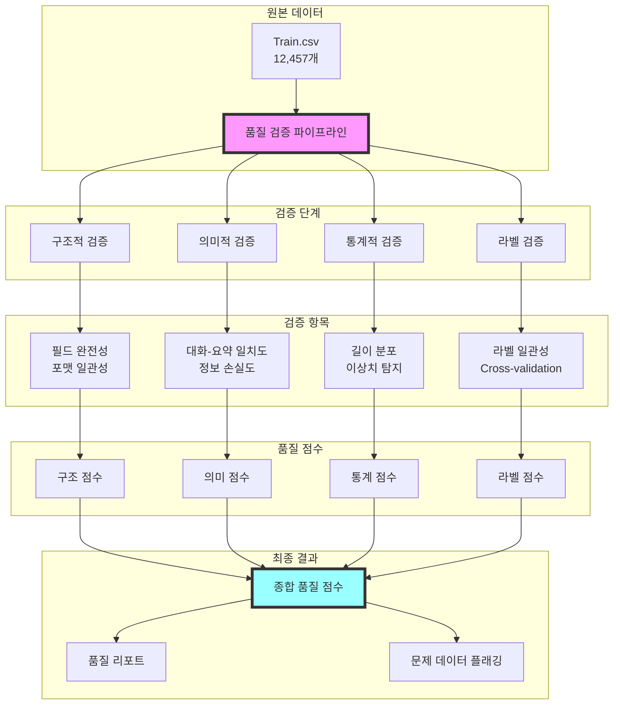

# 🔍 데이터 품질 검증 시스템

## 📊 시스템 개요

### 목적
- 학습 데이터의 품질 보장
- 라벨링 일관성 검증
- 이상치 및 노이즈 탐지
- 데이터 증강 품질 관리
- 실험 재현성 확보

## 🏗️ 품질 검증 아키텍처



## 📋 검증 체크리스트

### 1. 구조적 검증
```python
class StructuralValidator:
    def __init__(self):
        self.required_fields = ['fname', 'dialogue', 'summary', 'topic']
        self.errors = []

    def validate_structure(self, df):
        """데이터 구조 검증"""
        checks = {
            'missing_fields': self.check_fields(df),
            'null_values': self.check_nulls(df),
            'data_types': self.check_types(df),
            'id_uniqueness': self.check_unique_ids(df),
            'encoding_issues': self.check_encoding(df)
        }
        return checks

    def check_fields(self, df):
        """필수 필드 확인"""
        missing = set(self.required_fields) - set(df.columns)
        if missing:
            self.errors.append(f"Missing fields: {missing}")
        return len(missing) == 0

    def check_nulls(self, df):
        """널 값 체크"""
        null_counts = df[self.required_fields].isnull().sum()
        problematic = null_counts[null_counts > 0]

        if not problematic.empty:
            self.errors.append(f"Null values found: {problematic.to_dict()}")
        return problematic.empty

    def check_encoding(self, df):
        """인코딩 문제 체크"""
        encoding_errors = []

        for col in ['dialogue', 'summary']:
            for idx, text in df[col].items():
                if self.has_encoding_issue(text):
                    encoding_errors.append({
                        'index': idx,
                        'column': col,
                        'sample': text[:50]
                    })

        return encoding_errors
```

### 2. 의미적 검증
```python
class SemanticValidator:
    def __init__(self):
        self.min_compression_ratio = 0.1
        self.max_compression_ratio = 0.5

    def validate_semantic(self, df):
        """대화-요약 간 의미적 일치도 검증"""

        results = []
        for idx, row in df.iterrows():
            score = self.calculate_alignment(
                row['dialogue'],
                row['summary']
            )
            results.append({
                'index': idx,
                'alignment_score': score['alignment'],
                'compression_ratio': score['compression'],
                'key_info_preserved': score['key_info'],
                'issues': score['issues']
            })

        return pd.DataFrame(results)

    def calculate_alignment(self, dialogue, summary):
        """대화-요약 정렬도 계산"""

        # 압축률 계산
        compression = len(summary.split()) / len(dialogue.split())

        # 핵심 정보 보존도
        dialogue_entities = self.extract_entities(dialogue)
        summary_entities = self.extract_entities(summary)
        preservation = len(summary_entities & dialogue_entities) / len(dialogue_entities)

        # 의미적 유사도 (임베딩 기반)
        semantic_sim = self.calculate_semantic_similarity(dialogue, summary)

        issues = []
        if compression < self.min_compression_ratio:
            issues.append("과도한 압축")
        if compression > self.max_compression_ratio:
            issues.append("압축 부족")
        if preservation < 0.5:
            issues.append("핵심 정보 누락")

        return {
            'alignment': semantic_sim,
            'compression': compression,
            'key_info': preservation,
            'issues': issues
        }

    def extract_entities(self, text):
        """중요 엔티티 추출"""
        # 간단한 예시 - 실제로는 NER 모델 사용
        import re

        # 숫자, 날짜, 고유명사 등 추출
        entities = set()

        # 숫자
        entities.update(re.findall(r'\d+', text))

        # 대문자로 시작하는 단어 (고유명사 추정)
        entities.update(re.findall(r'\b[A-Z][a-z]+\b', text))

        return entities
```

### 3. 통계적 검증
```python
class StatisticalValidator:
    def __init__(self):
        self.outlier_threshold = 3  # 표준편차

    def validate_statistics(self, df):
        """통계적 이상치 탐지"""

        stats = {
            'dialogue_length': self.analyze_lengths(df['dialogue']),
            'summary_length': self.analyze_lengths(df['summary']),
            'compression_ratio': self.analyze_compression(df),
            'speaker_distribution': self.analyze_speakers(df),
            'topic_distribution': self.analyze_topics(df)
        }

        outliers = self.detect_outliers(df, stats)

        return {
            'statistics': stats,
            'outliers': outliers,
            'quality_scores': self.calculate_quality_scores(stats)
        }

    def analyze_lengths(self, texts):
        """텍스트 길이 분석"""
        lengths = texts.str.split().str.len()

        return {
            'mean': lengths.mean(),
            'std': lengths.std(),
            'min': lengths.min(),
            'max': lengths.max(),
            'q25': lengths.quantile(0.25),
            'q50': lengths.quantile(0.50),
            'q75': lengths.quantile(0.75)
        }

    def detect_outliers(self, df, stats):
        """이상치 탐지"""
        outliers = []

        # 길이 기반 이상치
        dialogue_lengths = df['dialogue'].str.split().str.len()
        mean_len = stats['dialogue_length']['mean']
        std_len = stats['dialogue_length']['std']

        for idx, length in dialogue_lengths.items():
            z_score = abs((length - mean_len) / std_len)
            if z_score > self.outlier_threshold:
                outliers.append({
                    'index': idx,
                    'type': 'dialogue_length',
                    'value': length,
                    'z_score': z_score
                })

        return outliers
```

### 4. 라벨 일관성 검증
```python
class LabelConsistencyValidator:
    def __init__(self):
        self.consistency_threshold = 0.7

    def validate_labels(self, df):
        """라벨(요약) 일관성 검증"""

        # 유사한 대화에 대한 요약 일관성 체크
        consistency_scores = []

        for idx, row in df.iterrows():
            similar_dialogues = self.find_similar_dialogues(
                row['dialogue'], df, top_k=5
            )

            if similar_dialogues:
                score = self.calculate_label_consistency(
                    row['summary'],
                    [df.loc[i, 'summary'] for i in similar_dialogues]
                )
                consistency_scores.append({
                    'index': idx,
                    'consistency': score,
                    'similar_indices': similar_dialogues
                })

        return pd.DataFrame(consistency_scores)

    def find_similar_dialogues(self, dialogue, df, top_k=5):
        """유사한 대화 찾기"""
        from sklearn.feature_extraction.text import TfidfVectorizer
        from sklearn.metrics.pairwise import cosine_similarity

        vectorizer = TfidfVectorizer(max_features=100)
        tfidf_matrix = vectorizer.fit_transform(df['dialogue'])
        query_vec = vectorizer.transform([dialogue])

        similarities = cosine_similarity(query_vec, tfidf_matrix)[0]
        top_indices = similarities.argsort()[-top_k-1:-1][::-1]

        return top_indices.tolist()

    def calculate_label_consistency(self, summary, similar_summaries):
        """요약 일관성 계산"""
        from rouge import Rouge

        rouge = Rouge()
        scores = []

        for similar in similar_summaries:
            try:
                score = rouge.get_scores(summary, similar)[0]
                scores.append(score['rouge-l']['f'])
            except:
                continue

        return np.mean(scores) if scores else 0
```

## 🔎 이상치 탐지 알고리즘

### 1. 다차원 이상치 탐지
```python
class AnomalyDetector:
    def __init__(self):
        self.methods = {
            'isolation_forest': IsolationForest(contamination=0.05),
            'local_outlier_factor': LocalOutlierFactor(contamination=0.05),
            'one_class_svm': OneClassSVM(gamma='auto', nu=0.05)
        }

    def detect_anomalies(self, df):
        """다양한 방법으로 이상치 탐지"""

        # 특징 추출
        features = self.extract_features(df)

        # 각 방법으로 이상치 탐지
        results = {}
        for method_name, detector in self.methods.items():
            if method_name == 'local_outlier_factor':
                predictions = detector.fit_predict(features)
            else:
                predictions = detector.fit_predict(features)

            anomaly_indices = np.where(predictions == -1)[0]
            results[method_name] = anomaly_indices.tolist()

        # 앙상블: 2개 이상 방법에서 이상치로 판정
        ensemble_anomalies = self.ensemble_detection(results)

        return {
            'individual_results': results,
            'ensemble_anomalies': ensemble_anomalies,
            'anomaly_samples': df.iloc[ensemble_anomalies]
        }

    def extract_features(self, df):
        """데이터에서 특징 추출"""
        features = pd.DataFrame()

        features['dialogue_length'] = df['dialogue'].str.len()
        features['summary_length'] = df['summary'].str.len()
        features['compression_ratio'] = features['summary_length'] / features['dialogue_length']
        features['num_speakers'] = df['dialogue'].str.count('#Person')
        features['num_turns'] = df['dialogue'].str.count('\n')

        return features

    def ensemble_detection(self, results, min_votes=2):
        """앙상블 기반 이상치 판정"""
        from collections import Counter

        all_anomalies = []
        for anomalies in results.values():
            all_anomalies.extend(anomalies)

        counter = Counter(all_anomalies)
        ensemble = [idx for idx, count in counter.items() if count >= min_votes]

        return ensemble
```

### 2. 노이즈 패턴 자동 탐지
```python
class NoisePatternDetector:
    def __init__(self):
        self.noise_patterns = {
            'escaped_newline': r'\\n',
            'html_tags': r'<[^>]+>',
            'multiple_spaces': r'\s{2,}',
            'special_chars': r'[^\w\s가-힣.,!?]',
            'repeated_chars': r'(.)\1{3,}',
            'broken_encoding': r'[�\ufffd]'
        }

    def detect_noise(self, df):
        """노이즈 패턴 탐지"""
        noise_report = []

        for col in ['dialogue', 'summary']:
            for pattern_name, pattern in self.noise_patterns.items():
                matches = df[col].str.contains(pattern, regex=True)
                if matches.any():
                    affected_indices = df[matches].index.tolist()
                    noise_report.append({
                        'column': col,
                        'pattern': pattern_name,
                        'count': len(affected_indices),
                        'percentage': len(affected_indices) / len(df) * 100,
                        'sample_indices': affected_indices[:5]
                    })

        return pd.DataFrame(noise_report)

    def auto_clean(self, text):
        """자동 노이즈 제거"""
        cleaned = text

        # 패턴별 정제
        cleaned = re.sub(r'\\n', '\n', cleaned)
        cleaned = re.sub(r'<[^>]+>', '', cleaned)
        cleaned = re.sub(r'\s{2,}', ' ', cleaned)
        cleaned = re.sub(r'(.)\1{3,}', r'\1\1', cleaned)

        return cleaned.strip()
```

## 📈 품질 점수 시스템

### 1. 종합 품질 점수 계산
```python
class QualityScorer:
    def __init__(self):
        self.weights = {
            'structural': 0.2,
            'semantic': 0.35,
            'statistical': 0.25,
            'consistency': 0.2
        }

    def calculate_quality_score(self, validation_results):
        """종합 품질 점수 계산"""

        scores = {
            'structural': self.structural_score(validation_results['structural']),
            'semantic': self.semantic_score(validation_results['semantic']),
            'statistical': self.statistical_score(validation_results['statistical']),
            'consistency': self.consistency_score(validation_results['consistency'])
        }

        # 가중 평균
        total_score = sum(
            score * self.weights[category]
            for category, score in scores.items()
        )

        return {
            'total_score': total_score,
            'category_scores': scores,
            'grade': self.get_grade(total_score),
            'recommendations': self.get_recommendations(scores)
        }

    def get_grade(self, score):
        """점수에 따른 등급"""
        if score >= 0.9:
            return 'A+ (Excellent)'
        elif score >= 0.8:
            return 'A (Very Good)'
        elif score >= 0.7:
            return 'B (Good)'
        elif score >= 0.6:
            return 'C (Acceptable)'
        else:
            return 'D (Needs Improvement)'

    def get_recommendations(self, scores):
        """개선 권장사항"""
        recommendations = []

        if scores['structural'] < 0.8:
            recommendations.append("구조적 문제 해결 필요 (누락 데이터, 인코딩)")

        if scores['semantic'] < 0.7:
            recommendations.append("대화-요약 정렬도 개선 필요")

        if scores['statistical'] < 0.7:
            recommendations.append("이상치 제거 및 분포 정규화 필요")

        if scores['consistency'] < 0.7:
            recommendations.append("라벨 일관성 검토 및 재라벨링 고려")

        return recommendations
```

### 2. 품질 리포트 생성
```python
class QualityReporter:
    def __init__(self):
        self.report_template = """
        # 데이터 품질 검증 리포트

        ## 📊 종합 점수: {total_score:.2f} ({grade})

        ## 카테고리별 점수
        - 구조적 품질: {structural:.2%}
        - 의미적 품질: {semantic:.2%}
        - 통계적 품질: {statistical:.2%}
        - 라벨 일관성: {consistency:.2%}

        ## 주요 발견사항
        {findings}

        ## 이상치 및 문제 데이터
        - 이상치 개수: {num_outliers}
        - 노이즈 패턴: {noise_patterns}
        - 권장 제거: {recommended_removal}

        ## 개선 권장사항
        {recommendations}

        ## 상세 통계
        {detailed_stats}
        """

    def generate_report(self, validation_results, output_path):
        """상세 품질 리포트 생성"""

        report = self.report_template.format(
            total_score=validation_results['total_score'],
            grade=validation_results['grade'],
            structural=validation_results['scores']['structural'],
            semantic=validation_results['scores']['semantic'],
            statistical=validation_results['scores']['statistical'],
            consistency=validation_results['scores']['consistency'],
            findings=self.format_findings(validation_results['findings']),
            num_outliers=len(validation_results['outliers']),
            noise_patterns=validation_results['noise_summary'],
            recommended_removal=validation_results['remove_indices'],
            recommendations=self.format_recommendations(
                validation_results['recommendations']
            ),
            detailed_stats=self.format_statistics(validation_results['stats'])
        )

        # 마크다운 파일로 저장
        with open(output_path, 'w', encoding='utf-8') as f:
            f.write(report)

        # 시각화 생성
        self.create_visualizations(validation_results)

        return report
```

## 🔄 데이터 증강 품질 관리

### 1. 증강 데이터 검증
```python
class AugmentationValidator:
    def __init__(self):
        self.min_similarity = 0.7
        self.max_similarity = 0.95

    def validate_augmented(self, original_df, augmented_df):
        """증강 데이터 품질 검증"""

        validation_results = []

        for idx, aug_row in augmented_df.iterrows():
            original_idx = aug_row['original_idx']
            original_row = original_df.loc[original_idx]

            # 유사도 체크
            similarity = self.calculate_similarity(
                original_row['summary'],
                aug_row['summary']
            )

            # 의미 보존도 체크
            preservation = self.check_semantic_preservation(
                original_row['dialogue'],
                aug_row['dialogue']
            )

            # 다양성 체크
            diversity = self.check_diversity(
                original_row['summary'],
                aug_row['summary']
            )

            validation_results.append({
                'augmented_idx': idx,
                'original_idx': original_idx,
                'similarity': similarity,
                'preservation': preservation,
                'diversity': diversity,
                'quality': self.judge_quality(similarity, preservation, diversity)
            })

        return pd.DataFrame(validation_results)

    def judge_quality(self, similarity, preservation, diversity):
        """증강 품질 판정"""
        if similarity < self.min_similarity:
            return "과도한 변형"
        elif similarity > self.max_similarity:
            return "불충분한 변형"
        elif preservation < 0.8:
            return "의미 손실"
        elif diversity < 0.3:
            return "다양성 부족"
        else:
            return "적절"
```

## 🚀 실행 계획

### Phase 1: 기초 검증 시스템 구축
- [ ] 구조적 검증 모듈 구현
- [ ] 기본 통계 분석 도구 구축
- [ ] 노이즈 패턴 데이터베이스 구축

### Phase 2: 고급 검증 기능
- [ ] 의미적 검증 알고리즘 구현
- [ ] 이상치 탐지 시스템 구축
- [ ] 라벨 일관성 검사기 개발

### Phase 3: 자동화 및 리포팅
- [ ] 자동 품질 점수 계산
- [ ] 리포트 생성 시스템
- [ ] 데이터 정제 파이프라인

## 🎯 예상 효과

| 검증 단계 | 문제 발견율 | 성능 개선 |
|----------|-----------|----------|
| 구조적 검증 | 5-10% | +2-3 ROUGE |
| 의미적 검증 | 10-15% | +3-5 ROUGE |
| 통계적 검증 | 8-12% | +2-4 ROUGE |
| 라벨 일관성 | 15-20% | +4-6 ROUGE |
| **종합** | **30-40%** | **+10-15 ROUGE** |