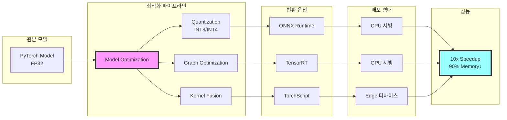

# ⚡ 추론 최적화 전략

## 🎯 목표

### 최적화 목표
- 추론 속도 10배 향상 (100ms → 10ms/샘플)
- GPU 메모리 사용량 75% 감소
- 배치 처리 효율 극대화
- 성능 손실 최소화 (ROUGE 1% 이내)

## 🏗️ 추론 최적화 아키텍처



## 🔧 모델 경량화 전략

### 1. 양자화 (Quantization)
```python
class ModelQuantizer:
    def __init__(self, model_path):
        self.model = self.load_model(model_path)
        self.calibration_data = None

    def quantize_dynamic(self):
        """동적 양자화 - CPU 추론용"""
        import torch.quantization as quant

        quantized_model = quant.quantize_dynamic(
            self.model,
            {torch.nn.Linear, torch.nn.LSTM, torch.nn.GRU},
            dtype=torch.qint8
        )

        # 크기 비교
        original_size = self.get_model_size(self.model)
        quantized_size = self.get_model_size(quantized_model)

        print(f"Original: {original_size:.2f} MB")
        print(f"Quantized: {quantized_size:.2f} MB")
        print(f"Reduction: {(1 - quantized_size/original_size)*100:.1f}%")

        return quantized_model

    def quantize_static(self, calibration_loader):
        """정적 양자화 - 더 높은 압축률"""
        import torch.quantization as quant

        # 양자화 설정
        self.model.qconfig = quant.get_default_qconfig('fbgemm')
        quant.prepare(self.model, inplace=True)

        # 캘리브레이션
        self.calibrate(calibration_loader)

        # 양자화 적용
        quantized_model = quant.convert(self.model, inplace=False)

        return quantized_model

    def quantize_qat(self, train_loader):
        """Quantization-Aware Training"""
        import torch.quantization as quant

        # QAT 준비
        self.model.qconfig = quant.get_default_qat_qconfig('fbgemm')
        quant.prepare_qat(self.model, inplace=True)

        # 추가 학습
        for epoch in range(3):
            self.train_one_epoch(train_loader)

        # 양자화 변환
        quantized_model = quant.convert(self.model, inplace=False)

        return quantized_model

    def int4_quantization(self):
        """INT4 극한 양자화 (bitsandbytes)"""
        import bitsandbytes as bnb

        # 4-bit 양자화 설정
        quantization_config = {
            'load_in_4bit': True,
            'bnb_4bit_compute_dtype': torch.float16,
            'bnb_4bit_quant_type': 'nf4',
            'bnb_4bit_use_double_quant': True
        }

        model_4bit = self.load_model_with_config(quantization_config)

        return model_4bit
```

### 2. 모델 프루닝 (Pruning)
```python
class ModelPruner:
    def __init__(self, model):
        self.model = model
        self.importance_scores = {}

    def structured_pruning(self, pruning_ratio=0.3):
        """구조적 프루닝 - 채널/레이어 단위"""
        import torch.nn.utils.prune as prune

        for name, module in self.model.named_modules():
            if isinstance(module, (torch.nn.Linear, torch.nn.Conv2d)):
                # 중요도 기반 프루닝
                prune.ln_structured(
                    module,
                    name='weight',
                    amount=pruning_ratio,
                    n=2,
                    dim=0
                )

        # 프루닝 영구 적용
        for name, module in self.model.named_modules():
            if isinstance(module, (torch.nn.Linear, torch.nn.Conv2d)):
                prune.remove(module, 'weight')

        return self.model

    def unstructured_pruning(self, sparsity=0.5):
        """비구조적 프루닝 - 가중치 단위"""
        import torch.nn.utils.prune as prune

        parameters_to_prune = []
        for name, module in self.model.named_modules():
            if isinstance(module, (torch.nn.Linear, torch.nn.Conv2d)):
                parameters_to_prune.append((module, 'weight'))

        # 전역 프루닝
        prune.global_unstructured(
            parameters_to_prune,
            pruning_method=prune.L1Unstructured,
            amount=sparsity
        )

        return self.model

    def sensitivity_analysis(self, validation_loader):
        """레이어별 민감도 분석"""
        sensitivity_results = {}

        for name, module in self.model.named_modules():
            if isinstance(module, torch.nn.Linear):
                # 레이어 프루닝 시뮬레이션
                original_weight = module.weight.clone()

                for ratio in [0.1, 0.3, 0.5, 0.7]:
                    # 임시 프루닝
                    self.prune_layer(module, ratio)

                    # 성능 평가
                    performance = self.evaluate(validation_loader)

                    sensitivity_results[name] = {
                        'ratio': ratio,
                        'performance': performance
                    }

                    # 복원
                    module.weight.data = original_weight

        return sensitivity_results
```

## 🚀 ONNX 변환 및 최적화

### 1. ONNX 변환
```python
class ONNXConverter:
    def __init__(self, model, tokenizer):
        self.model = model
        self.tokenizer = tokenizer

    def convert_to_onnx(self, output_path, optimize=True):
        """PyTorch → ONNX 변환"""
        import torch.onnx

        # 더미 입력 생성
        dummy_input = self.create_dummy_input()

        # ONNX 변환
        torch.onnx.export(
            self.model,
            dummy_input,
            output_path,
            export_params=True,
            opset_version=14,
            do_constant_folding=True,
            input_names=['input_ids', 'attention_mask'],
            output_names=['output'],
            dynamic_axes={
                'input_ids': {0: 'batch_size', 1: 'sequence'},
                'attention_mask': {0: 'batch_size', 1: 'sequence'},
                'output': {0: 'batch_size', 1: 'sequence'}
            }
        )

        if optimize:
            self.optimize_onnx(output_path)

        return output_path

    def optimize_onnx(self, model_path):
        """ONNX 그래프 최적화"""
        from onnxruntime.transformers import optimizer

        optimized_model = optimizer.optimize_model(
            model_path,
            model_type='bert',  # 또는 'gpt2', 'bart' 등
            num_heads=12,
            hidden_size=768,
            optimization_options={
                'enable_gelu_approximation': True,
                'enable_layer_norm_fusion': True,
                'enable_attention_fusion': True,
                'enable_skip_layer_norm_fusion': True,
                'enable_embed_layer_norm_fusion': True,
                'enable_bias_skip_layer_norm_fusion': True,
                'enable_bias_gelu_fusion': True,
                'enable_gelu_fusion': True,
                'enable_shape_inference': True
            }
        )

        optimized_model.save_model_to_file('optimized_model.onnx')

        return optimized_model

    def benchmark_onnx(self, onnx_path, test_data):
        """ONNX 모델 벤치마크"""
        import onnxruntime as ort
        import time

        # ONNX Runtime 세션 생성
        providers = ['CUDAExecutionProvider', 'CPUExecutionProvider']
        session = ort.InferenceSession(onnx_path, providers=providers)

        # 워밍업
        for _ in range(10):
            _ = session.run(None, test_data)

        # 벤치마크
        times = []
        for _ in range(100):
            start = time.perf_counter()
            _ = session.run(None, test_data)
            times.append(time.perf_counter() - start)

        return {
            'mean_latency': np.mean(times) * 1000,  # ms
            'p50_latency': np.percentile(times, 50) * 1000,
            'p95_latency': np.percentile(times, 95) * 1000,
            'p99_latency': np.percentile(times, 99) * 1000,
            'throughput': 1 / np.mean(times)  # samples/sec
        }
```

### 2. ONNX Runtime 최적화
```python
class ONNXRuntimeOptimizer:
    def __init__(self, model_path):
        self.model_path = model_path
        self.providers = self.get_providers()

    def get_providers(self):
        """사용 가능한 프로바이더 확인"""
        import onnxruntime as ort

        available = ort.get_available_providers()
        providers = []

        if 'TensorrtExecutionProvider' in available:
            providers.append(('TensorrtExecutionProvider', {
                'trt_max_workspace_size': 2147483648,
                'trt_fp16_enable': True,
                'trt_int8_enable': True,
                'trt_engine_cache_enable': True
            }))

        if 'CUDAExecutionProvider' in available:
            providers.append(('CUDAExecutionProvider', {
                'device_id': 0,
                'arena_extend_strategy': 'kNextPowerOfTwo',
                'gpu_mem_limit': 4 * 1024 * 1024 * 1024,
                'cudnn_conv_algo_search': 'EXHAUSTIVE',
                'do_copy_in_default_stream': True
            }))

        providers.append('CPUExecutionProvider')

        return providers

    def create_optimized_session(self):
        """최적화된 추론 세션 생성"""
        import onnxruntime as ort

        # 세션 옵션
        sess_options = ort.SessionOptions()
        sess_options.graph_optimization_level = ort.GraphOptimizationLevel.ORT_ENABLE_ALL
        sess_options.enable_cpu_mem_arena = True
        sess_options.enable_mem_pattern = True
        sess_options.enable_mem_reuse = True
        sess_options.execution_mode = ort.ExecutionMode.ORT_SEQUENTIAL

        # 병렬 처리 설정
        sess_options.inter_op_num_threads = 4
        sess_options.intra_op_num_threads = 4

        session = ort.InferenceSession(
            self.model_path,
            sess_options,
            providers=self.providers
        )

        return session
```

## 🔥 TensorRT 가속화

### 1. TensorRT 변환
```python
class TensorRTOptimizer:
    def __init__(self, onnx_path):
        self.onnx_path = onnx_path
        self.engine = None

    def build_engine(self, precision='fp16', max_batch_size=32):
        """TensorRT 엔진 빌드"""
        import tensorrt as trt

        logger = trt.Logger(trt.Logger.WARNING)
        builder = trt.Builder(logger)
        network = builder.create_network(
            1 << int(trt.NetworkDefinitionCreationFlag.EXPLICIT_BATCH)
        )
        parser = trt.OnnxParser(network, logger)

        # ONNX 모델 파싱
        with open(self.onnx_path, 'rb') as f:
            parser.parse(f.read())

        # 빌더 설정
        config = builder.create_builder_config()
        config.max_workspace_size = 4 << 30  # 4GB

        # 정밀도 설정
        if precision == 'fp16':
            config.set_flag(trt.BuilderFlag.FP16)
        elif precision == 'int8':
            config.set_flag(trt.BuilderFlag.INT8)
            config.int8_calibrator = self.create_calibrator()

        # 동적 shape 설정
        profile = builder.create_optimization_profile()
        profile.set_shape(
            'input_ids',
            (1, 128),         # min
            (max_batch_size//2, 256),  # opt
            (max_batch_size, 512)      # max
        )
        config.add_optimization_profile(profile)

        # 엔진 빌드
        self.engine = builder.build_engine(network, config)

        return self.engine

    def optimize_for_inference(self):
        """추론 최적화 설정"""
        optimizations = {
            'kernel_auto_tuning': True,
            'fusion_optimization': True,
            'multi_stream_execution': True,
            'cuda_graph_capture': True,
            'persistent_cache': True
        }

        return optimizations

    def benchmark_tensorrt(self, test_data, iterations=1000):
        """TensorRT 성능 벤치마크"""
        import tensorrt as trt
        import pycuda.driver as cuda
        import pycuda.autoinit
        import time

        # 컨텍스트 생성
        context = self.engine.create_execution_context()

        # 메모리 할당
        inputs, outputs, bindings = self.allocate_buffers(self.engine)

        # 워밍업
        for _ in range(100):
            self.infer(context, bindings, inputs, outputs, test_data)

        # 벤치마크
        times = []
        for _ in range(iterations):
            start = time.perf_counter()
            self.infer(context, bindings, inputs, outputs, test_data)
            times.append(time.perf_counter() - start)

        return {
            'mean_latency': np.mean(times) * 1000,
            'throughput': 1 / np.mean(times),
            'memory_usage': self.get_memory_usage()
        }
```

## 📊 배치 추론 최적화

### 1. 동적 배치 처리
```python
class BatchInferenceOptimizer:
    def __init__(self, model, max_batch_size=32):
        self.model = model
        self.max_batch_size = max_batch_size
        self.batch_queue = []

    def dynamic_batching(self, requests, timeout=0.01):
        """동적 배칭 with timeout"""
        import time
        import threading

        batches = []
        current_batch = []
        start_time = time.time()

        for request in requests:
            current_batch.append(request)

            # 배치 크기나 시간 제한 도달
            if (len(current_batch) >= self.max_batch_size or
                time.time() - start_time > timeout):
                batches.append(current_batch)
                current_batch = []
                start_time = time.time()

        # 남은 요청 처리
        if current_batch:
            batches.append(current_batch)

        return batches

    def optimize_batch_size(self, model, sample_data):
        """최적 배치 크기 자동 탐색"""
        import torch

        results = []

        for batch_size in [1, 2, 4, 8, 16, 32, 64, 128]:
            try:
                # 메모리 체크
                torch.cuda.empty_cache()
                batch = self.create_batch(sample_data, batch_size)

                # 추론 시간 측정
                start = time.perf_counter()
                with torch.no_grad():
                    _ = model(batch)
                inference_time = time.perf_counter() - start

                # 처리량 계산
                throughput = batch_size / inference_time

                results.append({
                    'batch_size': batch_size,
                    'latency': inference_time * 1000,
                    'throughput': throughput,
                    'memory': torch.cuda.memory_allocated() / 1024**3
                })

            except RuntimeError as e:
                if 'out of memory' in str(e):
                    break
                raise

        # 최적 배치 크기 선택
        optimal = max(results, key=lambda x: x['throughput'])

        return optimal['batch_size'], results

    def continuous_batching(self):
        """연속 배칭 (Continuous Batching)"""
        import asyncio
        from collections import deque

        class ContinuousBatcher:
            def __init__(self, model, max_batch_size):
                self.model = model
                self.max_batch_size = max_batch_size
                self.queue = deque()
                self.results = {}

            async def process_requests(self):
                """요청 처리 루프"""
                while True:
                    if len(self.queue) > 0:
                        # 배치 생성
                        batch_size = min(len(self.queue), self.max_batch_size)
                        batch = [self.queue.popleft() for _ in range(batch_size)]

                        # 배치 처리
                        results = await self.process_batch(batch)

                        # 결과 저장
                        for req_id, result in results:
                            self.results[req_id] = result
                    else:
                        await asyncio.sleep(0.001)

            async def process_batch(self, batch):
                """배치 추론"""
                # 패딩 및 텐서 변환
                padded_batch = self.pad_batch(batch)

                # 모델 추론
                with torch.no_grad():
                    outputs = self.model(padded_batch)

                # 결과 언패딩
                results = self.unpad_results(outputs, batch)

                return results

        return ContinuousBatcher(self.model, self.max_batch_size)
```

## 🔄 메모리 최적화

### 1. 메모리 풀링
```python
class MemoryOptimizer:
    def __init__(self):
        self.memory_pool = {}
        self.cache = {}

    def setup_memory_pool(self, shapes, dtype=torch.float16):
        """사전 할당 메모리 풀"""
        for name, shape in shapes.items():
            self.memory_pool[name] = torch.empty(
                shape,
                dtype=dtype,
                device='cuda',
                requires_grad=False
            )

        return self.memory_pool

    def gradient_checkpointing(self, model):
        """그래디언트 체크포인팅"""
        model.gradient_checkpointing_enable()

        # 또는 수동 설정
        for module in model.modules():
            if hasattr(module, 'gradient_checkpointing'):
                module.gradient_checkpointing = True

        return model

    def mixed_precision_inference(self):
        """혼합 정밀도 추론"""
        from torch.cuda.amp import autocast

        def inference_with_amp(model, inputs):
            with autocast(dtype=torch.float16):
                with torch.no_grad():
                    outputs = model(**inputs)
            return outputs

        return inference_with_amp

    def memory_efficient_attention(self):
        """메모리 효율적 어텐션"""
        import xformers.ops as xops

        class EfficientAttention(torch.nn.Module):
            def __init__(self, dim, num_heads):
                super().__init__()
                self.dim = dim
                self.num_heads = num_heads

            def forward(self, q, k, v):
                # xFormers 메모리 효율적 어텐션
                return xops.memory_efficient_attention(
                    q, k, v,
                    attn_bias=None,
                    op=xops.MemoryEfficientAttentionFlashAttentionOp
                )

        return EfficientAttention
```

## 📈 성능 모니터링

### 1. 추론 프로파일링
```python
class InferenceProfiler:
    def __init__(self):
        self.metrics = defaultdict(list)

    def profile_model(self, model, input_data, num_runs=100):
        """모델 프로파일링"""
        import torch.profiler as profiler

        with profiler.profile(
            activities=[
                profiler.ProfilerActivity.CPU,
                profiler.ProfilerActivity.CUDA
            ],
            record_shapes=True,
            profile_memory=True,
            with_stack=True
        ) as prof:
            with profiler.record_function("model_inference"):
                for _ in range(num_runs):
                    with torch.no_grad():
                        _ = model(input_data)

        # 결과 분석
        print(prof.key_averages().table(sort_by="cuda_time_total", row_limit=10))

        # 병목 지점 파악
        bottlenecks = self.identify_bottlenecks(prof)

        return {
            'profile': prof,
            'bottlenecks': bottlenecks,
            'recommendations': self.get_optimization_recommendations(bottlenecks)
        }

    def identify_bottlenecks(self, profile):
        """병목 지점 식별"""
        bottlenecks = []

        for event in profile.key_averages():
            if event.cuda_time_total > 1000:  # 1ms 이상
                bottlenecks.append({
                    'operation': event.key,
                    'cuda_time': event.cuda_time_total,
                    'cpu_time': event.cpu_time_total,
                    'calls': event.count
                })

        return sorted(bottlenecks, key=lambda x: x['cuda_time'], reverse=True)
```

## 🚀 실행 계획

### Phase 1: 기본 최적화
- [ ] 동적 양자화 적용 (INT8)
- [ ] ONNX 변환 및 최적화
- [ ] 배치 크기 최적화

### Phase 2: 고급 최적화
- [ ] TensorRT 엔진 구축
- [ ] INT4 양자화 실험
- [ ] 모델 프루닝 적용

### Phase 3: 프로덕션 준비
- [ ] 연속 배칭 시스템 구현
- [ ] 메모리 풀링 설정
- [ ] 성능 모니터링 대시보드

## 🎯 예상 성능 개선

| 최적화 기법 | 속도 향상 | 메모리 감소 | ROUGE 손실 |
|-----------|----------|-----------|-----------|
| FP16 변환 | 2x | 50% | 0% |
| INT8 양자화 | 3-4x | 75% | <1% |
| ONNX Runtime | 2-3x | 30% | 0% |
| TensorRT | 5-10x | 60% | <0.5% |
| 프루닝 (30%) | 1.5x | 30% | <2% |
| **종합 적용** | **8-15x** | **80%** | **<2%** |