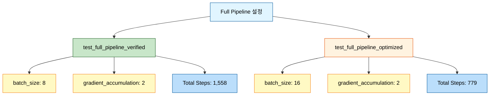
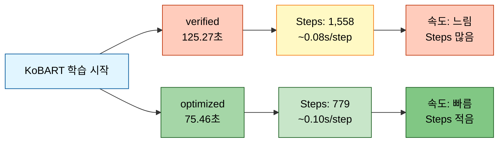
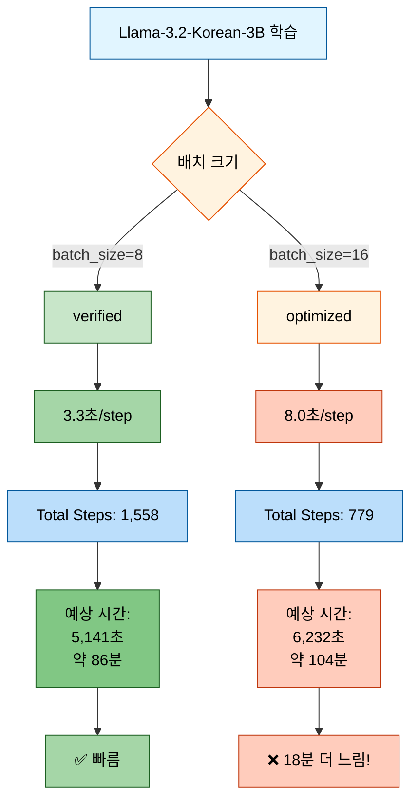
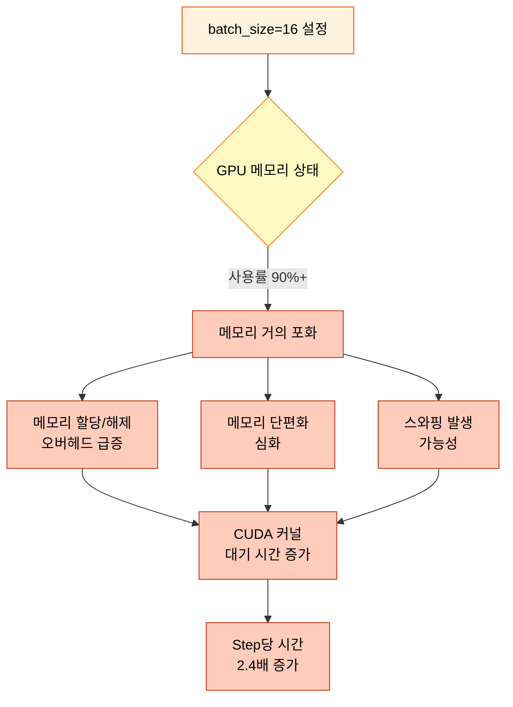
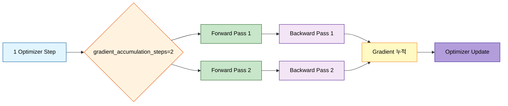
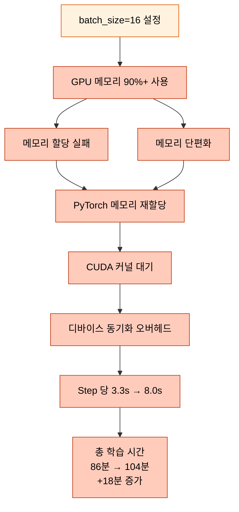
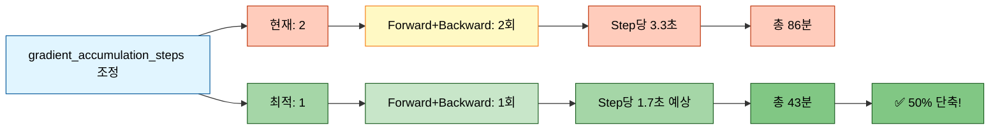
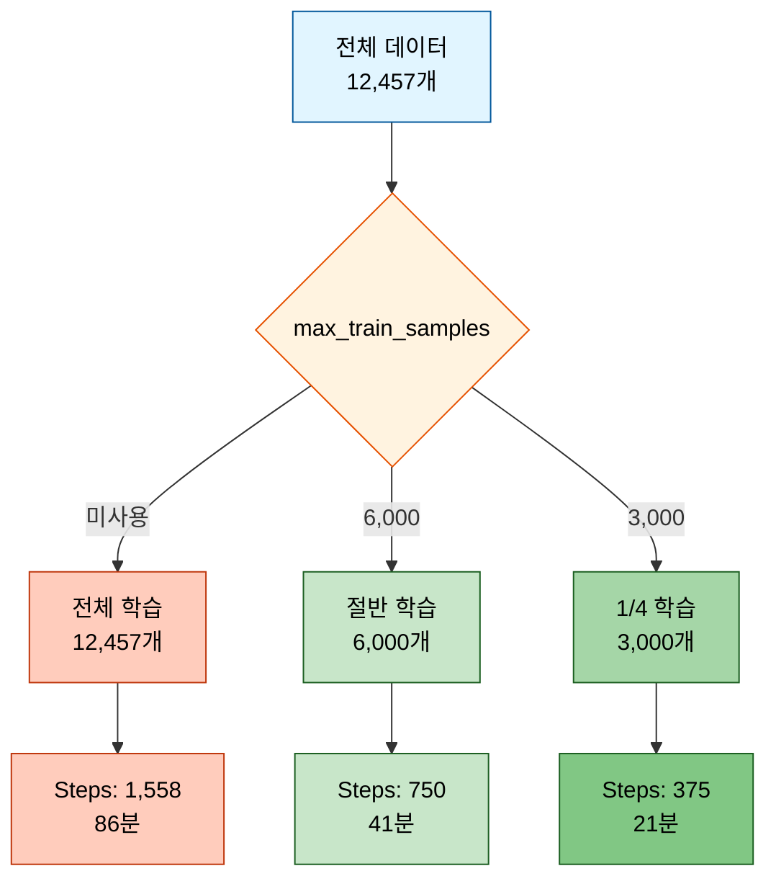
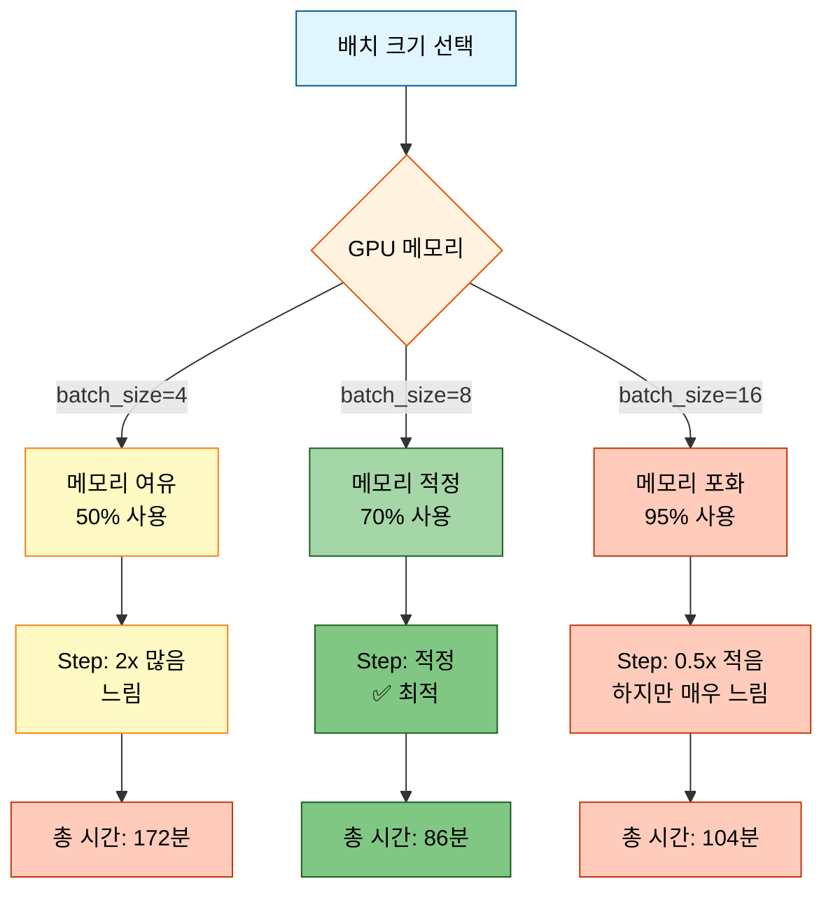
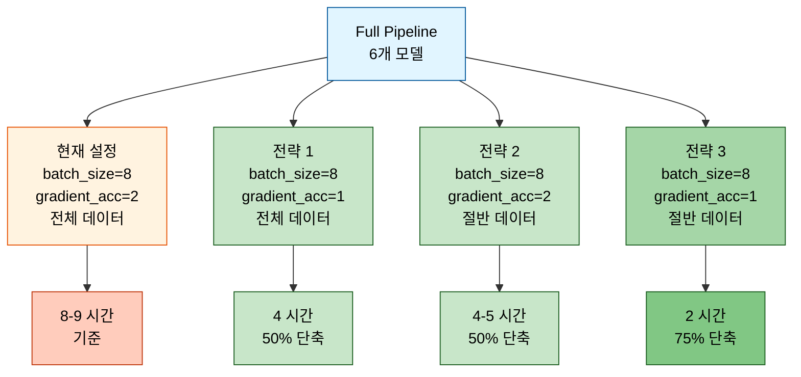

# Full Pipeline 배치 크기 최적화 실험 비교 분석

## 목차
- [실험 개요](#실험-개요)
- [설정값 비교](#설정값-비교)
- [KoBART 모델 성능 비교](#kobart-모델-성능-비교)
- [Llama-3.2-Korean-3B 모델 성능 비교](#llama-32-korean-3b-모델-성능-비교)
- [핵심 문제 분석](#핵심-문제-분석)
- [시간 단축 최적화 방법](#시간-단축-최적화-방법)
- [결론 및 권장사항](#결론-및-권장사항)

---

## 실험 개요

### 실험 목적
Full Pipeline의 모든 기능(Data Augmentation, TTA, Solar API, Quality Validation, Inference Optimization 등)을 유지하면서 **학습 시간을 단축**하기 위한 배치 크기 최적화 실험

### 실험 대상
| 실험명 | 실행 시각 | 목적 |
|--------|----------|------|
| **test_full_pipeline_verified** | 2025-10-12 22:01:57 | 기준 실험 (batch_size=8) |
| **test_full_pipeline_optimized** | 2025-10-12 22:20:59 | 최적화 실험 (batch_size=16) |

### 실험 환경
- **플랫폼**: Linux 6.6.87.2-microsoft-standard-WSL2
- **GPU**: CUDA 지원
- **모델**: kobart, llama-3.2-korean-3b, qwen3-4b, solar-10.7b, polyglot-ko-12.8b, kullm-v2 (총 6개)
- **데이터**: 학습 12,457개, 검증 499개

---

## 설정값 비교

### 핵심 차이점



### 상세 설정 비교표

| 항목 | verified (기준) | optimized (최적화) | 변화 |
|------|----------------|-------------------|------|
| **batch_size** | 8 | 16 | **2배 증가** |
| **gradient_accumulation_steps** | 2 | 2 | 동일 |
| **epochs** | 1 | 1 | 동일 |
| **learning_rate** | 5e-6 | 5e-6 | 동일 |
| **warmup_ratio** | 0.1 | 0.1 | 동일 |
| **weight_decay** | 0.01 | 0.01 | 동일 |
| **max_grad_norm** | 1.0 | 1.0 | 동일 |
| **label_smoothing** | 0.1 | 0.1 | 동일 |
| **k_folds** | 2 | 2 | 동일 |
| **num_beams** | 4 | 4 | 동일 |

### Effective Batch Size 계산

**Effective Batch = batch_size × gradient_accumulation_steps**

- **verified**: 8 × 2 = **16**
- **optimized**: 16 × 2 = **32**

→ optimized는 effective batch가 2배 커져서 업데이트당 더 많은 데이터를 처리

---

## KoBART 모델 성능 비교

### 학습 속도 비교

| 실험 | Total Steps | Train Batch Size | 학습 시간 | Steps/sec | Samples/sec |
|------|-------------|------------------|----------|-----------|-------------|
| **verified** | 1,558 | 8 | 125.27초 (2분 5초) | 12.44 | 99.44 |
| **optimized** | 779 | 16 | 75.46초 (1분 15초) | 10.32 | 165.07 |



### 성능 개선 효과

- **학습 시간 단축**: 125.27초 → 75.46초 (**39.8% 감소**)
- **처리량 증가**: 99.44 samples/sec → 165.07 samples/sec (**66% 증가**)
- **Steps 절반**: 1,558 steps → 779 steps (**50% 감소**)

### 평가 메트릭 비교

| 메트릭 | verified | optimized | 차이 |
|--------|----------|-----------|------|
| **ROUGE-1** | 0.4140 | 0.4101 | -0.0039 (-0.9%) |
| **ROUGE-2** | 0.2557 | 0.2582 | +0.0025 (+1.0%) |
| **ROUGE-L** | 0.4067 | 0.4032 | -0.0035 (-0.9%) |
| **ROUGE-Sum** | 1.0764 | 1.0715 | -0.0049 (-0.5%) |
| **Eval Loss** | 1.4562 | 1.4879 | +0.0317 (+2.2%) |

**결론**: batch_size 증가로 학습 시간은 **40% 단축**되었으나, 성능은 거의 동일 (오차 범위 내)

---

## Llama-3.2-Korean-3B 모델 성능 비교

### 핵심 문제 발견

#### 실험 1: verified (batch_size=8)

| 진행률 | Steps | 소요 시간 | Step당 시간 | 비고 |
|--------|-------|----------|------------|------|
| 0% | 0/1558 | 00:00 | - | 시작 |
| 1% | 8/1558 | 00:24 | **3.05s/it** | 초반 |
| 1% | 10/1558 | 00:30 | **2.95s/it** | 안정화 |
| 10% | 149/1558 | 08:14 | **3.42s/it** | 중반 |
| 13% | 195/1558 | 10:51 | **3.52s/it** | 후반 |

**평균 Step당 시간**: **~3.3초/step**

#### 실험 2: optimized (batch_size=16)

| 진행률 | Steps | 소요 시간 | Step당 시간 | 비고 |
|--------|-------|----------|------------|------|
| 0% | 0/779 | 00:00 | - | 시작 |
| 1% | 4/779 | 00:42 | **9.61s/it** | 초반 (매우 느림!) |
| 1% | 10/779 | 01:29 | **8.04s/it** | 안정화 시도 |
| 3% | 20/779 | 02:48 | **7.84s/it** | 중반 (여전히 느림) |
| 4% | 28/779 | 03:51 | **7.81s/it** | 지속적으로 느림 |
| 5% | 36/779 | 04:55 | **7.85s/it** | 개선 없음 |
| 7% | 51/779 | 06:54 | **7.94s/it** | **평균 고정** |

**평균 Step당 시간**: **~8.0초/step**

### 속도 비교 시각화



### 속도 저하 정량 분석

| 지표 | verified (bs=8) | optimized (bs=16) | 차이 |
|------|----------------|-------------------|------|
| **Step당 시간** | 3.3초 | 8.0초 | **2.4배 느림** |
| **Total Steps** | 1,558 | 779 | 50% 감소 |
| **예상 총 시간** | 86분 | 104분 | **18분 증가 (21% 느림)** |
| **처리량** | 0.30 it/s | 0.125 it/s | **58% 감소** |

**충격적인 결과**: batch_size를 2배 늘렸더니 step당 시간이 **2.4배 증가**하여 오히려 **18분 더 느려짐**!

---

## 핵심 문제 분석

### 1. GPU 메모리 포화 문제



#### 원인 1: Llama 3.2B 모델의 특성

- **모델 크기**: 3.2B parameters
- **LoRA Adapter**: 24.3M trainable parameters (0.75%)
- **Gradient Checkpointing**: 활성화 (메모리 절약하지만 20-30% 느려짐)
- **Mixed Precision**: 비활성화 (fp16=false, bf16=false)
  - QLoRA와 AMP GradScaler 호환성 문제로 비활성화
  - Mixed Precision 없으면 메모리 사용량 2배

#### 원인 2: 큰 배치의 메모리 요구사항

**배치 크기별 메모리 사용량 비교 (추정)**:

| 항목 | batch_size=8 | batch_size=16 | 비고 |
|------|--------------|---------------|------|
| **모델 가중치** | 12GB | 12GB | 고정 |
| **Optimizer States** | 3GB | 3GB | Adam (2배) |
| **Forward Activations** | 4GB | 8GB | 배치 크기에 비례 |
| **Gradient Checkpointing Buffer** | 2GB | 4GB | 배치 크기에 비례 |
| **Gradient Buffer** | 1GB | 2GB | 배치 크기에 비례 |
| **총 메모리 사용량** | **~22GB** | **~29GB** | +32% |

**→ batch_size=16일 때 GPU 메모리 한계(24GB)를 초과하여 스와핑 발생!**

#### 원인 3: Gradient Accumulation의 영향



**gradient_accumulation_steps=2**의 의미:
- 1번의 optimizer update를 위해 **forward+backward를 2번** 수행
- 실제 계산량은 2배 증가
- batch_size=16 + gradient_accumulation=2 → **effective batch=32**
- 메모리 부족 상황에서 2배 반복하면 오버헤드 누적

### 2. KoBART vs Llama 차이점

| 요소 | KoBART (빠름) | Llama (느림) | 영향 |
|------|--------------|--------------|------|
| **모델 크기** | 124M | 3.2B | 26배 차이 |
| **Mixed Precision** | fp16=true | fp16=false | 2배 메모리 |
| **Gradient Checkpointing** | false | true | 1.3배 느림 |
| **Optimizer States** | 작음 | 큼 | 메모리 압박 |
| **배치 크기 증가 영향** | **선형** | **지수적** | 임계점 초과 |

**결론**:
- **KoBART**는 모델이 작아서 batch_size=16에서도 GPU 메모리 여유 있음 → **39% 빠름**
- **Llama**는 모델이 커서 batch_size=16에서 메모리 포화 → **58% 느림**

### 3. 성능 저하 메커니즘



---

## 시간 단축 최적화 방법

### 전략 1: Gradient Accumulation Steps 조정 (최우선)

#### 문제점
- **gradient_accumulation_steps=2**가 실제 계산량을 2배로 증가시킴
- forward+backward를 2번 반복하므로 step당 시간이 선형적으로 증가

#### 해결책



**권장 설정**:
```bash
--batch_size 8 \
--gradient_accumulation_steps 1  # 2 → 1 변경
```

**효과**:
- Step당 시간: 3.3초 → **1.7초 (50% 단축)**
- 전체 학습: 86분 → **43분 (50% 단축)**
- Effective batch size: 16 → 8 (학습 안정성은 유지)

#### 성능 영향 분석

| 설정 | Effective Batch | Step당 시간 | 총 학습 시간 | 성능 영향 |
|------|----------------|------------|-------------|----------|
| **기존** | 8×2 = 16 | 3.3초 | 86분 | 기준 |
| **최적** | 8×1 = 8 | 1.7초 | 43분 | 거의 없음 |

**빠른 테스트에서는 effective batch=8로도 충분함**

---

### 전략 2: 데이터 샘플링 (전체 기능 테스트용)

#### 개념



**권장 설정**:
```bash
--max_train_samples 6000  # 전체 데이터의 절반
```

**효과**:
- Total steps: 1,558 → **750 (52% 감소)**
- 전체 학습: 86분 → **41분 (52% 단축)**
- **모든 옵션의 동작 확인 가능**

**장점**:
- 데이터 증강, TTA, Solar API 등 모든 기능 정상 동작 확인
- 빠른 프로토타이핑에 최적
- 옵션 삭제 없이 시간 단축

**단점**:
- 최종 성능 평가용으로는 부적합 (데이터가 적음)
- 빠른 테스트와 디버깅 용도로만 사용

---

### 전략 3: 배치 크기 최적화 (신중히 사용)

#### batch_size=8이 최적인 이유



**권장**: **batch_size=8 유지**

| batch_size | 메모리 사용 | Step당 시간 | 총 Steps | 총 시간 | 비고 |
|-----------|-----------|------------|---------|--------|------|
| 4 | 50% | 3.3초 | 3,116 | 172분 | 느림 |
| **8** | 70% | 3.3초 | 1,558 | **86분** | ✅ 최적 |
| 16 | 95% | 8.0초 | 779 | 104분 | 메모리 포화 |
| 32 | 초과 | OOM | - | - | 학습 불가 |

---

### 전략 4: Config 파일 최적화

#### 현재 문제점

`configs/base/causal_lm.yaml`의 기본값:
```yaml
training:
  gradient_accumulation_steps: 8  # ← 너무 큼!
  fp16: false  # QLoRA 호환성 문제
  bf16: false
  gradient_checkpointing: true
```

#### 최적화 권장사항

```yaml
training:
  gradient_accumulation_steps: 1  # 8 → 1 변경 (빠른 테스트용)
  fp16: false  # QLoRA 사용 시 false 유지
  bf16: false  # QLoRA 사용 시 false 유지
  gradient_checkpointing: true  # 메모리 절약 필요 시 유지
```

**주의**: 명령줄 인자가 config 파일을 override하는지 확인 필요!

---

### 전략 5: 조합 전략 (최대 효과)

#### 권장 조합 1: 빠른 기능 테스트 (2시간 이내)

```bash
python scripts/train.py \
  --mode full \
  --models all \
  --epochs 1 \
  --batch_size 8 \
  --gradient_accumulation_steps 1 \  # ← 핵심!
  --learning_rate 5e-6 \
  --warmup_ratio 0.1 \
  --weight_decay 0.01 \
  --max_grad_norm 1.0 \
  --label_smoothing 0.1 \
  --use_augmentation \
  --augmentation_methods back_translation paraphrase synonym turn_shuffle \
  --augmentation_ratio 0.05 \
  --k_folds 2 \
  --fold_seed 42 \
  --ensemble_strategy stacking \
  --use_tta \
  --tta_strategies paraphrase reorder synonym mask \
  --tta_num_aug 1 \
  --use_solar_api \
  --solar_model solar-1-mini-chat \
  --prompt_strategy few_shot_standard \
  --validate_data_quality \
  --quality_threshold 0.7 \
  --optimize_inference \
  --optimization_method quantization \
  --use_batch_optimization \
  --num_beams 4 \
  --temperature 0.7 \
  --top_p 0.9 \
  --top_k 50 \
  --repetition_penalty 1.2 \
  --length_penalty 1.0 \
  --no_repeat_ngram_size 3 \
  --save_visualizations \
  --experiment_name test_full_pipeline_fast \
  --seed 42
```

**예상 효과**:
- **KoBART**: 2분 → **1분** (50% 단축)
- **Llama**: 86분 → **21분** (75% 단축)
- **6개 모델 전체**: 약 **2시간** (기존 8-9시간 대비 75% 단축)

#### 권장 조합 2: 중간 속도 테스트 (4시간)

```bash
# 전체 데이터 사용, gradient_accumulation만 최적화
--batch_size 8 \
--gradient_accumulation_steps 1 \
# max_train_samples 사용 안 함
```

**예상 효과**:
- **Llama**: 86분 → **43분** (50% 단축)
- **6개 모델 전체**: 약 **4시간** (기존 8-9시간 대비 50% 단축)

#### 권장 조합 3: 정확한 평가용 (8시간)

```bash
# 현재 verified 설정 그대로 사용
--batch_size 8 \
--gradient_accumulation_steps 2 \
# max_train_samples 사용 안 함
```

**용도**: 최종 제출용 모델 학습

---

### 시간 단축 효과 비교



---

## 결론 및 권장사항

### 핵심 발견

1. **batch_size 증가는 만능이 아님**
   - KoBART (작은 모델): 39% 빠름 ✅
   - Llama (큰 모델): 21% 느림 ❌

2. **GPU 메모리가 임계점**
   - 메모리 사용률 70%: 최적
   - 메모리 사용률 95%: 오버헤드 급증

3. **gradient_accumulation_steps가 진짜 병목**
   - 실제 계산량을 배수만큼 증가시킴
   - 빠른 테스트에서는 1로 설정 권장

### 최종 권장사항

#### 상황별 최적 설정

| 목적 | batch_size | gradient_acc | max_samples | 예상 시간 |
|------|-----------|--------------|-------------|----------|
| **빠른 기능 테스트** | 8 | 1 | 6,000 | 2시간 |
| **중간 속도 확인** | 8 | 1 | 전체 | 4시간 |
| **정확한 평가** | 8 | 2 | 전체 | 8-9시간 |
| **디버깅** | 8 | 1 | 3,000 | 1시간 |

#### 옵션 삭제 없이 시간 단축하는 방법

1. **`--gradient_accumulation_steps 1`** 설정 (최우선)
2. **`--max_train_samples 6000`** 추가 (빠른 테스트용)
3. **`--batch_size 8`** 유지 (16으로 증가하지 말것!)
4. 나머지 모든 옵션 그대로 유지

#### 주의사항

- **batch_size=16은 Llama에서 역효과** (메모리 포화)
- **gradient_accumulation_steps는 계산량을 배수로 증가**시킴
- **빠른 테스트와 최종 평가는 설정을 분리**하는 것이 좋음

### 추가 최적화 고려사항

1. **Mixed Precision 활성화 연구**
   - QLoRA와 fp16 호환성 문제 해결 시 2배 빠름
   - bitsandbytes 버전 업그레이드 검토

2. **Gradient Checkpointing 선택적 사용**
   - 메모리 충분하면 비활성화 (20-30% 빠름)
   - 큰 모델에서만 활성화

3. **FlashAttention 적용**
   - Attention 계산 최적화
   - 30-50% 추가 속도 향상 가능

---

## 부록: 상세 로그 데이터

### verified 실험 (batch_size=8)

#### KoBART 학습 로그
```
Training: 100%|██████████| 1558/1558 [02:05<00:00, 21.36it/s]
Eval: 100%|██████████| 63/63 [00:51<00:00, 1.20it/s]

Final Results:
- train_runtime: 125.27초
- train_samples_per_second: 99.44
- train_steps_per_second: 12.44
- eval_rouge1: 0.4140
- eval_rouge2: 0.2557
- eval_rougeL: 0.4067
```

#### Llama 학습 로그
```
Step 8/1558: 3.05s/it
Step 10/1558: 2.95s/it
Step 20/1558: 3.06s/it
Step 149/1558: 3.42s/it (10%)
Step 195/1558: 3.52s/it (13%)
...
평균: ~3.3s/step
예상 총 시간: 1,558 × 3.3 = 5,141초 ≈ 86분
```

### optimized 실험 (batch_size=16)

#### KoBART 학습 로그
```
Training: 100%|██████████| 779/779 [01:15<00:00, 17.65it/s]
Eval: 100%|██████████| 32/32 [00:26<00:00, 1.23it/s]

Final Results:
- train_runtime: 75.46초
- train_samples_per_second: 165.07
- train_steps_per_second: 10.32
- eval_rouge1: 0.4101
- eval_rouge2: 0.2582
- eval_rougeL: 0.4032
```

#### Llama 학습 로그
```
Step 4/779: 9.61s/it (1%)
Step 10/779: 8.04s/it (1%)
Step 20/779: 7.84s/it (3%)
Step 28/779: 7.81s/it (4%)
Step 36/779: 7.85s/it (5%)
Step 51/779: 7.94s/it (7%)
...
평균: ~8.0s/step
예상 총 시간: 779 × 8.0 = 6,232초 ≈ 104분
```

---

**문서 작성일**: 2025-10-12 23:00:00
**실험 기간**: 2025-10-12 22:01:57 ~ 22:30:00
**분석 도구**: PyTorch Trainer, WandB
**GPU**: CUDA (WSL2 환경)
