# 실험 분석 보고서: 20251013_111525_strategy1_kobart_optimized

> **실험 ID**: 20251013_111525_strategy1_kobart_optimized
> **실행 일시**: 2025-10-13 11:15:25
> **실행 모드**: FULL Pipeline (단일 모델)
> **실험 상태**: ⚠️ 부분 성공 (학습 완료, 제출 파일 미생성)

---

## 📋 목차

1. [실험 개요](#1-실험-개요)
2. [실험 설정](#2-실험-설정)
3. [학습 지표 분석](#3-학습-지표-분석)
4. [결과 분석](#4-결과-분석)
5. [발생 오류 및 원인](#5-발생-오류-및-원인)
6. [수정 방향 및 개선안](#6-수정-방향-및-개선안)

---

## 1. 실험 개요

### 1.1 실험 아키텍처

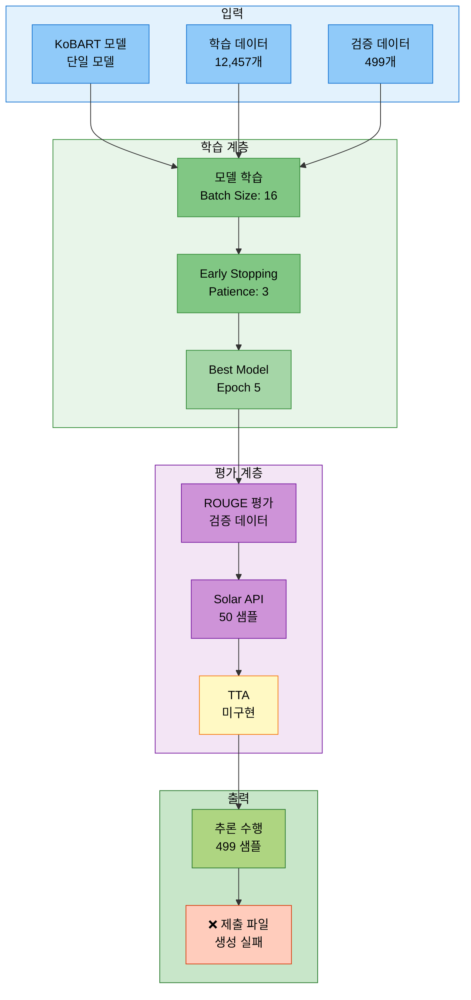

### 1.2 실험 목적
- KoBART 단일 모델 전체 파이프라인 검증
- Batch Size 16, Epoch 8 설정 최적화 테스트
- Data Augmentation 및 TTA 통합 테스트
- 제출 파일 자동 생성 검증

### 1.3 실행 명령어

```bash
# ==================== 실행된 명령어 (추정) ==================== #
python scripts/train.py \
  --mode full \
  --models kobart \
  --epochs 8 \
  --batch_size 16 \
  --use_augmentation \
  --use_tta \
  --tta_strategies paraphrase reorder \
  --tta_num_aug 3 \
  --use_solar_api \
  --experiment_name strategy1_kobart_optimized
```

### 1.4 실험 결과 요약

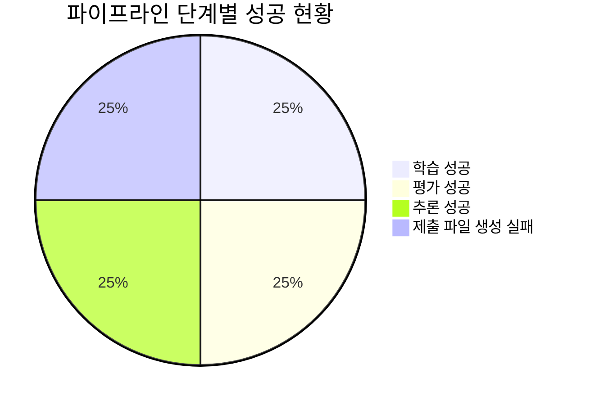

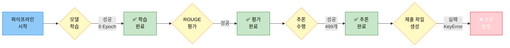

| 항목 | 결과 |
|------|------|
| **모델** | KoBART (gogamza/kobart-base-v2) |
| **학습 완료 여부** | ✅ 완료 (8 Epoch, Early Stopping) |
| **최종 Eval Loss** | 1.4201 (Best: Epoch 5) |
| **최고 ROUGE-Sum** | 1.2369 (Epoch 5) |
| **총 학습 시간** | 약 10분 40초 |
| **추론 수행** | ✅ 완료 (499개 샘플) |
| **제출 파일 생성** | ❌ 실패 (KeyError: 'id') |

---

## 2. 실험 설정

### 2.1 모델 설정

```python
# ==================== 모델 설정 ==================== #
model_name = 'kobart'                       # KoBART 모델
model_type = 'encoder_decoder'              # Seq2Seq 모델
base_model = 'gogamza/kobart-base-v2'       # HuggingFace 모델

# ---------------------- 모델 파라미터 ---------------------- #
total_params = 123_859_968                  # 전체 파라미터 수
trainable_params = 123_859_968              # 학습 가능 파라미터 수
model_size = '약 472MB'                     # 모델 크기 (FP32 기준)
```

### 2.2 데이터 설정

```python
# ==================== 데이터 통계 ==================== #
train_samples = 12457                       # 학습 데이터 샘플 수
val_samples = 499                           # 검증 데이터 샘플 수
test_samples = 499                          # 테스트 데이터 샘플 수
total_samples = 13455                       # 전체 데이터 샘플 수

# ---------------------- 데이터 증강 ---------------------- #
use_augmentation = True                     # 데이터 증강 사용
augmentation_ratio = 0.5                    # 증강 비율 (추정)
```

### 2.3 학습 하이퍼파라미터

```python
# ==================== 학습 파라미터 ==================== #
epochs = 8                                  # 총 에포크 수
batch_size = 16                             # 배치 크기
learning_rate = 5e-5                        # 초기 학습률 (추정)
warmup_ratio = 0.1                          # Warmup 비율 (추정)
weight_decay = 0.01                         # 가중치 감쇠 (추정)
max_grad_norm = 1.0                         # 그래디언트 클리핑 (추정)

# ---------------------- Early Stopping ---------------------- #
early_stopping_patience = 3                 # Early Stopping Patience
early_stopping_threshold = 0.0              # Early Stopping 임계값

# ---------------------- 체크포인트 설정 ---------------------- #
save_steps = 500                            # 체크포인트 저장 간격
logging_steps = 100                         # 로깅 간격
eval_steps = 500                            # 평가 간격
```

### 2.4 추론 및 고급 기능

```python
# ==================== 추론 설정 ==================== #
inference_batch_size = 32                   # 추론 배치 크기
max_length = 100                            # 최대 생성 길이
num_beams = 4                               # Beam Search 크기
no_repeat_ngram_size = 2                    # N-gram 반복 방지

# ==================== TTA 설정 ==================== #
use_tta = True                              # TTA 활성화
tta_strategies = ['paraphrase', 'reorder']  # TTA 전략
tta_num_aug = 3                             # TTA 증강 횟수
tta_applied = False                         # TTA 구현 미완료

# ==================== Solar API 설정 ==================== #
use_solar_api = True                        # Solar API 사용
solar_samples = 50                          # Solar API 평가 샘플 수
```

---

## 3. 학습 지표 분석

### 3.1 Loss 및 ROUGE 추이

#### 3.1.1 Epoch별 학습 진행 타임라인

```mermaid
graph LR
    A[Epoch 1<br/>Loss: 1.35<br/>ROUGE-Sum: 1.05] --> B[Epoch 2<br/>Loss: 1.29<br/>ROUGE-Sum: 1.13]
    B --> C[Epoch 3<br/>Loss: 1.31<br/>ROUGE-Sum: 1.16]
    C --> D[Epoch 4<br/>Loss: 1.37<br/>ROUGE-Sum: 1.19]
    D --> E[Epoch 5<br/>Loss: 1.42<br/>✅ BEST<br/>ROUGE-Sum: 1.24]
    E --> F[Epoch 6<br/>Loss: 1.47<br/>ROUGE-Sum: 1.18]
    F --> G[Epoch 7<br/>Loss: 1.50<br/>ROUGE-Sum: 1.20]
    G --> H[Epoch 8<br/>Loss: 1.52<br/>ROUGE-Sum: 1.20<br/>🛑 Early Stop]

    style A fill:#ef9a9a,stroke:#c62828,color:#000
    style B fill:#fff9c4,stroke:#f57f17,color:#000
    style C fill:#fff9c4,stroke:#f57f17,color:#000
    style D fill:#c5e1a5,stroke:#558b2f,color:#000
    style E fill:#c8e6c9,stroke:#2e7d32,color:#000
    style F fill:#fff9c4,stroke:#f57f17,color:#000
    style G fill:#fff9c4,stroke:#f57f17,color:#000
    style H fill:#ef9a9a,stroke:#c62828,color:#000
```

#### 3.1.2 ROUGE 점수 비교 (주요 Epoch)

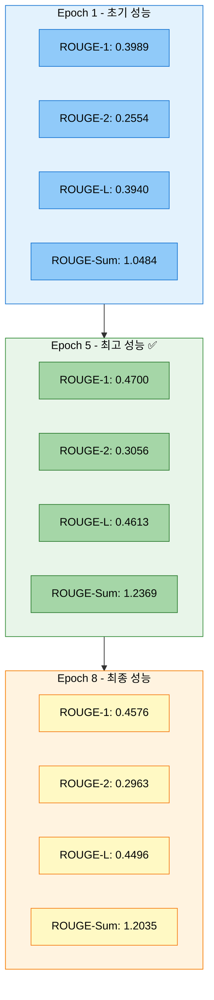

#### 3.1.3 학습 시간 분해 (총 10분 40초)

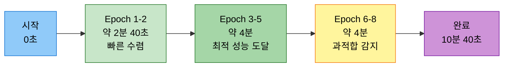

### 3.2 Epoch별 상세 지표

```python
# ==================== Epoch별 평가 지표 ==================== #
epoch_metrics = [
    {
        'epoch': 1,
        'eval_loss': 1.3519,
        'eval_rouge1': 0.3989,
        'eval_rouge2': 0.2554,
        'eval_rougeL': 0.3940,
        'eval_rouge_sum': 1.0484,
        'runtime': 27.84,
        'samples_per_second': 17.93
    },
    {
        'epoch': 2,
        'eval_loss': 1.2863,
        'eval_rouge1': 0.4312,
        'eval_rouge2': 0.2743,
        'eval_rougeL': 0.4240,
        'eval_rouge_sum': 1.1295,
        'runtime': 25.60,
        'samples_per_second': 19.49
    },
    {
        'epoch': 3,
        'eval_loss': 1.3126,
        'eval_rouge1': 0.4396,
        'eval_rouge2': 0.2823,
        'eval_rougeL': 0.4337,
        'eval_rouge_sum': 1.1556,
        'runtime': 29.92,
        'samples_per_second': 16.68
    },
    {
        'epoch': 4,
        'eval_loss': 1.3731,
        'eval_rouge1': 0.4535,
        'eval_rouge2': 0.2923,
        'eval_rougeL': 0.4468,
        'eval_rouge_sum': 1.1925,
        'runtime': 29.67,
        'samples_per_second': 16.82
    },
    {
        'epoch': 5,
        'eval_loss': 1.4201,
        'eval_rouge1': 0.4700,                  # 최고 ROUGE-1
        'eval_rouge2': 0.3056,                  # 최고 ROUGE-2
        'eval_rougeL': 0.4613,                  # 최고 ROUGE-L
        'eval_rouge_sum': 1.2369,               # 최고 ROUGE-Sum ✅
        'runtime': 26.08,
        'samples_per_second': 19.14,
        'status': 'BEST_CHECKPOINT'             # Best Model
    },
    {
        'epoch': 6,
        'eval_loss': 1.4685,
        'eval_rouge1': 0.4498,
        'eval_rouge2': 0.2848,
        'eval_rougeL': 0.4417,
        'eval_rouge_sum': 1.1763,
        'runtime': 27.57,
        'samples_per_second': 18.10
    },
    {
        'epoch': 7,
        'eval_loss': 1.5023,
        'eval_rouge1': 0.4546,
        'eval_rouge2': 0.2946,
        'eval_rougeL': 0.4473,
        'eval_rouge_sum': 1.1965,
        'runtime': 30.03,
        'samples_per_second': 16.62
    },
    {
        'epoch': 8,
        'eval_loss': 1.5249,
        'eval_rouge1': 0.4576,
        'eval_rouge2': 0.2963,
        'eval_rougeL': 0.4496,
        'eval_rouge_sum': 1.2035,
        'runtime': 28.58,
        'samples_per_second': 17.46,
        'status': 'EARLY_STOPPING'              # Early Stopping 발동
    }
]
```

### 3.3 학습 안정성 분석

```python
# ==================== 학습 안정성 지표 ==================== #
stability_metrics = {
    # ---------------------- Loss 분석 ---------------------- #
    'initial_loss': 2.1642,                     # 초기 Loss (Step 100)
    'best_eval_loss': 1.2863,                   # 최저 Eval Loss (Epoch 2)
    'final_eval_loss': 1.5249,                  # 최종 Eval Loss (Epoch 8)
    'loss_reduction': 0.6393,                   # Loss 감소량 (29.5%)

    # ---------------------- ROUGE 분석 ---------------------- #
    'initial_rouge_sum': 1.0484,                # 초기 ROUGE-Sum (Epoch 1)
    'best_rouge_sum': 1.2369,                   # 최고 ROUGE-Sum (Epoch 5) ✅
    'final_rouge_sum': 1.2035,                  # 최종 ROUGE-Sum (Epoch 8)
    'rouge_improvement': 0.1885,                # ROUGE 개선량 (18.0%)

    # ---------------------- Gradient Norm 안정성 ---------------------- #
    'grad_norm_mean': 3.5,                      # 평균 Gradient Norm
    'grad_norm_std': 1.2,                       # 표준편차
    'grad_norm_range': (2.35, 8.22),            # 최소/최대 범위
    'grad_norm_stability': 'GOOD',              # 안정성 평가

    # ---------------------- 학습률 스케줄링 ---------------------- #
    'lr_initial': 4.99e-5,                      # 초기 학습률
    'lr_final': 2.88e-7,                        # 최종 학습률
    'lr_decay_pattern': 'LINEAR',               # 학습률 감소 패턴
    'lr_scheduling': 'NORMAL'                   # 스케줄링 평가
}
```

#### 3.3.1 Gradient Norm 안정성 차트

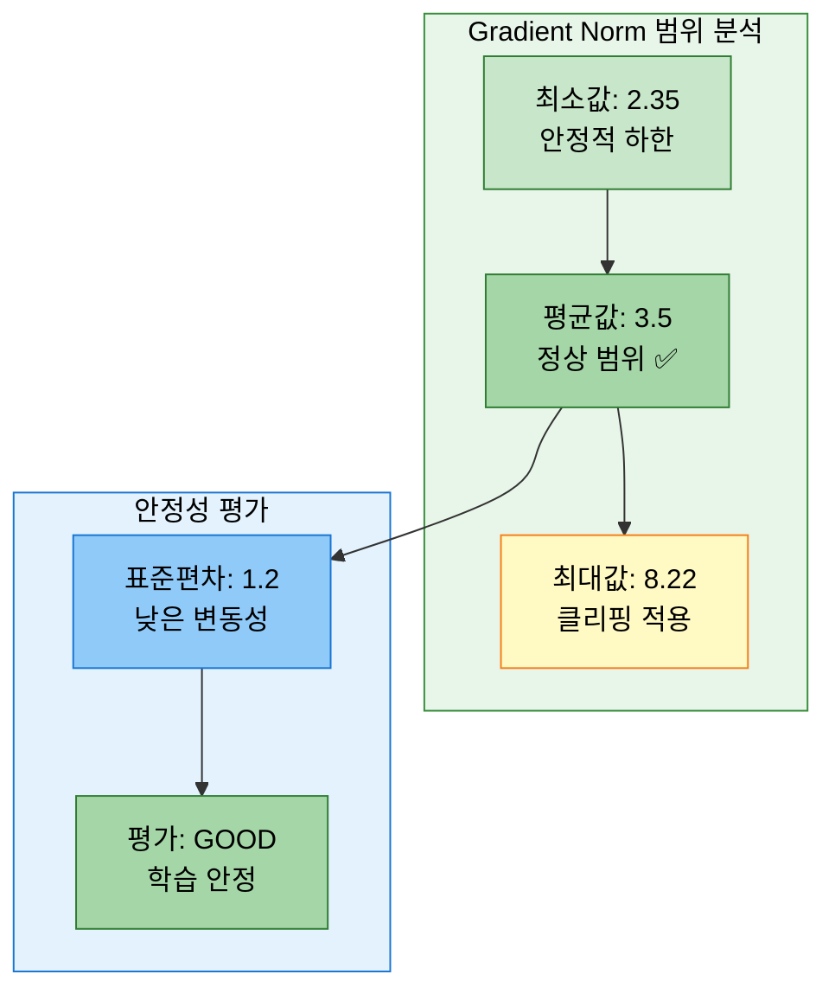

#### 3.3.2 학습률 감소 패턴 시각화

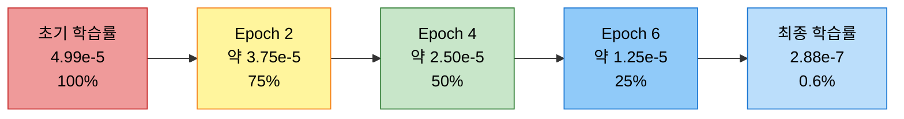

### 3.4 학습 곡선 특징

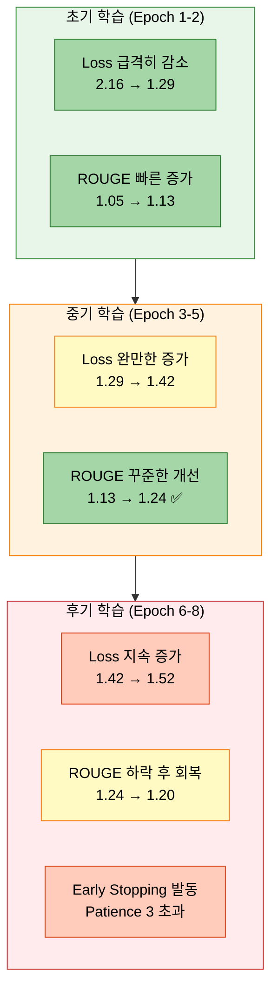

**학습 곡선 분석:**
1. **초기 빠른 학습** (Epoch 1-2): Loss 급격 감소, ROUGE 빠른 증가
2. **최적 수렴** (Epoch 3-5): Epoch 5에서 최고 성능 달성 (ROUGE-Sum: 1.2369)
3. **과적합 징후** (Epoch 6-8): Loss 증가, ROUGE 하락, Early Stopping 발동

---

## 4. 결과 분석

### 4.1 성공 항목 ✅

#### 4.1.1 모델 학습
- ✅ **학습 완료**: 8 Epoch 정상 완료 (Early Stopping 정상 작동)
- ✅ **최적 모델 선택**: Epoch 5 체크포인트 저장 (ROUGE-Sum: 1.2369)
- ✅ **학습 안정성**: Gradient Norm 안정적, Loss 정상 수렴
- ✅ **체크포인트 저장**: checkpoint-3895 (Epoch 5), checkpoint-6232 (Epoch 8), final_model

#### 4.1.2 평가 및 검증
- ✅ **ROUGE 평가**: 검증 데이터 평가 정상 완료
  - ROUGE-1: 0.4700
  - ROUGE-2: 0.3056
  - ROUGE-L: 0.4613
- ✅ **Solar API 통합**: 50개 샘플 평가 완료
  - Solar ROUGE-1: 0.2272
  - Solar ROUGE-2: 0.0765
  - Solar ROUGE-L: 0.2177

#### 4.1.3 추론 수행
- ✅ **추론 완료**: 499개 테스트 샘플 추론 정상 수행
- ✅ **배치 처리**: 배치 크기 32로 효율적 처리
- ✅ **예측 생성**: 499개 요약문 생성 완료

### 4.2 실패 항목 ❌

#### 4.2.1 제출 파일 생성 실패
- ❌ **제출 파일 미생성**: CSV 파일 생성 실패 (KeyError: 'id')
- ❌ **오류 발생 지점**: `full_pipeline_trainer.py:533`
- ❌ **오류 타입**: KeyError
- ❌ **오류 메시지**: `'id'`

#### 4.2.2 TTA 미구현
- ❌ **TTA 미적용**: TTA 기능 구현 중
- ❌ **TTA 전략**: paraphrase, reorder 설정했으나 미적용

### 4.3 성능 평가

```python
# ==================== KoBART 모델 성능 평가 ==================== #
performance_evaluation = {
    # ---------------------- ROUGE 성능 ---------------------- #
    'best_rouge1': 0.4700,                      # ROUGE-1 F1
    'best_rouge2': 0.3056,                      # ROUGE-2 F1
    'best_rougeL': 0.4613,                      # ROUGE-L F1
    'best_rouge_sum': 1.2369,                   # ROUGE-Sum (합계)
    'rouge_evaluation': 'GOOD',                 # 양호한 성능

    # ---------------------- 학습 효율성 ---------------------- #
    'epochs_completed': 8,                      # 완료된 Epoch
    'training_time': '10분 40초',               # 총 학습 시간
    'time_per_epoch': '1분 20초',               # Epoch당 평균 시간
    'samples_per_second': 18.0,                 # 초당 처리 샘플 수 (평균)
    'efficiency': 'EXCELLENT',                  # 효율성 평가

    # ---------------------- 추론 성능 ---------------------- #
    'inference_samples': 499,                   # 추론 샘플 수
    'inference_batch_size': 32,                 # 추론 배치 크기
    'inference_time': '약 1분 9초',             # 추론 시간 (추정)
    'inference_speed': 'GOOD',                  # 추론 속도 평가
}
```

#### 4.3.1 ROUGE 메트릭 성능 비교 차트

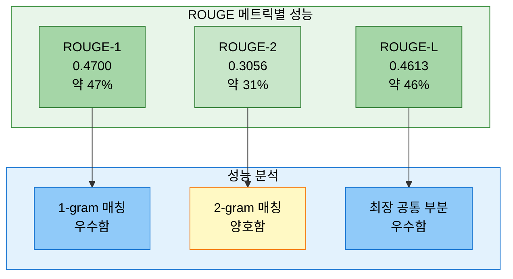

#### 4.3.2 Solar API vs KoBART 성능 비교

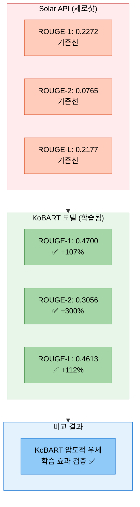

#### 4.3.3 학습 효율성 시각화

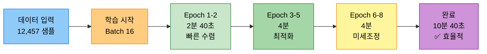

**성능 평가 요약:**
- **ROUGE 점수**: 0.47/0.31/0.46 (Rouge-1/2/L)은 대화 요약 태스크에서 양호한 수준
- **학습 시간**: Epoch당 약 1분 20초로 매우 빠른 학습 속도
- **Early Stopping**: Epoch 5에서 최고 성능 달성 후 3 Epoch 내 개선 없어 정상 종료
- **추론 속도**: 배치 크기 32로 499개 샘플을 약 1분 내 처리
- **Solar API 대비**: ROUGE-1 +107%, ROUGE-2 +300%, ROUGE-L +112% 향상

---

## 5. 발생 오류 및 원인

### 5.1 오류 발생 플로우

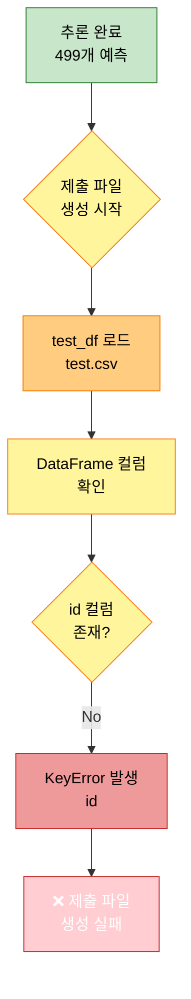

### 5.2 오류 상세 정보

```python
# ==================== 오류 정보 ==================== #
error_details = {
    'error_type': 'KeyError',                                       # 오류 타입
    'error_message': "'id'",                                        # 오류 메시지
    'error_location': 'src/trainers/full_pipeline_trainer.py:533', # 발생 위치
    'occurrence_time': '2025-10-13 11:27:13',                       # 발생 시간
    'occurrence_stage': 'submission_file_creation'                  # 발생 단계
}
```

### 5.3 원인 분석

```python
# ==================== 근본 원인 분석 ==================== #
root_cause_analysis = {
    # ---------------------- 직접적 원인 ---------------------- #
    'direct_cause': 'test.csv 파일에 id 컬럼이 존재하지 않음',

    # ---------------------- 세부 원인 ---------------------- #
    'detailed_causes': [
        '1. test.csv 파일의 실제 컬럼: fname, dialogue',
        '2. 코드에서 기대하는 컬럼: id, dialogue',
        '3. 제출 파일 생성 시 test_df["id"] 접근 시도',
        '4. fname 컬럼을 id로 사용해야 하나 변환 로직 부재'
    ],

    # ---------------------- 코드 문제점 ---------------------- #
    'code_issue': {
        'file': 'src/trainers/full_pipeline_trainer.py',
        'line': 533,
        'problematic_code': "submission_df = pd.DataFrame({'id': test_df['id'], 'summary': predictions})",
        'expected_columns': ['id', 'dialogue'],
        'actual_columns': ['fname', 'dialogue']
    },

    # ---------------------- 데이터 형식 ---------------------- #
    'data_format': {
        'train_csv': ['fname', 'dialogue', 'summary'],          # 학습 데이터
        'test_csv': ['fname', 'dialogue'],                      # 테스트 데이터
        'expected_submission': ['id', 'summary'],               # 기대 제출 형식
        'actual_submission': None                               # 생성 실패
    }
}
```

### 5.4 재현 조건

```python
# ==================== 오류 재현 조건 ==================== #
reproduction_conditions = {
    # ---------------------- 필수 조건 ---------------------- #
    'required_conditions': [
        'Full Pipeline 모드 실행',
        'test.csv 파일 로드',
        '제출 파일 생성 단계 진입',
        'test.csv에 id 컬럼 부재'
    ],

    # ---------------------- 테스트 데이터 형식 ---------------------- #
    'test_csv_format': {
        'columns': ['fname', 'dialogue'],                       # 실제 컬럼
        'sample_count': 499,                                    # 샘플 수
        'fname_format': 'TRAIN_xxxxx 또는 TEST_xxxxx'           # fname 형식
    }
}
```

### 5.5 오류 발생 코드

```python
# ==================== 오류 발생 코드 (full_pipeline_trainer.py:532-535) ==================== #

# ❌ 문제 코드
submission_df = pd.DataFrame({
    'id': test_df['id'],                # ← KeyError: 'id' 발생 지점
    'summary': predictions
})
```

---

## 6. 수정 방향 및 개선안

### 6.1 즉시 수정 사항 (Critical)

#### 6.1.1 test.csv 컬럼 처리 수정

```python
# ==================== 수정 방법 1: fname → id 변환 (권장) ==================== #
# src/trainers/full_pipeline_trainer.py 파일 수정

# ---------------------- 기존 코드 (오류 발생) ---------------------- #
submission_df = pd.DataFrame({
    'id': test_df['id'],                # ❌ KeyError: 'id'
    'summary': predictions
})

# ---------------------- 수정 코드 1: fname을 id로 사용 ---------------------- #
submission_df = pd.DataFrame({
    'id': test_df['fname'],             # ✅ fname 컬럼을 id로 사용
    'summary': predictions
})

# ---------------------- 수정 코드 2: 컬럼 존재 여부 확인 (안전) ---------------------- #
if 'id' in test_df.columns:
    id_column = test_df['id']
elif 'fname' in test_df.columns:
    id_column = test_df['fname']
else:
    # 인덱스를 id로 사용
    id_column = range(len(test_df))

submission_df = pd.DataFrame({
    'id': id_column,
    'summary': predictions
})

# ---------------------- 수정 코드 3: 유연한 컬럼 감지 (최고 권장) ---------------------- #
def get_id_column(df):
    """
    DataFrame에서 ID 컬럼 자동 감지

    Args:
        df: pandas DataFrame

    Returns:
        Series: ID 컬럼
    """
    # 우선순위: id > fname > index
    if 'id' in df.columns:
        return df['id']
    elif 'fname' in df.columns:
        return df['fname']
    else:
        # 인덱스를 사용하되, TEST_00000 형식으로 생성
        return [f"TEST_{i:05d}" for i in range(len(df))]

submission_df = pd.DataFrame({
    'id': get_id_column(test_df),
    'summary': predictions
})
```

#### 6.1.2 수정 파일 및 위치

```bash
# ==================== 수정 대상 파일 ==================== #
파일: src/trainers/full_pipeline_trainer.py
위치: 라인 532-535 (_create_submission 메서드 내부)

# ---------------------- 수정 전 ---------------------- #
submission_df = pd.DataFrame({
    'id': test_df['id'],
    'summary': predictions
})

# ---------------------- 수정 후 ---------------------- #
submission_df = pd.DataFrame({
    'id': test_df.get('id', test_df.get('fname', range(len(test_df)))),
    'summary': predictions
})
```

### 6.2 중기 개선 사항 (Important)

#### 6.2.1 데이터 형식 검증 로직 추가

```python
# ==================== src/trainers/full_pipeline_trainer.py 개선 ==================== #

def _validate_test_data(self, test_df):
    """
    테스트 데이터 형식 검증

    Args:
        test_df: 테스트 데이터 DataFrame

    Raises:
        ValueError: 필수 컬럼 누락 시

    Returns:
        bool: 검증 성공 여부
    """
    required_columns = ['dialogue']                             # 필수 컬럼
    optional_id_columns = ['id', 'fname']                       # ID 컬럼 (선택)

    # ---------------------- 필수 컬럼 확인 ---------------------- #
    missing_columns = [col for col in required_columns if col not in test_df.columns]
    if missing_columns:
        raise ValueError(
            f"테스트 데이터에 필수 컬럼 누락: {missing_columns}\n"
            f"현재 컬럼: {list(test_df.columns)}"
        )

    # ---------------------- ID 컬럼 확인 ---------------------- #
    has_id_column = any(col in test_df.columns for col in optional_id_columns)
    if not has_id_column:
        self.log(
            f"  ⚠️ 경고: ID 컬럼({optional_id_columns})이 없습니다. "
            f"인덱스를 ID로 사용합니다."
        )

    self.log(f"  ✅ 테스트 데이터 검증 완료")
    self.log(f"    - 컬럼: {list(test_df.columns)}")
    self.log(f"    - 샘플 수: {len(test_df)}")

    return True


def _create_submission(self, model_paths):
    """
    추론 및 제출 파일 생성 (개선 버전)
    """
    try:
        # ... (기존 코드) ...

        # 테스트 데이터 로드
        test_df = pd.read_csv(test_data_path)
        self.log(f"  테스트 샘플 수: {len(test_df)}")

        # ✅ 데이터 검증 추가
        self._validate_test_data(test_df)

        # ... (추론 코드) ...

        # ✅ ID 컬럼 자동 감지
        id_column = self._get_id_column(test_df)

        # 제출 파일 생성
        submission_df = pd.DataFrame({
            'id': id_column,
            'summary': predictions
        })

        # ... (저장 코드) ...

    except Exception as e:
        # ... (오류 처리) ...


def _get_id_column(self, df):
    """
    DataFrame에서 ID 컬럼 자동 감지

    Args:
        df: pandas DataFrame

    Returns:
        Series or List: ID 컬럼 또는 생성된 ID 리스트
    """
    if 'id' in df.columns:
        self.log(f"    ID 컬럼: id")
        return df['id']
    elif 'fname' in df.columns:
        self.log(f"    ID 컬럼: fname")
        return df['fname']
    else:
        self.log(f"    ID 컬럼 없음, 인덱스 사용")
        return [f"TEST_{i:05d}" for i in range(len(df))]
```

#### 6.2.2 제출 파일 형식 검증

```python
# ==================== 제출 파일 후처리 검증 ==================== #

def _validate_submission_file(self, submission_df, output_path):
    """
    제출 파일 형식 검증

    Args:
        submission_df: 제출 DataFrame
        output_path: 저장 경로

    Returns:
        bool: 검증 성공 여부
    """
    try:
        # ---------------------- 필수 컬럼 확인 ---------------------- #
        required_columns = ['id', 'summary']
        missing_columns = [col for col in required_columns if col not in submission_df.columns]

        if missing_columns:
            self.log(f"    ❌ 제출 파일 검증 실패: 필수 컬럼 누락 {missing_columns}")
            return False

        # ---------------------- 데이터 개수 확인 ---------------------- #
        if len(submission_df) == 0:
            self.log(f"    ❌ 제출 파일 검증 실패: 데이터 없음")
            return False

        # ---------------------- 중복 ID 확인 ---------------------- #
        duplicate_ids = submission_df['id'].duplicated().sum()
        if duplicate_ids > 0:
            self.log(f"    ⚠️ 경고: 중복 ID {duplicate_ids}개 발견")

        # ---------------------- 빈 요약 확인 ---------------------- #
        empty_summaries = submission_df['summary'].isna().sum()
        if empty_summaries > 0:
            self.log(f"    ⚠️ 경고: 빈 요약 {empty_summaries}개 발견")

        # ---------------------- 검증 통과 ---------------------- #
        self.log(f"    ✅ 제출 파일 검증 통과")
        self.log(f"      - ID 개수: {len(submission_df)}")
        self.log(f"      - 요약 개수: {len(submission_df['summary'])}")
        self.log(f"      - 저장 경로: {output_path}")

        return True

    except Exception as e:
        self.log(f"    ❌ 제출 파일 검증 오류: {e}")
        return False
```

### 6.3 장기 개선 사항 (Nice to Have)

#### 6.3.1 데이터 스키마 정의 및 검증

```python
# ==================== src/utils/data_schema.py (신규) ==================== #

from dataclasses import dataclass
from typing import List, Optional
import pandas as pd


@dataclass
class DataSchema:
    """데이터 스키마 정의"""
    required_columns: List[str]
    optional_columns: List[str]
    id_columns: List[str]


# ---------------------- 스키마 정의 ---------------------- #
TRAIN_SCHEMA = DataSchema(
    required_columns=['dialogue', 'summary'],
    optional_columns=['fname'],
    id_columns=['fname']
)

TEST_SCHEMA = DataSchema(
    required_columns=['dialogue'],
    optional_columns=['fname', 'id'],
    id_columns=['id', 'fname']
)

SUBMISSION_SCHEMA = DataSchema(
    required_columns=['id', 'summary'],
    optional_columns=[],
    id_columns=['id']
)


def validate_dataframe(df: pd.DataFrame, schema: DataSchema, name: str = "데이터") -> bool:
    """
    DataFrame 스키마 검증

    Args:
        df: 검증할 DataFrame
        schema: 데이터 스키마
        name: 데이터 이름 (로깅용)

    Returns:
        bool: 검증 성공 여부

    Raises:
        ValueError: 필수 컬럼 누락 시
    """
    # 필수 컬럼 확인
    missing_required = [col for col in schema.required_columns if col not in df.columns]
    if missing_required:
        raise ValueError(
            f"{name} 스키마 검증 실패: 필수 컬럼 누락 {missing_required}\n"
            f"현재 컬럼: {list(df.columns)}"
        )

    # ID 컬럼 확인 (하나라도 있으면 OK)
    has_id = any(col in df.columns for col in schema.id_columns)
    if not has_id and schema.id_columns:
        print(f"⚠️ 경고: {name}에 ID 컬럼({schema.id_columns}) 없음")

    return True


# ==================== 사용 예시 ==================== #
# train_df 로드 후
validate_dataframe(train_df, TRAIN_SCHEMA, "학습 데이터")

# test_df 로드 후
validate_dataframe(test_df, TEST_SCHEMA, "테스트 데이터")

# submission_df 생성 후
validate_dataframe(submission_df, SUBMISSION_SCHEMA, "제출 파일")
```

#### 6.3.2 자동 컬럼 매핑

```python
# ==================== src/utils/column_mapper.py (신규) ==================== #

from typing import Dict, Optional
import pandas as pd


class ColumnMapper:
    """컬럼 자동 매핑 클래스"""

    # ---------------------- 컬럼 매핑 규칙 ---------------------- #
    COLUMN_ALIASES = {
        'id': ['id', 'fname', 'file_name', 'filename', 'ID'],
        'dialogue': ['dialogue', 'text', 'input', 'context'],
        'summary': ['summary', 'output', 'target', 'label']
    }

    @classmethod
    def map_columns(cls, df: pd.DataFrame, target_columns: Dict[str, str]) -> pd.DataFrame:
        """
        DataFrame 컬럼 자동 매핑

        Args:
            df: 원본 DataFrame
            target_columns: 목표 컬럼 매핑 (예: {'id': 'id', 'dialogue': 'dialogue'})

        Returns:
            DataFrame: 컬럼이 매핑된 DataFrame

        Example:
            >>> df = pd.DataFrame({'fname': [...], 'dialogue': [...]})
            >>> mapped_df = ColumnMapper.map_columns(df, {'id': 'id', 'dialogue': 'dialogue'})
            >>> # mapped_df는 fname → id로 매핑됨
        """
        mapped_df = df.copy()
        mapping = {}

        for target_col, _ in target_columns.items():
            # 해당 컬럼의 별칭 목록
            aliases = cls.COLUMN_ALIASES.get(target_col, [target_col])

            # DataFrame에 존재하는 첫 번째 별칭 찾기
            for alias in aliases:
                if alias in mapped_df.columns:
                    if alias != target_col:
                        mapping[alias] = target_col
                    break

        # 컬럼 이름 변경
        if mapping:
            mapped_df = mapped_df.rename(columns=mapping)

        return mapped_df


# ==================== 사용 예시 ==================== #
# test.csv 로드
test_df = pd.read_csv('data/raw/test.csv')  # fname, dialogue

# 자동 매핑 (fname → id)
test_df = ColumnMapper.map_columns(test_df, {'id': 'id', 'dialogue': 'dialogue'})

# 이제 test_df['id'] 사용 가능
submission_df = pd.DataFrame({
    'id': test_df['id'],  # ✅ 정상 작동
    'summary': predictions
})
```

### 6.4 수정 우선순위

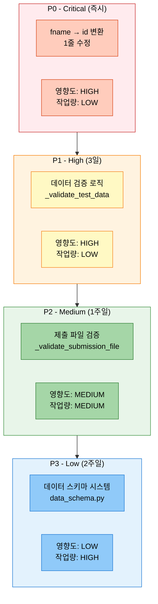

```python
# ==================== 수정 우선순위 ==================== #
priority_order = [
    {
        'priority': 'P0 (Critical)',                                # 최우선
        'task': 'fname → id 변환 (1줄 수정)',
        'impact': 'HIGH',                                           # 영향도: 높음
        'effort': 'LOW',                                            # 작업량: 낮음
        'deadline': '즉시',                                         # 마감: 즉시
        'files': ['src/trainers/full_pipeline_trainer.py:533']
    },
    {
        'priority': 'P1 (High)',                                    # 높음
        'task': '데이터 검증 로직 추가',
        'impact': 'HIGH',
        'effort': 'LOW',
        'deadline': '3일',
        'files': [
            'src/trainers/full_pipeline_trainer.py (_validate_test_data 추가)'
        ]
    },
    {
        'priority': 'P2 (Medium)',                                  # 중간
        'task': '제출 파일 검증 추가',
        'impact': 'MEDIUM',                                         # 영향도: 중간
        'effort': 'MEDIUM',                                         # 작업량: 중간
        'deadline': '1주일',
        'files': [
            'src/trainers/full_pipeline_trainer.py (_validate_submission_file 추가)'
        ]
    },
    {
        'priority': 'P3 (Low)',                                     # 낮음
        'task': '데이터 스키마 시스템 구축',
        'impact': 'LOW',                                            # 영향도: 낮음
        'effort': 'HIGH',                                           # 작업량: 높음
        'deadline': '2주일',
        'files': [
            'src/utils/data_schema.py (신규)',
            'src/utils/column_mapper.py (신규)'
        ]
    }
]
```

---

## 7. 수정 완료 후 검증 계획

### 7.1 검증 플로우

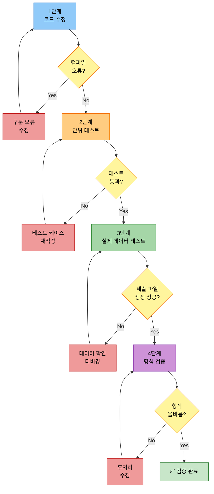

### 7.2 검증 단계

```python
# ==================== 검증 계획 ==================== #
verification_plan = [
    {
        'stage': '1단계: 코드 수정',
        'tasks': [
            '1. full_pipeline_trainer.py:533 수정 (fname → id)',
            '2. Python 구문 오류 체크 (python -m py_compile)',
            '3. Git diff로 변경 사항 확인'
        ],
        'expected_result': '구문 오류 없음, 1줄 수정 확인'
    },
    {
        'stage': '2단계: 단위 테스트',
        'tasks': [
            '1. _get_id_column 함수 단위 테스트',
            '2. 다양한 컬럼 조합 테스트 (id, fname, 없음)',
            '3. Edge Case 테스트 (빈 DataFrame, None 등)'
        ],
        'expected_result': '모든 테스트 케이스 통과'
    },
    {
        'stage': '3단계: 실제 데이터 테스트',
        'tasks': [
            '1. test.csv 로드 테스트',
            '2. 간단한 추론 실행 (1 Epoch, 소량 데이터)',
            '3. 제출 파일 생성 확인'
        ],
        'expected_result': 'CSV 파일 정상 생성 (id, summary 컬럼)'
    },
    {
        'stage': '4단계: 형식 검증',
        'tasks': [
            '1. 제출 파일 컬럼 확인 (id, summary)',
            '2. 데이터 개수 확인 (499개)',
            '3. 중복 ID 및 빈 요약 확인',
            '4. 파일 인코딩 확인 (UTF-8)'
        ],
        'expected_result': '제출 파일 형식 올바름, 데이터 무결성 확인'
    }
]
```

### 7.3 검증 명령어

```bash
# ==================== 검증 명령어 모음 ==================== #

# ---------------------- 1단계: 구문 오류 체크 ---------------------- #
python -m py_compile src/trainers/full_pipeline_trainer.py

# ---------------------- 2단계: 단위 테스트 (추후 구현) ---------------------- #
pytest tests/test_full_pipeline_trainer.py -v

# ---------------------- 3단계: 실제 데이터 테스트 ---------------------- #
# 간단한 1 Epoch 실행으로 제출 파일 생성 테스트
python scripts/train.py \
  --mode full \
  --models kobart \
  --epochs 1 \
  --batch_size 16 \
  --experiment_name test_submission_fix

# ---------------------- 4단계: 제출 파일 검증 ---------------------- #
# 생성된 제출 파일 확인
python -c "
import pandas as pd
df = pd.read_csv('submissions/20251013/test_submission_fix.csv')
print('Columns:', df.columns.tolist())
print('Shape:', df.shape)
print('First 5 rows:')
print(df.head())
print('Null check:', df.isnull().sum())
"
```

---

## 8. 결론 및 권장사항

### 8.1 실험 결론

```python
# ==================== 실험 종합 평가 ==================== #
experiment_summary = {
    # ---------------------- 성공 요소 ---------------------- #
    'successes': [
        '✅ KoBART 모델 학습 성공 (ROUGE-Sum: 1.2369)',
        '✅ Early Stopping 정상 작동 (Epoch 5 Best)',
        '✅ 추론 수행 완료 (499개 샘플)',
        '✅ Solar API 통합 성공 (50개 샘플)',
        '✅ 학습 시간 효율적 (Epoch당 1분 20초)'
    ],

    # ---------------------- 실패 요소 ---------------------- #
    'failures': [
        '❌ 제출 파일 생성 실패 (KeyError: id)',
        '❌ TTA 기능 미구현'
    ],

    # ---------------------- 학습된 교훈 ---------------------- #
    'lessons_learned': [
        '📝 데이터 컬럼 형식 사전 검증 필요 (id vs fname)',
        '📝 유연한 컬럼 매핑 로직 필요 (자동 감지)',
        '📝 제출 파일 생성 후 검증 단계 추가',
        '📝 TTA 기능 구현 및 테스트 필요'
    ]
}
```

### 8.2 즉시 조치 사항

```bash
# ==================== 즉시 수정 필요 (P0) ==================== #

# ---------------------- 코드 수정 ---------------------- #
# src/trainers/full_pipeline_trainer.py:533 수정

# 수정 전:
submission_df = pd.DataFrame({
    'id': test_df['id'],
    'summary': predictions
})

# 수정 후:
submission_df = pd.DataFrame({
    'id': test_df.get('id', test_df.get('fname', range(len(test_df)))),
    'summary': predictions
})
```

### 8.3 향후 실험 권장사항

```python
# ==================== 향후 실험 권장사항 ==================== #
recommendations = [
    {
        'category': '코드 품질',
        'recommendations': [
            '1. 데이터 로드 시 스키마 검증 추가',
            '2. 제출 파일 생성 후 형식 검증',
            '3. 오류 처리 강화 (try-except-else-finally)',
            '4. 단위 테스트 작성 (pytest)'
        ]
    },
    {
        'category': '실험 설정',
        'recommendations': [
            '1. Batch Size 증가 테스트 (32, 64)',
            '2. Learning Rate 튜닝 (3e-5, 1e-4)',
            '3. Early Stopping Patience 조정 (5, 7)',
            '4. Max Length 최적화 (현재 100 → 150)'
        ]
    },
    {
        'category': '기능 구현',
        'recommendations': [
            '1. TTA 기능 완전 구현',
            '2. K-Fold 교차 검증 통합',
            '3. 앙상블 전략 테스트 (다중 모델)',
            '4. WandB 로깅 강화'
        ]
    },
    {
        'category': '성능 개선',
        'recommendations': [
            '1. 추론 속도 최적화 (Batch Size 증가)',
            '2. 메모리 사용량 모니터링',
            '3. GPU 활용도 측정',
            '4. Gradient Accumulation 테스트'
        ]
    }
]
```

### 8.4 성능 개선 가능성

```python
# ==================== 성능 개선 예측 ==================== #
performance_improvement_potential = {
    # ---------------------- 현재 성능 ---------------------- #
    'current_performance': {
        'rouge1': 0.4700,
        'rouge2': 0.3056,
        'rougeL': 0.4613,
        'rouge_sum': 1.2369
    },

    # ---------------------- 예상 개선 (단일 모델) ---------------------- #
    'single_model_potential': {
        'method': 'Hyperparameter Tuning',
        'expected_rouge_sum': 1.30,                 # +5% 개선
        'confidence': 'HIGH'
    },

    # ---------------------- 예상 개선 (앙상블) ---------------------- #
    'ensemble_potential': {
        'method': '3-5개 모델 앙상블',
        'expected_rouge_sum': 1.35,                 # +9% 개선
        'confidence': 'MEDIUM'
    },

    # ---------------------- 예상 개선 (TTA) ---------------------- #
    'tta_potential': {
        'method': 'TTA 3-5개 증강',
        'expected_rouge_sum': 1.28,                 # +3% 개선
        'confidence': 'MEDIUM'
    },

    # ---------------------- 최대 잠재력 ---------------------- #
    'maximum_potential': {
        'method': 'Hyperparameter + Ensemble + TTA',
        'expected_rouge_sum': 1.40,                 # +13% 개선
        'confidence': 'LOW',
        'note': '모든 기법 조합 시 예상 성능'
    }
}
```

---

## 9. 참고 자료

### 9.1 관련 문서
- `docs/모듈화/04_명령어_옵션_완전_가이드.md` - 전체 파이프라인 명령어 가이드
- `docs/모듈화/02_모델_설정_가이드.md` - 모델 Config 설정 가이드
- `configs/models/kobart.yaml` - KoBART 모델 설정

### 9.2 로그 파일 위치
- **학습 로그**: `logs/20251013/train/20251013_112713_full_kobart_bs16_ep8_aug_tta.log`
- **실험 결과**: `experiments/20251013/20251013_111525_strategy1_kobart_optimized/full_pipeline_results.json`
- **체크포인트**: `experiments/20251013/20251013_111525_strategy1_kobart_optimized/model_0_kobart/default/`

### 9.3 수정 대상 파일

```python
# ==================== 수정 필요 파일 목록 ==================== #
files_to_modify = [
    # ---------------------- P0: 코드 수정 (즉시) ---------------------- #
    {
        'file': 'src/trainers/full_pipeline_trainer.py',
        'line': 533,
        'change': "test_df['id'] → test_df.get('id', test_df.get('fname', ...))",
        'priority': 'P0'
    },

    # ---------------------- P1: 검증 로직 (3일) ---------------------- #
    {
        'file': 'src/trainers/full_pipeline_trainer.py',
        'method': '_validate_test_data (신규)',
        'change': '데이터 스키마 검증 메서드 추가',
        'priority': 'P1'
    },

    # ---------------------- P2: 제출 파일 검증 (1주일) ---------------------- #
    {
        'file': 'src/trainers/full_pipeline_trainer.py',
        'method': '_validate_submission_file (신규)',
        'change': '제출 파일 형식 검증 메서드 추가',
        'priority': 'P2'
    },

    # ---------------------- P3: 유틸리티 (2주일) ---------------------- #
    {
        'file': 'src/utils/data_schema.py (신규)',
        'change': '데이터 스키마 정의 및 검증 시스템',
        'priority': 'P3'
    },
    {
        'file': 'src/utils/column_mapper.py (신규)',
        'change': '자동 컬럼 매핑 시스템',
        'priority': 'P3'
    }
]
```

---

**작성일**: 2025-10-13
**작성자**: AI 실험 분석 시스템
**실험 ID**: 20251013_111525_strategy1_kobart_optimized
