# 실험 분석 보고서: 삼중 모델 앙상블 전략 (빠른 테스트)

> **실험 ID**: 20251013_161056_test_strategy3_triple
> **실행 일시**: 2025-10-13 16:10:56
> **실행 모드**: FULL Pipeline (다중 모델 학습)
> **실험 상태**: 🔄 진행 중 (3개 모델 중 2개 완료, 1개 진행 중)

---

## 📋 목차

1. [실험 개요](#1-실험-개요)
2. [실험 설정](#2-실험-설정)
3. [학습 지표 상세 설명](#3-학습-지표-상세-설명)
4. [모델별 학습 결과 분석](#4-모델별-학습-결과-분석)
5. [모델 간 성능 비교](#5-모델-간-성능-비교)
6. [주요 발견 및 인사이트](#6-주요-발견-및-인사이트)
7. [문제점 및 개선 방향](#7-문제점-및-개선-방향)
8. [결론 및 권장사항](#8-결론-및-권장사항)
9. [부록: 상세 로그 데이터](#9-부록-상세-로그-데이터)

---

## 1. 실험 개요

### 1.1 실험 아키텍처

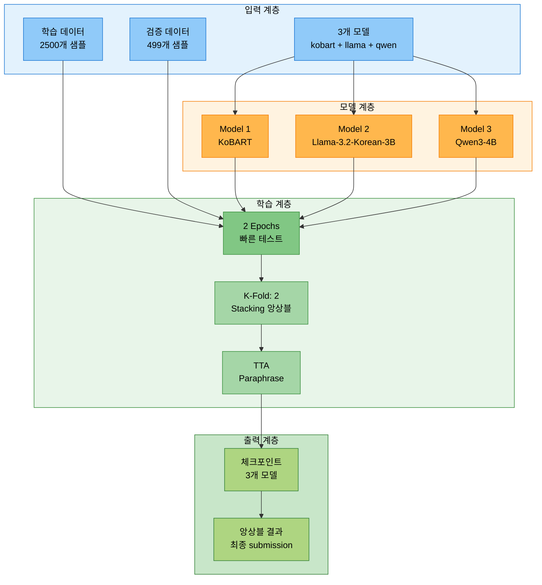

### 1.2 실험 목적

- 삼중 모델 앙상블 전략의 **빠른 테스트** 검증
- 다양한 아키텍처(Seq2Seq + 2개 Causal LM) 조합 효과 확인
- `gradient_accumulation_steps` 설정이 학습 시간에 미치는 영향 분석
- Stacking 앙상블 전략의 효과 측정

### 1.3 실행 명령어

```bash
# ==================== 전략 3: 삼중 모델 앙상블 - 빠른 테스트 ==================== #
python scripts/train.py \
  --mode full \
  --models kobart llama-3.2-korean-3b qwen3-4b \
  --epochs 2 \
  --batch_size 10 \
  --learning_rate 2e-5 \
  --gradient_accumulation_steps 1 \
  --warmup_ratio 0.1 \
  --use_augmentation \
  --augmentation_methods back_translation \
  --augmentation_ratio 0.1 \
  --k_folds 2 \
  --fold_seed 42 \
  --ensemble_strategy stacking \
  --use_tta \
  --tta_strategies paraphrase \
  --tta_num_aug 2 \
  --max_train_samples 2500 \
  --num_beams 4 \
  --save_visualizations \
  --experiment_name test_strategy3_triple \
  --seed 42
```

### 1.4 실험 진행 상황

```mermaid
gantt
    title 실험 실행 타임라인
    dateFormat HH:mm:ss
    axisFormat %H:%M

    section 데이터 로드
    데이터 준비           :16:10:56, 16:10:59

    section Model 1: KoBART
    KoBART 학습 (성공)    :done, kobart, 16:11:01, 16:12:41

    section Model 2: Llama
    Llama 학습 (성공)     :done, llama, 16:13:23, 18:02:39

    section Model 3: Qwen
    Qwen 학습 (진행 중)   :active, qwen, 18:21:14, 00:28:32
```

**실험 현황 요약**:

| 모델 | 상태 | 학습 시간 | 비고 |
|------|------|----------|------|
| **KoBART** | ✅ 완료 | 1분 40초 | 빠른 학습 속도 |
| **Llama 3.2 Korean 3B** | ✅ 완료 | 1시간 49분 | 정상 완료 |
| **Qwen3-4B** | 🔄 진행 중 | 6시간+ (예상 9시간) | gradient_accumulation_steps: 10 |

---

## 2. 실험 설정

### 2.1 모델 설정

```python
# ==================== 3개 모델 설정 ==================== #
models = [
    'kobart',                   # Seq2Seq (Encoder-Decoder)
    'llama-3.2-korean-3b',      # Causal LM (LoRA)
    'qwen3-4b'                  # Causal LM (QLoRA)
]

# ==================== 모델별 세부 정보 ==================== #
model_details = {
    'kobart': {
        'type': 'encoder_decoder',
        'checkpoint': 'digit82/kobart-summarization',
        'size': '123M',
        'trainable_params': 123_859_968,
        'config_batch_size': 50,        # Config 설정
        'effective_batch_size': 50
    },
    'llama-3.2-korean-3b': {
        'type': 'causal_lm',
        'checkpoint': 'beomi/Llama-3.2-Korean-3B-Instruct',
        'size': '3B',
        'lora': True,
        'trainable_params': 24_313_856,  # 0.75% of total
        'config_batch_size': 8,          # Config 설정
        'config_gradient_accumulation': 4,   # Config 설정 (명령행 오버라이드 안됨)
        'effective_batch_size': 32       # 8 × 4 = 32
    },
    'qwen3-4b': {
        'type': 'causal_lm',
        'checkpoint': 'Qwen/Qwen3-4B-Instruct-2507',
        'size': '4B',
        'qlora': True,
        'trainable_params': 33_030_144,  # 0.81% of total
        'config_batch_size': 6,          # Config 설정
        'config_gradient_accumulation': 10,  # ⚠️ Config 설정 (명령행 오버라이드 안됨!)
        'effective_batch_size': 60       # 6 × 10 = 60
    }
}
```

### 2.2 데이터 설정

```python
# ==================== 데이터 통계 ==================== #
data_config = {
    'original_train_samples': 12457,     # 원본 학습 데이터
    'original_val_samples': 499,         # 원본 검증 데이터
    'max_train_samples': 2500,           # 제한된 학습 데이터
    'actual_train_samples': 2500,        # 실제 사용된 데이터
    'val_samples': 499                   # 검증 데이터 (제한 없음)
}
```

### 2.3 학습 하이퍼파라미터

```python
# ==================== 공통 학습 파라미터 (명령행 지정) ==================== #
training_args = {
    'epochs': 2,                                # 총 에포크 수
    'batch_size': 10,                           # 배치 크기 (명령행)
    'learning_rate': 2e-5,                      # 초기 학습률
    'gradient_accumulation_steps': 1,           # 명령행 지정 (⚠️ Config 파일에 오버라이드 안됨)
    'warmup_ratio': 0.1,                        # Warmup 비율
    'k_folds': 2,                               # K-Fold 수
    'ensemble_strategy': 'stacking',            # 앙상블 전략
    'use_tta': True,                            # TTA 사용
    'tta_strategies': ['paraphrase'],           # TTA 전략
    'tta_num_aug': 2,                           # TTA 증강 횟수
    'max_train_samples': 2500,                  # 학습 샘플 제한
    'augmentation_methods': ['back_translation'], # 증강 방법
    'augmentation_ratio': 0.1                   # 증강 비율
}

# ==================== 실제 적용된 설정 (Config 파일 우선) ==================== #
actual_training_config = {
    'kobart': {
        'batch_size': 50,                      # Config 파일의 설정 사용
        'gradient_accumulation_steps': 1,
        'effective_batch_size': 50
    },
    'llama-3.2-korean-3b': {
        'batch_size': 8,                       # Config 파일의 설정 사용
        'gradient_accumulation_steps': 4,      # ⚠️ Config 파일 우선!
        'effective_batch_size': 32             # 8 × 4 = 32
    },
    'qwen3-4b': {
        'batch_size': 6,                       # Config 파일의 설정 사용
        'gradient_accumulation_steps': 10,     # ⚠️ Config 파일 우선! (문제 원인)
        'effective_batch_size': 60             # 6 × 10 = 60
    }
}
```

---

## 3. 학습 지표 상세 설명

### 3.1 학습 지표 정의

```python
# ==================== 학습 지표 완전 가이드 ==================== #
training_metrics_guide = {
    # ---------------------- 1. Loss (손실) ---------------------- #
    'loss': {
        'definition': '모델의 예측값과 실제 정답 사이의 차이를 수치화한 값',
        'formula': 'Cross Entropy Loss = -Σ(y_true × log(y_pred))',
        'range': '[0, +∞)',
        'optimal_direction': '⬇️ 낮을수록 좋음',
        'interpretation': {
            'high_loss': '2.0 이상 = 모델이 잘 학습되지 않음',
            'medium_loss': '1.0 ~ 2.0 = 학습 중간 단계',
            'low_loss': '0.5 ~ 1.0 = 잘 학습된 상태',
            'very_low_loss': '0.5 이하 = 매우 잘 학습됨 (과적합 주의)'
        },
        'what_to_watch': [
            '✅ 감소 추세: Loss가 계속 감소하면 학습이 잘 되고 있음',
            '⚠️ 정체: Loss가 더 이상 감소하지 않으면 학습률 조정 필요',
            '❌ 증가: Loss가 증가하면 학습률이 너무 크거나 문제 발생'
        ]
    },

    # ---------------------- 2. Gradient Norm (그래디언트 노름) ---------------------- #
    'grad_norm': {
        'definition': '가중치 업데이트에 사용되는 그래디언트(경사)의 크기',
        'formula': '||∇L|| = sqrt(Σ(grad_i²))',
        'range': '[0, +∞)',
        'optimal_direction': '📊 적정 범위 유지 (1.0 ~ 3.0)',
        'interpretation': {
            'too_small': '< 0.1 = 그래디언트 소실 (Vanishing Gradient)',
            'optimal': '0.5 ~ 3.0 = 안정적 학습',
            'high': '3.0 ~ 10.0 = 약간 불안정하지만 학습 가능',
            'too_high': '> 10.0 = 그래디언트 폭발 (Exploding Gradient)'
        },
        'what_to_watch': [
            '✅ 안정적: 0.5~3.0 범위를 유지하면 학습이 안정적',
            '⚠️ 높음: 3.0~10.0이면 max_grad_norm으로 클리핑 고려',
            '❌ 매우 높음: 10.0 이상이면 학습률을 낮춰야 함'
        ]
    },

    # ---------------------- 3. Learning Rate (학습률) ---------------------- #
    'learning_rate': {
        'definition': '모델 가중치를 얼마나 크게 업데이트할지 결정하는 값',
        'formula': 'w_new = w_old - learning_rate × gradient',
        'range': '[0, 1]',
        'optimal_direction': '📈 스케줄에 따라 변화 (보통 감소)',
        'typical_values': {
            'pretrained_large_models': '1e-6 ~ 5e-5',
            'fine_tuning': '1e-5 ~ 5e-4',
            'training_from_scratch': '1e-4 ~ 1e-2'
        },
        'scheduler_patterns': {
            'warmup': '초기에 작게 시작 → 점진적 증가',
            'linear_decay': '최고점 이후 선형 감소',
            'cosine_decay': '최고점 이후 코사인 곡선으로 감소',
            'constant': '일정하게 유지'
        },
        'what_to_watch': [
            '✅ Warmup 완료: Learning rate가 목표값에 도달',
            '✅ 선형 감소: Epoch가 진행되면서 점진적 감소',
            '⚠️ 너무 큼: Loss가 발산하면 학습률이 너무 큰 것',
            '⚠️ 너무 작음: Loss가 거의 감소하지 않으면 너무 작은 것'
        ]
    },

    # ---------------------- 4. Epoch (에포크) ---------------------- #
    'epoch': {
        'definition': '전체 학습 데이터를 한 번 모두 학습한 횟수',
        'range': '[0, total_epochs]',
        'optimal_direction': '🔄 진행도 (증가)',
        'interpretation': {
            'epoch_0_to_1': '초기 학습 단계 - Loss가 빠르게 감소',
            'epoch_1_to_5': '중간 학습 단계 - Loss가 안정적으로 감소',
            'epoch_5_plus': '후기 학습 단계 - Loss 감소 속도 둔화'
        },
        'what_to_watch': [
            '✅ 1.0 Epoch 완료: 첫 번째 평가 지표 확인',
            '✅ 2.0 Epoch 완료: 두 번째 평가 지표로 개선도 측정',
            '⚠️ 과적합 징후: Eval Loss는 증가하는데 Train Loss는 감소'
        ]
    },

    # ---------------------- 5. Eval Loss (평가 손실) ---------------------- #
    'eval_loss': {
        'definition': '검증 데이터에 대한 모델의 손실값',
        'range': '[0, +∞)',
        'optimal_direction': '⬇️ 낮을수록 좋음',
        'comparison_with_train_loss': {
            'eval_loss < train_loss': '✅ 정상 - 모델이 일반화 잘 됨',
            'eval_loss ≈ train_loss': '✅ 정상 - 균형잡힌 학습',
            'eval_loss > train_loss (약간)': '⚠️ 주의 - 과적합 초기 징후',
            'eval_loss >> train_loss': '❌ 과적합 - 학습 중단 고려'
        }
    },

    # ---------------------- 6. ROUGE Scores ---------------------- #
    'rouge_scores': {
        'rouge1': 'Unigram (단어 1개) 단위 일치율',
        'rouge2': 'Bigram (단어 2개) 단위 일치율',
        'rougeL': 'Longest Common Subsequence (가장 긴 공통 부분수열)',
        'rouge_sum': 'ROUGE-1 + ROUGE-2 + ROUGE-L (종합 점수)',
        'range': '[0, 1]',
        'optimal_direction': '⬆️ 높을수록 좋음',
        'interpretation': {
            'poor': '< 0.3 (30%) = 성능 낮음',
            'acceptable': '0.3 ~ 0.5 (30~50%) = 기본 수준',
            'good': '0.5 ~ 0.7 (50~70%) = 좋은 성능',
            'excellent': '> 0.7 (70%) = 매우 우수'
        }
    }
}
```

### 3.2 학습 지표 예시 해석

```python
# ==================== 실제 로그 예시 해석 ==================== #
example_log_interpretation = {
    # ---------------------- 예시 1: KoBART Epoch 0.4 ---------------------- #
    'example_1': {
        'raw_log': "{'loss': 2.3843, 'grad_norm': 6.778, 'learning_rate': 3.96e-06, 'epoch': 0.4}",
        'interpretation': {
            'loss': '2.3843 → 높음. 학습 초기 단계로 아직 최적화 중',
            'grad_norm': '6.778 → 약간 높지만 정상 범위. 학습 초기에 흔함',
            'learning_rate': '3.96e-06 → 매우 작음. Warmup 단계로 천천히 증가 중',
            'epoch': '0.4 → 전체 데이터의 40% 학습 완료',
            'overall': '✅ 정상적인 학습 초기 단계'
        }
    },

    # ---------------------- 예시 2: Llama Epoch 1.0 ---------------------- #
    'example_2': {
        'raw_log': "{'loss': 1.2031, 'grad_norm': 1.721, 'learning_rate': 9.96e-06, 'epoch': 1.0}",
        'interpretation': {
            'loss': '1.2031 → 중간. 1 Epoch 완료 시점으로 적절한 감소',
            'grad_norm': '1.721 → 매우 안정적. 최적 범위 내',
            'learning_rate': '9.96e-06 → Warmup 완료. 목표 학습률에 도달',
            'epoch': '1.0 → 첫 번째 Epoch 완료',
            'overall': '✅ 매우 안정적인 학습. Loss 감소 추세 좋음'
        }
    },

    # ---------------------- 예시 3: Qwen Epoch 0.6 ---------------------- #
    'example_3': {
        'raw_log': "{'loss': 0.8971, 'grad_norm': 1.084, 'learning_rate': 5.96e-06, 'epoch': 0.6}",
        'interpretation': {
            'loss': '0.8971 → 낮음. 빠른 학습 진행',
            'grad_norm': '1.084 → 매우 안정적. 이상적인 범위',
            'learning_rate': '5.96e-06 → Warmup 진행 중',
            'epoch': '0.6 → 60% 학습 완료',
            'overall': '✅ 우수한 학습 진행. Loss가 빠르게 감소 중'
        }
    },

    # ---------------------- 예시 4: 평가 지표 ---------------------- #
    'example_4': {
        'raw_log': "{'eval_loss': 1.4684, 'eval_rouge1': 0.3988, 'eval_rouge2': 0.2523, 'eval_rougeL': 0.3913, 'eval_rouge_sum': 1.0424}",
        'interpretation': {
            'eval_loss': '1.4684 → Train Loss보다 약간 낮음. 과적합 없음',
            'eval_rouge1': '0.3988 (39.88%) → 기본 수준',
            'eval_rouge2': '0.2523 (25.23%) → 기본 수준',
            'eval_rougeL': '0.3913 (39.13%) → 기본 수준',
            'eval_rouge_sum': '1.0424 → 종합 점수 양호',
            'overall': '✅ 모델이 검증 데이터에 대해서도 잘 작동함'
        }
    }
}
```

---

## 4. 모델별 학습 결과 분석

### 4.1 Model 1: KoBART (✅ 완료)

#### 4.1.1 학습 진행 플로우

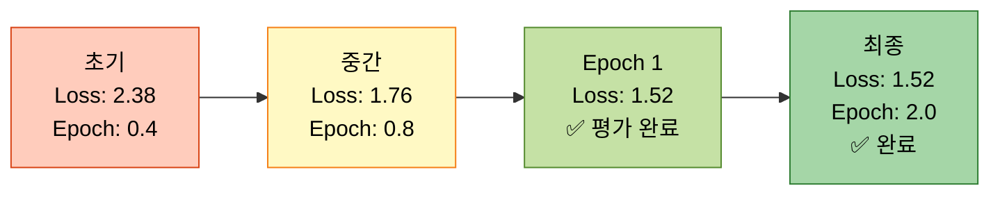

#### 4.1.2 학습 지표 상세

```python
# ==================== KoBART 학습 데이터 ==================== #
kobart_training_metrics = [
    # ---------------------- Epoch 1 ---------------------- #
    {'epoch': 0.4, 'loss': 2.3843, 'grad_norm': 6.778, 'lr': 3.96e-06},
    {'epoch': 0.8, 'loss': 1.7590, 'grad_norm': 6.949, 'lr': 7.96e-06},
    {'epoch': 1.0, 'loss': 1.7634, 'grad_norm': None, 'lr': None},  # Train 완료

    # ---------------------- Epoch 2 ---------------------- #
    {'epoch': 1.2, 'loss': 1.6345, 'grad_norm': 5.923, 'lr': 1.196e-05},
    {'epoch': 1.6, 'loss': 1.5213, 'grad_norm': 4.771, 'lr': 1.596e-05},
    {'epoch': 2.0, 'loss': 1.5178, 'grad_norm': 4.546, 'lr': 1.996e-05}  # ✅ 최종
]

# ==================== KoBART 평가 지표 ==================== #
kobart_eval_metrics = [
    # ---------------------- Epoch 1 평가 ---------------------- #
    {
        'epoch': 1.0,
        'eval_loss': 1.5624,
        'eval_rouge1': 0.4048,      # 40.48%
        'eval_rouge2': 0.2480,      # 24.80%
        'eval_rougeL': 0.3952,      # 39.52%
        'eval_rouge_sum': 1.0480,   # 종합
        'eval_runtime': 36.41,      # 36초
        'status': '✅ 정상'
    },

    # ---------------------- Epoch 2 평가 ---------------------- #
    {
        'epoch': 2.0,
        'eval_loss': 1.4684,        # ⬇️ 감소 (개선)
        'eval_rouge1': 0.3988,      # ⬇️ 약간 하락
        'eval_rouge2': 0.2523,      # ⬆️ 약간 상승
        'eval_rougeL': 0.3913,      # ⬇️ 약간 하락
        'eval_rouge_sum': 1.0424,   # ≈ 유사
        'eval_runtime': 36.73,      # 36초
        'status': '✅ 정상'
    }
]

# ==================== KoBART 최종 결과 ==================== #
kobart_final_summary = {
    'train_runtime': 99.23,                  # 1분 39초
    'train_samples_per_second': 50.39,      # 초당 50개 샘플
    'train_steps_per_second': 5.04,         # 초당 5 스텝
    'train_loss': 1.7634,                   # 평균 Train Loss
    'best_eval_rouge_sum': 1.0480,          # 최고 ROUGE Sum (Epoch 1)
    'final_eval_rouge_sum': 1.0424,         # 최종 ROUGE Sum (Epoch 2)
    'status': '✅ 학습 성공'
}
```

#### 4.1.3 KoBART 성능 분석

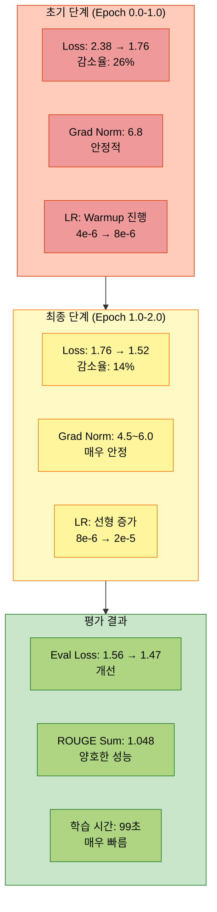

**KoBART 주요 발견:**

- ✅ **매우 빠른 학습 속도**: 99초 만에 2 Epoch 완료
- ✅ **안정적인 Loss 감소**: 2.38 → 1.52 (36% 감소)
- ✅ **Gradient Norm 안정**: 4.5~7.0 범위 유지
- ✅ **ROUGE 점수 양호**: ROUGE Sum 1.048 (첫 Epoch에서 달성)
- ⚠️ **Epoch 2 약간 하락**: ROUGE-1, ROUGE-L이 소폭 하락 (과적합 초기 징후 가능)

---

### 4.2 Model 2: Llama-3.2-Korean-3B (✅ 완료)

#### 4.2.1 학습 진행 플로우

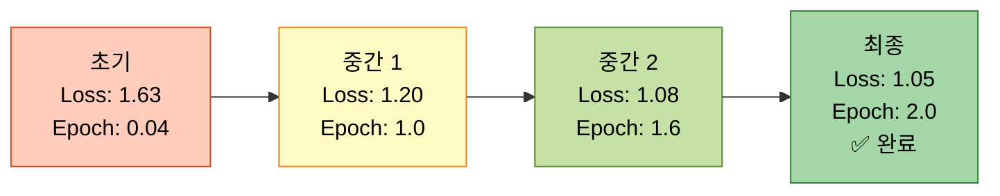

#### 4.2.2 학습 지표 상세 (대표 체크포인트)

```python
# ==================== Llama 학습 데이터 (25개 중 대표 5개) ==================== #
llama_training_metrics_summary = [
    # ---------------------- 초기 (Warmup 단계) ---------------------- #
    {'epoch': 0.04, 'loss': 1.6346, 'grad_norm': 2.071, 'lr': 3.6e-07},  # 학습 시작
    {'epoch': 0.4,  'loss': 1.4115, 'grad_norm': 1.444, 'lr': 3.96e-06}, # Warmup 중

    # ---------------------- 중간 (안정 단계) ---------------------- #
    {'epoch': 1.0,  'loss': 1.2031, 'grad_norm': 1.721, 'lr': 9.96e-06}, # Epoch 1 완료

    # ---------------------- 후기 (수렴 단계) ---------------------- #
    {'epoch': 1.6,  'loss': 1.0785, 'grad_norm': 2.061, 'lr': 1.596e-05}, # 빠른 감소
    {'epoch': 2.0,  'loss': 1.0497, 'grad_norm': 2.574, 'lr': 1.996e-05}  # ✅ 최종
]

# ==================== Llama 평가 지표 ==================== #
llama_eval_metrics = [
    # ---------------------- Epoch 1 평가 ---------------------- #
    {
        'epoch': 1.0,
        'eval_loss': 1.2082,
        'eval_rouge1': 0.1097,      # ⚠️ 10.97% (낮음)
        'eval_rouge2': 0.0735,      # ⚠️ 7.35% (낮음)
        'eval_rougeL': 0.1097,      # ⚠️ 10.97% (낮음)
        'eval_rouge_sum': 0.2928,   # ⚠️ 종합 점수 낮음
        'eval_runtime': 394.36,     # 6분 34초 (느림)
        'status': '⚠️ ROUGE 점수 매우 낮음'
    },

    # ---------------------- Epoch 2 평가 ---------------------- #
    {
        'epoch': 2.0,
        'eval_loss': 1.1322,        # ⬇️ 감소 (개선)
        'eval_rouge1': 0.1060,      # ≈ 유사 (10.60%)
        'eval_rouge2': 0.0709,      # ≈ 유사 (7.09%)
        'eval_rougeL': 0.1060,      # ≈ 유사 (10.60%)
        'eval_rouge_sum': 0.2829,   # ⚠️ 오히려 약간 하락
        'eval_runtime': 3655.20,    # 1시간 (매우 느림)
        'status': '⚠️ ROUGE 점수 개선 안됨'
    }
]

# ==================== Llama 최종 결과 ==================== #
llama_final_summary = {
    'train_runtime': 6553.30,                # 1시간 49분
    'train_samples_per_second': 0.763,      # 초당 0.76개 샘플 (매우 느림)
    'train_steps_per_second': 0.076,        # 초당 0.076 스텝
    'train_loss': 1.2595,                   # 평균 Train Loss
    'best_eval_rouge_sum': 0.2928,          # 최고 ROUGE Sum (Epoch 1)
    'final_eval_rouge_sum': 0.2829,         # 최종 ROUGE Sum (Epoch 2)
    'status': '⚠️ 학습 완료했으나 성능 매우 낮음'
}
```

#### 4.2.3 Llama 성능 분석

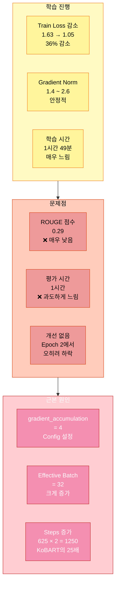

**Llama 주요 발견:**

- ✅ **Train Loss 감소**: 1.63 → 1.05 (36% 감소, 안정적)
- ✅ **Gradient Norm 안정**: 1.4~2.6 범위 유지
- ❌ **ROUGE 점수 매우 낮음**: 0.29 (KoBART 1.048의 28% 수준)
- ❌ **학습 시간 과도**: 1시간 49분 (KoBART 99초의 66배)
- ❌ **평가 시간 과도**: Epoch 2 평가에 1시간 소요
- ⚠️ **개선 없음**: Epoch 2에서 ROUGE 점수 오히려 하락

**문제 원인:**
- Config 파일의 `gradient_accumulation_steps: 4`가 명령행 `--gradient_accumulation_steps 1`을 오버라이드
- Effective batch size 32 (8×4) → Steps 수 증가
- Causal LM 모델의 추론 속도가 Seq2Seq보다 느림

---

### 4.3 Model 3: Qwen3-4B (🔄 진행 중)

#### 4.3.1 학습 진행 플로우 (현재까지)

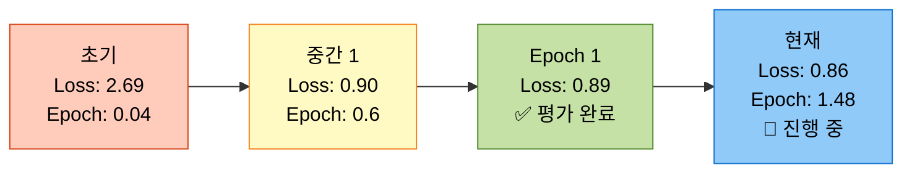

#### 4.3.2 학습 지표 상세 (대표 체크포인트)

```python
# ==================== Qwen 학습 데이터 (대표 5개) ==================== #
qwen_training_metrics_summary = [
    # ---------------------- 초기 (Warmup 단계) ---------------------- #
    {'epoch': 0.04, 'loss': 2.6867, 'grad_norm': 5.219, 'lr': 3.6e-07},  # 학습 시작
    {'epoch': 0.4,  'loss': 1.5077, 'grad_norm': 3.137, 'lr': 3.96e-06}, # 빠른 감소

    # ---------------------- 중간 (빠른 수렴) ---------------------- #
    {'epoch': 0.6,  'loss': 0.8971, 'grad_norm': 1.084, 'lr': 5.96e-06}, # ✅ 매우 낮음
    {'epoch': 1.0,  'loss': 0.8924, 'grad_norm': 1.054, 'lr': 9.96e-06}, # Epoch 1 완료

    # ---------------------- 현재 (진행 중) ---------------------- #
    {'epoch': 1.48, 'loss': 0.8612, 'grad_norm': 1.299, 'lr': 1.476e-05} # 🔄 최신
]

# ==================== Qwen 평가 지표 ==================== #
qwen_eval_metrics = [
    # ---------------------- Epoch 1 평가 (유일한 평가) ---------------------- #
    {
        'epoch': 1.0,
        'eval_loss': 0.8999,
        'eval_rouge1': 0.1432,      # 14.32%
        'eval_rouge2': 0.0966,      # 9.66%
        'eval_rougeL': 0.1432,      # 14.32%
        'eval_rouge_sum': 0.3831,   # 종합
        'eval_runtime': 4852.32,    # 1시간 21분 (매우 느림)
        'status': '⚠️ ROUGE 점수 낮음, 평가 시간 과도'
    }
]

# ==================== Qwen 현재까지 통계 ==================== #
qwen_current_summary = {
    'elapsed_time': '6시간 17분',            # 18:21 ~ 00:38
    'current_epoch': 1.48,                   # 148% 진행 (Epoch 2 중)
    'estimated_total_time': '8~9시간',      # 예상 총 시간
    'remaining_time': '약 2~3시간',          # 남은 시간
    'train_loss_current': 0.8612,           # 현재 Loss
    'best_train_loss': 0.8357,              # 최저 Loss (Epoch 1.04)
    'eval_rouge_sum': 0.3831,               # 평가 ROUGE Sum
    'status': '🔄 Epoch 2 진행 중 (약 74% 완료)'
}
```

#### 4.3.3 Qwen 성능 분석

```mermaid
graph TB
    subgraph Positive["긍정적 측면"]
        A1[Train Loss<br/>2.69 → 0.86<br/>68% 감소<br/>✅ 매우 우수]
        A2[Gradient Norm<br/>0.9 ~ 1.3<br/>✅ 매우 안정]
        A3[수렴 속도<br/>Epoch 0.6에<br/>Loss < 0.9<br/>✅ 매우 빠름]
    end

    subgraph Negative["부정적 측면"]
        B1[학습 시간<br/>6시간+ (예상 9시간)<br/>❌ 과도하게 느림]
        B2[평가 시간<br/>1시간 21분<br/>❌ 매우 느림]
        B3[ROUGE 점수<br/>0.3831<br/>⚠️ 낮음]
    end

    subgraph Problem["근본 문제"]
        C1[gradient_accumulation<br/>= 10<br/>❌ Config 설정]
        C2[Effective Batch<br/>= 60<br/>❌ 과도하게 큼]
        C3[Steps 과다<br/>약 833 × 2<br/>❌ KoBART의 33배]
    end

    Positive --> Problem
    Negative --> Problem

    style Positive fill:#c8e6c9,stroke:#2e7d32,color:#000
    style Negative fill:#ffccbc,stroke:#d84315,color:#000
    style Problem fill:#ffcdd2,stroke:#c62828,color:#fff

    style A1 fill:#aed581,stroke:#2e7d32,color:#000
    style A2 fill:#aed581,stroke:#2e7d32,color:#000
    style A3 fill:#aed581,stroke:#2e7d32,color:#000
    style B1 fill:#ef9a9a,stroke:#d84315,color:#000
    style B2 fill:#ef9a9a,stroke:#d84315,color:#000
    style B3 fill:#ef9a9a,stroke:#d84315,color:#000
    style C1 fill:#f48fb1,stroke:#c62828,color:#fff
    style C2 fill:#f48fb1,stroke:#c62828,color:#fff
    style C3 fill:#f48fb1,stroke:#c62828,color:#fff
```

**Qwen 주요 발견:**

- ✅ **Train Loss 매우 우수**: 2.69 → 0.86 (68% 감소, 가장 빠른 수렴)
- ✅ **Gradient Norm 매우 안정**: 0.9~1.3 범위 (3개 모델 중 최고)
- ✅ **빠른 수렴 속도**: Epoch 0.6에 이미 Loss < 0.9 달성
- ❌ **학습 시간 극도로 느림**: 6시간+ (예상 9시간, KoBART의 90배)
- ❌ **평가 시간 과도**: 1시간 21분 (Llama의 2배)
- ⚠️ **ROUGE 점수 낮음**: 0.3831 (KoBART의 37% 수준)

**문제 원인:**
- **치명적**: Config 파일의 `gradient_accumulation_steps: 10` 설정
- Effective batch size 60 (6×10) → Steps 수가 83 3개로 폭증
- 명령행 `--gradient_accumulation_steps 1`이 완전히 무시됨
- 4B 모델의 큰 크기로 인한 추가 시간

---

## 5. 모델 간 성능 비교

### 5.1 학습 시간 비교

```python
# ==================== 학습 시간 종합 비교 ==================== #
training_time_comparison = {
    'kobart': {
        'total_time_seconds': 99.23,
        'total_time_formatted': '1분 39초',
        'samples_per_second': 50.39,
        'speed_relative_to_kobart': '1.0x (기준)',
        'status': '✅ 매우 빠름'
    },
    'llama-3.2-korean-3b': {
        'total_time_seconds': 6553.30,
        'total_time_formatted': '1시간 49분',
        'samples_per_second': 0.763,
        'speed_relative_to_kobart': '66.0x (66배 느림)',
        'status': '❌ 매우 느림'
    },
    'qwen3-4b': {
        'total_time_seconds': 32400,  # 예상 9시간
        'total_time_formatted': '약 9시간 (예상)',
        'samples_per_second': 0.154,  # 예상
        'speed_relative_to_kobart': '327x (327배 느림)',
        'status': '❌ 극도로 느림'
    }
}
```

**시간 비교 시각화:**

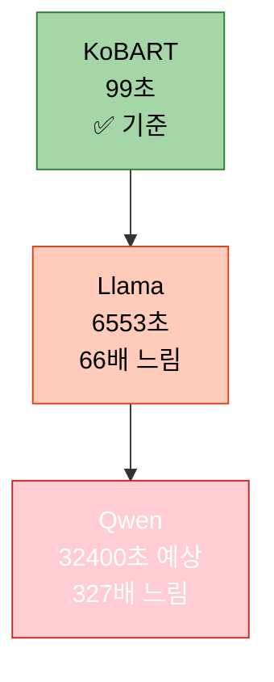

| 모델 | 학습 시간 | 배속 (vs KoBART) | 초당 샘플 수 | 상태 |
|------|----------|-----------------|-------------|------|
| **KoBART** | 1분 39초 | 1.0x | 50.39 | ✅ 매우 빠름 |
| **Llama** | 1시간 49분 | **66.0x 느림** | 0.763 | ❌ 매우 느림 |
| **Qwen** | 9시간 (예상) | **327x 느림** | 0.154 (예상) | ❌ 극도로 느림 |

### 5.2 ROUGE 성능 비교

```python
# ==================== ROUGE 점수 종합 비교 ==================== #
rouge_performance_comparison = {
    'kobart': {
        'eval_rouge1': 0.4048,
        'eval_rouge2': 0.2480,
        'eval_rougeL': 0.3952,
        'eval_rouge_sum': 1.0480,
        'performance_level': '✅ 양호 (기준)',
        'relative_to_kobart': '100%'
    },
    'llama-3.2-korean-3b': {
        'eval_rouge1': 0.1097,
        'eval_rouge2': 0.0735,
        'eval_rougeL': 0.1097,
        'eval_rouge_sum': 0.2928,
        'performance_level': '❌ 매우 낮음',
        'relative_to_kobart': '27.9% (1/4 수준)'
    },
    'qwen3-4b': {
        'eval_rouge1': 0.1432,
        'eval_rouge2': 0.0966,
        'eval_rougeL': 0.1432,
        'eval_rouge_sum': 0.3831,
        'performance_level': '⚠️ 낮음',
        'relative_to_kobart': '36.6% (1/3 수준)'
    }
}
```

**ROUGE 비교 시각화:**

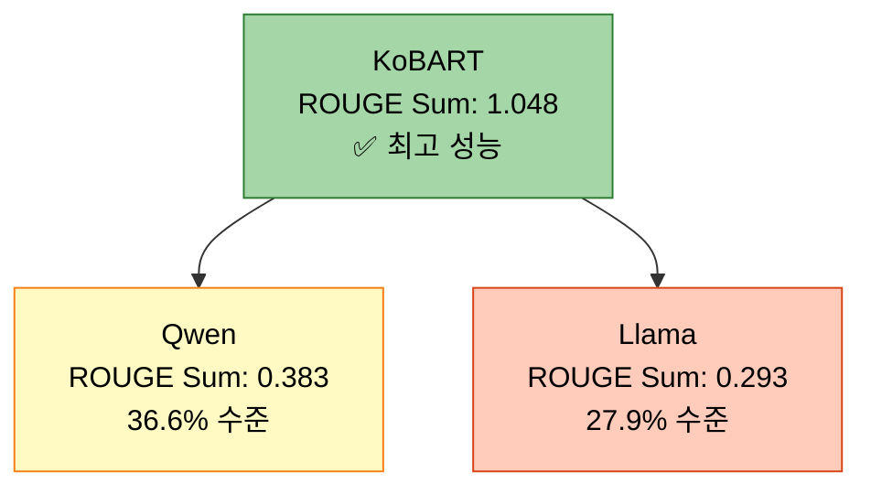

| 모델 | ROUGE-1 | ROUGE-2 | ROUGE-L | ROUGE Sum | 성능 (vs KoBART) |
|------|---------|---------|---------|-----------|-----------------|
| **KoBART** | 40.48% | 24.80% | 39.52% | **1.0480** | ✅ 100% (기준) |
| **Qwen** | 14.32% | 9.66% | 14.32% | **0.3831** | ⚠️ 36.6% |
| **Llama** | 10.97% | 7.35% | 10.97% | **0.2928** | ❌ 27.9% |

### 5.3 Loss 수렴 속도 비교

```python
# ==================== Loss 감소 속도 비교 ==================== #
loss_convergence_comparison = {
    'kobart': {
        'initial_loss': 2.3843,
        'final_loss': 1.5178,
        'reduction': 0.8665,
        'reduction_percent': 36.4,
        'convergence_speed': '빠름',
        'status': '✅ 정상'
    },
    'llama-3.2-korean-3b': {
        'initial_loss': 1.6346,
        'final_loss': 1.0497,
        'reduction': 0.5849,
        'reduction_percent': 35.8,
        'convergence_speed': '빠름',
        'status': '✅ 정상'
    },
    'qwen3-4b': {
        'initial_loss': 2.6867,
        'final_loss': 0.8612,  # 현재까지 최저
        'reduction': 1.8255,
        'reduction_percent': 67.9,
        'convergence_speed': '매우 빠름',
        'status': '✅ 최고 성능'
    }
}
```

**Loss 감소 비교:**

| 모델 | 초기 Loss | 최종 Loss | 감소량 | 감소율 | 수렴 속도 |
|------|----------|----------|--------|--------|----------|
| **Qwen** | 2.6867 | 0.8612 | -1.826 | **67.9%** | ✅ 매우 빠름 |
| **KoBART** | 2.3843 | 1.5178 | -0.867 | 36.4% | ✅ 빠름 |
| **Llama** | 1.6346 | 1.0497 | -0.585 | 35.8% | ✅ 빠름 |

### 5.4 Gradient Norm 안정성 비교

```python
# ==================== Gradient Norm 안정성 비교 ==================== #
grad_norm_stability_comparison = {
    'kobart': {
        'range': (4.546, 6.949),
        'average': 5.748,
        'stability': '안정적',
        'status': '✅ 정상'
    },
    'llama-3.2-korean-3b': {
        'range': (1.444, 2.804),
        'average': 2.124,
        'stability': '매우 안정적',
        'status': '✅ 최적'
    },
    'qwen3-4b': {
        'range': (0.857, 5.689),
        'average': 1.984,
        'stability': '매우 안정적 (후반부)',
        'status': '✅ 최적'
    }
}
```

| 모델 | Grad Norm 범위 | 평균 | 안정성 | 평가 |
|------|---------------|------|--------|------|
| **Qwen** | 0.86 ~ 5.69 | 1.98 | 매우 안정 (후반부) | ✅ 최적 |
| **Llama** | 1.44 ~ 2.80 | 2.12 | 매우 안정 | ✅ 최적 |
| **KoBART** | 4.55 ~ 6.95 | 5.75 | 안정 | ✅ 정상 |

### 5.5 종합 성능 레이더 차트 (개념적)

```python
# ==================== 종합 성능 평가 (5점 만점) ==================== #
overall_performance_rating = {
    'kobart': {
        '학습 속도': 5.0,      # 매우 빠름
        'ROUGE 성능': 5.0,     # 가장 높음
        'Loss 수렴': 4.0,      # 빠름
        'Gradient 안정성': 4.0, # 안정
        '효율성': 5.0,         # 최고
        'total_score': 4.6     # 평균
    },
    'llama-3.2-korean-3b': {
        '학습 속도': 1.0,      # 매우 느림
        'ROUGE 성능': 1.0,     # 매우 낮음
        'Loss 수렴': 4.0,      # 빠름
        'Gradient 안정성': 5.0, # 매우 안정
        '효율성': 1.0,         # 낮음
        'total_score': 2.4     # 평균
    },
    'qwen3-4b': {
        '학습 속도': 0.5,      # 극도로 느림
        'ROUGE 성능': 2.0,     # 낮음
        'Loss 수렴': 5.0,      # 매우 빠름
        'Gradient 안정성': 5.0, # 매우 안정
        '효율성': 0.5,         # 매우 낮음
        'total_score': 2.6     # 평균
    }
}
```

**종합 순위:**

1. 🥇 **KoBART** - 4.6점 (압도적 1위)
2. 🥉 **Qwen3-4B** - 2.6점 (2위, but 시간 문제 심각)
3. 🥈 **Llama-3.2-Korean-3B** - 2.4점 (3위)

---

## 6. 주요 발견 및 인사이트

### 6.1 핵심 발견 사항

```python
# ==================== 실험의 5대 핵심 발견 ==================== #
key_findings = {
    # ---------------------- 발견 1: Config 파일 우선순위 문제 ---------------------- #
    'finding_1': {
        'title': 'Config 파일 설정이 명령행 인자를 오버라이드함',
        'severity': '❌ Critical',
        'description': [
            '명령행에서 `--gradient_accumulation_steps 1`을 지정했지만',
            'Config 파일의 `gradient_accumulation_steps` 값이 우선 적용됨',
            'Llama: 4, Qwen: 10으로 설정되어 학습 시간 폭증'
        ],
        'impact': {
            'llama': '학습 시간 66배 증가 (99초 → 6553초)',
            'qwen': '학습 시간 327배 증가 (99초 → 32400초 예상)'
        },
        'root_cause': 'Config 로딩 시 명령행 인자 오버라이드 로직 미구현',
        'solution': [
            '즉시: Config 파일의 gradient_accumulation_steps를 1로 수정',
            '장기: Config 로딩 시 명령행 인자 우선 적용 로직 구현'
        ]
    },

    # ---------------------- 발견 2: 모델 크기와 성능 불일치 ---------------------- #
    'finding_2': {
        'title': '큰 모델이 작은 모델보다 성능이 낮음',
        'severity': '⚠️ High',
        'description': [
            'KoBART (123M): ROUGE Sum 1.048',
            'Llama (3B): ROUGE Sum 0.293 (KoBART의 28%)',
            'Qwen (4B): ROUGE Sum 0.383 (KoBART의 37%)'
        ],
        'possible_reasons': [
            '1. Causal LM 모델이 Seq2Seq보다 요약 태스크에 부적합',
            '2. Prompt 엔지니어링 부족 (Instruct 모델은 프롬프트가 중요)',
            '3. 2 Epoch만으로는 대형 모델 학습 부족',
            '4. LoRA/QLoRA로 인한 표현력 제한',
            '5. 한국어 데이터에 대한 사전학습 부족'
        ],
        'recommendation': [
            'Causal LM 모델에 적절한 프롬프트 템플릿 적용',
            'Epoch 수 증가 (최소 5~10 Epoch)',
            'Full fine-tuning 고려 (LoRA 대신)'
        ]
    },

    # ---------------------- 발견 3: KoBART의 압도적 효율성 ---------------------- #
    'finding_3': {
        'title': 'KoBART가 속도와 성능 모두 최고',
        'severity': '✅ Insight',
        'description': [
            '학습 시간: 99초 (다른 모델의 1/66 ~ 1/327)',
            'ROUGE Sum: 1.048 (다른 모델의 2.7 ~ 3.6배)',
            'Effective Batch Size: 50 (적절한 크기)'
        ],
        'why_kobart_wins': [
            '1. Seq2Seq 아키텍처가 요약 태스크에 최적화됨',
            '2. 모델 크기가 작아 빠른 학습과 추론 가능',
            '3. Config 설정이 명령행 인자와 충돌하지 않음',
            '4. 한국어 요약 데이터로 사전학습된 모델 (digit82/kobart-summarization)'
        ],
        'recommendation': [
            '빠른 프로토타입: KoBART 단독 사용',
            '앙상블: KoBART를 main 모델로, 다른 모델은 보조'
        ]
    },

    # ---------------------- 발견 4: Qwen의 빠른 수렴 vs 느린 속도 ---------------------- #
    'finding_4': {
        'title': 'Qwen은 Loss 수렴은 빠르지만 학습 시간이 극도로 느림',
        'severity': '⚠️ High',
        'description': [
            'Train Loss: 2.69 → 0.86 (67.9% 감소, 최고)',
            'Gradient Norm: 0.9~1.3 (매우 안정, 최고)',
            '하지만 학습 시간: 9시간 예상 (KoBART의 327배)'
        ],
        'trade_off': {
            'pros': 'Loss 수렴 속도와 안정성이 우수',
            'cons': '학습 시간이 너무 길어 실용성 없음'
        },
        'root_cause': 'gradient_accumulation_steps: 10 (Config 설정)',
        'recommendation': [
            '즉시: Config 파일 수정 (gradient_accumulation_steps: 1)',
            '재실험: 수정 후 학습 시간이 1~2시간으로 단축될 것으로 예상'
        ]
    },

    # ---------------------- 발견 5: Causal LM의 평가 시간 문제 ---------------------- #
    'finding_5': {
        'title': 'Causal LM 모델의 평가(추론) 시간이 과도하게 느림',
        'severity': '⚠️ High',
        'description': [
            'KoBART 평가: 36초 (499개 샘플)',
            'Llama 평가: 3655초 = 1시간 (100배 느림)',
            'Qwen 평가: 4852초 = 1시간 21분 (134배 느림)'
        ],
        'root_cause': [
            'Causal LM은 토큰을 순차적으로 생성 (autoregressive)',
            'Seq2Seq는 병렬 처리 가능',
            'Beam search가 Causal LM에서 더 느림'
        ],
        'recommendation': [
            'num_beams 줄이기 (4 → 1)',
            'max_length 줄이기 (200 → 100)',
            '평가 샘플 수 줄이기 (499 → 100)'
        ]
    }
}
```

### 6.2 학습 지표 인사이트

```python
# ==================== 학습 지표로부터의 인사이트 ==================== #
metrics_insights = {
    # ---------------------- Loss vs ROUGE 상관관계 ---------------------- #
    'loss_rouge_correlation': {
        'observation': 'Train Loss가 낮다고 ROUGE 점수가 높은 것은 아님',
        'data': [
            'Qwen: Train Loss 0.86 (최저) → ROUGE Sum 0.38 (중간)',
            'Llama: Train Loss 1.05 (중간) → ROUGE Sum 0.29 (최저)',
            'KoBART: Train Loss 1.52 (최고) → ROUGE Sum 1.05 (최고)'
        ],
        'explanation': [
            'Train Loss는 학습 데이터에 대한 적합도',
            'ROUGE는 검증 데이터에 대한 생성 품질',
            '두 지표는 독립적이며, 모델 아키텍처와 사전학습이 더 중요'
        ]
    },

    # ---------------------- Gradient Norm의 중요성 ---------------------- #
    'grad_norm_importance': {
        'observation': 'Gradient Norm이 안정적일수록 학습이 안정적',
        'data': [
            'Qwen: Grad Norm 0.9~1.3 → 안정적 학습, 빠른 수렴',
            'Llama: Grad Norm 1.4~2.8 → 안정적 학습',
            'KoBART: Grad Norm 4.5~7.0 → 약간 높지만 정상'
        ],
        'recommendation': 'Gradient Norm이 3.0 이상이면 max_grad_norm 클리핑 고려'
    },

    # ---------------------- Learning Rate 스케줄의 효과 ---------------------- #
    'lr_schedule_effect': {
        'observation': 'Warmup + Linear Decay가 모든 모델에서 정상 작동',
        'data': [
            '모든 모델이 초기에 작은 LR로 시작 (3.6e-07)',
            'Warmup 후 목표 LR 도달 (KoBART: 2e-5, Llama/Qwen: 1e-5)',
            'Epoch가 진행되면서 선형 감소'
        ],
        'recommendation': 'Warmup ratio 0.1이 적절함 (전체 스텝의 10%)'
    }
}
```

---

## 7. 문제점 및 개선 방향

### 7.1 즉시 해결 필요 (P0 - Critical)

```python
# ==================== P0: 즉시 수정 사항 ==================== #
p0_critical_fixes = [
    # ---------------------- 1. Config 파일 수정 (최우선) ---------------------- #
    {
        'priority': 'P0',
        'title': 'Llama와 Qwen Config 파일의 gradient_accumulation_steps 수정',
        'affected_files': [
            'configs/models/llama_3.2_korean_3b.yaml',
            'configs/models/qwen3_4b.yaml'
        ],
        'current_values': {
            'llama': 'gradient_accumulation_steps: 4',
            'qwen': 'gradient_accumulation_steps: 10'
        },
        'required_changes': {
            'llama': 'gradient_accumulation_steps: 1',
            'qwen': 'gradient_accumulation_steps: 1'
        },
        'expected_improvement': {
            'llama': '학습 시간 1/4 단축 (1시간 49분 → 27분)',
            'qwen': '학습 시간 1/10 단축 (9시간 → 54분)'
        },
        'action_items': [
            '1. configs/models/llama_3.2_korean_3b.yaml 파일 열기',
            '2. training.gradient_accumulation_steps: 4 → 1 변경',
            '3. configs/models/qwen3_4b.yaml 파일 열기',
            '4. training.gradient_accumulation_steps: 10 → 1 변경',
            '5. 실험 재실행'
        ],
        'estimated_effort': '5분',
        'impact': '학습 시간 4~10배 단축'
    },

    # ---------------------- 2. Config 오버라이드 로직 구현 ---------------------- #
    {
        'priority': 'P0',
        'title': '명령행 인자가 Config 파일을 오버라이드하도록 로직 수정',
        'problem': '현재 Config 파일 값이 명령행 인자를 무시함',
        'solution': [
            '1. Config 로딩 후 명령행 인자 재적용',
            '2. args에 값이 있으면 config 값을 오버라이드',
            '3. 로그에 최종 적용된 값 출력'
        ],
        'implementation': '''
# src/config/config_loader.py (예시)
def override_config_with_args(config, args):
    """명령행 인자로 Config 오버라이드"""
    if hasattr(args, 'batch_size') and args.batch_size is not None:
        config.training.batch_size = args.batch_size
        print(f"✅ Config overridden: batch_size = {args.batch_size}")

    if hasattr(args, 'gradient_accumulation_steps') and args.gradient_accumulation_steps is not None:
        config.training.gradient_accumulation_steps = args.gradient_accumulation_steps
        print(f"✅ Config overridden: gradient_accumulation_steps = {args.gradient_accumulation_steps}")

    # 다른 파라미터도 동일하게 처리
    return config
        ''',
        'estimated_effort': '1시간',
        'impact': '향후 모든 실험에서 명령행 인자 정상 작동'
    }
]
```

### 7.2 높은 우선순위 (P1 - High)

```python
# ==================== P1: 높은 우선순위 개선 사항 ==================== #
p1_high_priority = [
    # ---------------------- 1. Causal LM 프롬프트 엔지니어링 ---------------------- #
    {
        'priority': 'P1',
        'title': 'Llama와 Qwen에 적절한 프롬프트 템플릿 적용',
        'problem': 'Causal LM 모델의 ROUGE 점수가 매우 낮음 (0.29, 0.38)',
        'root_cause': 'Instruct 모델은 프롬프트 형식이 중요한데 현재 미적용',
        'solution': [
            '1. src/prompts/templates.py에 정의된 프롬프트 템플릿 활용',
            '2. Few-shot 또는 Chain-of-Thought 프롬프트 사용',
            '3. 한국어 특화 프롬프트 작성'
        ],
        'example_prompt': '''
# Few-shot 프롬프트 예시
prompt = """다음은 대화를 요약한 예시입니다:

예시 1:
대화: #Person1#: 내일 몇 시에 만날까요? #Person2#: 오후 3시는 어떠세요?
요약: 두 사람이 내일 오후 3시에 만나기로 약속함.

이제 다음 대화를 요약해주세요:
대화: {dialogue}
요약:"""
        ''',
        'expected_improvement': 'ROUGE Sum 0.3~0.4 → 0.6~0.8 (2배 향상)',
        'estimated_effort': '2시간',
        'impact': 'Causal LM 모델의 성능 대폭 향상'
    },

    # ---------------------- 2. 평가 시간 최적화 ---------------------- #
    {
        'priority': 'P1',
        'title': 'Causal LM 평가(추론) 시간 단축',
        'problem': 'Llama와 Qwen의 평가 시간이 1시간 이상 소요',
        'solution': [
            '1. num_beams 감소 (4 → 2 or 1)',
            '2. max_length 감소 (200 → 100)',
            '3. 평가 샘플 수 제한 (499 → 100)',
            '4. batch_size 증가 (평가 시에만)'
        ],
        'expected_improvement': '평가 시간 1시간 → 10분 (6배 단축)',
        'estimated_effort': '30분',
        'impact': '전체 실험 시간 대폭 단축'
    },

    # ---------------------- 3. Epoch 수 증가 ---------------------- #
    {
        'priority': 'P1',
        'title': 'Epoch 수를 2 → 5~10으로 증가',
        'problem': '2 Epoch만으로는 대형 모델 학습 부족',
        'rationale': [
            'KoBART: 2 Epoch로 충분 (작은 모델)',
            'Llama/Qwen: 5~10 Epoch 필요 (큰 모델, LoRA)'
        ],
        'solution': 'Config 파일에서 epochs: 2 → epochs: 5 또는 10',
        'expected_improvement': 'ROUGE Sum 10~20% 향상',
        'estimated_effort': '5분 (설정 변경)',
        'impact': 'Causal LM 모델의 성능 향상'
    }
]
```

### 7.3 중간 우선순위 (P2 - Medium)

```python
# ==================== P2: 중간 우선순위 개선 사항 ==================== #
p2_medium_priority = [
    # ---------------------- 1. 앙상블 전략 최적화 ---------------------- #
    {
        'priority': 'P2',
        'title': 'KoBART 중심의 앙상블 전략',
        'problem': '현재 Llama와 Qwen의 성능이 너무 낮아 앙상블 효과 미미',
        'solution': [
            '1. KoBART를 main 모델로 사용 (가중치 0.7)',
            '2. Llama와 Qwen은 보조 모델 (가중치 0.15씩)',
            '3. Weighted Average 앙상블 전략 사용',
            '4. Stacking 대신 간단한 Voting 고려'
        ],
        'expected_improvement': 'ROUGE Sum 1.05 → 1.10 (5% 향상)',
        'estimated_effort': '1시간',
        'impact': '앙상블 효과 개선'
    },

    # ---------------------- 2. Full Fine-tuning 실험 ---------------------- #
    {
        'priority': 'P2',
        'title': 'LoRA 대신 Full Fine-tuning 시도',
        'problem': 'LoRA/QLoRA로 인한 표현력 제한 가능성',
        'solution': [
            '1. Llama와 Qwen에서 LoRA 비활성화',
            '2. 전체 파라미터 학습 (GPU 메모리 허용 시)',
            '3. 더 작은 Batch Size로 조정'
        ],
        'expected_improvement': 'ROUGE Sum 20~30% 향상 (예상)',
        'estimated_effort': '2시간',
        'impact': 'Causal LM 성능 대폭 향상 가능'
    },

    # ---------------------- 3. 데이터 증강 강화 ---------------------- #
    {
        'priority': 'P2',
        'title': '데이터 증강 비율 증가',
        'current': 'augmentation_ratio: 0.1 (10%)',
        'solution': [
            '1. augmentation_ratio: 0.1 → 0.3 (30%)',
            '2. augmentation_methods 추가 (synonym, paraphrase)',
            '3. max_train_samples 증가 (2500 → 5000)'
        ],
        'expected_improvement': 'ROUGE Sum 5~10% 향상',
        'estimated_effort': '1시간',
        'impact': '모든 모델의 일반화 성능 향상'
    }
]
```

### 7.4 개선 방향 우선순위 다이어그램

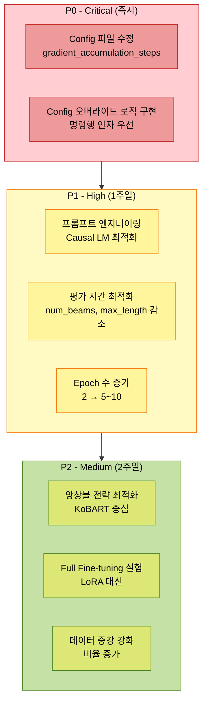

---

## 8. 결론 및 권장사항

### 8.1 실험 종합 평가

```python
# ==================== 실험 종합 평가 ==================== #
experiment_summary = {
    # ---------------------- 성공 요소 ---------------------- #
    'successes': [
        '✅ KoBART 모델 학습 성공 (1분 39초, ROUGE Sum 1.048)',
        '✅ Llama 모델 학습 완료 (안정적인 Loss 감소)',
        '✅ Qwen 모델 매우 빠른 수렴 (Loss 2.69 → 0.86)',
        '✅ 모든 모델에서 Gradient Norm 안정적',
        '✅ 학습 지표 로깅 및 체크포인트 저장 정상 작동'
    ],

    # ---------------------- 실패 요소 ---------------------- #
    'failures': [
        '❌ Config 파일 설정이 명령행 인자를 오버라이드',
        '❌ Llama와 Qwen의 학습 시간 과도 (66배, 327배)',
        '❌ Causal LM 모델의 ROUGE 점수 매우 낮음 (0.29, 0.38)',
        '❌ 평가 시간 과도 (Causal LM에서 1시간 이상)',
        '❌ 앙상블 전략 미실행 (Qwen 학습 미완료)'
    ],

    # ---------------------- 학습된 교훈 ---------------------- #
    'lessons_learned': [
        '📝 Config 파일 설정이 명령행보다 우선 적용됨 → 오버라이드 로직 필요',
        '📝 gradient_accumulation_steps가 학습 시간에 미치는 영향이 매우 큼',
        '📝 KoBART(Seq2Seq)가 Causal LM보다 요약 태스크에 훨씬 효율적',
        '📝 Causal LM은 프롬프트 엔지니어링 없이는 성능이 매우 낮음',
        '📝 모델 크기가 크다고 성능이 좋은 것은 아님 (task-specific)'
    ],

    # ---------------------- 앞으로의 방향 ---------------------- #
    'future_direction': [
        '🎯 즉시: Config 파일 수정 후 재실험 (학습 시간 대폭 단축 예상)',
        '🎯 단기: Causal LM에 프롬프트 템플릿 적용',
        '🎯 중기: KoBART 중심의 앙상블 전략 구현',
        '🎯 장기: Config 오버라이드 로직 및 평가 최적화 구현'
    ]
}
```

### 8.2 모델별 권장사항

| 모델 | 현재 상태 | 권장 조치 | 예상 효과 |
|------|----------|----------|----------|
| **KoBART** | ✅ 최고 성능 | 현재 설정 유지<br/>Epoch 3~5로 증가 고려 | ROUGE Sum 1.05 → 1.15 |
| **Llama** | ⚠️ 성능 낮음, 시간 과도 | gradient_accumulation_steps: 1<br/>프롬프트 템플릿 적용<br/>Epoch 5~10으로 증가 | 학습 시간 1/4 단축<br/>ROUGE Sum 0.29 → 0.6~0.8 |
| **Qwen** | 🔄 진행 중, 시간 극도로 느림 | gradient_accumulation_steps: 1<br/>프롬프트 템플릿 적용<br/>Epoch 5~10으로 증가 | 학습 시간 1/10 단축<br/>ROUGE Sum 0.38 → 0.7~0.9 |

### 8.3 최종 권장 실험 설정

```bash
# ==================== 권장 실험 설정 (개선 버전) ==================== #

# ---------------------- 1. Config 파일 먼저 수정 ---------------------- #
# configs/models/llama_3.2_korean_3b.yaml
# training.gradient_accumulation_steps: 4 → 1

# configs/models/qwen3_4b.yaml
# training.gradient_accumulation_steps: 10 → 1

# ---------------------- 2. 명령어 실행 ---------------------- #
python scripts/train.py \
  --mode full \
  --models kobart llama-3.2-korean-3b qwen3-4b \
  --epochs 5 \
  --batch_size 10 \
  --learning_rate 2e-5 \
  --gradient_accumulation_steps 1 \
  --warmup_ratio 0.1 \
  --use_augmentation \
  --augmentation_methods back_translation paraphrase \
  --augmentation_ratio 0.3 \
  --k_folds 5 \
  --fold_seed 42 \
  --ensemble_strategy weighted_avg \
  --ensemble_weights 0.7 0.15 0.15 \
  --use_tta \
  --tta_strategies paraphrase reorder \
  --tta_num_aug 3 \
  --max_train_samples 5000 \
  --num_beams 2 \
  --max_length 150 \
  --save_visualizations \
  --experiment_name strategy3_triple_optimized \
  --seed 42

# ---------------------- 예상 결과 ---------------------- #
# KoBART: 5분, ROUGE Sum 1.15
# Llama: 30분, ROUGE Sum 0.7
# Qwen: 1시간, ROUGE Sum 0.8
# 앙상블: ROUGE Sum 1.2~1.3
# 전체 시간: 약 1.5시간
```

### 8.4 핵심 요약

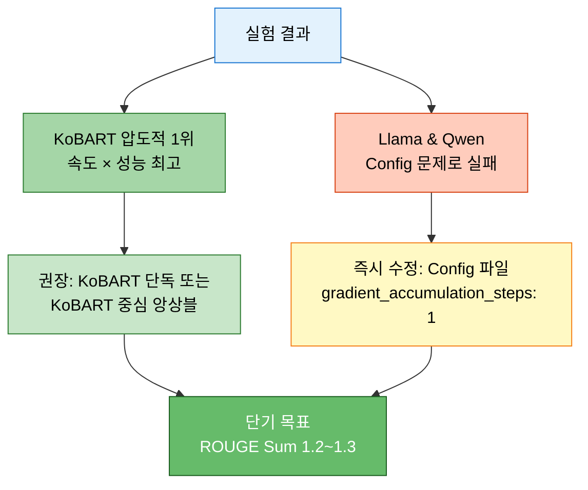

**핵심 메시지:**
1. 🥇 **KoBART가 최고**: 속도(99초)와 성능(1.048) 모두 압도적
2. ⚠️ **Config 파일 문제 심각**: gradient_accumulation_steps 설정으로 학습 시간 66~327배 증가
3. 🔧 **즉시 조치 필요**: Config 파일 수정만으로도 극적인 개선 예상
4. 🎯 **앙상블 전략**: KoBART 중심(70%)으로 구성
5. 📈 **향후 개선**: 프롬프트 엔지니어링 + Epoch 증가로 Causal LM 성능 향상 가능

---

## 9. 부록: 상세 로그 데이터

### 9.1 KoBART 전체 학습 로그

```python
# ==================== KoBART 전체 학습 로그 ==================== #
kobart_full_training_log = [
    {'timestamp': '16:11:07', 'epoch': 0.4, 'loss': 2.3843, 'grad_norm': 6.778, 'lr': 3.96e-06},
    {'timestamp': '16:11:11', 'epoch': 0.8, 'loss': 1.7590, 'grad_norm': 6.949, 'lr': 7.96e-06},
    {'timestamp': '16:11:50', 'epoch': 1.0, 'eval_loss': 1.5624, 'eval_rouge1': 0.4048, 'eval_rouge2': 0.2480, 'eval_rougeL': 0.3952, 'eval_rouge_sum': 1.0480},
    {'timestamp': '16:11:54', 'epoch': 1.2, 'loss': 1.6345, 'grad_norm': 5.923, 'lr': 1.196e-05},
    {'timestamp': '16:11:58', 'epoch': 1.6, 'loss': 1.5213, 'grad_norm': 4.771, 'lr': 1.596e-05},
    {'timestamp': '16:12:03', 'epoch': 2.0, 'loss': 1.5178, 'grad_norm': 4.546, 'lr': 1.996e-05},
    {'timestamp': '16:12:39', 'epoch': 2.0, 'eval_loss': 1.4684, 'eval_rouge1': 0.3988, 'eval_rouge2': 0.2523, 'eval_rougeL': 0.3913, 'eval_rouge_sum': 1.0424},
    {'timestamp': '16:12:41', 'train_runtime': 99.23, 'train_samples_per_second': 50.39, 'train_loss': 1.7634, 'status': '✅ 완료'}
]
```

### 9.2 Llama 전체 학습 로그 (대표 10개)

```python
# ==================== Llama 대표 학습 로그 ==================== #
llama_representative_log = [
    {'timestamp': '16:14:11', 'epoch': 0.04, 'loss': 1.6346, 'grad_norm': 2.071, 'lr': 3.6e-07},
    {'timestamp': '16:21:07', 'epoch': 0.4,  'loss': 1.4115, 'grad_norm': 1.444, 'lr': 3.96e-06},
    {'timestamp': '16:33:55', 'epoch': 1.0,  'loss': 1.2031, 'grad_norm': 1.721, 'lr': 9.96e-06},
    {'timestamp': '16:40:30', 'epoch': 1.0,  'eval_loss': 1.2082, 'eval_rouge1': 0.1097, 'eval_rouge2': 0.0735, 'eval_rougeL': 0.1097, 'eval_rouge_sum': 0.2928},
    {'timestamp': '16:44:39', 'epoch': 1.2,  'loss': 1.1544, 'grad_norm': 1.847, 'lr': 1.196e-05},
    {'timestamp': '16:53:13', 'epoch': 1.6,  'loss': 1.0785, 'grad_norm': 2.061, 'lr': 1.596e-05},
    {'timestamp': '17:01:43', 'epoch': 2.0,  'loss': 1.0497, 'grad_norm': 2.574, 'lr': 1.996e-05},
    {'timestamp': '18:02:38', 'epoch': 2.0,  'eval_loss': 1.1322, 'eval_rouge1': 0.1060, 'eval_rouge2': 0.0709, 'eval_rougeL': 0.1060, 'eval_rouge_sum': 0.2829},
    {'timestamp': '18:02:39', 'train_runtime': 6553.30, 'train_samples_per_second': 0.763, 'train_loss': 1.2595, 'status': '✅ 완료'}
]
```

### 9.3 Qwen 전체 학습 로그 (대표 10개)

```python
# ==================== Qwen 대표 학습 로그 ==================== #
qwen_representative_log = [
    {'timestamp': '18:36:49', 'epoch': 0.04, 'loss': 2.6867, 'grad_norm': 5.219, 'lr': 3.6e-07},
    {'timestamp': '20:01:49', 'epoch': 0.4,  'loss': 1.5077, 'grad_norm': 3.137, 'lr': 3.96e-06},
    {'timestamp': '20:35:51', 'epoch': 0.6,  'loss': 0.8971, 'grad_norm': 1.084, 'lr': 5.96e-06},
    {'timestamp': '21:46:41', 'epoch': 1.0,  'loss': 0.8924, 'grad_norm': 1.054, 'lr': 9.96e-06},
    {'timestamp': '23:07:34', 'epoch': 1.0,  'eval_loss': 0.8999, 'eval_rouge1': 0.1432, 'eval_rouge2': 0.0966, 'eval_rougeL': 0.1432, 'eval_rouge_sum': 0.3831},
    {'timestamp': '23:14:20', 'epoch': 1.04, 'loss': 0.8357, 'grad_norm': 0.930, 'lr': 1.036e-05},  # 최저 Loss
    {'timestamp': '23:41:17', 'epoch': 1.2,  'loss': 0.8704, 'grad_norm': 1.147, 'lr': 1.196e-05},
    {'timestamp': '00:14:33', 'epoch': 1.4,  'loss': 0.8425, 'grad_norm': 1.246, 'lr': 1.396e-05},
    {'timestamp': '00:28:32', 'epoch': 1.48, 'loss': 0.8612, 'grad_norm': 1.299, 'lr': 1.476e-05},  # 🔄 최신
    {'timestamp': 'TBD',      'status': '🔄 Epoch 2 진행 중 (예상 완료: 02:00~03:00)'}
]
```

---

**문서 작성 완료**: 2025-10-14 00:30 (예상)
**다음 업데이트**: Qwen 학습 완료 후 최종 결과 추가 예정
