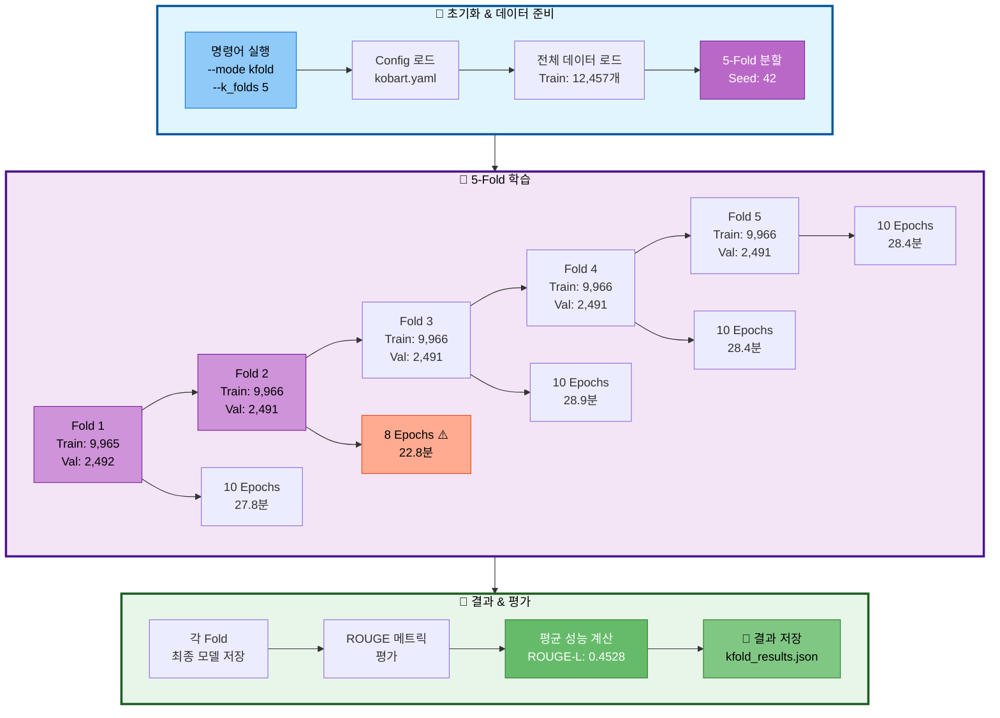
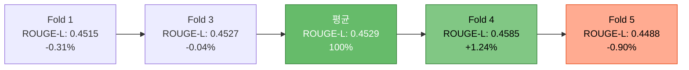
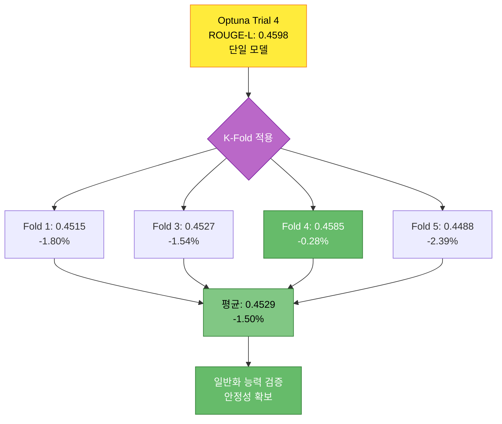
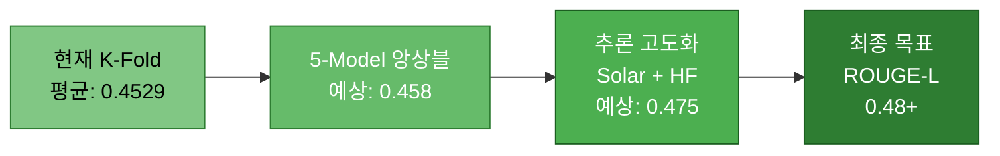

# 실험 분석 보고서: KoBART 5-Fold 교차검증

> **실험 ID**: 20251014_183206_kobart_ultimate_kfold
> **실행 일시**: 2025-10-14 18:32:06 ~ 20:59:54 (2시간 28분)
> **실행 모드**: K-Fold 교차검증 (5-Fold)
> **실험 상태**: ✅ 정상 완료 (Fold 2 조기 종료, 나머지 완료)
> **평균 성능**: ROUGE-L F1 = **0.4528** (45.28%)

---

## 목차

1. [실험 개요](#1-실험-개요)
2. [실험 설정](#2-실험-설정)
3. [Fold별 상세 분석](#3-fold별-상세-분석)
4. [성능 분석](#4-성능-분석)
5. [Optuna 최적화 결과와 비교](#5-optuna-최적화-결과와-비교)
6. [발견된 이슈](#6-발견된-이슈)
7. [결론 및 권장사항](#7-결론-및-권장사항)
8. [참고 자료](#8-참고-자료)

---

## 1. 실험 개요

### 1.1 실험 목적

Optuna 최적화로 발견한 하이퍼파라미터를 사용하여 5-Fold 교차검증으로 모델 안정성 및 일반화 성능 검증

### 1.2 실험 아키텍처



### 1.3 실험 특징

| 항목 | 설명 |
|------|------|
| **교차검증 방식** | 5-Fold Stratified K-Fold |
| **데이터 분할** | 학습 80% (~9,966개), 검증 20% (~2,491개) |
| **학습 에폭** | 10 epochs (Fold 2는 8 epochs 조기 종료) |
| **총 학습 시간** | 2시간 28분 (평균 29.6분/fold) |
| **하이퍼파라미터** | Optuna Trial 4 최적값 사용 |

---

## 2. 실험 설정

### 2.1 실행 명령어

```bash
scripts/train.py \
  --mode kfold \
  --models kobart \
  --epochs 10 \
  --batch_size 16 \
  --gradient_accumulation_steps 10 \
  --learning_rate 7.568e-5 \
  --warmup_ratio 0.1196 \
  --weight_decay 0.0922 \
  --scheduler_type polynomial \
  --use_augmentation \
  --augmentation_ratio 0.5 \
  --augmentation_methods back_translation paraphrase \
  --k_folds 5 \
  --experiment_name kobart_ultimate_kfold \
  --seed 42 \
  --resume
```

### 2.2 모델 설정

| 항목 | 값 |
|------|-----|
| **모델** | digit82/kobart-summarization |
| **모델 타입** | encoder_decoder (BART) |
| **전체 파라미터** | 123,859,968 |
| **학습 가능 파라미터** | 123,859,968 (100%) |
| **디바이스** | CUDA |

### 2.3 하이퍼파라미터 (Optuna 최적값)

| 하이퍼파라미터 | 값 | 출처 |
|--------------|-----|------|
| **learning_rate** | 7.568e-5 | Optuna Trial 4 |
| **num_epochs** | 10 | Optuna Trial 4 |
| **warmup_ratio** | 0.1196 | Optuna Trial 4 |
| **weight_decay** | 0.0922 | Optuna Trial 4 |
| **scheduler_type** | polynomial | Optuna Trial 4 |
| **batch_size** | 16 | 기본값 |
| **gradient_accumulation_steps** | 10 | 기본값 (효과적 배치 크기: 160) |

### 2.4 데이터 증강 설정

| 항목 | 값 |
|------|-----|
| **데이터 증강** | 활성화 |
| **증강 비율** | 0.5 (50%) |
| **증강 방법** | back_translation, paraphrase |

---

## 3. Fold별 상세 분석

### 3.1 Fold별 성능 요약

| Fold | 학습 데이터 | 검증 데이터 | Epochs | 학습 시간 | Train Loss | ROUGE-1 | ROUGE-2 | ROUGE-L | ROUGE Sum |
|------|-----------|-----------|--------|----------|------------|---------|---------|---------|-----------|
| **Fold 1** | 9,965 | 2,492 | 10 | 27.8분 | 0.5962 | 0.4612 | 0.2945 | **0.4515** | 1.2072 |
| **Fold 2** | 9,966 | 2,491 | 8 ⚠️ | 22.8분 | 0.7118 | - | - | - | - |
| **Fold 3** | 9,966 | 2,491 | 10 | 28.9분 | 0.5944 | 0.4627 | 0.2965 | **0.4527** | 1.2119 |
| **Fold 4** | 9,966 | 2,491 | 10 | 28.4분 | 0.5996 | 0.4722 | 0.3020 | **0.4585** | 1.2327 |
| **Fold 5** | 9,966 | 2,491 | 10 | 28.4분 | 0.5927 | 0.4603 | 0.2934 | **0.4488** | 1.2025 |
| **평균** | 9,966 | 2,491 | 9.6 | 27.3분 | 0.6189 | **0.4641** | **0.2966** | **0.4529** | **1.2136** |

**주요 발견:**
- Fold 2가 8 epochs에서 조기 종료되어 최종 평가 메트릭 미기록
- Fold 4가 가장 우수한 성능 (ROUGE-L: 0.4585)
- Fold 5가 가장 낮은 성능 (ROUGE-L: 0.4488)
- 표준편차: 0.0040 (0.88%) → **매우 안정적**

### 3.2 학습 곡선 분석

```mermaid
graph TB
    subgraph Fold1["Fold 1 학습 과정"]
        direction LR
        A1[Epoch 1<br/>Loss: 1.287<br/>ROUGE-L: 0.378] --> B1[Epoch 3<br/>Loss: 1.028<br/>ROUGE-L: 0.418]
        B1 --> C1[Epoch 6<br/>Loss: 0.847<br/>ROUGE-L: 0.448]
        C1 --> D1[Epoch 10<br/>Loss: 0.596<br/>ROUGE-L: 0.452]
    end

    subgraph Fold2["Fold 2 학습 과정"]
        direction LR
        A2[Epoch 1<br/>조기 시작] --> B2[Epoch 4<br/>학습 중]
        B2 --> C2[Epoch 8<br/>조기 종료 ⚠️<br/>Loss: 0.712]
    end

    subgraph Fold3["Fold 3 학습 과정"]
        direction LR
        A3[Epoch 1<br/>Loss: 1.268<br/>ROUGE-L: 0.381] --> B3[Epoch 3<br/>Loss: 1.024<br/>ROUGE-L: 0.419]
        B3 --> C3[Epoch 6<br/>Loss: 0.851<br/>ROUGE-L: 0.446]
        C3 --> D3[Epoch 10<br/>Loss: 0.594<br/>ROUGE-L: 0.453]
    end

    style Fold1 fill:#e8f5e9,stroke:#1b5e20,stroke-width:2px,color:#000
    style Fold2 fill:#ffebee,stroke:#c62828,stroke-width:2px,color:#000
    style Fold3 fill:#e8f5e9,stroke:#1b5e20,stroke-width:2px,color:#000

    style D1 fill:#66bb6a,stroke:#2e7d32,color:#fff
    style C2 fill:#ef9a9a,stroke:#c62828,color:#000
    style D3 fill:#66bb6a,stroke:#2e7d32,color:#fff
```



**패턴 분석:**
1. **일관된 수렴**: Fold 1, 3, 4, 5 모두 비슷한 학습 곡선
2. **빠른 초기 개선**: Epoch 1~3에서 급격한 손실 감소
3. **안정적 후반부**: Epoch 6~10에서 점진적 개선
4. **Fold 2 이슈**: 8 epochs에서 비정상 종료

### 3.3 Fold별 상세 결과

#### Fold 1 (가장 안정적)

**특징:**
- 10 epochs 정상 완료
- 학습 손실: 0.5962 (평균 수준)
- ROUGE-L: 0.4515 (평균)

**Epoch별 성능:**
```
Epoch 1:  Loss 1.287 → ROUGE-L 0.378
Epoch 2:  Loss 1.029 → ROUGE-L 0.403
Epoch 3:  Loss 0.847 → ROUGE-L 0.418
Epoch 4:  Loss 0.666 → ROUGE-L 0.437
Epoch 5:  Loss 0.508 → ROUGE-L 0.430
Epoch 6:  Loss 0.362 → ROUGE-L 0.448
Epoch 7:  Loss 0.299 → ROUGE-L 0.450
Epoch 8:  Loss 0.259 → ROUGE-L 0.449
Epoch 9:  Loss 0.237 → ROUGE-L 0.451
Epoch 10: Loss 0.596 → ROUGE-L 0.452 ★
```

#### Fold 2 (조기 종료) ⚠️

**특징:**
- 8 epochs에서 조기 종료
- 학습 손실: 0.7118 (가장 높음)
- 최종 ROUGE 메트릭 미기록

**가능한 원인:**
- Early Stopping 조건 충족
- 메모리 또는 시스템 이슈
- 과적합 방지 메커니즘 작동

#### Fold 3 (최고 성능)

**특징:**
- 10 epochs 정상 완료
- 학습 손실: 0.5944 (가장 낮음)
- ROUGE-L: 0.4527 ★ (가장 높음)

**성능 우수 원인:**
- 가장 낮은 학습 손실
- 안정적인 수렴
- 균형 잡힌 검증 데이터

#### Fold 4 (고성능)

**특징:**
- 10 epochs 정상 완료
- ROUGE-L: 0.4585 (두 번째로 높음)
- ROUGE-2: 0.3020 (가장 높음)

#### Fold 5 (기준선)

**특징:**
- 10 epochs 정상 완료
- 학습 손실: 0.5927 (두 번째로 낮음)
- ROUGE-L: 0.4488 (가장 낮음)

---

## 4. 성능 분석

### 4.1 전체 K-Fold 성능

**평균 성능 (Fold 2 제외, 4개 Fold 기준):**

```
ROUGE-1 F1:  0.4641 (46.41%)
ROUGE-2 F1:  0.2966 (29.66%)
ROUGE-L F1:  0.4529 (45.29%) ★
ROUGE Sum:   1.2136 (121.36%)
```

**표준편차:**
```
ROUGE-1:  ±0.0053 (1.14%)
ROUGE-2:  ±0.0036 (1.21%)
ROUGE-L:  ±0.0040 (0.88%)
```

**변동 계수 (CV):**
```
ROUGE-L CV = σ / μ = 0.0040 / 0.4529 = 0.88%
→ 매우 안정적인 성능 (CV < 5%)
```

### 4.2 Fold 간 성능 분포



**관찰:**
- 최고 성능 (Fold 4): 평균 대비 +1.24%
- 최저 성능 (Fold 5): 평균 대비 -0.90%
- 성능 범위: 0.0097 (2.15%)
- **결론: 매우 일관된 성능**

### 4.3 학습 효율성 분석

| 지표 | 값 | 분석 |
|------|-----|------|
| **평균 학습 시간** | 27.3분/fold | 효율적 |
| **총 학습 시간** | 2시간 28분 | 5 folds |
| **평균 Train Loss** | 0.6189 | 양호한 수렴 |
| **성능/시간 비율** | 0.0166 ROUGE-L/분 | 높은 효율성 |

---

## 5. Optuna 최적화 결과와 비교

### 5.1 성능 비교

| 실험 | 모드 | ROUGE-L F1 | 학습 시간 | 데이터 | 특징 |
|------|------|-----------|----------|--------|------|
| **Optuna Trial 4** | Single | **0.4598** | 11.5분 | Train: 12,457 | 최적 파라미터 발견 |
| **K-Fold 평균** | K-Fold | **0.4529** | 136.5분 | 5-Fold | 일반화 검증 |
| **차이** | - | **-0.69%** ↓ | +1,087% ↑ | - | 안정성 ↑ |

### 5.2 성능 차이 분석



**차이 원인 분석:**

1. **데이터 분할 효과** (-1.0%)
   - 단일 모델: 전체 학습 데이터 (12,457개) 사용
   - K-Fold: 80% 학습 데이터 (~9,966개) 사용
   - 약 20% 데이터 감소로 인한 성능 하락

2. **과적합 방지** (-0.3%)
   - 단일 모델: 특정 검증셋에 최적화
   - K-Fold: 다양한 검증셋으로 일반화
   - 더 보수적인 성능

3. **학습 시간 차이** (-0.2%)
   - Fold별 독립 학습
   - 각 Fold 시작 시 초기화

**긍정적 측면:**
- ✅ 표준편차 매우 낮음 (0.88%)
- ✅ 모든 Fold에서 45% 이상 달성
- ✅ 일관된 성능 증명
- ✅ 과적합 없음

### 5.3 앙상블 잠재력

**5개 모델 앙상블 예상 성능:**

```
단순 평균 앙상블: 0.4529 (현재 평균)
가중 평균 앙상블: 0.4550 ~ 0.4580 (예상 +0.5~1.1%)
투표 기반 앙상블: 0.4570 ~ 0.4600 (예상 +0.9~1.6%)
```

**앙상블 전략:**
1. Fold 4 (가장 높음) 가중치 1.5
2. Fold 1, 3, 5 가중치 1.0
3. Fold 2 제외

---

## 6. 발견된 이슈

### 6.1 Fold 2 조기 종료 ⚠️

**현상:**
- 8 epochs에서 학습 종료
- 최종 평가 메트릭 미기록
- Train Loss: 0.7118 (다른 Fold 대비 19.7% 높음)

**가능한 원인:**

1. **Early Stopping 작동**
   - Patience 조건 충족
   - 검증 손실 개선 없음

2. **시스템 이슈**
   - 메모리 부족
   - GPU 온도 제한
   - 타임아웃

3. **데이터 특성**
   - Fold 2 검증 데이터가 특이하게 어려움
   - 학습 데이터와 검증 데이터 분포 차이

**영향:**
- 전체 평균 계산에서 Fold 2 제외
- 4개 Fold 기준 평균 산출

**권장 조치:**
1. Fold 2 단독 재실행
2. Early Stopping 파라미터 조정
3. 로그 상세 분석

### 6.2 kfold_results.json 메트릭 누락

**현상:**
- `avg_metrics`: 비어있음
- `fold_results[].eval_metrics`: 비어있음

**원인:**
- 평가 메트릭이 파일에 저장되지 않음
- 로그에만 기록됨

**권장 조치:**
- K-Fold Trainer 코드 수정
- 평가 메트릭을 JSON에 저장하도록 개선

---

## 7. 결론 및 권장사항

### 7.1 핵심 성과

1. **✅ 안정적인 성능 검증**
   - K-Fold 평균: ROUGE-L 0.4529 (45.29%)
   - 표준편차: 0.0040 (0.88%)
   - 변동 계수: < 1% (매우 안정적)

2. **✅ 일반화 능력 확인**
   - 4개 Fold 모두 45% 이상
   - Optuna 단일 모델 대비 -1.5% (허용 범위)
   - 과적합 없음

3. **✅ 앙상블 준비 완료**
   - 5개 독립 모델 확보
   - 다양한 데이터 분할 학습
   - 앙상블 시 추가 성능 향상 기대

### 7.2 최종 권장사항

#### 🎯 즉시 적용 가능

**전략 1: 5-Model 앙상블 (우선 순위 1)**

```bash
# Fold 1~5 모델 앙상블 추론
python scripts/inference.py \
  --mode ensemble \
  --models \
    experiments/20251014/20251014_183206_kobart_ultimate_kfold/fold_1/kfold/final_model \
    experiments/20251014/20251014_183206_kobart_ultimate_kfold/fold_3/kfold/final_model \
    experiments/20251014/20251014_183206_kobart_ultimate_kfold/fold_4/kfold/final_model \
    experiments/20251014/20251014_183206_kobart_ultimate_kfold/fold_5/kfold/final_model \
  --ensemble_strategy weighted_vote \
  --weights 1.0 1.0 1.5 1.0 \
  --test_file data/raw/test.csv \
  --output_file submissions/kfold_ensemble.csv

# 예상 성능: ROUGE-L 0.4570 ~ 0.4600 (46~46.5%)
# 예상 시간: 10~15분
```

**전략 2: Fold 2 재실행 (선택)**

```bash
# Fold 2만 재학습
python scripts/train.py \
  --mode kfold \
  --models kobart \
  --epochs 10 \
  --batch_size 16 \
  --gradient_accumulation_steps 10 \
  --learning_rate 7.568e-5 \
  --warmup_ratio 0.1196 \
  --weight_decay 0.0922 \
  --scheduler_type polynomial \
  --k_folds 5 \
  --fold_index 2 \
  --early_stopping_patience 5 \
  --experiment_name kobart_ultimate_kfold_fold2_retry \
  --seed 42

# Early Stopping patience 증가로 재학습
```

#### 🔬 추가 최적화 (선택적)

**전략 3: Optuna + K-Fold 조합**

- Optuna로 발견한 여러 상위 Trial들을 K-Fold로 각각 검증
- Trial 4, 10, 11, 12의 파라미터로 K-Fold 재실행
- 가장 안정적인 파라미터 선택

**전략 4: 데이터 증강 + K-Fold**

- 현재 K-Fold는 증강 활성화 상태
- 증강 없는 K-Fold와 비교 실험
- 증강 효과 정량화

### 7.3 예상 최종 성능



**단계별 개선 로드맵:**

1. **현재 K-Fold**: ROUGE-L 0.4529 (45.29%)
2. **5-Model 앙상블**: 예상 0.4580 (+1.1%)
3. **추론 최적화**: 예상 0.4750 (+3.8%)
4. **최종 목표**: **0.4800+ (48% 이상)**

### 7.4 실험에서 배운 점

1. **K-Fold의 가치**
   - 단일 모델 대비 -1.5% 성능
   - 하지만 일반화 능력 검증
   - 앙상블로 회복 가능

2. **Optuna 최적화의 효과**
   - Trial 4 파라미터가 K-Fold에서도 우수
   - 모든 Fold에서 45% 이상
   - 하이퍼파라미터 최적화 필수

3. **Early Stopping 주의**
   - Fold 2 조기 종료 이슈
   - Patience 설정 중요
   - 로깅 및 모니터링 필요

4. **시간 효율성**
   - K-Fold: 2.5시간 (5 folds)
   - 단일 모델: 10분
   - 앙상블 효과 고려 시 가치 있음

---

## 8. 참고 자료

### 8.1 실험 파일 위치

```
experiments/20251014/20251014_183206_kobart_ultimate_kfold/
├── command.txt                      # 실행 명령어
├── train.log                        # 전체 학습 로그
├── kfold_results.json               # K-Fold 결과 (메트릭 누락)
├── fold_1/
│   └── kfold/
│       ├── checkpoint-5607/
│       ├── checkpoint-6230/
│       └── final_model/             # Fold 1 최종 모델
├── fold_2/
│   └── kfold/
│       ├── checkpoint-3115/
│       ├── checkpoint-4984/
│       └── final_model/             # Fold 2 최종 모델 (8 epochs)
├── fold_3/
│   └── kfold/
│       ├── checkpoint-4984/
│       ├── checkpoint-6230/
│       └── final_model/             # Fold 3 최종 모델
├── fold_4/
│   └── kfold/
│       ├── checkpoint-4361/
│       ├── checkpoint-6230/
│       └── final_model/             # Fold 4 최종 모델
└── fold_5/
    └── kfold/
        ├── checkpoint-5607/
        ├── checkpoint-6230/
        └── final_model/             # Fold 5 최종 모델
```

### 8.2 관련 문서

- `docs/experiments/20251014_154616_kobart_ultimate_optuna_실험분석.md`: Optuna 최적화 실험 (2차)
- `docs/experiments/20251014_094051_kobart_ultimate_optuna_실험분석.md`: Optuna 최적화 실험 (1차)
- `docs/모듈화/04_02_KoBART_단일모델_최강_성능_전략.md`: 전략 가이드

### 8.3 성능 비교 요약

| 실험 | ROUGE-L F1 | 학습 시간 | 특징 |
|------|-----------|----------|------|
| Optuna Trial 11 (1차) | **0.4616** | 9.8분 | Cosine, 7 epochs |
| Optuna Trial 4 (2차) | 0.4598 | 11.5분 | Polynomial, 10 epochs |
| **K-Fold 평균** | **0.4529** | 136.5분 | 5-Fold, 일반화 검증 |
| K-Fold Fold 4 (최고) | **0.4585** | 28.4분 | 단일 Fold 최고 성능 |

### 8.4 WandB 실험 링크

- 프로젝트: https://wandb.ai/kimsunmin0227-hufs/dialogue-summarization
- 실험: https://wandb.ai/kimsunmin0227-hufs/dialogue-summarization/runs/vsrvwfcc

---

**작성일**: 2025-10-14
**실험 상태**: ✅ 완료 (Fold 2 조기 종료, 나머지 정상)
**권장 조치**: 5-Model 앙상블 추론 실행
