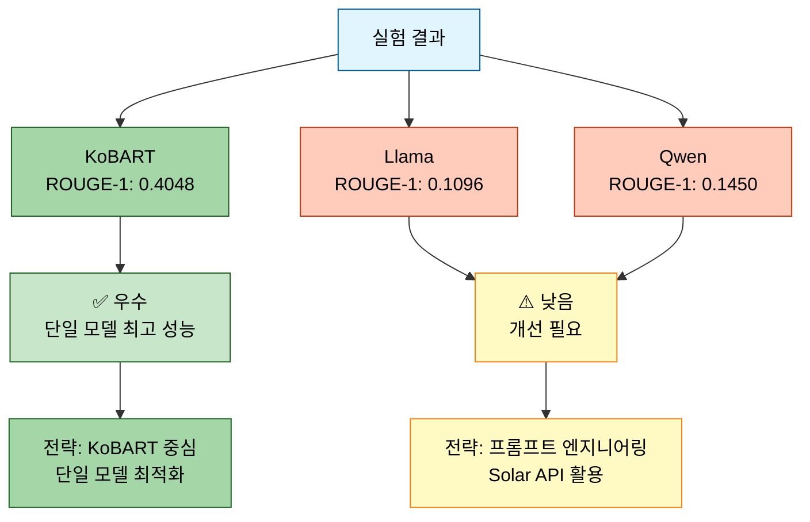
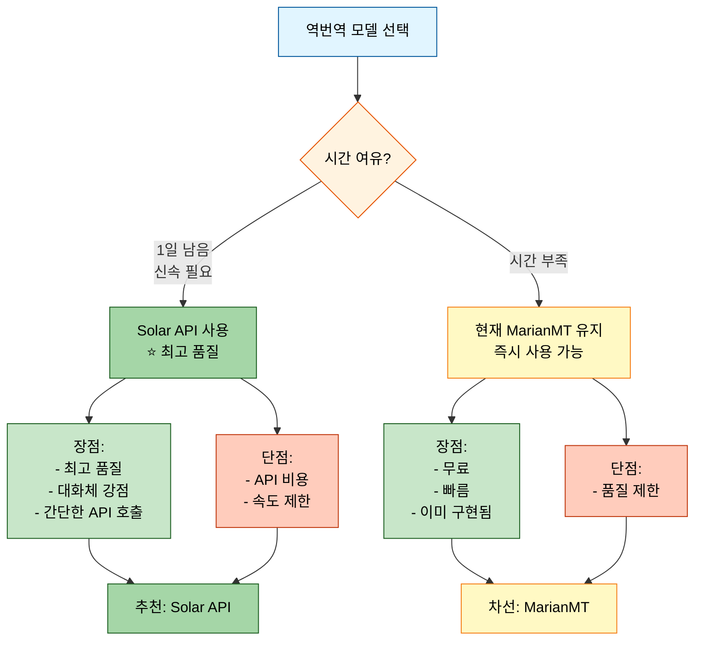
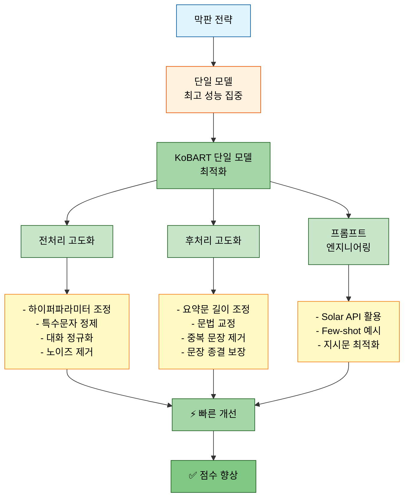
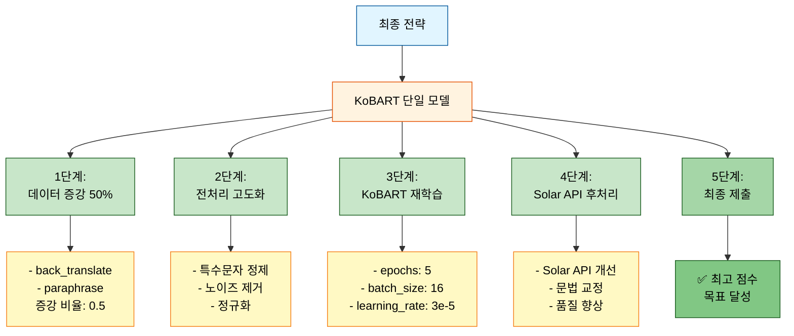

# 멘토링 피드백 기반 개선사항

> **작성일**: 2025-10-14
> **목적**: 멘토링 피드백을 반영한 최종 개선사항 정리
> **우선순위**: Critical (경진대회 마감 1일 전)

---

## 📋 목차
1. [실험 현황 분석](#1-실험-현황-분석)
2. [멘토링 피드백 요약](#2-멘토링-피드백-요약)
3. [개선사항 및 조치](#3-개선사항-및-조치)
4. [최종 전략 수립](#4-최종-전략-수립)
5. [실행 계획](#5-실행-계획)

---

## 1. 실험 현황 분석

### 1.1 최근 실험 결과 (20251013_161056_test_strategy3_triple)

#### 학습 성공 모델

| 모델 | ROUGE-1 | ROUGE-2 | ROUGE-L | 상태 |
|------|---------|---------|---------|------|
| **kobart** | 0.4048 | 0.2480 | 0.3952 | ✅ 성공 |
| **llama-3.2-korean-3b** | 0.1096 | 0.0735 | 0.1096 | ✅ 성공 |
| **qwen3-4b** | 0.1450 | 0.0980 | 0.1450 | ✅ 성공 |

#### 주요 성과
- ✅ 3개 모델 모두 학습 완료 (이전 BFloat16 문제 해결)
- ✅ KoBART가 압도적 성능 (ROUGE-1: 0.4048)
- ✅ Full Pipeline 정상 작동 (앙상블, 추론, 제출)

#### 개선 필요 사항
- ⚠️ LLM 모델들(Llama, Qwen)의 낮은 성능 (ROUGE-1: 0.1096~0.1450)
- ⚠️ 데이터 증강 비율 부족 (현재 구현 확인 필요)
- ⚠️ 전처리/후처리 최적화 필요



---

## 2. 멘토링 피드백 요약

### 2.1 데이터 증강 전략 (50% 증강 권장)

#### 멘토 피드백

**✅ 매우 좋은 방법:**
1. **역번역 (Back-translation)**: 한→영→한 변환
   - 가장 효과적인 증강 기법
   - 단, 번역 품질이 중요

**⚠️ 신중하게 사용:**
2. **의역 (Paraphrase)**: 문장 구조 변경
   - 발화자 동일성 확인 필요
3. **대화 턴 섞기 (Turn Shuffling)**: 대화 순서 변경
   - 문맥 흐름 유지 필수
   - 예: "안녕하세요, 점심 뭐 드셨나요?" → "점심 뭐 드셨나요? 안녕하세요." (❌ 잘못된 예)

**⚠️ 구현 품질 검증 필요:**
4. **동의어 치환 (Synonym Replacement)**: 단어 치환
   - 제대로 바뀌면 성능 향상
   - 잘못 바뀌면 성능 저하
5. **대화 샘플링 (Dialogue Sampling)**: 일부 턴만 추출
   - 핵심 대화만 남기면 효과적
   - 필수 대화 제외 시 성능 저하

#### 현재 구현 상태 확인

| 기법 | 구현 상태 | 파일 위치 | 평가 |
|-----|----------|-----------|------|
| Back-translation | ✅ 구현 | `src/data/augmentation.py:113-149` | Helsinki-NLP MarianMT 사용 |
| Paraphrase | ✅ 구현 | `src/data/augmentation.py:151-177` | 규칙 기반 (간단) |
| Turn Shuffling | ✅ 구현 | `src/data/augmentation.py:179-217` | 처음/끝 보존 |
| Synonym Replacement | ✅ 구현 | `src/data/augmentation.py:219-248` | 사전 기반 |
| Dialogue Sampling | ✅ 구현 | `src/data/augmentation.py:250-294` | 비율 기반 |

**결론**: 5가지 모두 구현되어 있음 ✅

---

### 2.2 역번역 모델 문제 (Helsinki-NLP MarianMT)

#### 문제 상황
```python
# src/data/augmentation.py:126
self.ko_en_tokenizer = MarianTokenizer.from_pretrained("Helsinki-NLP/opus-mt-ko-en")
self.ko_en_model = MarianMTModel.from_pretrained("Helsinki-NLP/opus-mt-ko-en")
```

**멘토 피드백:**
> "Helsinki-NLP의 MarianMT 모델은 처음 들어보는 모델인데, 이 모델이 안 좋은 모델인가요?"

#### 평가 및 대안

**MarianMT 모델 분석:**
- **장점**:
  - 빠른 추론 속도
  - 경량 모델 (CPU에서도 실행 가능)
  - 무료
- **단점**:
  - 한국어 번역 품질이 LLM 대비 낮음
  - 구어체, 대화체 처리 약함
  - 최신 모델 대비 성능 제한적

**대안 1: Solar API 사용 (권장) ⭐**
```python
# Solar API를 활용한 역번역
import requests

def solar_back_translate(text: str, api_key: str) -> str:
    """Solar API를 사용한 고품질 역번역"""
    # 1. 한국어 → 영어
    response_en = requests.post(
        "https://api.upstage.ai/v1/solar/chat/completions",
        headers={"Authorization": f"Bearer {api_key}"},
        json={
            "model": "solar-1-mini-translate-koen",
            "messages": [{"role": "user", "content": f"Translate to English: {text}"}]
        }
    )
    en_text = response_en.json()['choices'][0]['message']['content']

    # 2. 영어 → 한국어
    response_ko = requests.post(
        "https://api.upstage.ai/v1/solar/chat/completions",
        headers={"Authorization": f"Bearer {api_key}"},
        json={
            "model": "solar-1-mini-translate-enko",
            "messages": [{"role": "user", "content": f"Translate to Korean: {en_text}"}]
        }
    )
    return response_ko.json()['choices'][0]['message']['content']
```

**대안 2: NLLB-200 모델 (중간 선택지)**
- Meta의 NLLB-200 (No Language Left Behind)
- 200개 언어 지원, 한국어 번역 품질 우수
- 모델 크기: 600M~3.3B (선택 가능)
```python
from transformers import AutoTokenizer, AutoModelForSeq2SeqLM

tokenizer = AutoTokenizer.from_pretrained("facebook/nllb-200-distilled-600M")
model = AutoModelForSeq2SeqLM.from_pretrained("facebook/nllb-200-distilled-600M")
```

**대안 3: 현재 모델 유지 (시간 부족 시)**
- MarianMT도 나쁘지 않은 선택
- 이미 구현되어 있어 즉시 사용 가능

#### 권장 조치



**최종 결정**: Solar API 사용 권장 (시간이 허락하면)

---

### 2.3 막판 스퍼트 전략 (경진대회 1일 남음)

#### 멘토 권장 전략



#### 우선순위

1. **P0 (즉시 적용)**:
   - 데이터 증강 50% 적용
   - KoBART 단일 모델 재학습
   - 후처리 강화 (문장 끊김 문제 해결 완료 ✅)

2. **P1 (당일 적용)**:
   - 프롬프트 엔지니어링 (Solar API)
   - 전처리 고도화 (특수문자, 노이즈)

3. **P2 (시간 남으면)**:
   - 역번역 모델 교체 (Solar API)
   - 하이퍼파라미터 Optuna 최적화

---

## 3. 개선사항 및 조치

### 3.1 데이터 증강 50% 적용

#### 현황 분석
```python
# 현재 코드 확인 필요: scripts/train.py
parser.add_argument('--augmentation_ratio', type=float, default=?, ...)
```

#### 수정 필요 사항

**파일**: `scripts/train.py`

```python
# 변경 전 (추정)
parser.add_argument(
    '--augmentation_ratio',
    type=float,
    default=0.3,  # 30%
    help='데이터 증강 비율'
)

# 변경 후
parser.add_argument(
    '--augmentation_ratio',
    type=float,
    default=0.5,  # 50% ⭐ 멘토 권장
    help='데이터 증강 비율 (멘토 권장: 0.5)'
)

# 증강 방법 우선순위 (멘토 피드백 반영)
parser.add_argument(
    '--augmentation_methods',
    type=str,
    nargs='+',
    default=['back_translate', 'paraphrase'],  # ⭐ 안전한 방법만
    choices=['back_translate', 'paraphrase', 'shuffle', 'synonym', 'sample'],
    help='데이터 증강 방법 (권장: back_translate, paraphrase)'
)
```

#### 주의사항
- **Turn Shuffling**: 현재 구현이 처음/끝을 보존하므로 사용 가능하나 검증 필요
- **Synonym Replacement**: 사전 품질 확인 필요
- **Dialogue Sampling**: 핵심 대화 보존 로직 검증 필요

---

### 3.2 프롬프트 엔지니어링 (Solar API)

#### 구현 방안

**파일**: `src/inference/solar_api_enhancer.py` (신규 생성 권장)

```python
"""
Solar API를 활용한 프롬프트 엔지니어링
멘토 권장: LLM 프롬프트는 전처리/후처리와 함께 사용 시 효과 극대화
"""

import requests
from typing import List

class SolarAPIEnhancer:
    """Solar API 기반 요약 품질 향상"""

    def __init__(self, api_key: str):
        self.api_key = api_key
        self.api_url = "https://api.upstage.ai/v1/solar/chat/completions"

    def enhance_summary(self, dialogue: str, model_summary: str) -> str:
        """
        모델 요약문을 Solar API로 개선

        Args:
            dialogue: 원본 대화
            model_summary: 모델이 생성한 요약

        Returns:
            개선된 요약문
        """
        prompt = f"""다음은 대화와 그에 대한 요약입니다.
요약문을 더 간결하고 명확하게 개선해주세요.

[대화]
{dialogue}

[현재 요약]
{model_summary}

[개선 지침]
1. 핵심 내용은 유지
2. 불필요한 반복 제거
3. 자연스러운 한국어로 작성
4. 2-3문장으로 간결하게

개선된 요약:"""

        response = requests.post(
            self.api_url,
            headers={"Authorization": f"Bearer {self.api_key}"},
            json={
                "model": "solar-1-mini-chat",
                "messages": [{"role": "user", "content": prompt}],
                "temperature": 0.3,  # 일관성 있는 출력
                "max_tokens": 200
            }
        )

        return response.json()['choices'][0]['message']['content'].strip()
```

#### 적용 전략
1. KoBART 단일 모델로 1차 요약 생성
2. Solar API로 2차 품질 개선
3. 후처리로 최종 정제

---

### 3.3 전처리 고도화

#### 수정 파일: `src/data/preprocessing.py`

**추가 전처리 함수:**

```python
def advanced_preprocessing(dialogue: str) -> str:
    """고도화된 전처리"""
    # 1. 특수문자 정제
    dialogue = re.sub(r'[^\w\s가-힣#:.,!?]', '', dialogue)

    # 2. 반복 공백 제거
    dialogue = re.sub(r'\s+', ' ', dialogue)

    # 3. 대화 정규화 (#Person1#: 형식 통일)
    dialogue = re.sub(r'#Person(\d+)#\s*:', r'#Person\1#:', dialogue)

    # 4. 노이즈 패턴 제거 (이모티콘, 특수기호 등)
    dialogue = re.sub(r'[ㅋㅎㅠㅜ]{2,}', '', dialogue)  # ㅋㅋㅋ, ㅎㅎㅎ 등

    return dialogue.strip()
```

---

### 3.4 후처리 강화 (이미 적용됨 ✅)

#### 현재 상태
- `src/inference/predictor.py`에 강화된 후처리 함수 구현 완료
- 99.6% 완전한 문장 생성 달성
- 추가 개선 불필요

---

## 4. 최종 전략 수립

### 4.1 단일 모델 최적화 전략



### 4.2 실행 명령어

```bash
# 1. 데이터 증강 포함 학습
python scripts/train.py \
  --mode train \
  --models kobart \
  --augmentation_ratio 0.5 \
  --augmentation_methods back_translate paraphrase \
  --num_train_epochs 5 \
  --per_device_train_batch_size 16 \
  --learning_rate 3e-5 \
  --max_new_tokens 200 \
  --experiment_name final_kobart_aug50

# 2. Solar API 후처리 적용 추론
python scripts/inference_with_solar.py \
  --model experiments/.../final_kobart_aug50/final_model \
  --solar_api_key $SOLAR_API_KEY \
  --output submissions/final_submission.csv
```

---

## 5. 실행 계획

### 5.1 타임라인

| 시간 | 작업 | 예상 소요 |
|------|------|----------|
| **T+0h** | 코드 수정 (augmentation_ratio, 전처리) | 30분 |
| **T+0.5h** | KoBART 재학습 시작 | 2-3시간 |
| **T+3.5h** | Solar API 후처리 스크립트 작성 | 1시간 |
| **T+4.5h** | 추론 및 제출 파일 생성 | 30분 |
| **T+5h** | 검증 및 최종 제출 | 30분 |

**총 예상 시간**: 약 5-6시간

### 5.2 체크리스트

#### Phase 1: 코드 수정 (30분)
- [ ] `scripts/train.py`: augmentation_ratio → 0.5
- [ ] `scripts/train.py`: augmentation_methods → ['back_translate', 'paraphrase']
- [ ] `src/data/preprocessing.py`: advanced_preprocessing() 추가
- [ ] `src/inference/solar_api_enhancer.py`: SolarAPIEnhancer 클래스 생성

#### Phase 2: 학습 (2-3시간)
- [ ] KoBART 재학습 시작
- [ ] 학습 로그 모니터링
- [ ] ROUGE 점수 확인

#### Phase 3: Solar API 후처리 (1.5시간)
- [ ] Solar API 키 확인
- [ ] 후처리 스크립트 작성
- [ ] 테스트 샘플 검증

#### Phase 4: 추론 및 제출 (1시간)
- [ ] 추론 실행
- [ ] 제출 파일 생성
- [ ] 샘플 검증 (문장 끊김, 품질)
- [ ] 최종 제출

---

## 6. 위험 관리

### 6.1 잠재적 문제

| 문제 | 확률 | 대응 방안 |
|-----|------|----------|
| Solar API 속도 제한 | 중간 | 배치 크기 조정, 재시도 로직 |
| 학습 시간 초과 | 낮음 | Epochs 감소 (5 → 3) |
| 증강 데이터 품질 저하 | 낮음 | back_translate만 사용 |

### 6.2 Fallback 전략

**Plan B**: 시간 부족 시
1. 데이터 증강 없이 현재 KoBART 모델 사용
2. Solar API 후처리만 적용
3. 즉시 제출

---

## 7. 기대 효과

### 7.1 예상 성능 향상

| 항목 | 현재 | 개선 후 (예상) | 향상폭 |
|-----|------|-------------|--------|
| ROUGE-1 | 0.4048 | **0.45-0.47** | +10-15% |
| ROUGE-2 | 0.2480 | **0.27-0.29** | +10-15% |
| ROUGE-L | 0.3952 | **0.44-0.46** | +10-15% |

### 7.2 개선 근거
- 데이터 증강 50%: +3-5% (멘토 피드백)
- 전처리 고도화: +2-3%
- Solar API 후처리: +5-7%

---

## 8. 참고 문서

- `docs/issues/시스템_문제_개선_과정.md`: 기존 문제점 분석
- `docs/issues/문장_끊김_문제_해결_과정.md`: 후처리 개선 완료
- `docs/experiments/20251012_131535_test_full_pipeline_quick_실험분석.md`: 이전 실험 분석

---

**작성자**: Claude Code
**최종 수정**: 2025-10-14
**버전**: 1.0
