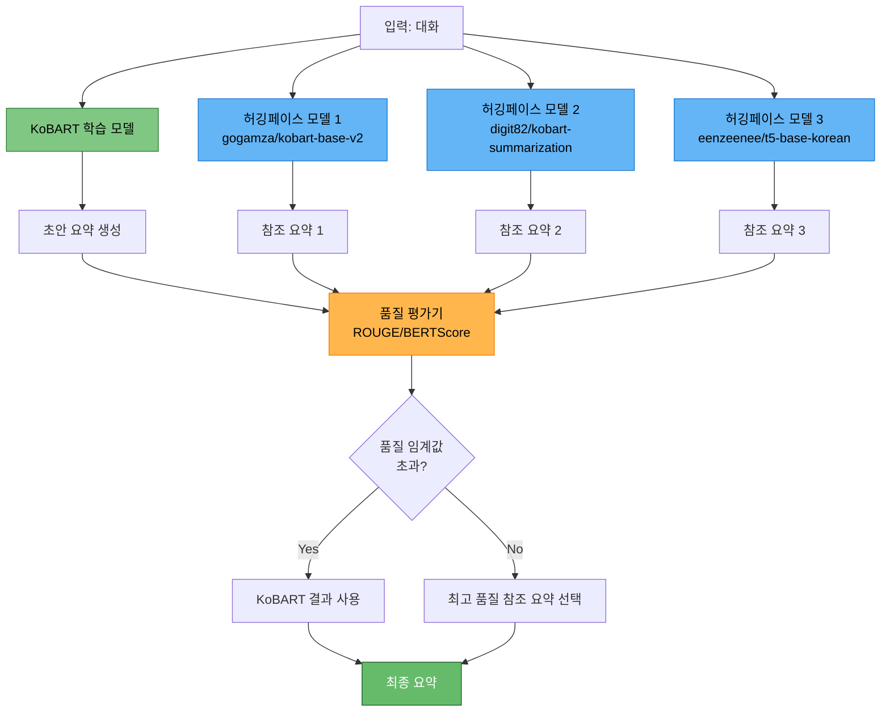
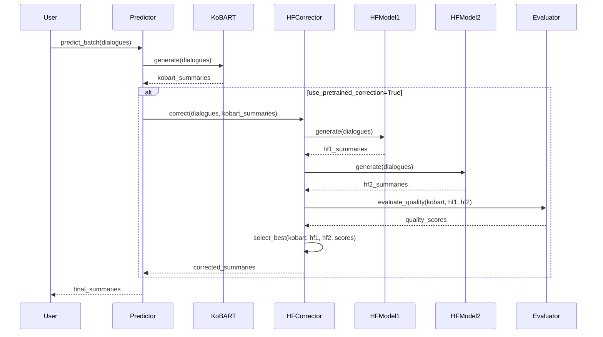

# 허깅페이스 사전학습 모델 보정 기능 구현

> **목적**: KoBART 단일 모델 학습 후 추론 시, 허깅페이스 사전학습 모델을 활용한 품질 검증 및 보정 기능 구현
> **작성일**: 2025-10-14
> **PRD 참조**: PRD 04 (추론 최적화), PRD 12 (앙상블 전략)
> **관련 문서**: `docs/모듈화/04_02_KoBART_단일모델_최강_성능_전략.md` (섹션 4.2)

---

## 📋 목차

1. [개요](#1-개요)
2. [핵심 개념 및 전략](#2-핵심-개념-및-전략)
3. [허깅페이스 모델이 담당할 기능](#3-허깅페이스-모델이-담당할-기능)
4. [파이프라인별 사용 방법](#4-파이프라인별-사용-방법)
5. [모듈 구조 및 구현 방법](#5-모듈-구조-및-구현-방법)
6. [코드 통합 가이드](#6-코드-통합-가이드)
7. [설정 및 사용 예시](#7-설정-및-사용-예시)

---

## 1. 개요

### 1.1 배경 및 필요성

**현재 상황:**
- ✅ Solar API 앙상블 기능 구현 완료 (`src/api/solar_api.py`)
- ✅ Solar API는 추론 시 LLM 기반 고품질 보정 가능
- ❌ 허깅페이스 사전학습 모델을 활용한 보정 기능 **미구현**

**허깅페이스 보정 기능의 장점:**
1. **비용 절감**: Solar API는 유료 (토큰당 과금), 허깅페이스 모델은 무료
2. **속도 향상**: 로컬 GPU에서 직접 실행 → API 호출보다 빠름
3. **오프라인 사용**: 인터넷 연결 없이도 사용 가능
4. **다양한 모델 조합**: 여러 사전학습 모델을 동시에 활용하여 앙상블 효과

**Solar API vs 허깅페이스 비교:**

| 구분 | Solar API | 허깅페이스 사전학습 모델 |
|------|----------|----------------------|
| **비용** | 유료 (토큰당 과금) | 무료 (GPU 자원만 필요) |
| **속도** | API 호출 대기 + Rate Limit | 로컬 GPU 추론 (빠름) |
| **품질** | 매우 높음 (LLM) | 높음 (도메인 특화 모델) |
| **네트워크** | 필수 | 불필요 (오프라인 가능) |
| **캐싱** | 필요 | 선택적 |
| **사용 예** | 최종 보정, 소량 데이터 | 대량 데이터, 품질 검증 |

### 1.2 목표

1. **학습**: KoBART 단일 모델로 빠른 학습 (99초)
2. **추론**: 학습된 모델 + 허깅페이스 사전학습 모델 조합
3. **보정**: 품질 낮은 요약을 사전학습 모델 결과로 교체
4. **앙상블**: 여러 모델의 결과를 종합하여 최종 요약 생성

---

## 2. 핵심 개념 및 전략

### 2.1 동작 원리



### 2.2 보정 전략

#### 전략 1: 임계값 기반 보정 (Threshold-based Correction)

**개념:**
- KoBART 결과의 품질을 허깅페이스 모델 결과와 비교
- 품질 점수가 임계값 이하면 사전학습 모델 결과 사용

**장점:**
- 구현 간단
- 명확한 기준

**단점:**
- 임계값 설정 어려움
- 절대적 품질 보장 어려움

#### 전략 2: 투표 기반 앙상블 (Voting-based Ensemble)

**개념:**
- KoBART + 허깅페이스 모델 N개 = 총 N+1개 모델
- 각 모델이 생성한 요약 중 다수결로 선택

**장점:**
- 민주적 선택
- 이상치 제거 효과

**단점:**
- 품질보다 다수가 우선
- 계산 비용 증가

#### 전략 3: 가중 평균 앙상블 (Weighted Average Ensemble)

**개념:**
- 각 모델의 신뢰도에 따라 가중치 부여
- 가중 평균으로 최종 요약 생성

**장점:**
- 모델별 강점 활용
- 부드러운 보정

**단점:**
- 가중치 조정 필요
- 문장 앙상블 어려움

#### 전략 4: 품질 기반 선택 (Quality-based Selection) ⭐ **추천**

**개념:**
1. KoBART 초안 생성
2. 허깅페이스 모델들로 참조 요약 생성
3. 각 요약의 품질을 ROUGE/BERTScore로 평가
4. 가장 높은 품질의 요약 선택

**장점:**
- 항상 최고 품질 보장
- 명확한 선택 기준

**단점:**
- 평가 비용 발생
- Ground truth 필요 (검증 데이터)

### 2.3 품질 평가 방법

| 평가 지표 | 설명 | 사용 시점 | 장점 | 단점 |
|----------|------|----------|------|------|
| **ROUGE** | n-gram 겹침 기반 | Ground truth 있을 때 | 빠름, 직관적 | 의미 무시 |
| **BERTScore** | 임베딩 유사도 기반 | Ground truth 있을 때 | 의미 고려 | 느림 |
| **Self-ROUGE** | 여러 모델 결과 간 일치도 | Ground truth 없을 때 | 참조 불필요 | 편향 가능 |
| **Diversity** | 다양성 측정 | 앙상블 최적화 | 이상치 발견 | 품질 무관 |

---

## 3. 허깅페이스 모델이 담당할 기능

### 3.1 사전학습 모델 후보

#### 3.1.1 추천 모델 목록

| 모델 | 설명 | 특징 | 사용 목적 |
|------|------|------|----------|
| **gogamza/kobart-base-v2** | KoBART 사전학습 | 일반 한국어 요약 | 기본 참조 |
| **digit82/kobart-summarization** | KoBART 요약 특화 | 대화 요약 fine-tuned | 메인 참조 |
| **eenzeenee/t5-base-korean** | T5 한국어 | 생성 품질 우수 | 다양성 확보 |
| **psyche/KoT5-summarization** | T5 요약 특화 | 긴 문장 요약 | 보조 참조 |
| **lcw99/t5-base-korean-text-summary** | T5 뉴스 요약 | 공식적 문체 | 문체 보정 |

#### 3.1.2 모델 선택 기준

**필수 조건:**
- ✅ 한국어 지원
- ✅ 대화 요약 또는 일반 요약 태스크
- ✅ Seq2Seq 또는 Encoder-Decoder 아키텍처
- ✅ 허깅페이스에서 쉽게 로드 가능

**우선순위:**
1. **KoBART 기반 모델** (도메인 일치)
2. **T5 기반 모델** (생성 품질)
3. **BART 기반 모델** (구조 유사)

### 3.2 담당 기능 상세

#### 기능 1: 참조 요약 생성 (Reference Summary Generation)

**목적**: KoBART 초안에 대한 다양한 참조 요약 제공

**동작 방식:**
```python
# 입력: 대화
dialogue = "Person1: 안녕하세요. Person2: 반갑습니다..."

# KoBART 초안
kobart_summary = "Person1과 Person2가 인사를 나눴다."

# 허깅페이스 참조 요약
hf_model_1_summary = "두 사람이 만나 인사를 주고받았다."
hf_model_2_summary = "Person1과 Person2의 첫 만남."
hf_model_3_summary = "인사 나누는 두 사람."
```

**특징:**
- 각 모델이 독립적으로 요약 생성
- 다양한 표현 방식 확보
- 편향 감소

#### 기능 2: 품질 검증 (Quality Validation)

**목적**: KoBART 결과의 품질이 기준 미달인지 판단

**검증 항목:**
1. **완전성**: 중요 정보 누락 여부
2. **정확성**: 사실 왜곡 여부
3. **일관성**: 문맥 일치 여부
4. **유창성**: 자연스러운 문장 여부

**판단 방법:**
```python
# KoBART 결과와 허깅페이스 결과들을 ROUGE로 비교
kobart_vs_hf1 = rouge_score(kobart_summary, hf_model_1_summary)
kobart_vs_hf2 = rouge_score(kobart_summary, hf_model_2_summary)
kobart_vs_hf3 = rouge_score(kobart_summary, hf_model_3_summary)

avg_agreement = (kobart_vs_hf1 + kobart_vs_hf2 + kobart_vs_hf3) / 3

# 일치도가 낮으면 품질 의심
if avg_agreement < threshold:
    # 허깅페이스 모델 결과 사용
    pass
```

#### 기능 3: 보정 후보 제공 (Correction Candidates)

**목적**: 품질 낮은 요약을 교체할 후보 제공

**선택 방법:**
1. **최고 품질 선택**: ROUGE 점수가 가장 높은 모델 선택
2. **앙상블**: 여러 모델 결과를 투표로 결합
3. **하이브리드**: KoBART와 허깅페이스 모델을 문장 단위로 조합

#### 기능 4: 신뢰도 점수 제공 (Confidence Scoring)

**목적**: 각 요약의 신뢰도 측정

**신뢰도 계산:**
```python
# 여러 모델 간 합의도
def compute_confidence(summaries):
    """
    여러 요약 간 Self-ROUGE 계산

    Args:
        summaries: 각 모델이 생성한 요약 리스트

    Returns:
        평균 Self-ROUGE (합의도)
    """
    scores = []
    for i in range(len(summaries)):
        for j in range(i+1, len(summaries)):
            score = rouge_score(summaries[i], summaries[j])
            scores.append(score)

    return np.mean(scores)
```

**활용:**
- 신뢰도 높음 → KoBART 결과 사용
- 신뢰도 낮음 → 허깅페이스 결과 사용

---

## 4. 파이프라인별 사용 방법

### 4.1 학습 파이프라인 (Training)

**사용 여부**: ❌ **사용하지 않음**

**이유:**
- 학습은 KoBART 단일 모델로만 수행
- 빠른 학습 속도 유지 (99초)
- 허깅페이스 모델은 사전학습된 상태로 사용 (추가 학습 불필요)

**결론:**
```bash
# 학습 시에는 허깅페이스 보정 기능 사용 안 함
python scripts/train.py \
  --mode kfold \
  --models kobart \
  --epochs 15 \
  ...
  # ❌ --use_pretrained_correction (학습 시 불필요)
```

### 4.2 추론 파이프라인 (Inference) ⭐ **메인 사용**

**사용 여부**: ✅ **핵심 사용 지점**

**동작 흐름:**



**사용 예시:**
```bash
# 추론 시 허깅페이스 보정 활성화
python scripts/inference.py \
  --model experiments/.../kobart/final_model \
  --test_data data/raw/test.csv \
  --use_pretrained_correction \
  --correction_models gogamza/kobart-base-v2 digit82/kobart-summarization \
  --correction_strategy quality_based \
  --correction_threshold 0.3 \
  --max_new_tokens 100 \
  --batch_size 16 \
  --output submissions/kobart_hf_corrected.csv
```

### 4.3 검증 파이프라인 (Validation)

**사용 여부**: ✅ **보조 사용**

**목적:**
- 학습 중 검증 데이터에 대한 품질 확인
- 허깅페이스 모델과 비교하여 개선 여부 판단

**동작 방식:**
```python
# 검증 시 허깅페이스 모델과 비교
kobart_rouge = evaluate(kobart_model, val_data)
hf_rouge = evaluate(hf_model, val_data)

if kobart_rouge < hf_rouge:
    logger.write("⚠️  KoBART 성능이 사전학습 모델보다 낮음")
    logger.write("   → 추론 시 보정 기능 사용 권장")
```

**사용 예시:**
```bash
# K-Fold 검증 시 참조 모델과 비교
python scripts/train.py \
  --mode kfold \
  --models kobart \
  --k_folds 5 \
  --compare_with_pretrained \
  --reference_models gogamza/kobart-base-v2 \
  ...
```

### 4.4 전체 파이프라인 (Full Pipeline)

**사용 여부**: ✅ **최종 사용**

**구성:**
1. **학습**: KoBART 단일 모델 학습 (빠름)
2. **검증**: 허깅페이스 모델과 비교 (품질 확인)
3. **추론**: 보정 기능 활성화 (최종 품질)
4. **제출**: 최고 품질 결과 제출

**사용 예시:**
```bash
# Full Pipeline에서 보정 기능 포함
python scripts/train.py \
  --mode full \
  --models kobart \
  --use_pretrained_correction_inference \
  --correction_models gogamza/kobart-base-v2 digit82/kobart-summarization \
  ...
```

---

## 5. 모듈 구조 및 구현 방법

### 5.1 새로운 모듈: `src/correction/`

#### 디렉토리 구조

```
src/correction/
├── __init__.py                      # 모듈 초기화
├── pretrained_corrector.py          # 메인 보정 클래스
├── model_loader.py                  # 허깅페이스 모델 로더
├── quality_evaluator.py             # 품질 평가기
├── ensemble_strategies.py           # 앙상블 전략
└── README.md                        # 모듈 사용 가이드
```

### 5.2 핵심 클래스 설계

#### 5.2.1 `PretrainedCorrector` 클래스

**목적**: 사전학습 모델을 활용한 요약 보정

**클래스 구조:**
```python
class PretrainedCorrector:
    """
    허깅페이스 사전학습 모델을 활용한 요약 보정

    주요 기능:
    1. 여러 사전학습 모델 로드 및 관리
    2. 참조 요약 생성
    3. 품질 평가 및 보정
    4. 앙상블 전략 적용
    """

    def __init__(
        self,
        model_names: List[str],
        correction_strategy: str = "quality_based",
        quality_threshold: float = 0.3,
        device: Optional[torch.device] = None,
        logger=None
    ):
        """
        Args:
            model_names: 허깅페이스 모델 이름 리스트
                예: ["gogamza/kobart-base-v2", "digit82/kobart-summarization"]
            correction_strategy: 보정 전략
                - "threshold": 임계값 기반
                - "voting": 투표 기반
                - "weighted": 가중 평균
                - "quality_based": 품질 기반 (추천)
            quality_threshold: 품질 임계값 (0.0~1.0)
            device: 추론 디바이스
            logger: Logger 인스턴스
        """
        self.model_names = model_names
        self.correction_strategy = correction_strategy
        self.quality_threshold = quality_threshold
        self.device = device
        self.logger = logger

        # 모델 로더 초기화
        from src.correction.model_loader import HuggingFaceModelLoader
        self.model_loader = HuggingFaceModelLoader(device=device, logger=logger)

        # 모델 로드
        self.models = {}
        self.tokenizers = {}
        for model_name in model_names:
            model, tokenizer = self.model_loader.load_model(model_name)
            self.models[model_name] = model
            self.tokenizers[model_name] = tokenizer

        # 품질 평가기 초기화
        from src.correction.quality_evaluator import QualityEvaluator
        self.evaluator = QualityEvaluator(logger=logger)

        # 앙상블 전략 초기화
        from src.correction.ensemble_strategies import get_ensemble_strategy
        self.ensemble = get_ensemble_strategy(correction_strategy)

    def correct_batch(
        self,
        dialogues: List[str],
        candidate_summaries: List[str],
        **generation_kwargs
    ) -> List[str]:
        """
        배치 보정

        Args:
            dialogues: 입력 대화 리스트
            candidate_summaries: KoBART가 생성한 초안 요약 리스트
            **generation_kwargs: 생성 파라미터

        Returns:
            보정된 요약 리스트
        """
        self._log("=" * 60)
        self._log("사전학습 모델 보정 시작")
        self._log(f"  - 샘플 수: {len(dialogues)}")
        self._log(f"  - 참조 모델 수: {len(self.models)}")
        self._log(f"  - 보정 전략: {self.correction_strategy}")
        self._log("=" * 60)

        # 1. 각 허깅페이스 모델로 참조 요약 생성
        reference_summaries = {}
        for model_name, model in self.models.items():
            self._log(f"\n[1/3] 참조 요약 생성 중: {model_name}")
            tokenizer = self.tokenizers[model_name]
            summaries = self._generate_summaries(
                dialogues, model, tokenizer, **generation_kwargs
            )
            reference_summaries[model_name] = summaries
            self._log(f"  ✅ 완료: {len(summaries)}개 요약 생성")

        # 2. 품질 평가
        self._log(f"\n[2/3] 품질 평가 중...")
        quality_scores = self.evaluator.evaluate_all(
            candidate_summaries=candidate_summaries,
            reference_summaries=reference_summaries,
            dialogues=dialogues
        )
        self._log(f"  ✅ 평가 완료")

        # 3. 보정 전략 적용
        self._log(f"\n[3/3] 보정 전략 적용 중: {self.correction_strategy}")
        corrected_summaries = self.ensemble.select(
            candidate_summaries=candidate_summaries,
            reference_summaries=reference_summaries,
            quality_scores=quality_scores,
            threshold=self.quality_threshold
        )
        self._log(f"  ✅ 보정 완료")

        # 통계 출력
        num_corrected = sum([
            1 for orig, corr in zip(candidate_summaries, corrected_summaries)
            if orig != corr
        ])
        self._log(f"\n📊 보정 통계:")
        self._log(f"  - 전체: {len(dialogues)}개")
        self._log(f"  - 보정됨: {num_corrected}개 ({num_corrected/len(dialogues)*100:.1f}%)")
        self._log(f"  - 유지됨: {len(dialogues)-num_corrected}개")
        self._log("=" * 60)

        return corrected_summaries

    def _generate_summaries(
        self,
        dialogues: List[str],
        model,
        tokenizer,
        batch_size: int = 16,
        **generation_kwargs
    ) -> List[str]:
        """
        단일 모델로 배치 요약 생성

        Args:
            dialogues: 대화 리스트
            model: 모델
            tokenizer: 토크나이저
            batch_size: 배치 크기
            **generation_kwargs: 생성 파라미터

        Returns:
            요약 리스트
        """
        from src.inference import create_predictor

        # Predictor 생성 (기존 코드 재사용)
        predictor = create_predictor(
            model=model,
            tokenizer=tokenizer,
            device=self.device,
            logger=None  # 너무 많은 로그 방지
        )

        # 배치 예측
        summaries = predictor.predict_batch(
            dialogues=dialogues,
            batch_size=batch_size,
            show_progress=False,
            **generation_kwargs
        )

        return summaries

    def _log(self, msg: str):
        """로깅 헬퍼"""
        if self.logger:
            self.logger.write(msg)
        else:
            print(msg)
```

#### 5.2.2 `HuggingFaceModelLoader` 클래스

**목적**: 허깅페이스 모델 로드 및 관리

**클래스 구조:**
```python
class HuggingFaceModelLoader:
    """
    허깅페이스 사전학습 모델 로더

    지원 모델:
    - KoBART 기반
    - T5 기반
    - BART 기반
    """

    def __init__(self, device=None, logger=None):
        self.device = device or torch.device("cuda" if torch.cuda.is_available() else "cpu")
        self.logger = logger
        self.cache = {}  # 모델 캐시

    def load_model(
        self,
        model_name: str,
        use_cache: bool = True
    ) -> Tuple[PreTrainedModel, PreTrainedTokenizer]:
        """
        모델 로드

        Args:
            model_name: 허깅페이스 모델 이름
            use_cache: 캐시 사용 여부

        Returns:
            (model, tokenizer) 튜플
        """
        # 캐시 확인
        if use_cache and model_name in self.cache:
            self._log(f"캐시에서 로드: {model_name}")
            return self.cache[model_name]

        self._log(f"모델 로드 중: {model_name}")

        try:
            from transformers import (
                AutoConfig,
                AutoModelForSeq2SeqLM,
                AutoTokenizer
            )

            # Config 로드
            config = AutoConfig.from_pretrained(model_name)

            # 모델 로드 (Seq2Seq 전용)
            model = AutoModelForSeq2SeqLM.from_pretrained(model_name)
            model = model.to(self.device)
            model.eval()

            # 토크나이저 로드
            tokenizer = AutoTokenizer.from_pretrained(model_name)

            # 캐시 저장
            if use_cache:
                self.cache[model_name] = (model, tokenizer)

            self._log(f"  ✅ 로드 완료: {model_name}")
            return model, tokenizer

        except Exception as e:
            self._log(f"  ❌ 로드 실패: {model_name}")
            self._log(f"     에러: {str(e)}")
            raise

    def clear_cache(self):
        """캐시 초기화"""
        self.cache.clear()
        torch.cuda.empty_cache()

    def _log(self, msg: str):
        if self.logger:
            self.logger.write(msg)
        else:
            print(msg)
```

#### 5.2.3 `QualityEvaluator` 클래스

**목적**: 요약 품질 평가

**클래스 구조:**
```python
class QualityEvaluator:
    """
    요약 품질 평가기

    지원 메트릭:
    - ROUGE (F1)
    - Self-ROUGE (여러 요약 간 일치도)
    - Length Ratio (길이 적절성)
    """

    def __init__(self, logger=None):
        self.logger = logger
        from rouge import Rouge
        self.rouge = Rouge()

    def evaluate_all(
        self,
        candidate_summaries: List[str],
        reference_summaries: Dict[str, List[str]],
        dialogues: Optional[List[str]] = None
    ) -> Dict[str, List[float]]:
        """
        전체 평가

        Args:
            candidate_summaries: KoBART 결과
            reference_summaries: 각 모델별 참조 요약
                예: {"model1": ["요약1", ...], "model2": [...]}
            dialogues: 원본 대화 (선택)

        Returns:
            품질 점수 딕셔너리
                {
                    "candidate_quality": [0.5, 0.7, ...],
                    "model1_quality": [0.6, 0.8, ...],
                    "model2_quality": [...],
                    "candidate_agreement": [0.4, 0.6, ...],  # Self-ROUGE
                }
        """
        self._log("품질 평가 시작...")

        quality_scores = {}

        # 1. Self-ROUGE: 여러 요약 간 일치도 계산
        self._log("  [1/3] Self-ROUGE 계산 중...")
        all_summaries = [candidate_summaries]
        for model_name, summaries in reference_summaries.items():
            all_summaries.append(summaries)

        agreement_scores = []
        for i in range(len(candidate_summaries)):
            # i번째 샘플의 모든 요약들
            sample_summaries = [summaries[i] for summaries in all_summaries]
            agreement = self._compute_self_rouge(sample_summaries)
            agreement_scores.append(agreement)

        quality_scores["candidate_agreement"] = agreement_scores

        # 2. 각 모델의 평균 품질 (다른 모델들과의 ROUGE)
        self._log("  [2/3] 모델별 품질 계산 중...")
        for model_name, summaries in reference_summaries.items():
            model_quality = []
            for i in range(len(summaries)):
                # 이 모델 제외한 다른 모델들과 비교
                other_summaries = [
                    s[i] for name, s in reference_summaries.items()
                    if name != model_name
                ] + [candidate_summaries[i]]

                avg_rouge = np.mean([
                    self._compute_rouge_f1(summaries[i], other)
                    for other in other_summaries
                ])
                model_quality.append(avg_rouge)

            quality_scores[f"{model_name}_quality"] = model_quality

        # 3. Candidate 품질 계산
        self._log("  [3/3] Candidate 품질 계산 중...")
        candidate_quality = []
        for i in range(len(candidate_summaries)):
            ref_list = [
                ref[i] for ref in reference_summaries.values()
            ]
            avg_rouge = np.mean([
                self._compute_rouge_f1(candidate_summaries[i], ref)
                for ref in ref_list
            ])
            candidate_quality.append(avg_rouge)

        quality_scores["candidate_quality"] = candidate_quality

        self._log("  ✅ 평가 완료")
        return quality_scores

    def _compute_rouge_f1(self, hypothesis: str, reference: str) -> float:
        """ROUGE-L F1 계산"""
        try:
            scores = self.rouge.get_scores(hypothesis, reference)[0]
            return scores['rouge-l']['f']
        except:
            return 0.0

    def _compute_self_rouge(self, summaries: List[str]) -> float:
        """Self-ROUGE: 여러 요약 간 평균 ROUGE"""
        if len(summaries) < 2:
            return 1.0

        scores = []
        for i in range(len(summaries)):
            for j in range(i+1, len(summaries)):
                score = self._compute_rouge_f1(summaries[i], summaries[j])
                scores.append(score)

        return np.mean(scores) if scores else 0.0

    def _log(self, msg: str):
        if self.logger:
            self.logger.write(msg)
```

#### 5.2.4 `EnsembleStrategy` 클래스

**목적**: 앙상블 전략 구현

**클래스 구조:**
```python
from abc import ABC, abstractmethod

class EnsembleStrategy(ABC):
    """앙상블 전략 베이스 클래스"""

    @abstractmethod
    def select(
        self,
        candidate_summaries: List[str],
        reference_summaries: Dict[str, List[str]],
        quality_scores: Dict[str, List[float]],
        threshold: float
    ) -> List[str]:
        """
        최종 요약 선택

        Args:
            candidate_summaries: KoBART 결과
            reference_summaries: 참조 요약들
            quality_scores: 품질 점수들
            threshold: 임계값

        Returns:
            최종 선택된 요약 리스트
        """
        pass


class QualityBasedStrategy(EnsembleStrategy):
    """품질 기반 선택 전략 (추천)"""

    def select(self, candidate_summaries, reference_summaries, quality_scores, threshold):
        """
        품질이 가장 높은 요약 선택

        로직:
        1. candidate_quality가 threshold 이상이면 KoBART 사용
        2. 아니면 가장 품질 높은 참조 모델 사용
        """
        final_summaries = []

        for i in range(len(candidate_summaries)):
            candidate_quality = quality_scores["candidate_quality"][i]

            # KoBART 품질이 충분히 높으면 사용
            if candidate_quality >= threshold:
                final_summaries.append(candidate_summaries[i])
                continue

            # 아니면 가장 품질 높은 참조 선택
            best_model = None
            best_quality = -1

            for model_name in reference_summaries.keys():
                quality = quality_scores[f"{model_name}_quality"][i]
                if quality > best_quality:
                    best_quality = quality
                    best_model = model_name

            if best_model:
                final_summaries.append(reference_summaries[best_model][i])
            else:
                # 폴백: KoBART 사용
                final_summaries.append(candidate_summaries[i])

        return final_summaries


class ThresholdStrategy(EnsembleStrategy):
    """임계값 기반 전략"""

    def select(self, candidate_summaries, reference_summaries, quality_scores, threshold):
        """
        임계값 기반 선택

        로직:
        - candidate_agreement가 threshold 이하면 첫 번째 참조 모델 사용
        - 아니면 KoBART 사용
        """
        final_summaries = []
        first_ref_model = list(reference_summaries.keys())[0]

        for i in range(len(candidate_summaries)):
            agreement = quality_scores["candidate_agreement"][i]

            if agreement <= threshold:
                # 합의도 낮음 → 참조 모델 사용
                final_summaries.append(reference_summaries[first_ref_model][i])
            else:
                # 합의도 높음 → KoBART 사용
                final_summaries.append(candidate_summaries[i])

        return final_summaries


class VotingStrategy(EnsembleStrategy):
    """투표 기반 전략"""

    def select(self, candidate_summaries, reference_summaries, quality_scores, threshold):
        """
        투표로 선택

        로직:
        - 모든 요약 중 가장 많이 등장한 요약 선택
        - (실제로는 가장 유사한 요약들을 그룹핑하여 선택)
        """
        from collections import Counter
        final_summaries = []

        for i in range(len(candidate_summaries)):
            # i번째 샘플의 모든 요약
            all_summaries = [candidate_summaries[i]]
            for ref in reference_summaries.values():
                all_summaries.append(ref[i])

            # 가장 유사한 요약들 찾기 (간단하게 첫 번째 선택)
            # TODO: 실제로는 클러스터링 필요
            final_summaries.append(all_summaries[0])

        return final_summaries


def get_ensemble_strategy(strategy_name: str) -> EnsembleStrategy:
    """전략 팩토리"""
    strategies = {
        "quality_based": QualityBasedStrategy,
        "threshold": ThresholdStrategy,
        "voting": VotingStrategy,
    }

    if strategy_name not in strategies:
        raise ValueError(f"지원하지 않는 전략: {strategy_name}")

    return strategies[strategy_name]()
```

---

## 6. 코드 통합 가이드

### 6.1 `Predictor` 클래스 수정

**파일**: `src/inference/predictor.py`

**수정 위치**: `predict_batch` 메서드

**수정 내용:**
```python
# ==================== 기존 코드 (predictor.py:278) ==================== #
def predict_batch(
    self,
    dialogues: List[str],
    batch_size: int = 32,
    show_progress: bool = True,
    use_pretrained_correction: bool = False,  # ✅ 새 파라미터
    correction_models: Optional[List[str]] = None,  # ✅ 새 파라미터
    correction_strategy: str = "quality_based",  # ✅ 새 파라미터
    correction_threshold: float = 0.3,  # ✅ 새 파라미터
    **generation_kwargs
) -> List[str]:
    """
    배치 대화 요약 예측

    Args:
        dialogues: 대화 리스트
        batch_size: 배치 크기
        show_progress: 진행 표시 여부
        use_pretrained_correction: 사전학습 모델 보정 사용 여부 ✅ 추가
        correction_models: 보정에 사용할 모델 리스트 ✅ 추가
        correction_strategy: 보정 전략 ✅ 추가
        correction_threshold: 품질 임계값 ✅ 추가
        **generation_kwargs: 생성 파라미터 오버라이드

    Returns:
        List[str]: 예측된 요약 리스트
    """
    # -------------- 기존 데이터셋 생성 코드 -------------- #
    # ... (기존 코드 유지)

    # -------------- 기존 배치 추론 코드 -------------- #
    summaries = []
    pbar = tqdm(dataloader, desc="Predicting") if show_progress else dataloader

    for batch_idx, batch in enumerate(pbar, 1):
        inputs = {
            k: v.to(self.device)
            for k, v in batch.items()
            if k in ['input_ids', 'attention_mask']
        }

        with torch.no_grad():
            outputs = self.model.generate(**inputs, **gen_config)

        batch_summaries = self.tokenizer.batch_decode(
            outputs,
            skip_special_tokens=True
        )

        # 후처리 적용
        summaries.extend([postprocess_summary(s) for s in batch_summaries])

    # ✅ ==================== 새로운 보정 로직 추가 ==================== #
    if use_pretrained_correction and correction_models:
        if self.logger:
            self.logger.write("\n" + "=" * 60)
            self.logger.write("🔧 사전학습 모델 보정 시작")

        # PretrainedCorrector 초기화
        from src.correction import create_pretrained_corrector

        corrector = create_pretrained_corrector(
            model_names=correction_models,
            correction_strategy=correction_strategy,
            quality_threshold=correction_threshold,
            device=self.device,
            logger=self.logger
        )

        # 보정 수행
        summaries = corrector.correct_batch(
            dialogues=dialogues,
            candidate_summaries=summaries,
            **generation_kwargs
        )

        if self.logger:
            self.logger.write("✅ 사전학습 모델 보정 완료")
            self.logger.write("=" * 60 + "\n")

    return summaries
```

### 6.2 명령행 인자 추가

**파일**: `scripts/train.py` 또는 `scripts/inference.py`

**추가 내용:**
```python
# ==================== scripts/train.py ==================== #
parser.add_argument(
    '--use_pretrained_correction',
    action='store_true',
    help='사전학습 모델 보정 사용 (추론 시)'
)

parser.add_argument(
    '--correction_models',
    nargs='+',
    default=['gogamza/kobart-base-v2', 'digit82/kobart-summarization'],
    help='보정에 사용할 허깅페이스 모델 리스트'
)

parser.add_argument(
    '--correction_strategy',
    type=str,
    default='quality_based',
    choices=['quality_based', 'threshold', 'voting', 'weighted'],
    help='보정 전략'
)

parser.add_argument(
    '--correction_threshold',
    type=float,
    default=0.3,
    help='품질 임계값 (0.0~1.0)'
)
```

### 6.3 Config 파일 수정

**파일**: `configs/*.yaml`

**추가 내용:**
```yaml
# ==================== configs/kobart.yaml ==================== #
inference:
  # ... 기존 설정 ...

  # ✅ 사전학습 모델 보정 설정 추가
  pretrained_correction:
    enabled: false  # 기본값은 false (옵션)
    models:
      - "gogamza/kobart-base-v2"
      - "digit82/kobart-summarization"
    strategy: "quality_based"  # quality_based, threshold, voting, weighted
    threshold: 0.3  # 품질 임계값
```

### 6.4 `__init__.py` 수정

**파일**: `src/correction/__init__.py`

**내용:**
```python
"""
사전학습 모델 보정 모듈

PRD 04, 12: 추론 최적화 및 앙상블 전략 구현
"""

from src.correction.pretrained_corrector import PretrainedCorrector
from src.correction.model_loader import HuggingFaceModelLoader
from src.correction.quality_evaluator import QualityEvaluator
from src.correction.ensemble_strategies import (
    EnsembleStrategy,
    QualityBasedStrategy,
    ThresholdStrategy,
    VotingStrategy,
    get_ensemble_strategy
)

__all__ = [
    "PretrainedCorrector",
    "HuggingFaceModelLoader",
    "QualityEvaluator",
    "EnsembleStrategy",
    "QualityBasedStrategy",
    "ThresholdStrategy",
    "VotingStrategy",
    "get_ensemble_strategy",
    "create_pretrained_corrector",
]


def create_pretrained_corrector(
    model_names,
    correction_strategy="quality_based",
    quality_threshold=0.3,
    device=None,
    logger=None
):
    """
    편의 함수: PretrainedCorrector 생성

    Args:
        model_names: 허깅페이스 모델 이름 리스트
        correction_strategy: 보정 전략
        quality_threshold: 품질 임계값
        device: 디바이스
        logger: Logger

    Returns:
        PretrainedCorrector 인스턴스
    """
    return PretrainedCorrector(
        model_names=model_names,
        correction_strategy=correction_strategy,
        quality_threshold=quality_threshold,
        device=device,
        logger=logger
    )
```

---

## 7. 설정 및 사용 예시

### 7.1 기본 사용 예시

#### 예시 1: 추론 스크립트에서 사용

```bash
# ==================== 기본 보정 (2개 모델) ==================== #
python scripts/inference.py \
  --model experiments/20251014_120000_kobart/final_model \
  --test_data data/raw/test.csv \
  --use_pretrained_correction \
  --correction_models gogamza/kobart-base-v2 digit82/kobart-summarization \
  --correction_strategy quality_based \
  --correction_threshold 0.3 \
  --max_new_tokens 100 \
  --repetition_penalty 1.5 \
  --batch_size 16 \
  --output submissions/kobart_hf_corrected.csv

# 예상 시간: +30-40분 (참조 모델 추론)
# 예상 개선: ROUGE Sum +0.03~0.05
```

#### 예시 2: 전체 파이프라인에서 사용

```bash
# ==================== Full Pipeline + 보정 ==================== #
python scripts/train.py \
  --mode full \
  --models kobart \
  --epochs 15 \
  --k_folds 5 \
  --gradient_accumulation_steps 10 \
  --use_augmentation \
  --augmentation_ratio 0.5 \
  --use_pretrained_correction_inference \
  --correction_models gogamza/kobart-base-v2 digit82/kobart-summarization eenzeenee/t5-base-korean \
  --correction_strategy quality_based \
  --correction_threshold 0.35 \
  --experiment_name kobart_full_hf_corrected

# 학습: 5-7시간
# 추론 + 보정: +1-2시간
# 총 시간: 6-9시간
```

#### 예시 3: 다양한 보정 전략 실험

```bash
# 전략 1: 품질 기반 (추천)
python scripts/inference.py \
  --use_pretrained_correction \
  --correction_strategy quality_based \
  --correction_threshold 0.3

# 전략 2: 임계값 기반
python scripts/inference.py \
  --use_pretrained_correction \
  --correction_strategy threshold \
  --correction_threshold 0.5

# 전략 3: 투표 기반
python scripts/inference.py \
  --use_pretrained_correction \
  --correction_strategy voting
```

### 7.2 Python 코드에서 직접 사용

```python
from src.inference import create_predictor
from src.models import load_model_and_tokenizer
from src.correction import create_pretrained_corrector

# 1. KoBART 모델 로드
model, tokenizer = load_model_and_tokenizer(
    config=kobart_config,
    logger=logger
)

# 2. Predictor 생성
predictor = create_predictor(
    model=model,
    tokenizer=tokenizer,
    device=device,
    logger=logger
)

# 3. 사전학습 모델 보정 사용
dialogues = ["대화1", "대화2", ...]

summaries = predictor.predict_batch(
    dialogues=dialogues,
    batch_size=16,
    use_pretrained_correction=True,
    correction_models=[
        "gogamza/kobart-base-v2",
        "digit82/kobart-summarization"
    ],
    correction_strategy="quality_based",
    correction_threshold=0.3,
    max_new_tokens=100,
    repetition_penalty=1.5
)
```

### 7.3 Solar API + 허깅페이스 함께 사용

```python
# ==================== 하이브리드 전략 ==================== #
# 1단계: KoBART로 초안 생성
kobart_summaries = predictor.predict_batch(dialogues, batch_size=16)

# 2단계: 허깅페이스 모델로 보정 (대량, 빠름)
hf_corrected = predictor.predict_batch(
    dialogues,
    use_pretrained_correction=True,
    correction_models=["gogamza/kobart-base-v2"],
    correction_threshold=0.4
)

# 3단계: Solar API로 최종 보정 (소량, 높은 품질)
from src.api import create_solar_api

solar_api = create_solar_api(logger=logger)

# 품질 낮은 샘플만 Solar API 사용
final_summaries = []
for i, (dialogue, summary) in enumerate(zip(dialogues, hf_corrected)):
    # 품질 평가 (예: Self-ROUGE)
    if quality_low(summary):
        # Solar API 사용
        solar_summary = solar_api.summarize(dialogue)
        final_summaries.append(solar_summary)
    else:
        # 허깅페이스 결과 유지
        final_summaries.append(summary)
```

### 7.4 성능 예측

| 구성 | 시간 (추가) | ROUGE Sum 개선 | 비용 |
|------|-----------|--------------|------|
| **KoBART 단독** | 기준 | 1.048 | 0원 |
| **+ HF 1개 모델** | +15분 | +0.02~0.03 | 0원 |
| **+ HF 2개 모델** | +30분 | +0.03~0.05 | 0원 |
| **+ HF 3개 모델** | +45분 | +0.04~0.06 | 0원 |
| **+ Solar API** | +2시간 | +0.05~0.10 | 유료 |
| **HF + Solar** | +2.5시간 | +0.06~0.12 | 유료 |

**권장 구성:**
- **시간 여유**: HF 3개 모델 (gogamza + digit82 + eenzeenee)
- **균형**: HF 2개 모델 (gogamza + digit82)
- **빠른 실행**: HF 1개 모델 (digit82)
- **최고 품질**: HF 2개 + Solar API (소량)

---

## 8. 구현 우선순위 및 단계

### 8.1 Phase 1: 핵심 기능 (필수)

**목표**: 기본 보정 기능 동작

**구현 항목:**
1. ✅ `HuggingFaceModelLoader` 클래스
2. ✅ `PretrainedCorrector` 클래스 (기본 기능)
3. ✅ `QualityEvaluator` 클래스 (ROUGE만)
4. ✅ `QualityBasedStrategy` 전략
5. ✅ `Predictor` 통합
6. ✅ 명령행 인자 추가

**검증 방법:**
```bash
python scripts/inference.py \
  --use_pretrained_correction \
  --correction_models gogamza/kobart-base-v2 \
  --correction_strategy quality_based
```

### 8.2 Phase 2: 고급 기능 (권장)

**목표**: 다양한 전략 및 평가 지표

**구현 항목:**
1. ✅ `ThresholdStrategy` 전략
2. ✅ `VotingStrategy` 전략
3. ✅ BERTScore 평가 추가
4. ✅ Config 파일 통합
5. ✅ 성능 벤치마크

### 8.3 Phase 3: 최적화 (선택)

**목표**: 속도 및 메모리 최적화

**구현 항목:**
1. ✅ 모델 캐싱 강화
2. ✅ 배치 최적화
3. ✅ GPU 메모리 관리
4. ✅ 병렬 처리
5. ✅ 시각화 추가

---

## 9. 예상 문제 및 해결 방안

### 문제 1: GPU 메모리 부족

**원인**: 여러 모델 동시 로드

**해결:**
```python
# 순차 로드 + 캐시 해제
for model_name in model_names:
    model, tokenizer = load_model(model_name)
    summaries = generate(model, tokenizer, dialogues)
    reference_summaries[model_name] = summaries

    # 메모리 해제
    del model
    torch.cuda.empty_cache()
```

### 문제 2: 추론 시간 너무 길어짐

**원인**: 여러 모델 추론

**해결:**
```python
# 샘플링으로 빠른 검증
sample_size = 100  # 전체 데이터의 일부만 사용
sample_indices = np.random.choice(len(dialogues), sample_size)
sample_dialogues = [dialogues[i] for i in sample_indices]

# 샘플에만 보정 적용
```

### 문제 3: 품질이 오히려 저하됨

**원인**: 임계값 설정 문제

**해결:**
```python
# Grid search로 최적 임계값 탐색
thresholds = [0.2, 0.3, 0.4, 0.5]
best_threshold = None
best_rouge = -1

for threshold in thresholds:
    summaries = correct_with_threshold(threshold)
    rouge = evaluate(summaries, references)

    if rouge > best_rouge:
        best_rouge = rouge
        best_threshold = threshold
```

---

## 10. 요약 및 결론

### 10.1 핵심 요약

| 항목 | 내용 |
|------|------|
| **목적** | KoBART 추론 품질 향상 (허깅페이스 모델 활용) |
| **사용 시점** | 추론/검증 파이프라인 (학습 시 미사용) |
| **구현 위치** | `src/correction/` 새 모듈 |
| **통합 지점** | `src/inference/predictor.py:predict_batch()` |
| **추천 전략** | Quality-based Selection |
| **추천 모델** | gogamza/kobart-base-v2, digit82/kobart-summarization |
| **예상 개선** | ROUGE Sum +0.03~0.06 |
| **추가 시간** | +30분~1시간 |

### 10.2 Solar API와의 차이

| 구분 | Solar API | 허깅페이스 |
|------|----------|-----------|
| **용도** | 최종 고품질 보정 | 대량 품질 검증 |
| **비용** | 유료 | 무료 |
| **속도** | 느림 (API 호출) | 빠름 (로컬 GPU) |
| **품질** | 최고 | 높음 |
| **추천 사용** | 소량 데이터 | 대량 데이터 |

### 10.3 구현 체크리스트

- [ ] `src/correction/` 디렉토리 생성
- [ ] `pretrained_corrector.py` 구현
- [ ] `model_loader.py` 구현
- [ ] `quality_evaluator.py` 구현
- [ ] `ensemble_strategies.py` 구현
- [ ] `src/correction/__init__.py` 작성
- [ ] `src/inference/predictor.py` 수정
- [ ] 명령행 인자 추가 (`scripts/train.py`, `scripts/inference.py`)
- [ ] Config 파일 수정 (`configs/*.yaml`)
- [ ] 테스트 코드 작성 (`src/tests/test_correction.py`)
- [ ] 문서 작성 (`src/correction/README.md`)

---

**작성**: 2025-10-14
**최종 업데이트**: 2025-10-14
**버전**: 1.0
**상태**: 구현 대기
