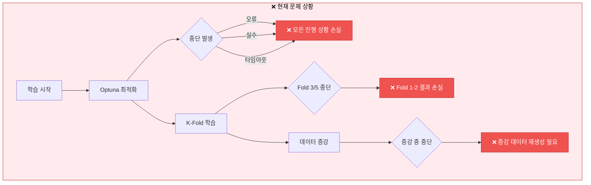
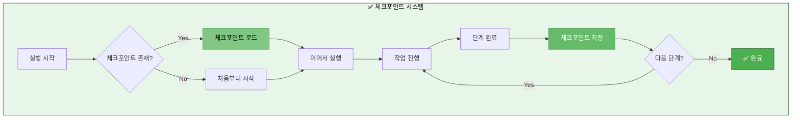
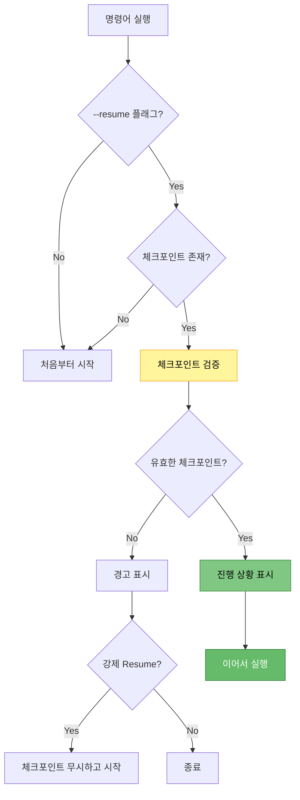

# 체크포인트 중간 저장 기능 추가 방안

> **목적**: 학습/추론/검증 각 단계마다 체크포인트를 저장하여 중단 시 이어서 실행 가능하도록 개선
> **작성일**: 2025-10-14
> **우선순위**: 🔥 높음 (실행 안정성 필수)

---

## 📋 목차

1. [문제 상황 및 필요성](#1-문제-상황-및-필요성)
2. [체크포인트 저장 전략](#2-체크포인트-저장-전략)
3. [단계별 구현 방안](#3-단계별-구현-방안)
4. [체크포인트 파일 구조](#4-체크포인트-파일-구조)
5. [Resume 로직 설계](#5-resume-로직-설계)
6. [구현 상세 계획](#6-구현-상세-계획)
7. [테스트 시나리오](#7-테스트-시나리오)

---

## 1. 문제 상황 및 필요성

### 1.1 현재 발생하는 문제



### 1.2 필요한 체크포인트 지점

| 단계 | 체크포인트 필요 시점 | 저장 내용 | 우선순위 |
|------|---------------------|----------|----------|
| **Optuna 최적화** | 각 Trial 완료 후 | Trial 결과, 최적 파라미터 | 🔥 높음 |
| **데이터 증강** | 증강 완료 후 | 증강된 데이터셋 | 🔥 높음 |
| **K-Fold 학습** | 각 Fold 완료 후 | Fold 모델, 평가 결과 | 🔥 높음 |
| **HuggingFace 보정** | 보정 완료 후 | 보정된 요약, 통계 | 중간 |
| **Solar API 호출** | 배치 완료 후 | API 응답, 캐시 | 중간 |
| **검증** | 검증 완료 후 | ROUGE 점수, 메트릭 | 낮음 |

---

## 2. 체크포인트 저장 전략

### 2.1 전체 체크포인트 시스템 구조



### 2.2 체크포인트 저장 원칙

1. **자동 저장**: 각 중요 단계 완료 시 자동으로 저장
2. **증분 저장**: 이전 체크포인트는 유지하고 새로운 체크포인트 추가
3. **메타데이터**: 진행 상황, 타임스탬프, 버전 정보 포함
4. **원자적 저장**: 저장 중 실패 시 이전 상태 유지
5. **정리 정책**: 오래된 체크포인트 자동 정리 (옵션)

---

## 3. 단계별 구현 방안

### 3.1 Optuna 최적화 체크포인트

#### 현재 상황
- Optuna는 기본적으로 SQLite 또는 In-memory storage 사용
- Trial 완료마다 자동 저장되지만, Study 객체 영속성 부족

#### 구현 방안

```python
# src/optimization/optuna_checkpoint.py (신규 생성)

class OptunaCheckpointManager:
    """Optuna 체크포인트 관리자"""

    def __init__(self, checkpoint_dir: str, study_name: str):
        self.checkpoint_dir = Path(checkpoint_dir)
        self.study_name = study_name
        self.checkpoint_file = self.checkpoint_dir / f"{study_name}_checkpoint.pkl"

    def save_checkpoint(self, study, trial_number: int):
        """Trial 완료마다 체크포인트 저장"""
        checkpoint = {
            'study_name': study.study_name,
            'direction': study.direction,
            'best_params': study.best_params,
            'best_value': study.best_value,
            'completed_trials': trial_number,
            'all_trials': [self._trial_to_dict(t) for t in study.trials],
            'timestamp': datetime.now().isoformat()
        }

        # 원자적 저장
        tmp_file = self.checkpoint_file.with_suffix('.tmp')
        with open(tmp_file, 'wb') as f:
            pickle.dump(checkpoint, f)
        tmp_file.replace(self.checkpoint_file)

    def load_checkpoint(self) -> Optional[dict]:
        """체크포인트 로드"""
        if self.checkpoint_file.exists():
            with open(self.checkpoint_file, 'rb') as f:
                return pickle.load(f)
        return None

    def resume_study(self, sampler, pruner) -> Tuple[optuna.Study, int]:
        """체크포인트에서 Study 복원"""
        checkpoint = self.load_checkpoint()
        if checkpoint is None:
            # 새로 시작
            study = optuna.create_study(
                study_name=self.study_name,
                sampler=sampler,
                pruner=pruner,
                direction=checkpoint['direction']
            )
            return study, 0

        # 기존 Study 복원
        study = optuna.create_study(
            study_name=self.study_name,
            sampler=sampler,
            pruner=pruner,
            direction=checkpoint['direction']
        )

        # 완료된 Trial들 재등록
        for trial_dict in checkpoint['all_trials']:
            study.add_trial(self._dict_to_trial(trial_dict))

        return study, checkpoint['completed_trials']
```

**수정 파일**: `src/optimization/optuna_optimizer.py`

```python
# 기존 코드에 추가
from src.optimization.optuna_checkpoint import OptunaCheckpointManager

class OptunaOptimizer:
    def __init__(self, ...):
        # 기존 코드
        ...

        # ✅ 체크포인트 관리자 추가
        self.checkpoint_manager = OptunaCheckpointManager(
            checkpoint_dir=output_dir,
            study_name=study_name
        )

    def optimize(self, n_trials: int = 50, timeout: Optional[int] = None):
        # ✅ 체크포인트에서 복원
        study, completed_trials = self.checkpoint_manager.resume_study(
            sampler=self.sampler,
            pruner=self.pruner
        )

        remaining_trials = n_trials - completed_trials
        if remaining_trials <= 0:
            self.logger.write(f"✅ 이미 {n_trials}개 Trial 완료됨. 건너뜀.")
            return study.best_params

        self.logger.write(f"🔄 Resume: {completed_trials}/{n_trials} 완료, {remaining_trials}개 남음")

        # Trial 콜백에 체크포인트 저장 추가
        def trial_callback(study, trial):
            self.checkpoint_manager.save_checkpoint(study, trial.number)

        study.optimize(
            self.objective,
            n_trials=remaining_trials,
            timeout=timeout,
            callbacks=[trial_callback]  # ✅ 콜백 추가
        )

        return study.best_params
```

---

### 3.2 데이터 증강 체크포인트

#### 현재 상황
- 데이터 증강은 시간이 오래 걸림 (역번역 등)
- 증강 중 중단 시 처음부터 재시작 필요

#### 구현 방안

```python
# src/augmentation/augmentation_checkpoint.py (신규 생성)

class AugmentationCheckpointManager:
    """데이터 증강 체크포인트 관리자"""

    def __init__(self, checkpoint_dir: str):
        self.checkpoint_dir = Path(checkpoint_dir)
        self.checkpoint_file = self.checkpoint_dir / "augmentation_checkpoint.pkl"

    def save_checkpoint(self, augmented_data: pd.DataFrame, progress: dict):
        """증강 진행 상황 저장"""
        checkpoint = {
            'augmented_data': augmented_data,
            'progress': progress,
            'timestamp': datetime.now().isoformat()
        }

        tmp_file = self.checkpoint_file.with_suffix('.tmp')
        with open(tmp_file, 'wb') as f:
            pickle.dump(checkpoint, f)
        tmp_file.replace(self.checkpoint_file)

    def load_checkpoint(self) -> Optional[dict]:
        """증강 체크포인트 로드"""
        if self.checkpoint_file.exists():
            with open(self.checkpoint_file, 'rb') as f:
                return pickle.load(f)
        return None

    def is_complete(self, target_size: int) -> bool:
        """증강 완료 여부 확인"""
        checkpoint = self.load_checkpoint()
        if checkpoint is None:
            return False
        return len(checkpoint['augmented_data']) >= target_size
```

**수정 파일**: `src/data/augmentation.py`

```python
# 기존 DataAugmenter 클래스에 추가

class DataAugmenter:
    def __init__(self, ...):
        # 기존 코드
        ...

        # ✅ 체크포인트 관리자 추가
        self.checkpoint_manager = None  # 필요 시 초기화

    def augment_data(
        self,
        df: pd.DataFrame,
        augmentation_ratio: float = 0.5,
        checkpoint_dir: Optional[str] = None,
        resume: bool = True
    ) -> pd.DataFrame:
        """
        데이터 증강 (체크포인트 지원)
        """
        # ✅ 체크포인트 관리자 초기화
        if checkpoint_dir:
            self.checkpoint_manager = AugmentationCheckpointManager(checkpoint_dir)

        # ✅ 체크포인트 확인
        if resume and self.checkpoint_manager:
            checkpoint = self.checkpoint_manager.load_checkpoint()
            if checkpoint and self.checkpoint_manager.is_complete(target_size):
                self.logger.write("✅ 증강 데이터 체크포인트 발견. 로드 중...")
                return checkpoint['augmented_data']

        # 증강 진행
        augmented_samples = []
        target_size = int(len(df) * augmentation_ratio)

        for idx in range(target_size):
            # 증강 로직
            ...
            augmented_samples.append(augmented_sample)

            # ✅ 주기적으로 체크포인트 저장 (100개마다)
            if self.checkpoint_manager and (idx + 1) % 100 == 0:
                progress = {
                    'completed': idx + 1,
                    'total': target_size,
                    'ratio': (idx + 1) / target_size
                }
                augmented_df = pd.DataFrame(augmented_samples)
                self.checkpoint_manager.save_checkpoint(augmented_df, progress)
                self.logger.write(f"💾 증강 체크포인트 저장: {idx+1}/{target_size}")

        # 최종 저장
        final_df = pd.concat([df, pd.DataFrame(augmented_samples)], ignore_index=True)
        if self.checkpoint_manager:
            progress = {'completed': target_size, 'total': target_size, 'ratio': 1.0}
            self.checkpoint_manager.save_checkpoint(final_df, progress)

        return final_df
```

---

### 3.3 K-Fold 학습 체크포인트

#### 현재 상황
- K-Fold는 각 Fold마다 독립적으로 모델 학습
- Fold 중간에 중단 시 완료된 Fold 결과 손실

#### 구현 방안

```python
# src/trainers/kfold_checkpoint.py (신규 생성)

class KFoldCheckpointManager:
    """K-Fold 체크포인트 관리자"""

    def __init__(self, checkpoint_dir: str, k_folds: int):
        self.checkpoint_dir = Path(checkpoint_dir)
        self.k_folds = k_folds
        self.checkpoint_file = self.checkpoint_dir / "kfold_checkpoint.json"

    def save_fold_result(self, fold: int, model_path: str, metrics: dict):
        """Fold 완료 후 결과 저장"""
        checkpoint = self.load_checkpoint() or {
            'k_folds': self.k_folds,
            'completed_folds': [],
            'fold_results': {}
        }

        checkpoint['completed_folds'].append(fold)
        checkpoint['fold_results'][f'fold_{fold}'] = {
            'model_path': model_path,
            'metrics': metrics,
            'timestamp': datetime.now().isoformat()
        }

        # 원자적 저장
        tmp_file = self.checkpoint_file.with_suffix('.tmp')
        with open(tmp_file, 'w') as f:
            json.dump(checkpoint, f, indent=2, ensure_ascii=False)
        tmp_file.replace(self.checkpoint_file)

    def load_checkpoint(self) -> Optional[dict]:
        """체크포인트 로드"""
        if self.checkpoint_file.exists():
            with open(self.checkpoint_file, 'r') as f:
                return json.load(f)
        return None

    def get_completed_folds(self) -> List[int]:
        """완료된 Fold 목록"""
        checkpoint = self.load_checkpoint()
        if checkpoint is None:
            return []
        return checkpoint.get('completed_folds', [])

    def is_complete(self) -> bool:
        """K-Fold 전체 완료 여부"""
        checkpoint = self.load_checkpoint()
        if checkpoint is None:
            return False
        return len(checkpoint.get('completed_folds', [])) == self.k_folds
```

**수정 파일**: `src/trainers/kfold_trainer.py`

```python
# KFoldTrainer 클래스 수정

from src.trainers.kfold_checkpoint import KFoldCheckpointManager

class KFoldTrainer(BaseTrainer):
    def train(self) -> dict:
        # ✅ 체크포인트 관리자 초기화
        checkpoint_manager = KFoldCheckpointManager(
            checkpoint_dir=self.args.output_dir,
            k_folds=self.args.k_folds
        )

        # ✅ 완료된 Fold 확인
        completed_folds = checkpoint_manager.get_completed_folds()
        if completed_folds:
            self.logger.write(f"🔄 Resume: Fold {completed_folds} 이미 완료")

        # ✅ 남은 Fold만 실행
        all_results = []
        for fold in range(self.args.k_folds):
            if fold in completed_folds:
                # 체크포인트에서 로드
                checkpoint = checkpoint_manager.load_checkpoint()
                fold_result = checkpoint['fold_results'][f'fold_{fold}']
                all_results.append(fold_result)
                self.logger.write(f"✅ Fold {fold}: 체크포인트에서 로드")
                continue

            # Fold 학습 진행
            self.logger.write(f"\n{'='*60}")
            self.logger.write(f"📊 Fold {fold + 1}/{self.args.k_folds} 시작")

            # ... 기존 학습 로직 ...

            fold_result = {
                'fold': fold,
                'model_path': fold_model_path,
                'metrics': fold_metrics
            }
            all_results.append(fold_result)

            # ✅ Fold 완료 후 체크포인트 저장
            checkpoint_manager.save_fold_result(
                fold=fold,
                model_path=fold_model_path,
                metrics=fold_metrics
            )
            self.logger.write(f"💾 Fold {fold} 체크포인트 저장 완료")

        return {'fold_results': all_results}
```

---

### 3.4 HuggingFace 보정 체크포인트

#### 구현 방안

```python
# src/correction/correction_checkpoint.py (신규 생성)

class CorrectionCheckpointManager:
    """HuggingFace 보정 체크포인트 관리자"""

    def __init__(self, checkpoint_dir: str):
        self.checkpoint_dir = Path(checkpoint_dir)
        self.checkpoint_file = self.checkpoint_dir / "correction_checkpoint.pkl"

    def save_checkpoint(self, corrected_summaries: List[str], progress: int, total: int):
        """보정 진행 상황 저장"""
        checkpoint = {
            'corrected_summaries': corrected_summaries,
            'progress': progress,
            'total': total,
            'timestamp': datetime.now().isoformat()
        }

        tmp_file = self.checkpoint_file.with_suffix('.tmp')
        with open(tmp_file, 'wb') as f:
            pickle.dump(checkpoint, f)
        tmp_file.replace(self.checkpoint_file)

    def load_checkpoint(self) -> Optional[dict]:
        """보정 체크포인트 로드"""
        if self.checkpoint_file.exists():
            with open(self.checkpoint_file, 'rb') as f:
                return pickle.load(f)
        return None
```

**수정 파일**: `src/correction/pretrained_corrector.py`

```python
# PretrainedCorrector 클래스에 추가

class PretrainedCorrector:
    def correct_batch(
        self,
        dialogues: List[str],
        candidate_summaries: List[str],
        batch_size: int = 16,
        checkpoint_dir: Optional[str] = None,
        **generation_kwargs
    ) -> List[str]:
        # ✅ 체크포인트 관리자
        checkpoint_manager = None
        if checkpoint_dir:
            checkpoint_manager = CorrectionCheckpointManager(checkpoint_dir)
            checkpoint = checkpoint_manager.load_checkpoint()

            if checkpoint and checkpoint['progress'] == checkpoint['total']:
                self.logger.write("✅ HF 보정 체크포인트 발견. 로드 중...")
                return checkpoint['corrected_summaries']

        # ... 기존 보정 로직 ...

        # ✅ 배치마다 체크포인트 저장
        if checkpoint_manager and (batch_idx + 1) % 10 == 0:
            checkpoint_manager.save_checkpoint(
                corrected_summaries=corrected_summaries[:len(summaries_so_far)],
                progress=len(summaries_so_far),
                total=len(dialogues)
            )
```

---

### 3.5 Solar API 체크포인트

#### 현재 상황
- Solar API는 이미 캐싱 기능 내장
- 추가 체크포인트는 배치 단위로만 필요

#### 구현 방안

**수정 파일**: `src/api/solar_api.py`

```python
# SolarAPI 클래스에 배치 체크포인트 추가

class SolarAPI:
    def summarize_batch(
        self,
        dialogues: List[str],
        batch_size: int = 10,
        delay: float = 1.0,
        checkpoint_dir: Optional[str] = None
    ) -> List[str]:
        # ✅ 체크포인트 파일
        checkpoint_file = None
        if checkpoint_dir:
            checkpoint_file = Path(checkpoint_dir) / "solar_api_checkpoint.pkl"
            if checkpoint_file.exists():
                with open(checkpoint_file, 'rb') as f:
                    checkpoint = pickle.load(f)
                    if checkpoint['total'] == len(dialogues):
                        self._log("✅ Solar API 체크포인트 발견. 로드 중...")
                        return checkpoint['summaries']

        summaries = []

        for i in range(0, len(dialogues), batch_size):
            # ... 기존 배치 처리 ...

            # ✅ 배치마다 체크포인트 저장
            if checkpoint_file and (i + batch_size) < len(dialogues):
                checkpoint = {
                    'summaries': summaries,
                    'progress': len(summaries),
                    'total': len(dialogues),
                    'timestamp': datetime.now().isoformat()
                }
                with open(checkpoint_file, 'wb') as f:
                    pickle.dump(checkpoint, f)

        return summaries
```

---

## 4. 체크포인트 파일 구조

### 4.1 디렉토리 구조

```
experiments/20251014/20251014_094051_kobart_balanced/
├── train.log
├── checkpoints/                           # ✅ 체크포인트 폴더
│   ├── optuna_checkpoint.pkl              # Optuna 체크포인트
│   ├── augmentation_checkpoint.pkl        # 데이터 증강
│   ├── kfold_checkpoint.json              # K-Fold 진행 상황
│   ├── correction_checkpoint.pkl          # HF 보정
│   └── solar_api_checkpoint.pkl           # Solar API
├── fold_0/                                # Fold 모델들
│   ├── checkpoint-1000/
│   └── final_model/
├── fold_1/
│   └── ...
└── final_model/                           # 최종 앙상블 모델
```

### 4.2 체크포인트 파일 형식

#### Optuna 체크포인트 (pickle)
```python
{
    'study_name': 'optuna_kobart_ultimate',
    'direction': 'maximize',
    'best_params': {...},
    'best_value': 0.4616,
    'completed_trials': 11,
    'all_trials': [...],
    'timestamp': '2025-10-14T12:00:00'
}
```

#### K-Fold 체크포인트 (JSON)
```json
{
  "k_folds": 5,
  "completed_folds": [0, 1, 2],
  "fold_results": {
    "fold_0": {
      "model_path": "experiments/.../fold_0/final_model",
      "metrics": {
        "rouge-l": 0.45
      },
      "timestamp": "2025-10-14T12:30:00"
    }
  }
}
```

---

## 5. Resume 로직 설계

### 5.1 Resume 플로우차트



### 5.2 Resume 명령행 옵션

**scripts/train.py에 추가할 옵션**:

```python
parser.add_argument(
    '--resume',
    action='store_true',
    help='체크포인트에서 이어서 실행 (기본값: False)'
)

parser.add_argument(
    '--resume_from',
    type=str,
    default=None,
    help='특정 체크포인트 디렉토리에서 Resume'
)

parser.add_argument(
    '--ignore_checkpoint',
    action='store_true',
    help='체크포인트 무시하고 처음부터 시작'
)
```

---

## 6. 구현 상세 계획

### 6.1 신규 생성 파일

| 파일 경로 | 역할 | 우선순위 |
|----------|------|----------|
| `src/checkpoints/__init__.py` | 체크포인트 모듈 초기화 | 필수 |
| `src/checkpoints/base_checkpoint.py` | 베이스 체크포인트 클래스 | 필수 |
| `src/optimization/optuna_checkpoint.py` | Optuna 체크포인트 | 🔥 높음 |
| `src/augmentation/augmentation_checkpoint.py` | 증강 체크포인트 | 🔥 높음 |
| `src/trainers/kfold_checkpoint.py` | K-Fold 체크포인트 | 🔥 높음 |
| `src/correction/correction_checkpoint.py` | HF 보정 체크포인트 | 중간 |
| `src/api/solar_checkpoint.py` | Solar API 체크포인트 | 중간 |

### 6.2 수정 파일

| 파일 경로 | 수정 내용 | 우선순위 |
|----------|----------|----------|
| `src/optimization/optuna_optimizer.py` | 체크포인트 통합 | 🔥 높음 |
| `src/data/augmentation.py` | 체크포인트 통합 | 🔥 높음 |
| `src/trainers/kfold_trainer.py` | Resume 로직 | 🔥 높음 |
| `src/correction/pretrained_corrector.py` | 체크포인트 통합 | 중간 |
| `src/api/solar_api.py` | 배치 체크포인트 | 중간 |
| `scripts/train.py` | --resume 옵션 추가 | 필수 |

### 6.3 베이스 체크포인트 클래스

```python
# src/checkpoints/base_checkpoint.py (신규 생성)

from abc import ABC, abstractmethod
from typing import Any, Optional
from pathlib import Path
import pickle
import json
from datetime import datetime

class BaseCheckpointManager(ABC):
    """
    체크포인트 관리자 베이스 클래스

    모든 체크포인트 관리자는 이 클래스를 상속받아 구현
    """

    def __init__(self, checkpoint_dir: str, checkpoint_name: str):
        """
        Args:
            checkpoint_dir: 체크포인트 저장 디렉토리
            checkpoint_name: 체크포인트 파일 이름 (확장자 제외)
        """
        self.checkpoint_dir = Path(checkpoint_dir)
        self.checkpoint_dir.mkdir(parents=True, exist_ok=True)
        self.checkpoint_name = checkpoint_name

    @abstractmethod
    def save_checkpoint(self, data: Any, **kwargs):
        """체크포인트 저장 (서브클래스에서 구현)"""
        pass

    @abstractmethod
    def load_checkpoint(self) -> Optional[Any]:
        """체크포인트 로드 (서브클래스에서 구현)"""
        pass

    def _atomic_save_pickle(self, file_path: Path, data: Any):
        """원자적 Pickle 저장"""
        tmp_file = file_path.with_suffix('.tmp')
        with open(tmp_file, 'wb') as f:
            pickle.dump(data, f)
        tmp_file.replace(file_path)

    def _atomic_save_json(self, file_path: Path, data: dict):
        """원자적 JSON 저장"""
        tmp_file = file_path.with_suffix('.tmp')
        with open(tmp_file, 'w', encoding='utf-8') as f:
            json.dump(data, f, indent=2, ensure_ascii=False)
        tmp_file.replace(file_path)

    def exists(self) -> bool:
        """체크포인트 존재 여부"""
        return self.get_checkpoint_path().exists()

    @abstractmethod
    def get_checkpoint_path(self) -> Path:
        """체크포인트 파일 경로 반환"""
        pass

    def delete_checkpoint(self):
        """체크포인트 삭제"""
        checkpoint_path = self.get_checkpoint_path()
        if checkpoint_path.exists():
            checkpoint_path.unlink()
```

---

## 7. 테스트 시나리오

### 7.1 Optuna Resume 테스트

```bash
# 1. 초기 실행 (10 trials 중 5개만 실행 후 중단)
python scripts/train.py \
  --mode optuna \
  --models kobart \
  --optuna_trials 10 \
  --experiment_name test_resume

# Ctrl+C로 중단

# 2. Resume 실행 (남은 5개 trial 실행)
python scripts/train.py \
  --mode optuna \
  --models kobart \
  --optuna_trials 10 \
  --resume \
  --resume_from experiments/20251014/.../checkpoints \
  --experiment_name test_resume

# 예상 결과: Trial 5부터 시작하여 10까지 완료
```

### 7.2 K-Fold Resume 테스트

```bash
# 1. 초기 실행 (5 folds 중 2개만 완료 후 중단)
python scripts/train.py \
  --mode kfold \
  --models kobart \
  --k_folds 5 \
  --epochs 3 \
  --experiment_name test_kfold_resume

# Ctrl+C로 중단

# 2. Resume 실행
python scripts/train.py \
  --mode kfold \
  --models kobart \
  --k_folds 5 \
  --epochs 3 \
  --resume \
  --experiment_name test_kfold_resume

# 예상 결과: Fold 2부터 시작하여 4까지 완료
```

### 7.3 데이터 증강 Resume 테스트

```bash
# 1. 증강 중 중단
python scripts/train.py \
  --mode single \
  --models kobart \
  --use_augmentation \
  --augmentation_ratio 0.5 \
  --experiment_name test_aug_resume

# Ctrl+C로 중단 (증강 50% 진행 시)

# 2. Resume
python scripts/train.py \
  --mode single \
  --models kobart \
  --use_augmentation \
  --augmentation_ratio 0.5 \
  --resume \
  --experiment_name test_aug_resume

# 예상 결과: 증강 50%부터 이어서 진행
```

---

## 8. 구현 우선순위

### Phase 1: 핵심 체크포인트 (필수)
1. ✅ BaseCheckpointManager 클래스 구현
2. ✅ OptunaCheckpointManager 구현 및 통합
3. ✅ KFoldCheckpointManager 구현 및 통합
4. ✅ AugmentationCheckpointManager 구현 및 통합
5. ✅ `--resume` 명령행 옵션 추가

### Phase 2: 추가 체크포인트 (선택)
1. ⏸️ CorrectionCheckpointManager 구현
2. ⏸️ Solar API 배치 체크포인트 강화
3. ⏸️ 검증 체크포인트 (필요 시)

### Phase 3: 개선 및 최적화
1. ⏸️ 자동 정리 정책 (오래된 체크포인트 삭제)
2. ⏸️ 체크포인트 압축 (디스크 공간 절약)
3. ⏸️ 진행 상황 시각화 (진행률 표시)

---

## 9. 예상 효과

### 9.1 시간 절약

| 시나리오 | 기존 | 체크포인트 사용 | 절약 시간 |
|----------|------|----------------|----------|
| Optuna 10 trials 중 5개 완료 후 중단 | 처음부터 (10 trials) | 5 trials만 | 50% |
| K-Fold 5 중 3개 완료 후 중단 | 처음부터 (5 folds) | 2 folds만 | 60% |
| 증강 50% 진행 후 중단 | 처음부터 (100%) | 50%부터 | 50% |

### 9.2 안정성 향상

- ✅ 장시간 실험 안심 진행
- ✅ 네트워크 오류 시 복구 가능
- ✅ 실수로 중단해도 안전
- ✅ 타임아웃 대응 가능

---

## 10. 주의사항

### 10.1 체크포인트 저장 시 주의

1. **디스크 공간**: 체크포인트는 디스크 공간을 차지함
2. **원자적 저장**: 저장 중 중단되어도 이전 상태 유지
3. **버전 호환성**: 코드 변경 시 체크포인트 호환성 고려

### 10.2 Resume 시 주의

1. **하이퍼파라미터 변경**: Resume 시 하이퍼파라미터가 달라지면 경고
2. **데이터 변경**: 데이터가 변경되면 체크포인트 무효화
3. **모델 변경**: 모델 구조 변경 시 체크포인트 사용 불가

---

**작성**: 2025-10-14
**우선순위**: 🔥 높음
**예상 구현 시간**: Phase 1 기준 4-6시간
