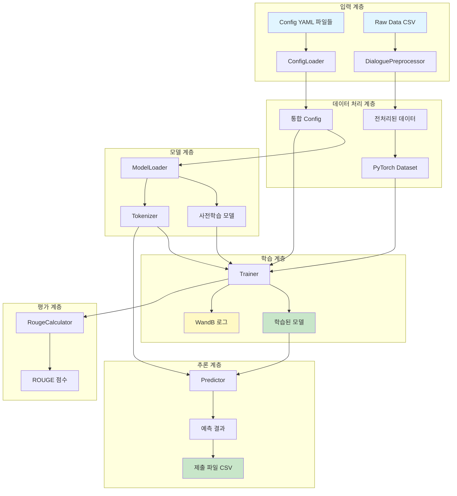
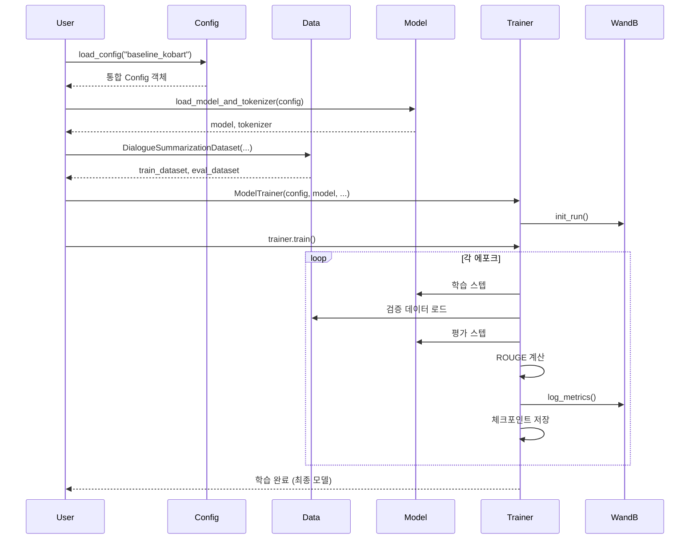
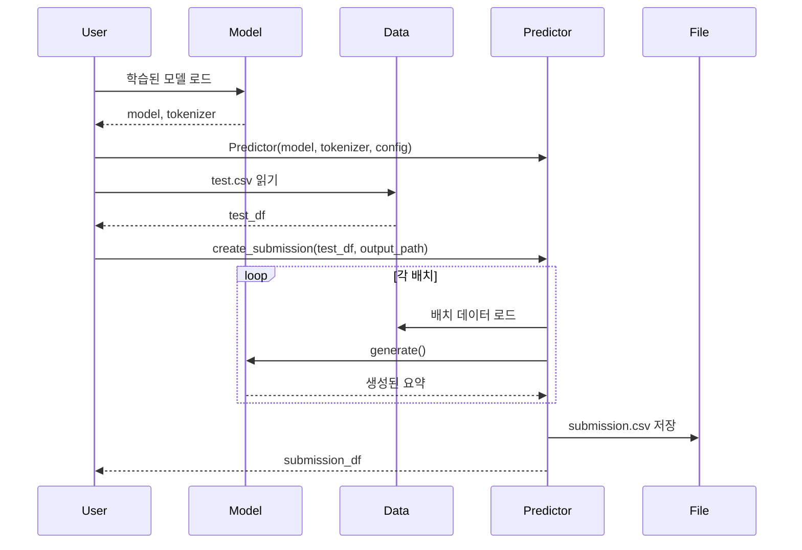
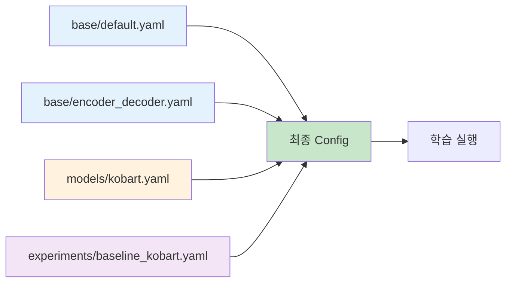

# 모듈화 시스템 전체 개요

## 📋 목차
1. [시스템 아키텍처](#시스템-아키텍처)
2. [모듈 구조](#모듈-구조)
3. [데이터 플로우](#데이터-플로우)
4. [설치 및 환경 설정](#설치-및-환경-설정)
5. [빠른 시작](#빠른-시작)

---

## 🏗️ 시스템 아키텍처

### 전체 구조 다이어그램



---

## 📦 모듈 구조

### 디렉토리 구조

```
src/
├── config/              # Config 관리 시스템
│   ├── __init__.py
│   └── loader.py       # 계층적 Config 병합
│
├── data/               # 데이터 처리
│   ├── __init__.py
│   ├── preprocessor.py # 텍스트 전처리
│   └── dataset.py      # PyTorch Dataset 클래스
│
├── models/             # 모델 로딩
│   ├── __init__.py
│   └── model_loader.py # HuggingFace 모델 로더
│
├── evaluation/         # 평가 시스템
│   ├── __init__.py
│   └── metrics.py      # ROUGE 계산
│
├── training/           # 학습 시스템
│   ├── __init__.py
│   └── trainer.py      # Seq2SeqTrainer 래퍼
│
└── inference/          # 추론 시스템
    ├── __init__.py
    └── predictor.py    # 배치 추론 및 제출 파일 생성
```

### 모듈별 역할

| 모듈 | 주요 클래스 | 핵심 기능 |
|------|------------|----------|
| **config** | `ConfigLoader` | YAML 기반 계층적 설정 관리 |
| **data** | `DialoguePreprocessor`<br>`DialogueSummarizationDataset`<br>`InferenceDataset` | 데이터 전처리<br>학습/검증 데이터셋<br>추론 데이터셋 |
| **models** | `ModelLoader` | 모델/토크나이저 로딩<br>특수 토큰 처리 |
| **evaluation** | `RougeCalculator` | ROUGE-1/2/L 계산<br>Multi-reference 지원 |
| **training** | `ModelTrainer` | 학습 파이프라인<br>WandB 로깅 통합 |
| **inference** | `Predictor` | 배치 추론<br>제출 파일 생성 |

---

## 🔄 데이터 플로우

### 학습 파이프라인



### 추론 파이프라인



---

## 🛠️ 설치 및 환경 설정

### 1. 가상환경 활성화

```bash
# pyenv 가상환경 활성화
source ~/.pyenv/versions/nlp_py3_11_9/bin/activate

# 또는 pyenv 명령어 사용
pyenv activate nlp_py3_11_9
```

### 2. 필수 패키지 설치

```bash
pip install -r requirements.txt
```

**주요 패키지:**
- `torch==2.8.0` - PyTorch 딥러닝 프레임워크
- `transformers==4.57.0` - HuggingFace Transformers
- `pandas==2.3.3` - 데이터 처리
- `omegaconf==2.3.0` - Config 관리
- `rouge-score==0.1.2` - ROUGE 평가
- `wandb==0.22.2` - 실험 로깅

### 3. 프로젝트 구조 확인

```bash
# 프로젝트 루트에서 실행
tree -L 2 src/
tree -L 2 configs/
tree -L 2 tests/
```

---

## 🚀 빠른 시작

### 1. Config 기반 학습 실행

```python
from src.config import load_config
from src.models import load_model_and_tokenizer
from src.data import DialogueSummarizationDataset
from src.training import create_trainer
import pandas as pd

# 1. Config 로드
config = load_config("baseline_kobart")

# 2. 모델 및 토크나이저 로드
model, tokenizer = load_model_and_tokenizer(config)

# 3. 데이터 로드
train_df = pd.read_csv("data/raw/train.csv")
train_dataset = DialogueSummarizationDataset(
    dialogues=train_df['dialogue'].tolist(),
    summaries=train_df['summary'].tolist(),
    tokenizer=tokenizer
)

# 4. Trainer 생성 및 학습
trainer = create_trainer(
    config=config,
    model=model,
    tokenizer=tokenizer,
    train_dataset=train_dataset
)

# 5. 학습 실행
results = trainer.train()
```

### 2. 추론 및 제출 파일 생성

```python
from src.models import load_model_and_tokenizer
from src.inference import create_predictor
import pandas as pd

# 1. 학습된 모델 로드
model, tokenizer = load_model_and_tokenizer(config)
# 또는 저장된 체크포인트에서 로드
# model = AutoModelForSeq2SeqLM.from_pretrained("outputs/best_model")

# 2. Predictor 생성
predictor = create_predictor(
    model=model,
    tokenizer=tokenizer,
    config=config
)

# 3. 테스트 데이터 로드
test_df = pd.read_csv("data/raw/test.csv")

# 4. 제출 파일 생성
submission_df = predictor.create_submission(
    test_df=test_df,
    output_path="submissions/submission.csv",
    batch_size=32
)
```

### 3. 단일 명령어로 테스트 실행

```bash
# 가상환경 활성화 후 각 모듈 테스트
source ~/.pyenv/versions/nlp_py3_11_9/bin/activate

python tests/test_config_loader.py
python tests/test_preprocessor.py
python tests/test_model_loader.py
python tests/test_metrics.py
python tests/test_trainer.py
python tests/test_predictor.py
```

---

## 📊 Config 시스템 상세

### Config 계층 구조



### Config 병합 우선순위

1. `base/default.yaml` - 기본 설정
2. `base/encoder_decoder.yaml` - 모델 타입별 설정
3. `models/{model_name}.yaml` - 특정 모델 설정
4. `experiments/{experiment_name}.yaml` - 실험별 설정 (최우선)

**예시:**
```yaml
# base/default.yaml
training:
  batch_size: 8
  learning_rate: 5e-5

# experiments/baseline_kobart.yaml
training:
  batch_size: 50        # 오버라이드됨
  learning_rate: 1e-5   # 오버라이드됨
```

---

## 🧪 테스트 결과 요약

### 전체 테스트 현황

| 모듈 | 테스트 파일 | 테스트 개수 | 상태 |
|------|------------|-----------|------|
| Config | `test_config_loader.py` | 6개 | ✅ 통과 |
| Data | `test_preprocessor.py` | 5개 | ✅ 통과 |
| Models | `test_model_loader.py` | 5개 | ✅ 통과 |
| Evaluation | `test_metrics.py` | 6개 | ✅ 통과 |
| Training | `test_trainer.py` | 5개 | ✅ 통과 |
| Inference | `test_predictor.py` | 6개 | ✅ 통과 |
| **전체** | **6개 파일** | **33개** | **✅ 모두 통과** |

### 주요 검증 항목

✅ **Config Loader**
- 계층적 YAML 병합 정상 동작
- 실험별 Config 오버라이드 정상 작동

✅ **Data Preprocessing**
- 12,457개 실제 데이터 전처리 성공
- 노이즈 제거, 화자 추출, 턴 계산 정상 동작

✅ **Model Loader**
- KoBART 모델 (123M 파라미터) 로딩 성공
- GPU 자동 감지 및 배치 정상 동작

✅ **Metrics**
- ROUGE-1/2/L 계산 정상 동작
- Multi-reference 평가 지원 확인

✅ **Trainer**
- Seq2SeqTrainer 래핑 정상 동작
- WandB 로깅 통합 확인

✅ **Inference**
- 배치 추론 정상 동작
- 제출 파일 생성 정상 동작

---

## 📝 다음 단계

1. **전체 파이프라인 통합 스크립트** - 학습부터 추론까지 원스텝 실행
2. **Cross-validation 시스템** - K-Fold 교차 검증
3. **Ensemble 시스템** - 다중 모델 앙상블
4. **Optuna 튜닝** - 하이퍼파라미터 자동 최적화

---

## 🔗 관련 문서

- [01_Config_시스템.md](./01_Config_시스템.md) - Config 상세 가이드
- [02_데이터_처리.md](./02_데이터_처리.md) - 데이터 전처리 및 Dataset
- [03_모델_로딩.md](./03_모델_로딩.md) - 모델 로더 사용법
- [04_평가_시스템.md](./04_평가_시스템.md) - ROUGE 평가 가이드
- [05_학습_시스템.md](./05_학습_시스템.md) - Trainer 사용법
- [06_추론_시스템.md](./06_추론_시스템.md) - Predictor 사용법

---

**작성일:** 2025-10-11
**버전:** 1.0.0
**작성자:** AI Assistant
