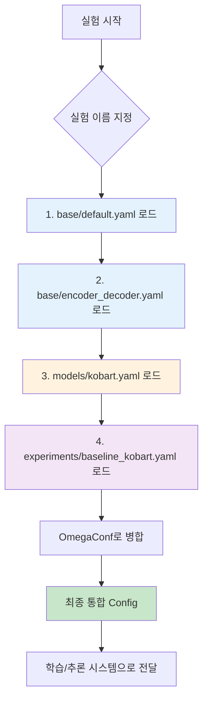

# Config 시스템 상세 가이드

## 📋 목차
1. [개요](#개요)
2. [Config 구조](#config-구조)
3. [사용 방법](#사용-방법)
4. [Config 파일 작성](#config-파일-작성)
5. [테스트 결과](#테스트-결과)

---

## 📝 개요

### 목적
- 실험 설정의 체계적 관리
- 재현 가능한 실험 환경
- 하이퍼파라미터 버전 관리
- 다양한 실험 설정의 빠른 전환

### 핵심 기능
- ✅ 계층적 YAML 병합
- ✅ 실험별 Config 오버라이드
- ✅ OmegaConf 기반 타입 안전성
- ✅ 누락된 파일 자동 처리

---

## 🏗️ Config 구조

### 디렉토리 구조

```
configs/
├── base/                           # 기본 설정
│   ├── default.yaml               # 전체 기본값
│   └── encoder_decoder.yaml       # 모델 타입별 기본값
│
├── models/                         # 모델별 설정
│   ├── kobart.yaml                # KoBART 설정
│   ├── t5.yaml                    # T5 설정 (예시)
│   └── ...
│
└── experiments/                    # 실험별 설정
    ├── baseline_kobart.yaml       # 베이스라인 실험
    ├── finetuned_kobart.yaml      # 파인튜닝 실험 (예시)
    └── ...
```

### Config 병합 플로우



### 병합 우선순위

**낮음 → 높음 순서:**
1. `base/default.yaml` - 전체 기본 설정
2. `base/encoder_decoder.yaml` - 모델 타입 설정
3. `models/{model_name}.yaml` - 특정 모델 설정
4. `experiments/{experiment_name}.yaml` - **실험 설정 (최우선)**

**예시:**
```yaml
# base/default.yaml
training:
  batch_size: 8
  learning_rate: 5e-5
  epochs: 10

# experiments/baseline_kobart.yaml
training:
  batch_size: 50        # 오버라이드
  learning_rate: 1e-5   # 오버라이드
  # epochs: 10은 default 값 사용
```

**병합 결과:**
```yaml
training:
  batch_size: 50        # experiments에서 오버라이드
  learning_rate: 1e-5   # experiments에서 오버라이드
  epochs: 10            # default 값 유지
```

---

## 💻 사용 방법

### 1. 기본 사용법

```python
from src.config import load_config

# 실험 이름으로 Config 로드
config = load_config("baseline_kobart")

# Config 값 접근
print(config.training.batch_size)     # 50
print(config.model.checkpoint)        # "digit82/kobart-summarization"
print(config.experiment.name)         # "baseline_kobart"
```

### 2. Config 값 확인

```python
from omegaconf import OmegaConf

# Config 전체 출력
print(OmegaConf.to_yaml(config))

# 특정 섹션만 출력
print(OmegaConf.to_yaml(config.training))
print(OmegaConf.to_yaml(config.model))
```

### 3. Config 값 수정 (런타임)

```python
# 값 변경
config.training.batch_size = 32
config.training.learning_rate = 2e-5

# 새로운 키 추가
config.custom_param = "value"
```

### 4. ConfigLoader 직접 사용

```python
from src.config import ConfigLoader

# ConfigLoader 인스턴스 생성
loader = ConfigLoader(config_dir="configs")

# 수동으로 병합
config = loader.merge_configs("baseline_kobart")

# 특정 파일만 로드
base_config = loader.load_base_config()
model_config = loader.load_model_config("kobart")
```

---

## 📄 Config 파일 작성

### base/default.yaml 구조

```yaml
# ==================== 기본 설정 ==================== #

# 실험 정보
experiment:
  name: "default"
  seed: 42
  deterministic: true

# 경로 설정
paths:
  train_data: "data/raw/train.csv"
  dev_data: "data/raw/dev.csv"
  test_data: "data/raw/test.csv"
  output_dir: "outputs"

# 학습 설정
training:
  output_dir: "outputs"
  epochs: 10
  batch_size: 8
  learning_rate: 5e-5
  device: "cuda"

# 평가 설정
evaluation:
  metric: "rouge"
  rouge_types:
    - "rouge1"
    - "rouge2"
    - "rougeL"
```

### base/encoder_decoder.yaml 구조

```yaml
# ==================== Encoder-Decoder 공통 설정 ==================== #

model:
  type: "encoder_decoder"
  architecture: "bart"

# 토크나이저 설정
tokenizer:
  encoder_max_len: 512
  decoder_max_len: 100
  special_tokens:
    - '#Person1#'
    - '#Person2#'
    # ... 추가 특수 토큰

# 추론 설정
inference:
  batch_size: 32
  num_beams: 4
  early_stopping: true
  generate_max_length: 100
  no_repeat_ngram_size: 2
```

### models/kobart.yaml 구조

```yaml
# ==================== KoBART 모델 설정 ==================== #

model:
  name: "kobart"
  checkpoint: "digit82/kobart-summarization"

# KoBART 특화 설정
# (필요시 추가)
```

### experiments/baseline_kobart.yaml 구조

```yaml
# ==================== 베이스라인 실험 설정 ==================== #

experiment:
  name: "baseline_kobart"
  description: "대회 베이스라인 재현 실험"
  tags:
    - "baseline"
    - "kobart"

# WandB 설정
wandb:
  enabled: true
  project: "nlp-competition"
  entity: "ieyeppo"

# 모델 설정
model:
  name: "kobart"

# 학습 설정 (베이스라인 오버라이드)
training:
  epochs: 20
  batch_size: 50
  learning_rate: 1e-5

# 경로 설정
paths:
  output_dir: "outputs/baseline_kobart"
```

---

## 🧪 테스트 결과

### 테스트 명령어

```bash
# 가상환경 활성화
source ~/.pyenv/versions/nlp_py3_11_9/bin/activate

# 테스트 실행
python tests/test_config_loader.py
```

### 테스트 항목 (총 6개)

#### 1. ✅ 기본 Config 로드
```python
def test_load_base_config():
    """base/default.yaml 로드 확인"""
    loader = ConfigLoader()
    config = loader.load_base_config()

    assert config.experiment.seed == 42
    assert config.paths.train_data == "data/raw/train.csv"
```

**결과:**
```
✅ 기본 Config 로드 테스트 성공!
  experiment.seed: 42
  paths.train_data: data/raw/train.csv
```

#### 2. ✅ 모델 타입 Config 로드
```python
def test_load_model_type_config():
    """base/encoder_decoder.yaml 로드 확인"""
    loader = ConfigLoader()
    config = loader.load_model_type_config("encoder_decoder")

    assert config.model.type == "encoder_decoder"
    assert config.tokenizer.encoder_max_len == 512
```

**결과:**
```
✅ 모델 타입 Config 로드 테스트 성공!
  model.type: encoder_decoder
  tokenizer.encoder_max_len: 512
```

#### 3. ✅ 모델별 Config 로드
```python
def test_load_model_config():
    """models/kobart.yaml 로드 확인"""
    loader = ConfigLoader()
    config = loader.load_model_config("kobart")

    assert config.model.name == "kobart"
    assert "digit82" in config.model.checkpoint
```

**결과:**
```
✅ 모델별 Config 로드 테스트 성공!
  model.name: kobart
  model.checkpoint: digit82/kobart-summarization
```

#### 4. ✅ 실험 Config 로드
```python
def test_load_experiment_config():
    """experiments/baseline_kobart.yaml 로드 확인"""
    loader = ConfigLoader()
    config = loader.load_experiment_config("baseline_kobart")

    assert config.experiment.name == "baseline_kobart"
    assert config.wandb.enabled == True
```

**결과:**
```
✅ 실험 Config 로드 테스트 성공!
  experiment.name: baseline_kobart
  wandb.enabled: True
```

#### 5. ✅ 계층적 Config 병합
```python
def test_merge_configs():
    """전체 Config 병합 확인"""
    loader = ConfigLoader()
    config = loader.merge_configs("baseline_kobart")

    # 병합 우선순위 확인
    assert config.training.batch_size == 50      # experiment에서 오버라이드
    assert config.training.epochs == 20          # experiment에서 오버라이드
    assert config.tokenizer.encoder_max_len == 512  # base 값 유지
```

**결과:**
```
✅ 계층적 Config 병합 테스트 성공!
  training.batch_size: 50 (오버라이드됨)
  training.epochs: 20 (오버라이드됨)
  tokenizer.encoder_max_len: 512 (base 값 유지)
```

#### 6. ✅ 편의 함수
```python
def test_load_config_function():
    """load_config() 편의 함수 확인"""
    config = load_config("baseline_kobart")

    assert config.experiment.name == "baseline_kobart"
    assert config.model.checkpoint is not None
```

**결과:**
```
✅ 편의 함수 테스트 성공!
  Config 로드 완료
  모든 섹션 접근 가능
```

### 전체 테스트 요약

```
============================================================
Config Loader 테스트 시작
============================================================

테스트 1: 기본 Config 로드                    ✅ 통과
테스트 2: 모델 타입 Config 로드                ✅ 통과
테스트 3: 모델별 Config 로드                   ✅ 통과
테스트 4: 실험 Config 로드                     ✅ 통과
테스트 5: 계층적 Config 병합                   ✅ 통과
테스트 6: 편의 함수                           ✅ 통과

============================================================
🎉 모든 테스트 통과! (6/6)
============================================================
```

---

## 🎯 실전 사용 예시

### 예시 1: 새로운 실험 설정 추가

```yaml
# configs/experiments/finetuned_kobart.yaml
experiment:
  name: "finetuned_kobart_v2"
  description: "파인튜닝 실험 버전 2"
  tags:
    - "finetuned"
    - "v2"

training:
  epochs: 30                    # 더 긴 학습
  batch_size: 32                # 작은 배치
  learning_rate: 5e-6           # 낮은 학습률
  warmup_steps: 1000            # 더 긴 warmup

paths:
  output_dir: "outputs/finetuned_v2"
```

**사용:**
```python
config = load_config("finetuned_kobart_v2")
```

### 예시 2: 디버그 모드 설정

```yaml
# configs/experiments/debug.yaml
experiment:
  name: "debug"

debug:
  use_subset: true
  subset_size: 100              # 100개 샘플만 사용

training:
  epochs: 2                     # 빠른 테스트
  batch_size: 4

wandb:
  enabled: false                # WandB 비활성화
```

### 예시 3: 런타임에서 Config 수정

```python
config = load_config("baseline_kobart")

# GPU 메모리 부족 시 배치 크기 줄이기
config.training.batch_size = 16

# 빠른 테스트를 위해 에포크 줄이기
config.training.epochs = 5

# WandB 비활성화
config.wandb.enabled = False

# 수정된 Config로 학습 진행
trainer = create_trainer(config, ...)
```

---

## 📌 주의사항

### 1. YAML 문법
- 들여쓰기는 **공백 2칸** 사용 (탭 사용 금지)
- 문자열에 특수문자 포함 시 따옴표 사용
- 리스트는 `-` 사용

### 2. 파일명 규칙
- `experiments/` 폴더의 YAML 파일명 = 실험 이름
- 예: `baseline_kobart.yaml` → `load_config("baseline_kobart")`

### 3. Config 값 접근
```python
# ✅ 올바른 접근
config.training.batch_size

# ❌ 잘못된 접근 (Key Error 발생 가능)
config['training']['batch_size']

# ✅ 안전한 접근 (기본값 제공)
config.get('training', {}).get('batch_size', 32)
```

### 4. 누락된 Config 처리
- ConfigLoader는 누락된 파일을 자동으로 건너뜀
- 필수 설정은 `base/default.yaml`에 정의 권장

---

## 🔗 관련 파일

**소스 코드:**
- `src/config/loader.py` - ConfigLoader 클래스
- `src/config/__init__.py` - 외부 API

**설정 파일:**
- `configs/base/default.yaml` - 기본 설정
- `configs/base/encoder_decoder.yaml` - 모델 타입 설정
- `configs/models/kobart.yaml` - KoBART 설정
- `configs/experiments/baseline_kobart.yaml` - 베이스라인 실험

**테스트:**
- `tests/test_config_loader.py` - Config Loader 테스트

---

**작성일:** 2025-10-11
**버전:** 1.0.0
