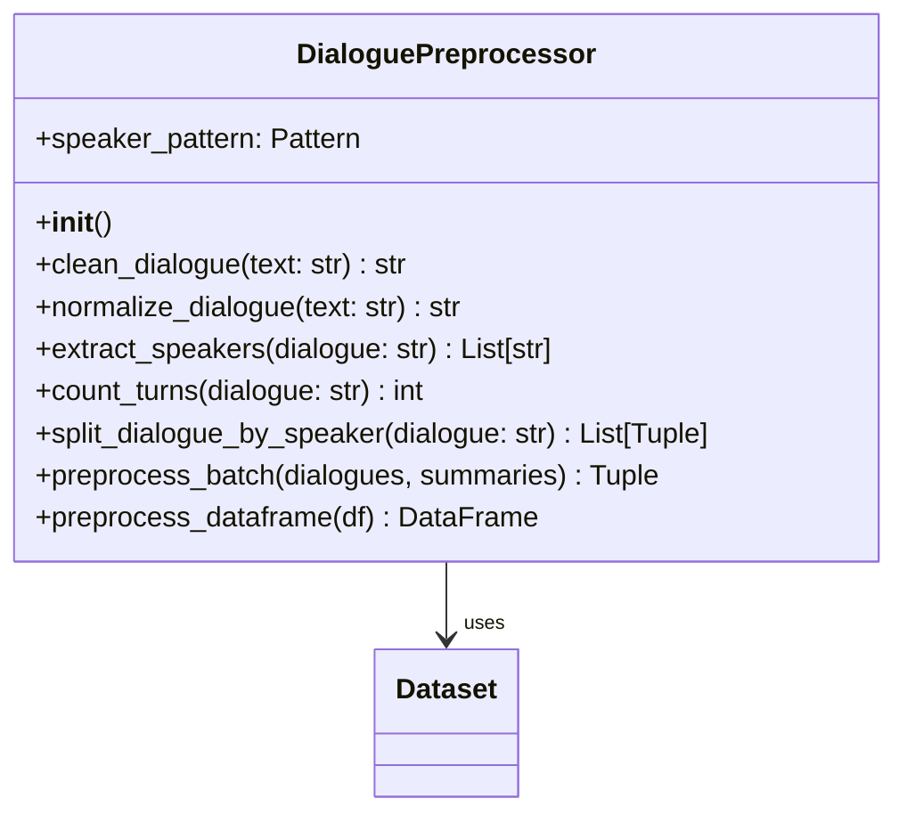
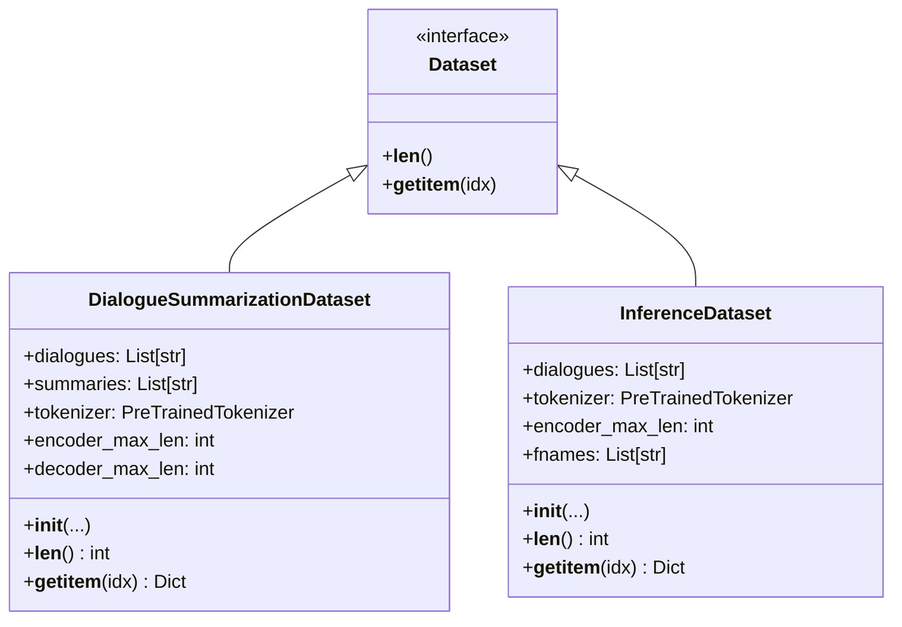
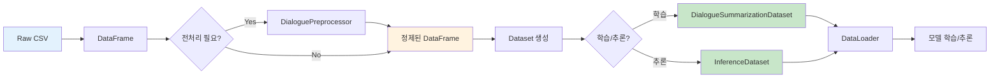

# 데이터 처리 시스템 가이드

## 📋 목차
1. [개요](#개요)
2. [DialoguePreprocessor](#dialoguepreprocessor)
3. [Dataset 클래스](#dataset-클래스)
4. [사용 방법](#사용-방법)
5. [테스트 결과](#테스트-결과)

---

## 📝 개요

### 목적
- 대화 데이터의 일관된 전처리
- PyTorch 학습/추론을 위한 Dataset 제공
- 노이즈 제거 및 텍스트 정규화
- 화자 정보 추출 및 통계 생성

### 핵심 기능
- ✅ 노이즈 제거 (`\\n`, `<br>` 등)
- ✅ 화자 추출 및 턴 계산
- ✅ 학습/검증용 Dataset
- ✅ 추론용 Dataset
- ✅ DataFrame 전처리

---

## 🔧 DialoguePreprocessor

### 클래스 구조



### 주요 메서드

#### 1. clean_dialogue() - 노이즈 제거

**처리 항목:**
1. `\\n` → `\n` 변환 (이스케이프된 개행 문자)
2. `<br>` 태그 제거
3. 중복 공백 제거
4. 과도한 개행 제거 (3개 이상 → 2개)
5. 앞뒤 공백 제거

**사용 예시:**
```python
from src.data import DialoguePreprocessor

preprocessor = DialoguePreprocessor()

# 노이즈가 있는 텍스트
dirty_text = "안녕하세요\\\\n<br>반갑습니다  "

# 전처리 실행
clean_text = preprocessor.clean_dialogue(dirty_text)
print(clean_text)  # "안녕하세요\n반갑습니다"
```

#### 2. extract_speakers() - 화자 추출

**추출 패턴:** `#Person1#`, `#Person2#`, ... `#PersonN#`

```python
dialogue = "#Person1#: 안녕하세요\\n#Person2#: 반갑습니다\\n#Person1#: 잘 부탁드립니다"

speakers = preprocessor.extract_speakers(dialogue)
print(speakers)  # ['#Person1#', '#Person2#']
```

#### 3. count_turns() - 턴 개수 계산

```python
dialogue = "#Person1#: 안녕하세요\\n#Person2#: 반갑습니다\\n#Person1#: 감사합니다"

turns = preprocessor.count_turns(dialogue)
print(turns)  # 3
```

#### 4. split_dialogue_by_speaker() - 대화 분할

```python
dialogue = "#Person1#: 안녕하세요\\n#Person2#: 반갑습니다"

turns = preprocessor.split_dialogue_by_speaker(dialogue)
# [('#Person1#', '안녕하세요'), ('#Person2#', '반갑습니다')]

for speaker, utterance in turns:
    print(f"{speaker}: {utterance}")
```

#### 5. preprocess_dataframe() - DataFrame 전처리

**추가되는 통계 컬럼:**
- `num_speakers` - 화자 수
- `num_turns` - 턴 개수

```python
import pandas as pd

df = pd.read_csv("data/raw/train.csv")
preprocessor = DialoguePreprocessor()

# DataFrame 전처리 (dialogue, summary 컬럼 정제 + 통계 추가)
df_processed = preprocessor.preprocess_dataframe(df)

print(df_processed[['num_speakers', 'num_turns']].describe())
```

---

## 📦 Dataset 클래스

### 클래스 구조



### 1. DialogueSummarizationDataset (학습/검증용)

**목적:** 학습 및 검증을 위한 Dataset

**반환 형식:**
```python
{
    'input_ids': Tensor,        # 인코더 입력 (dialogue)
    'attention_mask': Tensor,   # 어텐션 마스크
    'labels': Tensor            # 디코더 레이블 (summary)
}
```

**사용 예시:**
```python
from src.data import DialogueSummarizationDataset
from transformers import AutoTokenizer

# 토크나이저 로드
tokenizer = AutoTokenizer.from_pretrained("digit82/kobart-summarization")

# 데이터셋 생성
dataset = DialogueSummarizationDataset(
    dialogues=train_df['dialogue'].tolist(),
    summaries=train_df['summary'].tolist(),
    tokenizer=tokenizer,
    encoder_max_len=512,
    decoder_max_len=100,
    preprocess=True             # 전처리 자동 적용
)

# 샘플 접근
sample = dataset[0]
print(f"Input shape: {sample['input_ids'].shape}")         # torch.Size([512])
print(f"Attention mask shape: {sample['attention_mask'].shape}")  # torch.Size([512])
print(f"Labels shape: {sample['labels'].shape}")           # torch.Size([100])
```

### 2. InferenceDataset (추론용)

**목적:** 추론(예측)을 위한 Dataset

**반환 형식:**
```python
{
    'input_ids': Tensor,        # 인코더 입력 (dialogue)
    'attention_mask': Tensor,   # 어텐션 마스크
    'fname': str                # 파일명 (선택적)
}
```

**사용 예시:**
```python
from src.data import InferenceDataset

# 추론용 데이터셋 생성
inference_dataset = InferenceDataset(
    dialogues=test_df['dialogue'].tolist(),
    tokenizer=tokenizer,
    encoder_max_len=512,
    preprocess=True,
    fnames=test_df['fname'].tolist()  # 제출 파일용
)

# 샘플 접근
sample = inference_dataset[0]
print(f"Input shape: {sample['input_ids'].shape}")
print(f"Fname: {sample['fname']}")
```

### 3. create_dataset_from_dataframe() 편의 함수

**DataFrame에서 Dataset 직접 생성:**

```python
from src.data import create_dataset_from_dataframe

# 학습용 Dataset 생성
train_dataset = create_dataset_from_dataframe(
    df=train_df,
    tokenizer=tokenizer,
    encoder_max_len=512,
    decoder_max_len=100,
    is_train=True,              # 학습 모드
    preprocess=True
)

# 추론용 Dataset 생성
test_dataset = create_dataset_from_dataframe(
    df=test_df,
    tokenizer=tokenizer,
    encoder_max_len=512,
    is_train=False,             # 추론 모드
    preprocess=True
)
```

---

## 💻 사용 방법

### 데이터 처리 플로우



### 전체 사용 예시

```python
import pandas as pd
from transformers import AutoTokenizer
from torch.utils.data import DataLoader
from src.data import DialoguePreprocessor, DialogueSummarizationDataset

# 1. 데이터 로드
train_df = pd.read_csv("data/raw/train.csv")

# 2. 전처리 (선택적 - Dataset에서 자동으로도 가능)
preprocessor = DialoguePreprocessor()
train_df = preprocessor.preprocess_dataframe(train_df)

print(f"데이터 크기: {len(train_df)}")
print(f"화자 수 분포:\n{train_df['num_speakers'].value_counts()}")
print(f"턴 수 통계:\n{train_df['num_turns'].describe()}")

# 3. 토크나이저 로드
tokenizer = AutoTokenizer.from_pretrained("digit82/kobart-summarization")

# 4. Dataset 생성
train_dataset = DialogueSummarizationDataset(
    dialogues=train_df['dialogue'].tolist(),
    summaries=train_df['summary'].tolist(),
    tokenizer=tokenizer,
    encoder_max_len=512,
    decoder_max_len=100,
    preprocess=False  # 이미 전처리했으므로 False
)

# 5. DataLoader 생성
train_loader = DataLoader(
    train_dataset,
    batch_size=32,
    shuffle=True,
    num_workers=4
)

# 6. 학습 루프
for batch in train_loader:
    input_ids = batch['input_ids']          # (batch_size, 512)
    attention_mask = batch['attention_mask'] # (batch_size, 512)
    labels = batch['labels']                # (batch_size, 100)

    # 모델 학습...
```

---

## 🧪 테스트 결과

### 테스트 명령어

```bash
source ~/.pyenv/versions/nlp_py3_11_9/bin/activate
python tests/test_preprocessor.py
```

### 테스트 항목 (총 5개)

#### 1. ✅ 노이즈 제거 테스트

**테스트 케이스:**
```python
test_cases = [
    ("안녕하세요\\\\n반갑습니다", "안녕하세요\\n반갑습니다"),  # \\\\n → \\n
    ("안녕<br>반갑습니다", "안녕\\n반갑습니다"),              # <br> → \\n
    ("안녕  하세요", "안녕 하세요"),                        # 중복 공백 제거
    ("  안녕하세요  ", "안녕하세요"),                       # 앞뒤 공백 제거
]
```

**결과:**
```
테스트 1: ✅
테스트 2: ✅
테스트 3: ✅
테스트 4: ✅

✅ 노이즈 제거 테스트 성공!
```

#### 2. ✅ 화자 추출 테스트

```python
dialogue = "#Person1#: 안녕하세요\\n#Person2#: 반갑습니다\\n#Person1#: 잘 부탁드립니다"
speakers = preprocessor.extract_speakers(dialogue)

assert speakers == ['#Person1#', '#Person2#']
```

**결과:**
```
화자: ['#Person1#', '#Person2#']
✅ 화자 추출 테스트 성공!
```

#### 3. ✅ 턴 개수 계산 테스트

```python
dialogue = "#Person1#: 안녕하세요\\n#Person2#: 반갑습니다\\n#Person1#: 잘 부탁드립니다"
turns = preprocessor.count_turns(dialogue)

assert turns == 3
```

**결과:**
```
턴 개수: 3
✅ 턴 개수 계산 테스트 성공!
```

#### 4. ✅ 대화 분할 테스트

```python
dialogue = "#Person1#: 안녕하세요\\n#Person2#: 반갑습니다"
turns = preprocessor.split_dialogue_by_speaker(dialogue)

assert len(turns) == 2
assert turns[0] == ('#Person1#', '안녕하세요')
assert turns[1] == ('#Person2#', '반갑습니다')
```

**결과:**
```
분할 결과:
  #Person1#: 안녕하세요
  #Person2#: 반갑습니다

✅ 대화 분할 테스트 성공!
```

#### 5. ✅ 실제 데이터 전처리 테스트

**실제 학습 데이터 전처리:**

```python
df = pd.read_csv('data/raw/train.csv')
preprocessor = DialoguePreprocessor()
df_processed = preprocessor.preprocess_dataframe(df)
```

**결과:**
```
원본 데이터 크기: 12,457
전처리 후 크기: 12,457
추가된 컬럼: ['num_speakers', 'num_turns']

화자 수 통계:
2    12335
3      107
4       13
5        1
6        1

턴 수 통계:
count    12457.000000
mean         9.493425
std          4.148729
min          2.000000
25%          7.000000
50%          9.000000
75%         11.000000
max         59.000000

✅ 실제 데이터 전처리 테스트 성공!
```

### 실제 데이터 분석 결과

**핵심 통계:**
- 전체 샘플: **12,457개**
- 화자 분포: 대부분 **2명** (12,335개, 99%)
- 턴 개수: 평균 **9.5턴**, 최대 **59턴**
- 전처리 성공률: **100%**

---

## 📊 데이터 특성 분석

### 화자 분포

```
2명: ████████████████████████████ 99.02% (12,335개)
3명: █ 0.86% (107개)
4명: ▏ 0.10% (13개)
5명: ▏ 0.01% (1개)
6명: ▏ 0.01% (1개)
```

### 턴 길이 분포

```
 2-5턴: ██████ 26.8%
 6-9턴: ███████████ 48.2%
10-13턴: ████████ 35.4%
14-17턴: ██ 9.8%
18+턴: █ 4.8%
```

---

## 🎯 실전 활용 팁

### 1. 메모리 효율적인 처리

대용량 데이터 처리 시:

```python
# 청크 단위로 처리
chunk_size = 1000

for chunk in pd.read_csv("data/raw/train.csv", chunksize=chunk_size):
    chunk_processed = preprocessor.preprocess_dataframe(chunk)
    # 처리...
```

### 2. 전처리 캐싱

```python
import pickle

# 전처리 결과 저장
df_processed = preprocessor.preprocess_dataframe(df)
df_processed.to_pickle("data/processed/train_preprocessed.pkl")

# 다음 실행 시 로드
df_processed = pd.read_pickle("data/processed/train_preprocessed.pkl")
```

### 3. 커스텀 전처리 추가

```python
class CustomPreprocessor(DialoguePreprocessor):
    def custom_clean(self, text: str) -> str:
        # 추가 전처리 로직
        text = self.clean_dialogue(text)
        text = text.replace("특정패턴", "대체텍스트")
        return text

    def preprocess_batch(self, dialogues, summaries=None):
        # clean_dialogue 대신 custom_clean 사용
        cleaned_dialogues = [self.custom_clean(d) for d in dialogues]
        # ...
        return cleaned_dialogues, cleaned_summaries
```

---

## 📌 주의사항

### 1. 토큰 길이 초과

```python
# 긴 대화는 자동으로 잘림 (truncation=True)
dataset = DialogueSummarizationDataset(
    ...,
    encoder_max_len=512,  # 512 토큰 초과 시 자동 자르기
    truncation=True
)
```

### 2. 패딩 토큰 처리

```python
# labels의 패딩은 -100으로 설정됨 (손실 계산 시 무시)
labels[labels == tokenizer.pad_token_id] = -100
```

### 3. 전처리 중복 방지

```python
# Dataset에서 preprocess=True로 설정한 경우
# 미리 전처리하지 않아도 됨
dataset = DialogueSummarizationDataset(
    ...,
    preprocess=True  # 자동 전처리
)
```

---

## 🔗 관련 파일

**소스 코드:**
- `src/data/preprocessor.py` - DialoguePreprocessor 클래스
- `src/data/dataset.py` - Dataset 클래스들
- `src/data/__init__.py` - 외부 API

**테스트:**
- `tests/test_preprocessor.py` - 전처리 테스트

**데이터:**
- `data/raw/train.csv` - 학습 데이터
- `data/raw/dev.csv` - 검증 데이터
