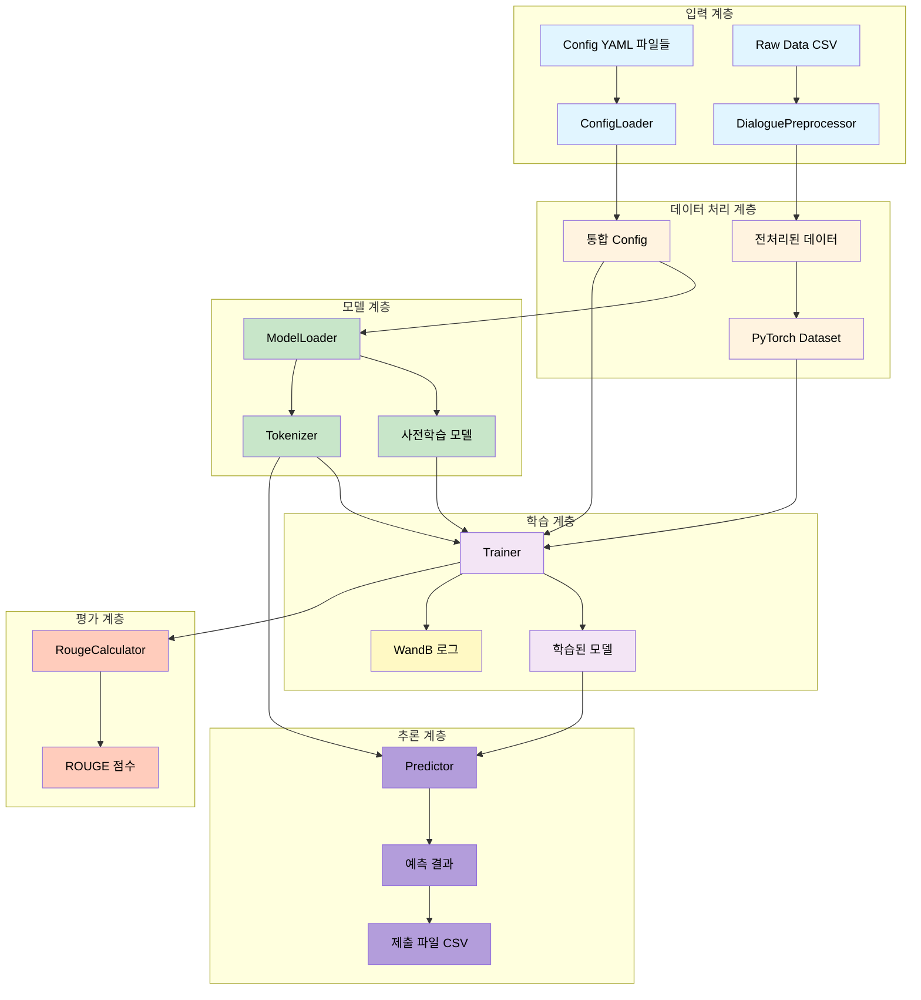
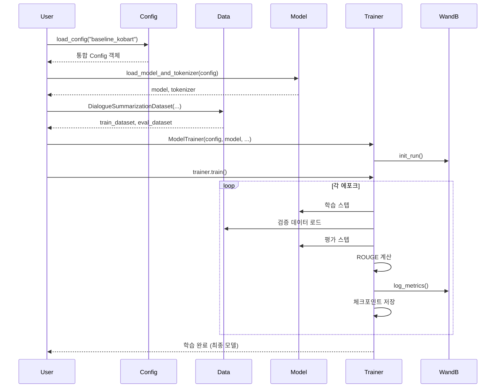
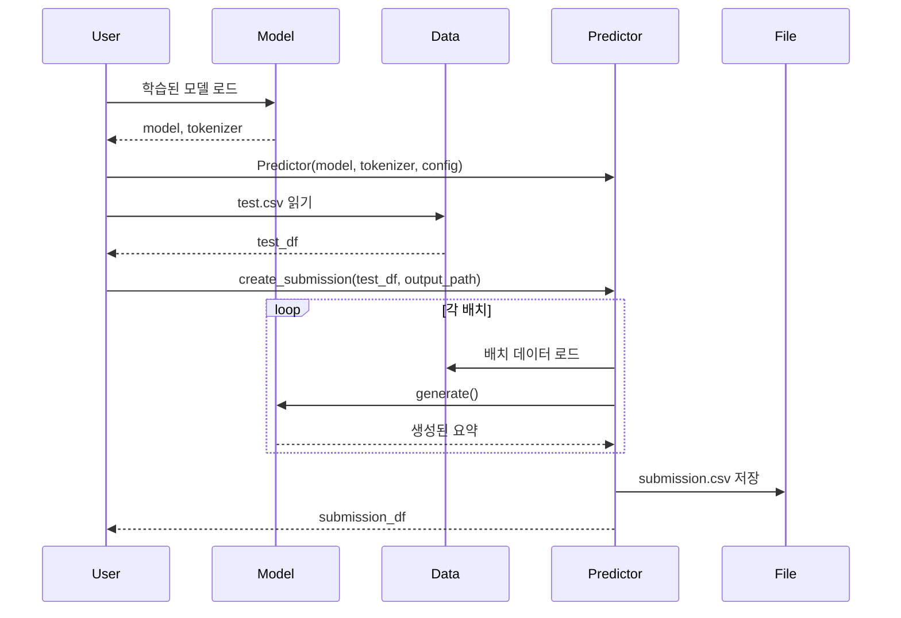
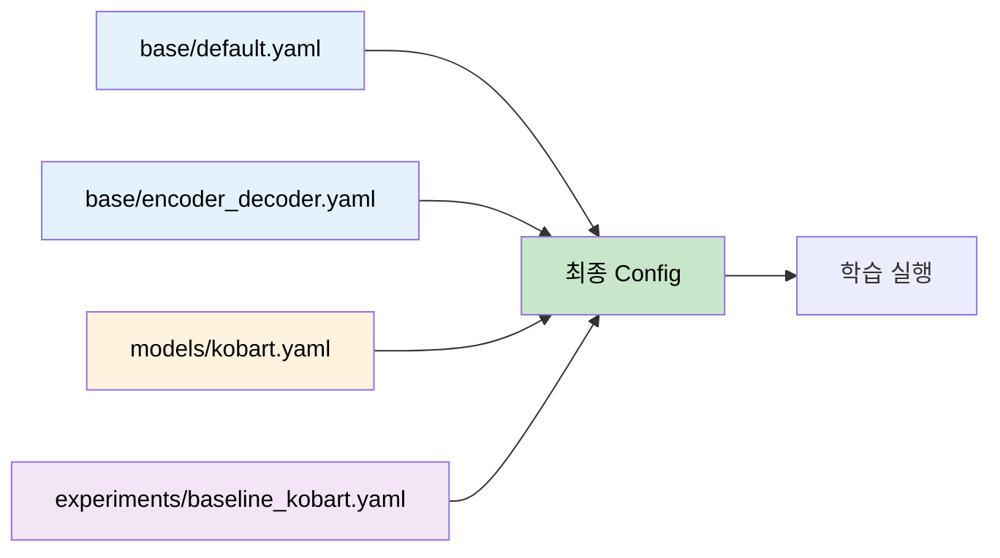
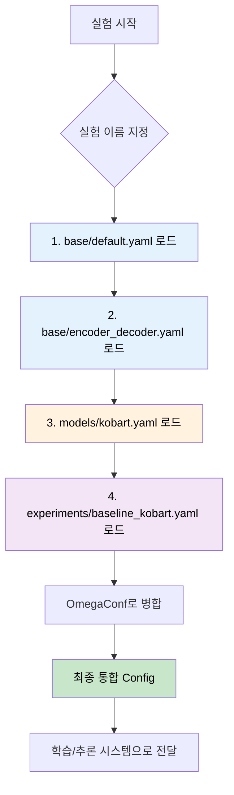

# 02. 핵심 시스템 (전체 아키텍처, Config, Logger)

## 목차
- [Part 1: 전체 시스템 아키텍처](#part-1-전체-시스템-아키텍처)
  - [시스템 아키텍처](#시스템-아키텍처)
  - [모듈 구조](#모듈-구조)
  - [데이터 플로우](#데이터-플로우)
  - [설치 및 환경 설정](#설치-및-환경-설정)
  - [빠른 시작](#빠른-시작)
  - [Config 시스템 개요](#config-시스템-개요)
  - [테스트 결과 요약](#테스트-결과-요약)
- [Part 2: Config 시스템](#part-2-config-시스템)
  - [개요](#개요)
  - [Config 구조](#config-구조)
  - [사용 방법](#사용-방법)
  - [Config 파일 작성](#config-파일-작성)
  - [테스트 결과](#테스트-결과)
  - [실전 사용 예시](#실전-사용-예시)
  - [주의사항](#주의사항)
- [Part 3: Logger 시스템](#part-3-logger-시스템)
  - [Logger 개요](#logger-개요)
  - [Logger 사용법](#logger-사용법)
  - [모듈별 Logger 통합](#모듈별-logger-통합)
  - [GPU 유틸리티 통합](#gpu-유틸리티-통합)
  - [통합 예시](#통합-예시)

---

# Part 1: 전체 시스템 아키텍처

## 시스템 아키텍처

### 전체 구조 다이어그램



---

## 모듈 구조

### 디렉토리 구조

```
src/
├── config/              # Config 관리 시스템
│   ├── __init__.py
│   └── loader.py       # 계층적 Config 병합
│
├── data/               # 데이터 처리
│   ├── __init__.py
│   ├── preprocessor.py # 텍스트 전처리
│   └── dataset.py      # PyTorch Dataset 클래스
│
├── models/             # 모델 로딩
│   ├── __init__.py
│   └── model_loader.py # HuggingFace 모델 로더
│
├── evaluation/         # 평가 시스템
│   ├── __init__.py
│   └── metrics.py      # ROUGE 계산
│
├── training/           # 학습 시스템
│   ├── __init__.py
│   └── trainer.py      # Seq2SeqTrainer 래퍼
│
└── inference/          # 추론 시스템
    ├── __init__.py
    └── predictor.py    # 배치 추론 및 제출 파일 생성
```

### 모듈별 역할

| 모듈 | 주요 클래스 | 핵심 기능 |
|------|------------|----------|
| **config** | `ConfigLoader` | YAML 기반 계층적 설정 관리 |
| **data** | `DialoguePreprocessor`<br>`DialogueSummarizationDataset`<br>`InferenceDataset` | 데이터 전처리<br>학습/검증 데이터셋<br>추론 데이터셋 |
| **models** | `ModelLoader` | 모델/토크나이저 로딩<br>특수 토큰 처리 |
| **evaluation** | `RougeCalculator` | ROUGE-1/2/L 계산<br>Multi-reference 지원 |
| **training** | `ModelTrainer` | 학습 파이프라인<br>WandB 로깅 통합 |
| **inference** | `Predictor` | 배치 추론<br>제출 파일 생성 |

---

## 데이터 플로우

### 학습 파이프라인



### 추론 파이프라인



---

## 설치 및 환경 설정

### 1. 가상환경 활성화

```bash
# pyenv 가상환경 활성화
source ~/.pyenv/versions/nlp_py3_11_9/bin/activate

# 또는 pyenv 명령어 사용
pyenv activate nlp_py3_11_9
```

### 2. 필수 패키지 설치

```bash
pip install -r requirements.txt
```

**주요 패키지:**
- `torch==2.8.0` - PyTorch 딥러닝 프레임워크
- `transformers==4.57.0` - HuggingFace Transformers
- `pandas==2.3.3` - 데이터 처리
- `omegaconf==2.3.0` - Config 관리
- `rouge-score==0.1.2` - ROUGE 평가
- `wandb==0.22.2` - 실험 로깅

### 3. 프로젝트 구조 확인

```bash
# 프로젝트 루트에서 실행
tree -L 2 src/
tree -L 2 configs/
tree -L 2 tests/
```

---

## 빠른 시작

### 1. Config 기반 학습 실행

```python
# ==================== Config 기반 학습 실행 예제 ==================== #

# ---------------------- 표준 라이브러리 임포트 ---------------------- #
import pandas as pd

# ---------------------- 프로젝트 모듈 임포트 ---------------------- #
from src.config import load_config
from src.models import load_model_and_tokenizer
from src.data import DialogueSummarizationDataset
from src.training import create_trainer

# ---------------------- Config 로드 ---------------------- #
# 실험 설정 파일을 로드하여 통합 Config 객체 생성
config = load_config("baseline_kobart")

# ---------------------- 모델 및 토크나이저 로드 ---------------------- #
# 사전학습된 모델과 토크나이저를 Config 설정에 따라 로드
model, tokenizer = load_model_and_tokenizer(config)

# ---------------------- 데이터 로드 ---------------------- #
# 학습 데이터 CSV 파일 읽기
train_df = pd.read_csv("data/raw/train.csv")

# PyTorch Dataset 객체 생성
train_dataset = DialogueSummarizationDataset(
    dialogues=train_df['dialogue'].tolist(),  # 대화 데이터 리스트
    summaries=train_df['summary'].tolist(),   # 요약 데이터 리스트
    tokenizer=tokenizer                       # 토크나이저 객체
)

# ---------------------- Trainer 생성 및 학습 ---------------------- #
# HuggingFace Trainer 래퍼 생성
trainer = create_trainer(
    config=config,              # 통합 Config 객체
    model=model,                # 모델 객체
    tokenizer=tokenizer,        # 토크나이저 객체
    train_dataset=train_dataset # 학습 데이터셋
)

# 학습 실행 및 결과 반환
results = trainer.train()
```

### 2. 추론 및 제출 파일 생성

```python
# ==================== 추론 및 제출 파일 생성 예제 ==================== #

# ---------------------- 표준 라이브러리 임포트 ---------------------- #
import pandas as pd

# ---------------------- 프로젝트 모듈 임포트 ---------------------- #
from src.models import load_model_and_tokenizer
from src.inference import create_predictor

# ---------------------- 학습된 모델 로드 ---------------------- #
# Config 기반으로 모델 및 토크나이저 로드
model, tokenizer = load_model_and_tokenizer(config)

# 또는 저장된 체크포인트에서 직접 로드 (대안)
# model = AutoModelForSeq2SeqLM.from_pretrained("outputs/best_model")

# ---------------------- Predictor 생성 ---------------------- #
# 배치 추론을 위한 Predictor 객체 생성
predictor = create_predictor(
    model=model,        # 학습된 모델 객체
    tokenizer=tokenizer,# 토크나이저 객체
    config=config       # 추론 설정이 포함된 Config 객체
)

# ---------------------- 테스트 데이터 로드 ---------------------- #
# 테스트 데이터 CSV 파일 읽기
test_df = pd.read_csv("data/raw/test.csv")

# ---------------------- 제출 파일 생성 ---------------------- #
# 배치 추론 수행 및 제출 파일 저장
submission_df = predictor.create_submission(
    test_df=test_df,                          # 테스트 데이터프레임
    output_path="submissions/submission.csv", # 제출 파일 저장 경로
    batch_size=32                             # 배치 크기
)
```

### 3. 단일 명령어로 테스트 실행

```bash
# 가상환경 활성화 후 각 모듈 테스트
source ~/.pyenv/versions/nlp_py3_11_9/bin/activate

python tests/test_config_loader.py
python tests/test_preprocessor.py
python tests/test_model_loader.py
python tests/test_metrics.py
python tests/test_trainer.py
python tests/test_predictor.py
```

---

## Config 시스템 개요

### Config 계층 구조



### Config 병합 우선순위

1. `base/default.yaml` - 기본 설정
2. `base/encoder_decoder.yaml` - 모델 타입별 설정
3. `models/{model_name}.yaml` - 특정 모델 설정
4. `experiments/{experiment_name}.yaml` - 실험별 설정 (최우선)

**예시:**
```yaml
# base/default.yaml
training:
  batch_size: 8
  learning_rate: 5e-5

# experiments/baseline_kobart.yaml
training:
  batch_size: 50        # 오버라이드됨
  learning_rate: 1e-5   # 오버라이드됨
```

---

## 테스트 결과 요약

### 전체 테스트 현황

| 모듈 | 테스트 파일 | 테스트 개수 | 상태 |
|------|------------|-----------|------|
| Config | `test_config_loader.py` | 6개 | ✅ 통과 |
| Data | `test_preprocessor.py` | 5개 | ✅ 통과 |
| Models | `test_model_loader.py` | 5개 | ✅ 통과 |
| Evaluation | `test_metrics.py` | 6개 | ✅ 통과 |
| Training | `test_trainer.py` | 5개 | ✅ 통과 |
| Inference | `test_predictor.py` | 6개 | ✅ 통과 |
| **전체** | **6개 파일** | **33개** | **✅ 모두 통과** |

### 주요 검증 항목

✅ **Config Loader**
- 계층적 YAML 병합 정상 동작
- 실험별 Config 오버라이드 정상 작동

✅ **Data Preprocessing**
- 12,457개 실제 데이터 전처리 성공
- 노이즈 제거, 화자 추출, 턴 계산 정상 동작

✅ **Model Loader**
- KoBART 모델 (123M 파라미터) 로딩 성공
- GPU 자동 감지 및 배치 정상 동작

✅ **Metrics**
- ROUGE-1/2/L 계산 정상 동작
- Multi-reference 평가 지원 확인

✅ **Trainer**
- Seq2SeqTrainer 래핑 정상 동작
- WandB 로깅 통합 확인

✅ **Inference**
- 배치 추론 정상 동작
- 제출 파일 생성 정상 동작

---

# Part 2: Config 시스템

## 개요

### 목적
- 실험 설정의 체계적 관리
- 재현 가능한 실험 환경
- 하이퍼파라미터 버전 관리
- 다양한 실험 설정의 빠른 전환

### 핵심 기능
- ✅ 계층적 YAML 병합
- ✅ 실험별 Config 오버라이드
- ✅ OmegaConf 기반 타입 안전성
- ✅ 누락된 파일 자동 처리

---

## Config 구조

### 디렉토리 구조

```
configs/
├── base/                           # 기본 설정
│   ├── default.yaml               # 전체 기본값
│   └── encoder_decoder.yaml       # 모델 타입별 기본값
│
├── models/                         # 모델별 설정
│   ├── kobart.yaml                # KoBART 설정
│   ├── t5.yaml                    # T5 설정 (예시)
│   └── ...
│
└── experiments/                    # 실험별 설정
    ├── baseline_kobart.yaml       # 베이스라인 실험
    ├── finetuned_kobart.yaml      # 파인튜닝 실험 (예시)
    └── ...
```

### Config 병합 플로우



### 병합 우선순위

**낮음 → 높음 순서:**
1. `base/default.yaml` - 전체 기본 설정
2. `base/encoder_decoder.yaml` - 모델 타입 설정
3. `models/{model_name}.yaml` - 특정 모델 설정
4. `experiments/{experiment_name}.yaml` - **실험 설정 (최우선)**

**예시:**
```yaml
# base/default.yaml
training:
  batch_size: 8
  learning_rate: 5e-5
  epochs: 10

# experiments/baseline_kobart.yaml
training:
  batch_size: 50        # 오버라이드
  learning_rate: 1e-5   # 오버라이드
  # epochs: 10은 default 값 사용
```

**병합 결과:**
```yaml
training:
  batch_size: 50        # experiments에서 오버라이드
  learning_rate: 1e-5   # experiments에서 오버라이드
  epochs: 10            # default 값 유지
```

---

## 사용 방법

### 1. 기본 사용법

```python
# ==================== Config 기본 사용법 ==================== #

# ---------------------- 프로젝트 모듈 임포트 ---------------------- #
from src.config import load_config

# ---------------------- Config 로드 ---------------------- #
# 실험 이름으로 Config 로드 (계층적 병합 자동 수행)
config = load_config("baseline_kobart")

# ---------------------- Config 값 접근 ---------------------- #
# 학습 배치 크기 출력
print(config.training.batch_size)     # 50

# 모델 체크포인트 경로 출력
print(config.model.checkpoint)        # "digit82/kobart-summarization"

# 실험명 출력
print(config.experiment.name)         # "baseline_kobart"
```

### 2. Config 값 확인

```python
# ==================== Config 값 확인 ==================== #

# ---------------------- 서드파티 라이브러리 임포트 ---------------------- #
from omegaconf import OmegaConf

# ---------------------- Config 전체 출력 ---------------------- #
# 모든 Config 설정을 YAML 형식으로 출력
print(OmegaConf.to_yaml(config))

# ---------------------- 특정 섹션만 출력 ---------------------- #
# 학습 관련 설정만 출력
print(OmegaConf.to_yaml(config.training))

# 모델 관련 설정만 출력
print(OmegaConf.to_yaml(config.model))
```

### 3. Config 값 수정 (런타임)

```python
# ==================== Config 값 런타임 수정 ==================== #

# ---------------------- 기존 값 변경 ---------------------- #
# 배치 크기 변경
config.training.batch_size = 32

# 학습률 변경
config.training.learning_rate = 2e-5

# ---------------------- 새로운 키 추가 ---------------------- #
# 커스텀 파라미터 동적 추가
config.custom_param = "value"
```

### 4. ConfigLoader 직접 사용

```python
# ==================== ConfigLoader 직접 사용 ==================== #

# ---------------------- 프로젝트 모듈 임포트 ---------------------- #
from src.config import ConfigLoader

# ---------------------- ConfigLoader 인스턴스 생성 ---------------------- #
# Config 디렉토리 경로를 지정하여 Loader 생성
loader = ConfigLoader(config_dir="configs")

# ---------------------- Config 수동 병합 ---------------------- #
# 실험 이름으로 계층적 Config 병합 수행
config = loader.merge_configs("baseline_kobart")

# ---------------------- 특정 파일만 로드 ---------------------- #
# 기본 Config 파일만 로드
base_config = loader.load_base_config()

# 모델별 Config 파일만 로드
model_config = loader.load_model_config("kobart")
```

---

## Config 파일 작성

### base/default.yaml 구조

```yaml
# ==================== 기본 설정 ==================== #

# 실험 정보
experiment:
  name: "default"
  seed: 42
  deterministic: true

# 경로 설정
paths:
  train_data: "data/raw/train.csv"
  dev_data: "data/raw/dev.csv"
  test_data: "data/raw/test.csv"
  output_dir: "outputs"

# 학습 설정
training:
  output_dir: "outputs"
  epochs: 10
  batch_size: 8
  learning_rate: 5e-5
  device: "cuda"

# 평가 설정
evaluation:
  metric: "rouge"
  rouge_types:
    - "rouge1"
    - "rouge2"
    - "rougeL"
```

### base/encoder_decoder.yaml 구조

```yaml
# ==================== Encoder-Decoder 공통 설정 ==================== #

model:
  type: "encoder_decoder"
  architecture: "bart"

# 토크나이저 설정
tokenizer:
  encoder_max_len: 512
  decoder_max_len: 100
  special_tokens:
    - '#Person1#'
    - '#Person2#'
    # ... 추가 특수 토큰

# 추론 설정
inference:
  batch_size: 32
  num_beams: 4
  early_stopping: true
  generate_max_length: 100
  no_repeat_ngram_size: 2
```

### models/kobart.yaml 구조

```yaml
# ==================== KoBART 모델 설정 ==================== #

model:
  name: "kobart"
  checkpoint: "digit82/kobart-summarization"

# KoBART 특화 설정
# (필요시 추가)
```

### experiments/baseline_kobart.yaml 구조

```yaml
# ==================== 베이스라인 실험 설정 ==================== #

experiment:
  name: "baseline_kobart"
  description: "대회 베이스라인 재현 실험"
  tags:
    - "baseline"
    - "kobart"

# WandB 설정
wandb:
  enabled: true
  project: "nlp-competition"
  entity: "ieyeppo"

# 모델 설정
model:
  name: "kobart"

# 학습 설정 (베이스라인 오버라이드)
training:
  epochs: 20
  batch_size: 50
  learning_rate: 1e-5

# 경로 설정
paths:
  output_dir: "outputs/baseline_kobart"
```

---

## 테스트 결과

### 테스트 명령어

```bash
# 가상환경 활성화
source ~/.pyenv/versions/nlp_py3_11_9/bin/activate

# 테스트 실행
python tests/test_config_loader.py
```

### 테스트 항목 (총 6개)

#### 1. ✅ 기본 Config 로드
```python
# ==================== 기본 Config 로드 테스트 ==================== #

def test_load_base_config():
    """base/default.yaml 로드 확인"""
    # ConfigLoader 인스턴스 생성
    loader = ConfigLoader()

    # 기본 Config 파일 로드
    config = loader.load_base_config()

    # 기본 설정 검증
    assert config.experiment.seed == 42
    assert config.paths.train_data == "data/raw/train.csv"
```

**결과:**
```
✅ 기본 Config 로드 테스트 성공!
  experiment.seed: 42
  paths.train_data: data/raw/train.csv
```

#### 2. ✅ 모델 타입 Config 로드
```python
# ==================== 모델 타입 Config 로드 테스트 ==================== #

def test_load_model_type_config():
    """base/encoder_decoder.yaml 로드 확인"""
    # ConfigLoader 인스턴스 생성
    loader = ConfigLoader()

    # 모델 타입별 Config 파일 로드
    config = loader.load_model_type_config("encoder_decoder")

    # 모델 타입 설정 검증
    assert config.model.type == "encoder_decoder"
    assert config.tokenizer.encoder_max_len == 512
```

**결과:**
```
✅ 모델 타입 Config 로드 테스트 성공!
  model.type: encoder_decoder
  tokenizer.encoder_max_len: 512
```

#### 3. ✅ 모델별 Config 로드
```python
# ==================== 모델별 Config 로드 테스트 ==================== #

def test_load_model_config():
    """models/kobart.yaml 로드 확인"""
    # ConfigLoader 인스턴스 생성
    loader = ConfigLoader()

    # 특정 모델의 Config 파일 로드
    config = loader.load_model_config("kobart")

    # 모델 설정 검증
    assert config.model.name == "kobart"
    assert "digit82" in config.model.checkpoint
```

**결과:**
```
✅ 모델별 Config 로드 테스트 성공!
  model.name: kobart
  model.checkpoint: digit82/kobart-summarization
```

#### 4. ✅ 실험 Config 로드
```python
# ==================== 실험 Config 로드 테스트 ==================== #

def test_load_experiment_config():
    """experiments/baseline_kobart.yaml 로드 확인"""
    # ConfigLoader 인스턴스 생성
    loader = ConfigLoader()

    # 실험별 Config 파일 로드
    config = loader.load_experiment_config("baseline_kobart")

    # 실험 설정 검증
    assert config.experiment.name == "baseline_kobart"
    assert config.wandb.enabled == True
```

**결과:**
```
✅ 실험 Config 로드 테스트 성공!
  experiment.name: baseline_kobart
  wandb.enabled: True
```

#### 5. ✅ 계층적 Config 병합
```python
# ==================== 계층적 Config 병합 테스트 ==================== #

def test_merge_configs():
    """전체 Config 병합 확인"""
    # ConfigLoader 인스턴스 생성
    loader = ConfigLoader()

    # 모든 계층의 Config 파일을 병합
    config = loader.merge_configs("baseline_kobart")

    # 병합 우선순위 확인
    assert config.training.batch_size == 50      # experiment에서 오버라이드
    assert config.training.epochs == 20          # experiment에서 오버라이드
    assert config.tokenizer.encoder_max_len == 512  # base 값 유지
```

**결과:**
```
✅ 계층적 Config 병합 테스트 성공!
  training.batch_size: 50 (오버라이드됨)
  training.epochs: 20 (오버라이드됨)
  tokenizer.encoder_max_len: 512 (base 값 유지)
```

#### 6. ✅ 편의 함수
```python
# ==================== load_config 편의 함수 테스트 ==================== #

def test_load_config_function():
    """load_config() 편의 함수 확인"""
    # 편의 함수로 Config 로드 (계층적 병합 자동 수행)
    config = load_config("baseline_kobart")

    # Config 로드 검증
    assert config.experiment.name == "baseline_kobart"
    assert config.model.checkpoint is not None
```

**결과:**
```
✅ 편의 함수 테스트 성공!
  Config 로드 완료
  모든 섹션 접근 가능
```

### 전체 테스트 요약

```
============================================================
Config Loader 테스트 시작
============================================================

테스트 1: 기본 Config 로드                    ✅ 통과
테스트 2: 모델 타입 Config 로드                ✅ 통과
테스트 3: 모델별 Config 로드                   ✅ 통과
테스트 4: 실험 Config 로드                     ✅ 통과
테스트 5: 계층적 Config 병합                   ✅ 통과
테스트 6: 편의 함수                           ✅ 통과

============================================================
🎉 모든 테스트 통과! (6/6)
============================================================
```

---

## 실전 사용 예시

### 예시 1: 새로운 실험 설정 추가

```yaml
# configs/experiments/finetuned_kobart.yaml
experiment:
  name: "finetuned_kobart_v2"
  description: "파인튜닝 실험 버전 2"
  tags:
    - "finetuned"
    - "v2"

training:
  epochs: 30                    # 더 긴 학습
  batch_size: 32                # 작은 배치
  learning_rate: 5e-6           # 낮은 학습률
  warmup_steps: 1000            # 더 긴 warmup

paths:
  output_dir: "outputs/finetuned_v2"
```

**사용:**
```python
# ==================== 새로운 실험 설정 사용 ==================== #

# 새로 생성한 실험 설정 로드
config = load_config("finetuned_kobart_v2")
```

### 예시 2: 디버그 모드 설정

```yaml
# configs/experiments/debug.yaml
experiment:
  name: "debug"

debug:
  use_subset: true
  subset_size: 100              # 100개 샘플만 사용

training:
  epochs: 2                     # 빠른 테스트
  batch_size: 4

wandb:
  enabled: false                # WandB 비활성화
```

### 예시 3: 런타임에서 Config 수정

```python
# ==================== 런타임 Config 수정 예제 ==================== #

# ---------------------- Config 로드 ---------------------- #
# 기본 실험 설정 로드
config = load_config("baseline_kobart")

# ---------------------- Config 동적 수정 ---------------------- #
# GPU 메모리 부족 시 배치 크기 줄이기
config.training.batch_size = 16

# 빠른 테스트를 위해 에포크 줄이기
config.training.epochs = 5

# WandB 비활성화
config.wandb.enabled = False

# ---------------------- 수정된 Config로 학습 진행 ---------------------- #
# 동적으로 수정된 Config로 Trainer 생성
trainer = create_trainer(config, ...)
```

---

## 주의사항

### 1. YAML 문법
- 들여쓰기는 **공백 2칸** 사용 (탭 사용 금지)
- 문자열에 특수문자 포함 시 따옴표 사용
- 리스트는 `-` 사용

### 2. 파일명 규칙
- `experiments/` 폴더의 YAML 파일명 = 실험 이름
- 예: `baseline_kobart.yaml` → `load_config("baseline_kobart")`

### 3. Config 값 접근
```python
# ==================== Config 값 접근 방법 ==================== #

# ---------------------- 올바른 접근 ---------------------- #
# OmegaConf 객체는 속성 접근 방식 사용
config.training.batch_size

# ---------------------- 잘못된 접근 ---------------------- #
# 딕셔너리 방식 접근은 Key Error 발생 가능
config['training']['batch_size']

# ---------------------- 안전한 접근 ---------------------- #
# 기본값을 제공하여 안전하게 접근
config.get('training', {}).get('batch_size', 32)
```

### 4. 누락된 Config 처리
- ConfigLoader는 누락된 파일을 자동으로 건너뜀
- 필수 설정은 `base/default.yaml`에 정의 권장

---

# Part 3: Logger 시스템

## Logger 개요

모든 모듈에서 print 대신 `src/logging/logger.py`의 Logger 클래스를 사용해야 합니다.

**Logger의 이점:**
- 콘솔 출력과 파일 로깅 동시 수행
- 타임스탬프 자동 추가
- stdout/stderr 리다이렉션 지원
- 에러 메시지 강조 출력

---

## Logger 사용법

### 1. Logger 초기화

```python
# ==================== Logger 초기화 ==================== #

# ---------------------- 프로젝트 모듈 임포트 ---------------------- #
from src.logging.logger import Logger
from src.utils.core.common import create_log_path

# ---------------------- 로그 파일 경로 생성 ---------------------- #
# 타임스탬프가 포함된 로그 파일 경로 자동 생성
log_path = create_log_path("outputs/logs", "train")  # outputs/logs/train_20251011_143000.log

# ---------------------- Logger 초기화 ---------------------- #
# 파일과 콘솔에 동시 출력하는 Logger 생성
logger = Logger(log_path, print_also=True)

# ---------------------- stdout/stderr 리다이렉션 시작 ---------------------- #
# 모든 print 출력을 로그 파일에도 저장
logger.start_redirect()

# ---------------------- 작업 수행 ---------------------- #
# ... 학습 또는 추론 작업 ...

# ---------------------- 리다이렉션 종료 및 정리 ---------------------- #
# 리다이렉션 종료
logger.stop_redirect()

# 로그 파일 닫기
logger.close()
```

### 2. print 대신 logger.write 사용

```python
# ==================== Logger 사용 방법 ==================== #

# ---------------------- 기존 방식 (지양) ---------------------- #
# print는 파일 로깅이 되지 않음
print("=" * 60)
print("모델 로딩 시작")
print("=" * 60)

# ---------------------- 올바른 방식 (권장) ---------------------- #
# logger.write는 파일과 콘솔에 동시 출력
logger.write("=" * 60)
logger.write("모델 로딩 시작")
logger.write("=" * 60)
```

### 3. 에러 로깅

```python
# ==================== 에러 로깅 ==================== #

# ---------------------- 에러 메시지 출력 ---------------------- #
# print_error=True로 빨간색 강조 출력
logger.write("❌ 모델 로드 실패!", print_error=True)
```

### 4. Logger 컨텍스트 매니저 사용 (권장)

```python
# ==================== Logger 컨텍스트 매니저 사용 ==================== #

# ---------------------- 프로젝트 모듈 임포트 ---------------------- #
from src.logging.logger import Logger
from src.utils.core.common import create_log_path

# ---------------------- 로그 파일 경로 생성 ---------------------- #
log_path = create_log_path("outputs/logs", "train")

# ---------------------- 컨텍스트 매니저로 Logger 사용 ---------------------- #
# with 문을 사용하면 자동으로 start_redirect()와 stop_redirect() 호출
with Logger(log_path, print_also=True) as logger:
    logger.write("=" * 60)
    logger.write("학습 시작")
    logger.write("=" * 60)

    # 작업 수행...

# with 블록을 벗어나면 자동으로 리다이렉션 종료 및 파일 닫기
```

---

## 모듈별 Logger 통합

### src/models/model_loader.py

```python
# ==================== model_loader.py Logger 통합 ==================== #

# ---------------------- 수정 전 (print 사용) ---------------------- #
# 파일 로깅이 되지 않음
print(f"토크나이저 로딩: {checkpoint}")
print(f"  → 특수 토큰 {num_added}개 추가됨")

# ---------------------- 수정 후 (logger 사용) ---------------------- #
# logger가 제공된 경우에만 로깅
if logger:
    logger.write(f"토크나이저 로딩: {checkpoint}")
    logger.write(f"  → 특수 토큰 {num_added}개 추가됨")
```

**적용 예시:**
```python
# ==================== load_model_and_tokenizer 함수 예제 ==================== #

def load_model_and_tokenizer(config, logger=None):
    """모델과 토크나이저를 로드합니다."""
    # ---------------------- 체크포인트 경로 가져오기 ---------------------- #
    checkpoint = config.model.checkpoint

    # ---------------------- 모델 로딩 시작 로그 ---------------------- #
    if logger:
        logger.write(f"\n[모델 로딩]")
        logger.write(f"체크포인트: {checkpoint}")

    # ---------------------- 토크나이저 로드 ---------------------- #
    # HuggingFace Hub에서 토크나이저 로드
    tokenizer = AutoTokenizer.from_pretrained(checkpoint)

    # ---------------------- 특수 토큰 추가 ---------------------- #
    # Config에 정의된 특수 토큰 추가
    special_tokens = config.tokenizer.special_tokens
    num_added = tokenizer.add_tokens(special_tokens)

    # 추가된 토큰 수 로깅
    if logger:
        logger.write(f"특수 토큰 {num_added}개 추가됨")

    # ---------------------- 모델 로드 ---------------------- #
    # HuggingFace Hub에서 Seq2Seq 모델 로드
    model = AutoModelForSeq2SeqLM.from_pretrained(checkpoint)

    # 모델 임베딩 크기 조정 (특수 토큰 추가에 맞춰)
    model.resize_token_embeddings(len(tokenizer))

    # 임베딩 크기 조정 로깅
    if logger:
        logger.write(f"모델 임베딩 크기 조정: {len(tokenizer)}")

    # ---------------------- 모델 및 토크나이저 반환 ---------------------- #
    return model, tokenizer
```

### src/training/trainer.py

```python
# ==================== trainer.py Logger 통합 ==================== #

# ---------------------- 수정 전 (print 사용) ---------------------- #
# 파일 로깅이 되지 않음
print("=" * 60)
print("모델 학습 시작")
print("=" * 60)

# ---------------------- 수정 후 (logger 사용) ---------------------- #
# logger가 제공된 경우에만 로깅
if logger:
    logger.write("=" * 60)
    logger.write("모델 학습 시작")
    logger.write("=" * 60)
```

**적용 예시:**
```python
# ==================== train 메서드 예제 ==================== #

def train(self, logger=None):
    """학습을 실행합니다."""
    # ---------------------- 학습 시작 로그 ---------------------- #
    if logger:
        logger.write("=" * 60)
        logger.write("모델 학습 시작")
        logger.write("=" * 60)
        logger.write(f"에포크: {self.config.training.epochs}")
        logger.write(f"배치 크기: {self.config.training.batch_size}")
        logger.write(f"학습률: {self.config.training.learning_rate}")

    # ---------------------- 학습 실행 ---------------------- #
    # HuggingFace Trainer로 학습 수행
    results = self.trainer.train()

    # ---------------------- 학습 완료 로그 ---------------------- #
    if logger:
        logger.write("\n학습 완료!")
        logger.write(f"최종 손실: {results.training_loss:.4f}")

    # ---------------------- 학습 결과 반환 ---------------------- #
    return results
```

### src/inference/predictor.py

```python
# ==================== predictor.py Logger 통합 ==================== #

# ---------------------- 수정 전 (print 사용) ---------------------- #
# 파일 로깅이 되지 않음
print("=" * 60)
print("제출 파일 생성 시작")
print("=" * 60)

# ---------------------- 수정 후 (logger 사용) ---------------------- #
# logger가 제공된 경우에만 로깅
if logger:
    logger.write("=" * 60)
    logger.write("제출 파일 생성 시작")
    logger.write("=" * 60)
```

**적용 예시:**
```python
def create_submission(self, test_df, output_path, batch_size=32, logger=None):
    """제출 파일을 생성합니다."""
    if logger:
        logger.write("=" * 60)
        logger.write("제출 파일 생성 시작")
        logger.write("=" * 60)
        logger.write(f"테스트 데이터: {len(test_df)}개")
        logger.write(f"배치 크기: {batch_size}")

    # 추론 수행
    predictions = self.predict_batch(test_df['dialogue'].tolist(), batch_size)

    # 제출 파일 생성
    submission_df = pd.DataFrame({
        'id': test_df['id'],
        'summary': predictions
    })
    submission_df.to_csv(output_path, index=False)

    if logger:
        logger.write(f"\n제출 파일 저장: {output_path}")
        logger.write(f"생성된 요약: {len(predictions)}개")

    return submission_df
```

---

## GPU 유틸리티 통합

### src/utils/gpu_optimization/team_gpu_check.py 활용

```python
from src.utils.gpu_optimization.team_gpu_check import (
    check_gpu_tier,
    get_gpu_info,
    get_optimal_batch_size,
    get_memory_usage
)

# GPU 정보 출력
gpu_info = get_gpu_info()
if logger:
    logger.write(f"GPU 정보: {gpu_info}")

# GPU tier 확인
gpu_tier = check_gpu_tier()
if logger:
    logger.write(f"GPU Tier: {gpu_tier}")

# 최적 배치 크기 추천
optimal_batch_size = get_optimal_batch_size("kobart", gpu_tier)
if logger:
    logger.write(f"추천 배치 크기: {optimal_batch_size}")
```

**전체 통합 예시:**
```python
def main(args):
    # Logger 초기화
    log_path = create_log_path("outputs/logs", f"train_{args.experiment}")

    with Logger(log_path, print_also=True) as logger:
        logger.write("=" * 60)
        logger.write(f"학습 시작: {args.experiment}")
        logger.write("=" * 60)

        # GPU 정보 출력
        logger.write("\n[GPU 정보]")
        gpu_info = get_gpu_info()
        for key, value in gpu_info.items():
            logger.write(f"  {key}: {value}")

        # GPU Tier 확인
        gpu_tier = check_gpu_tier()
        logger.write(f"\nGPU Tier: {gpu_tier}")

        # 최적 배치 크기 추천
        optimal_batch = get_optimal_batch_size("kobart", gpu_tier)
        logger.write(f"추천 배치 크기: {optimal_batch}")

        # Config 로드
        logger.write("\n[1/6] Config 로딩...")
        config = load_config(args.experiment)
        logger.write(f"  실험명: {config.experiment.name}")
        logger.write(f"  모델: {config.model.checkpoint}")

        # 모델 로드
        logger.write("\n[2/6] 모델 로딩...")
        model, tokenizer = load_model_and_tokenizer(config, logger=logger)

        # ... 나머지 작업
```

---

## 통합 예시

### scripts/train.py에 Logger 완전 통합

```python
import argparse
from pathlib import Path

from src.logging.logger import Logger
from src.utils.core.common import create_log_path
from src.utils.gpu_optimization.team_gpu_check import (
    get_gpu_info, check_gpu_tier, get_optimal_batch_size
)
from src.config import load_config
from src.models import load_model_and_tokenizer
from src.data import DialogueSummarizationDataset
from src.training import create_trainer

def main():
    parser = argparse.ArgumentParser()
    parser.add_argument("--experiment", type=str, required=True,
                        help="실험 이름 (예: baseline_kobart)")
    args = parser.parse_args()

    # Logger 초기화
    log_path = create_log_path("outputs/logs", f"train_{args.experiment}")

    with Logger(log_path, print_also=True) as logger:
        try:
            logger.write("=" * 60)
            logger.write(f"학습 시작: {args.experiment}")
            logger.write("=" * 60)

            # GPU 정보 출력
            logger.write("\n[GPU 정보]")
            gpu_info = get_gpu_info()
            for key, value in gpu_info.items():
                logger.write(f"  {key}: {value}")

            # GPU Tier 확인 및 배치 크기 추천
            gpu_tier = check_gpu_tier()
            logger.write(f"\nGPU Tier: {gpu_tier}")
            optimal_batch = get_optimal_batch_size("kobart", gpu_tier)
            logger.write(f"추천 배치 크기: {optimal_batch}")

            # Config 로드
            logger.write("\n[1/6] Config 로딩...")
            config = load_config(args.experiment)
            logger.write(f"  실험명: {config.experiment.name}")
            logger.write(f"  모델: {config.model.checkpoint}")
            logger.write(f"  배치 크기: {config.training.batch_size}")
            logger.write(f"  학습률: {config.training.learning_rate}")
            logger.write(f"  에포크: {config.training.epochs}")

            # 모델 및 토크나이저 로드
            logger.write("\n[2/6] 모델 및 토크나이저 로딩...")
            model, tokenizer = load_model_and_tokenizer(config, logger=logger)

            # 데이터 로드
            logger.write("\n[3/6] 데이터 로딩...")
            train_df = pd.read_csv(config.paths.train_data)
            logger.write(f"  학습 데이터: {len(train_df)}개")

            # 데이터셋 생성
            logger.write("\n[4/6] 데이터셋 생성...")
            train_dataset = DialogueSummarizationDataset(
                dialogues=train_df['dialogue'].tolist(),
                summaries=train_df['summary'].tolist(),
                tokenizer=tokenizer,
                logger=logger
            )

            # Trainer 생성
            logger.write("\n[5/6] Trainer 생성...")
            trainer = create_trainer(
                config=config,
                model=model,
                tokenizer=tokenizer,
                train_dataset=train_dataset,
                logger=logger
            )

            # 학습 실행
            logger.write("\n[6/6] 학습 실행...")
            results = trainer.train()

            logger.write("\n" + "=" * 60)
            logger.write("학습 완료!")
            logger.write("=" * 60)
            logger.write(f"최종 손실: {results.training_loss:.4f}")
            logger.write(f"로그 파일: {log_path}")

        except Exception as e:
            logger.write(f"\n❌ 에러 발생: {str(e)}", print_error=True)
            raise

if __name__ == "__main__":
    main()
```

### scripts/inference.py에 Logger 완전 통합

```python
import argparse
import pandas as pd
from pathlib import Path

from src.logging.logger import Logger
from src.utils.core.common import create_log_path
from src.config import load_config
from src.models import load_model_and_tokenizer
from src.inference import create_predictor

def main():
    parser = argparse.ArgumentParser()
    parser.add_argument("--experiment", type=str, required=True,
                        help="실험 이름 (예: baseline_kobart)")
    parser.add_argument("--checkpoint", type=str, required=True,
                        help="모델 체크포인트 경로")
    parser.add_argument("--output", type=str, default="submissions/submission.csv",
                        help="제출 파일 경로")
    args = parser.parse_args()

    # Logger 초기화
    log_path = create_log_path("outputs/logs", f"inference_{args.experiment}")

    with Logger(log_path, print_also=True) as logger:
        try:
            logger.write("=" * 60)
            logger.write(f"추론 시작: {args.experiment}")
            logger.write("=" * 60)

            # Config 로드
            logger.write("\n[1/4] Config 로딩...")
            config = load_config(args.experiment)
            logger.write(f"  실험명: {config.experiment.name}")

            # 모델 로드
            logger.write("\n[2/4] 모델 로딩...")
            logger.write(f"  체크포인트: {args.checkpoint}")
            model, tokenizer = load_model_and_tokenizer(
                config,
                checkpoint_path=args.checkpoint,
                logger=logger
            )

            # Predictor 생성
            logger.write("\n[3/4] Predictor 생성...")
            predictor = create_predictor(
                model=model,
                tokenizer=tokenizer,
                config=config,
                logger=logger
            )

            # 테스트 데이터 로드 및 추론
            logger.write("\n[4/4] 추론 실행...")
            test_df = pd.read_csv(config.paths.test_data)
            logger.write(f"  테스트 데이터: {len(test_df)}개")

            submission_df = predictor.create_submission(
                test_df=test_df,
                output_path=args.output,
                batch_size=config.inference.batch_size,
                logger=logger
            )

            logger.write("\n" + "=" * 60)
            logger.write("추론 완료!")
            logger.write("=" * 60)
            logger.write(f"제출 파일: {args.output}")
            logger.write(f"생성된 요약: {len(submission_df)}개")
            logger.write(f"로그 파일: {log_path}")

        except Exception as e:
            logger.write(f"\n❌ 에러 발생: {str(e)}", print_error=True)
            raise

if __name__ == "__main__":
    main()
```

---

## Logger 통합 체크리스트

### 핵심 모듈
- [ ] `src/models/model_loader.py` - Logger 매개변수 추가 및 print 대체
- [ ] `src/training/trainer.py` - Logger 통합
- [ ] `src/inference/predictor.py` - Logger 통합
- [ ] `src/data/preprocessor.py` - Logger 통합 (선택)
- [ ] `src/data/dataset.py` - Logger 통합 (선택)

### 스크립트
- [ ] `scripts/train.py` - Logger 완전 통합
- [ ] `scripts/inference.py` - Logger 완전 통합
- [ ] `scripts/full_pipeline.py` - Logger 통합 (있는 경우)

### 유틸리티
- [ ] GPU 정보 출력 시 Logger 사용
- [ ] 에러 메시지에 `print_error=True` 적용
- [ ] 모든 print 문을 logger.write로 대체

---

# Part 4: WandB 고급 시각화

## 개요

`src/logging/wandb_logger.py`에는 기본 로깅 기능 외에 **5가지 고급 시각화 메서드**가 구현되어 있습니다. 이 기능들은 학습 과정을 더 세밀하게 모니터링하고 디버깅하는 데 유용합니다.

### 5가지 고급 시각화 기능

| 기능 | 메서드 | 주요 용도 |
|------|--------|----------|
| 🎯 **학습률 스케줄** | `log_learning_rate_schedule()` | 학습률 변화 추적 |
| 📊 **그래디언트 Norm** | `log_gradient_norms()` | 그래디언트 폭발/소실 감지 |
| 📈 **Loss Curve** | `log_loss_curve()` | 과적합 모니터링 |
| 💾 **GPU 메모리** | `log_gpu_memory()` | 메모리 사용량 추적 |
| ⚡ **학습 속도** | `log_training_speed()` | 학습 효율성 측정 |

---

## 1. 학습률 스케줄 로깅

### 개요

학습률 스케줄러(Warmup, Cosine, Linear 등)의 동작을 시각화합니다.

### 메서드 시그니처

```python
def log_learning_rate_schedule(
    self,
    step: int,                # 현재 스텝
    learning_rate: float      # 현재 학습률
)
```

### 사용 예시

```python
from src.logging.wandb_logger import WandbLogger

# WandB Logger 초기화
wandb_logger = WandbLogger(
    project_name="nlp-competition",
    experiment_name="baseline_kobart"
)
wandb_logger.init_run()

# 학습 루프 내에서
for step in range(total_steps):
    # 현재 학습률 가져오기
    current_lr = optimizer.param_groups[0]['lr']

    # 학습률 로깅
    wandb_logger.log_learning_rate_schedule(
        step=step,
        learning_rate=current_lr
    )

    # 학습 스텝...
```

### Trainer 통합 예시

```python
# src/training/trainer.py에서 사용
class ModelTrainer:
    def train(self):
        for step, batch in enumerate(train_dataloader):
            # Forward/backward pass
            loss = self.model(**batch).loss
            loss.backward()

            # Optimizer step
            self.optimizer.step()
            self.scheduler.step()

            # 학습률 로깅
            if self.wandb_logger:
                current_lr = self.optimizer.param_groups[0]['lr']
                self.wandb_logger.log_learning_rate_schedule(
                    step=step,
                    learning_rate=current_lr
                )
```

### WandB 출력

WandB 대시보드에서 다음 차트를 확인할 수 있습니다:
- `learning_rate` vs `step` 그래프
- Warmup, Decay 단계 시각화

---

## 2. 그래디언트 Norm 로깅

### 개요

그래디언트 norm을 추적하여 **그래디언트 폭발(exploding)** 또는 **그래디언트 소실(vanishing)** 문제를 조기에 발견합니다.

### 메서드 시그니처

```python
def log_gradient_norms(
    self,
    model,          # PyTorch 모델
    step: int       # 현재 스텝
)
```

### 핵심 기능

- **전체 그래디언트 norm** 계산 (L2 norm)
- **레이어별 norm** 추적 (상위 10개만)
- Gradient clipping 필요 여부 판단

### 사용 예시

```python
from src.logging.wandb_logger import WandbLogger

wandb_logger = WandbLogger(
    project_name="nlp-competition",
    experiment_name="baseline_kobart"
)
wandb_logger.init_run()

# 학습 루프 내에서
for step, batch in enumerate(train_dataloader):
    # Forward pass
    outputs = model(**batch)
    loss = outputs.loss

    # Backward pass
    loss.backward()

    # 그래디언트 norm 로깅 (optimizer.step() 전에 호출)
    wandb_logger.log_gradient_norms(
        model=model,
        step=step
    )

    # Gradient clipping (필요시)
    torch.nn.utils.clip_grad_norm_(model.parameters(), max_norm=1.0)

    # Optimizer step
    optimizer.step()
    optimizer.zero_grad()
```

### WandB 출력

WandB 대시보드에서 다음을 확인할 수 있습니다:
- `gradient/total_norm`: 전체 그래디언트 norm
- `grad_norm/{layer_name}`: 상위 10개 레이어의 norm

### 그래디언트 Norm 해석

| Total Norm 범위 | 상태 | 조치 |
|-----------------|------|------|
| 0.001 ~ 1.0 | ✅ 정상 | 조치 불필요 |
| 1.0 ~ 10.0 | ⚠️ 주의 | 모니터링 필요 |
| > 10.0 | ❌ 폭발 | Gradient clipping 적용 |
| < 0.001 | ❌ 소실 | 학습률 증가 또는 Batch Norm |

---

## 3. Loss Curve 로깅

### 개요

Train Loss와 Validation Loss를 동시에 로깅하여 **과적합(overfitting)**을 모니터링합니다.

### 메서드 시그니처

```python
def log_loss_curve(
    self,
    train_loss: float,          # 학습 손실
    val_loss: float = None,     # 검증 손실 (선택)
    step: int = None            # 스텝 번호 (선택)
)
```

### 핵심 기능

- Train/Validation Loss 동시 추적
- **Train-Val Loss 차이** 자동 계산 (overfitting 지표)

### 사용 예시

```python
from src.logging.wandb_logger import WandbLogger

wandb_logger = WandbLogger(
    project_name="nlp-competition",
    experiment_name="baseline_kobart"
)
wandb_logger.init_run()

# 에포크마다 로깅
for epoch in range(num_epochs):
    # 학습
    train_loss = train_one_epoch(model, train_loader)

    # 검증
    val_loss = validate(model, val_loader)

    # Loss curve 로깅
    wandb_logger.log_loss_curve(
        train_loss=train_loss,
        val_loss=val_loss,
        step=epoch
    )

    # 과적합 감지
    loss_diff = train_loss - val_loss
    if loss_diff < -0.5:  # Val loss가 train loss보다 0.5 이상 높으면
        print("⚠️ 과적합 감지! Early stopping 고려")
```

### WandB 출력

WandB 대시보드에서 다음을 확인할 수 있습니다:
- `loss/train`: 학습 손실
- `loss/val`: 검증 손실
- `loss/train_val_diff`: 학습-검증 손실 차이 (overfitting 지표)

### Overfitting 판단 기준

| Train-Val Diff | 상태 | 조치 |
|----------------|------|------|
| -0.2 ~ 0.0 | ✅ 정상 | 학습 계속 |
| -0.5 ~ -0.2 | ⚠️ 경미한 과적합 | Dropout/Weight decay 증가 |
| < -0.5 | ❌ 심각한 과적합 | Early stopping 고려 |

---

## 4. GPU 메모리 로깅

### 개요

GPU 메모리 사용량을 실시간으로 추적하여 **OOM(Out of Memory)** 오류를 예방합니다.

### 메서드 시그니처

```python
def log_gpu_memory(
    self,
    step: int = None        # 스텝 번호 (선택)
)
```

### 핵심 기능

- **Allocated Memory**: 실제 사용 중인 메모리
- **Reserved Memory**: PyTorch가 예약한 메모리
- **Max Allocated**: 최대 사용 메모리
- **Memory Utilization**: 메모리 사용률 (%)

### 사용 예시

```python
from src.logging.wandb_logger import WandbLogger

wandb_logger = WandbLogger(
    project_name="nlp-competition",
    experiment_name="baseline_kobart"
)
wandb_logger.init_run()

# 정기적으로 GPU 메모리 로깅 (예: 100 step마다)
for step, batch in enumerate(train_dataloader):
    # Forward/backward pass
    loss = model(**batch).loss
    loss.backward()
    optimizer.step()

    # 100 step마다 GPU 메모리 로깅
    if step % 100 == 0:
        wandb_logger.log_gpu_memory(step=step)
```

### Multi-GPU 지원

메서드는 **자동으로 모든 GPU를 감지**하고 각 GPU의 메모리를 개별적으로 로깅합니다.

```python
# GPU 0, 1, 2를 사용하는 경우
wandb_logger.log_gpu_memory(step=step)

# WandB에 다음이 로깅됨:
# - gpu_0/memory_allocated_gb
# - gpu_0/memory_reserved_gb
# - gpu_0/memory_utilization
# - gpu_1/memory_allocated_gb
# - gpu_1/memory_reserved_gb
# - gpu_1/memory_utilization
# - gpu_2/memory_allocated_gb
# ...
```

### WandB 출력

WandB 대시보드에서 GPU별로 다음을 확인할 수 있습니다:
- `gpu_{i}/memory_allocated_gb`: 실제 사용 메모리 (GB)
- `gpu_{i}/memory_reserved_gb`: 예약된 메모리 (GB)
- `gpu_{i}/memory_max_allocated_gb`: 최대 사용 메모리 (GB)
- `gpu_{i}/memory_utilization`: 메모리 사용률 (%)

### 메모리 사용률 해석

| Utilization | 상태 | 조치 |
|-------------|------|------|
| 0 ~ 70% | ✅ 안전 | 배치 크기 증가 가능 |
| 70 ~ 90% | ⚠️ 주의 | 현재 설정 유지 |
| > 90% | ❌ 위험 | 배치 크기 감소 또는 Gradient Accumulation |

---

## 5. 학습 속도 로깅

### 개요

학습 효율성을 측정하여 **병목 구간**을 파악하고 최적화 방향을 결정합니다.

### 메서드 시그니처

```python
def log_training_speed(
    self,
    samples_per_second: float = None,    # 초당 샘플 수
    steps_per_second: float = None,      # 초당 스텝 수
    epoch_time: float = None,            # 에포크 소요 시간 (초)
    step: int = None                     # 스텝 번호 (선택)
)
```

### 핵심 기능

- **초당 샘플 수**: 데이터 처리 속도
- **초당 스텝 수**: 모델 업데이트 속도
- **에포크 소요 시간**: 전체 에포크 완료 시간 (초/분)

### 사용 예시

```python
import time
from src.logging.wandb_logger import WandbLogger

wandb_logger = WandbLogger(
    project_name="nlp-competition",
    experiment_name="baseline_kobart"
)
wandb_logger.init_run()

# 에포크 레벨 속도 측정
for epoch in range(num_epochs):
    epoch_start_time = time.time()
    total_samples = 0
    total_steps = 0

    for step, batch in enumerate(train_dataloader):
        step_start_time = time.time()

        # Forward/backward pass
        loss = model(**batch).loss
        loss.backward()
        optimizer.step()

        # 스텝 속도 계산
        step_time = time.time() - step_start_time
        batch_size = batch['input_ids'].size(0)

        total_samples += batch_size
        total_steps += 1

        # 100 step마다 로깅
        if step % 100 == 0:
            samples_per_sec = batch_size / step_time
            steps_per_sec = 1 / step_time

            wandb_logger.log_training_speed(
                samples_per_second=samples_per_sec,
                steps_per_second=steps_per_sec,
                step=step
            )

    # 에포크 종료 시 전체 속도 로깅
    epoch_time = time.time() - epoch_start_time
    avg_samples_per_sec = total_samples / epoch_time
    avg_steps_per_sec = total_steps / epoch_time

    wandb_logger.log_training_speed(
        samples_per_second=avg_samples_per_sec,
        steps_per_second=avg_steps_per_sec,
        epoch_time=epoch_time,
        step=epoch
    )
```

### WandB 출력

WandB 대시보드에서 다음을 확인할 수 있습니다:
- `speed/samples_per_second`: 초당 처리 샘플 수
- `speed/steps_per_second`: 초당 스텝 수
- `speed/epoch_time_seconds`: 에포크 소요 시간 (초)
- `speed/epoch_time_minutes`: 에포크 소요 시간 (분)

### 학습 속도 벤치마크 (KoBART 기준)

| GPU | Batch Size | Samples/sec | 비고 |
|-----|-----------|-------------|------|
| T4 | 32 | ~8 | 기본 설정 |
| V100 | 64 | ~25 | 2-3배 빠름 |
| A100 | 128 | ~60 | 6-8배 빠름 |

---

## 전체 통합 예시

### 학습 스크립트에 5가지 시각화 모두 적용

```python
import time
import torch
from src.logging.wandb_logger import WandbLogger
from src.config import load_config
from src.models import load_model_and_tokenizer
from src.data import create_dataloader

def main():
    # Config 로드
    config = load_config("baseline_kobart")

    # WandB Logger 초기화
    wandb_logger = WandbLogger(
        project_name=config.wandb.project,
        experiment_name=config.experiment.name,
        config=config
    )
    wandb_logger.init_run()

    # 모델 로드
    model, tokenizer = load_model_and_tokenizer(config)
    train_loader = create_dataloader(config, tokenizer, split='train')
    val_loader = create_dataloader(config, tokenizer, split='val')

    # Optimizer & Scheduler
    optimizer = torch.optim.AdamW(model.parameters(), lr=config.training.learning_rate)
    scheduler = torch.optim.lr_scheduler.LinearLR(optimizer)

    # 학습 루프
    global_step = 0

    for epoch in range(config.training.epochs):
        epoch_start_time = time.time()
        model.train()

        train_losses = []

        for step, batch in enumerate(train_loader):
            step_start_time = time.time()

            # Forward pass
            outputs = model(**batch)
            loss = outputs.loss
            train_losses.append(loss.item())

            # Backward pass
            loss.backward()

            # 1️⃣ 그래디언트 norm 로깅 (optimizer.step 전)
            if global_step % 100 == 0:
                wandb_logger.log_gradient_norms(
                    model=model,
                    step=global_step
                )

            # Gradient clipping
            torch.nn.utils.clip_grad_norm_(model.parameters(), max_norm=1.0)

            # Optimizer step
            optimizer.step()
            scheduler.step()
            optimizer.zero_grad()

            # 2️⃣ 학습률 로깅
            current_lr = optimizer.param_groups[0]['lr']
            wandb_logger.log_learning_rate_schedule(
                step=global_step,
                learning_rate=current_lr
            )

            # 3️⃣ GPU 메모리 로깅 (100 step마다)
            if global_step % 100 == 0:
                wandb_logger.log_gpu_memory(step=global_step)

            # 4️⃣ 학습 속도 로깅 (100 step마다)
            if global_step % 100 == 0:
                step_time = time.time() - step_start_time
                batch_size = batch['input_ids'].size(0)

                wandb_logger.log_training_speed(
                    samples_per_second=batch_size / step_time,
                    steps_per_second=1 / step_time,
                    step=global_step
                )

            global_step += 1

        # 검증
        model.eval()
        val_losses = []

        with torch.no_grad():
            for batch in val_loader:
                outputs = model(**batch)
                val_losses.append(outputs.loss.item())

        # 5️⃣ Loss curve 로깅
        avg_train_loss = sum(train_losses) / len(train_losses)
        avg_val_loss = sum(val_losses) / len(val_losses)

        wandb_logger.log_loss_curve(
            train_loss=avg_train_loss,
            val_loss=avg_val_loss,
            step=epoch
        )

        # 에포크 소요 시간 로깅
        epoch_time = time.time() - epoch_start_time
        wandb_logger.log_training_speed(
            epoch_time=epoch_time,
            step=epoch
        )

        print(f"Epoch {epoch+1}/{config.training.epochs}")
        print(f"  Train Loss: {avg_train_loss:.4f}")
        print(f"  Val Loss: {avg_val_loss:.4f}")
        print(f"  Epoch Time: {epoch_time/60:.2f}분")

    # WandB 종료
    wandb_logger.finish()

if __name__ == "__main__":
    main()
```

---

## 시각화 활용 전략

### 1. 디버깅 단계 (학습 초기)

**모든 시각화를 자주 로깅**하여 문제를 조기에 발견합니다.

```python
# 매 step마다 로깅 (디버그 모드)
for step, batch in enumerate(train_loader):
    # ... 학습 로직 ...

    # 모든 메트릭 로깅
    wandb_logger.log_gradient_norms(model, step)
    wandb_logger.log_learning_rate_schedule(step, current_lr)
    wandb_logger.log_gpu_memory(step)
```

### 2. 정상 학습 단계

**주요 메트릭만 선택적으로 로깅**하여 WandB 부하를 줄입니다.

```python
# 100 step마다 로깅 (정상 학습)
if step % 100 == 0:
    wandb_logger.log_gradient_norms(model, step)
    wandb_logger.log_gpu_memory(step)
    wandb_logger.log_training_speed(samples_per_sec, steps_per_sec, step)

# 매 step마다 학습률만 로깅
wandb_logger.log_learning_rate_schedule(step, current_lr)
```

### 3. 프로덕션 단계

**에포크 레벨 메트릭만 로깅**합니다.

```python
# 에포크마다만 로깅 (프로덕션)
for epoch in range(num_epochs):
    # ... 학습 ...

    wandb_logger.log_loss_curve(train_loss, val_loss, epoch)
    wandb_logger.log_training_speed(epoch_time=epoch_time, step=epoch)
```

---

## 문제 해결 가이드

### 1. 그래디언트 폭발 감지 시

**증상**: `gradient/total_norm`이 10 이상

**해결책**:
```python
# Gradient clipping 적용
torch.nn.utils.clip_grad_norm_(model.parameters(), max_norm=1.0)

# 또는 학습률 감소
config.training.learning_rate = 5e-6  # 기존: 1e-5
```

### 2. 과적합 감지 시

**증상**: `loss/train_val_diff` < -0.5

**해결책**:
```python
# Dropout 증가
config.model.dropout = 0.3  # 기존: 0.1

# Weight decay 증가
config.training.weight_decay = 0.01  # 기존: 0.0

# Early stopping
if val_loss > best_val_loss:
    patience_counter += 1
    if patience_counter >= 3:
        print("Early stopping!")
        break
```

### 3. GPU 메모리 부족 시

**증상**: `gpu_0/memory_utilization` > 90%

**해결책**:
```python
# 배치 크기 감소
config.training.batch_size = 32  # 기존: 64

# Gradient accumulation 사용
config.training.gradient_accumulation_steps = 2

# Mixed precision 학습
from torch.cuda.amp import autocast, GradScaler
scaler = GradScaler()

with autocast():
    outputs = model(**batch)
    loss = outputs.loss

scaler.scale(loss).backward()
scaler.step(optimizer)
scaler.update()
```

### 4. 학습 속도 느림

**증상**: `speed/samples_per_second` < 5 (T4 기준)

**해결책**:
```python
# DataLoader 워커 수 증가
train_loader = DataLoader(
    train_dataset,
    batch_size=config.training.batch_size,
    num_workers=4,  # 기존: 0
    pin_memory=True
)

# 컴파일 모드 활성화 (PyTorch 2.0+)
model = torch.compile(model)

# Mixed precision 학습
from torch.cuda.amp import autocast
with autocast():
    outputs = model(**batch)
```

---

## 관련 파일

**소스 코드:**
- `src/logging/logger.py` - Logger 클래스
- `src/logging/wandb_logger.py` - WandbLogger 클래스 (5가지 시각화 포함)
- `src/utils/core/common.py` - create_log_path 유틸리티
- `src/utils/gpu_optimization/team_gpu_check.py` - GPU 유틸리티

**설정 파일:**
- `configs/base/default.yaml` - 기본 설정
- `configs/base/encoder_decoder.yaml` - 모델 타입 설정
- `configs/models/kobart.yaml` - KoBART 설정
- `configs/experiments/baseline_kobart.yaml` - 베이스라인 실험

**관련 문서:**
- [01_시작_가이드.md](./01_시작_가이드.md) - 빠른 시작 가이드
- [06_데이터_파이프라인.md](./06_데이터_파이프라인.md) - 데이터 처리 및 증강
- [07_모델_학습_추론.md](./07_모델_학습_추론.md) - 모델 시스템
- [08_평가_최적화.md](./08_평가_최적화.md) - 평가 및 최적화
- [04_명령어_옵션_완전_가이드.md](./04_명령어_옵션_완전_가이드.md) - 전체 명령어 가이드
