# 02. 핵심 시스템 (전체 아키텍처, Config, Logger)

## 목차
- [Part 1: 전체 시스템 아키텍처](#part-1-전체-시스템-아키텍처)
  - [시스템 아키텍처](#시스템-아키텍처)
  - [모듈 구조](#모듈-구조)
  - [데이터 플로우](#데이터-플로우)
  - [설치 및 환경 설정](#설치-및-환경-설정)
  - [빠른 시작](#빠른-시작)
  - [Config 시스템 개요](#config-시스템-개요)
  - [테스트 결과 요약](#테스트-결과-요약)
- [Part 2: Config 시스템](#part-2-config-시스템)
  - [개요](#개요)
  - [Config 구조](#config-구조)
  - [사용 방법](#사용-방법)
  - [Config 파일 작성](#config-파일-작성)
  - [테스트 결과](#테스트-결과)
  - [실전 사용 예시](#실전-사용-예시)
  - [주의사항](#주의사항)
- [Part 3: Logger 시스템](#part-3-logger-시스템)
  - [Logger 개요](#logger-개요)
  - [Logger 사용법](#logger-사용법)
  - [모듈별 Logger 통합](#모듈별-logger-통합)
  - [GPU 유틸리티 통합](#gpu-유틸리티-통합)
  - [통합 예시](#통합-예시)

---

# Part 1: 전체 시스템 아키텍처

## 시스템 아키텍처

### 전체 구조 다이어그램

```mermaid
graph TB
    subgraph "입력 계층"
        A[Config YAML 파일들] --> B[ConfigLoader]
        C[Raw Data CSV] --> D[DialoguePreprocessor]
    end

    subgraph "데이터 처리 계층"
        B --> E[통합 Config]
        D --> F[전처리된 데이터]
        F --> G[PyTorch Dataset]
    end

    subgraph "모델 계층"
        E --> H[ModelLoader]
        H --> I[사전학습 모델]
        H --> J[Tokenizer]
    end

    subgraph "학습 계층"
        G --> K[Trainer]
        I --> K
        J --> K
        E --> K
        K --> L[학습된 모델]
        K --> M[WandB 로그]
    end

    subgraph "평가 계층"
        K --> N[RougeCalculator]
        N --> O[ROUGE 점수]
    end

    subgraph "추론 계층"
        L --> P[Predictor]
        J --> P
        P --> Q[예측 결과]
        Q --> R[제출 파일 CSV]
    end

    style A fill:#e1f5ff
    style C fill:#e1f5ff
    style L fill:#c8e6c9
    style R fill:#c8e6c9
    style M fill:#fff9c4
```



---

## 모듈 구조

### 디렉토리 구조

```
src/
├── config/              # Config 관리 시스템
│   ├── __init__.py
│   └── loader.py       # 계층적 Config 병합
│
├── data/               # 데이터 처리
│   ├── __init__.py
│   ├── preprocessor.py # 텍스트 전처리
│   └── dataset.py      # PyTorch Dataset 클래스
│
├── models/             # 모델 로딩
│   ├── __init__.py
│   └── model_loader.py # HuggingFace 모델 로더
│
├── evaluation/         # 평가 시스템
│   ├── __init__.py
│   └── metrics.py      # ROUGE 계산
│
├── training/           # 학습 시스템
│   ├── __init__.py
│   └── trainer.py      # Seq2SeqTrainer 래퍼
│
└── inference/          # 추론 시스템
    ├── __init__.py
    └── predictor.py    # 배치 추론 및 제출 파일 생성
```

### 모듈별 역할

| 모듈 | 주요 클래스 | 핵심 기능 |
|------|------------|----------|
| **config** | `ConfigLoader` | YAML 기반 계층적 설정 관리 |
| **data** | `DialoguePreprocessor`<br>`DialogueSummarizationDataset`<br>`InferenceDataset` | 데이터 전처리<br>학습/검증 데이터셋<br>추론 데이터셋 |
| **models** | `ModelLoader` | 모델/토크나이저 로딩<br>특수 토큰 처리 |
| **evaluation** | `RougeCalculator` | ROUGE-1/2/L 계산<br>Multi-reference 지원 |
| **training** | `ModelTrainer` | 학습 파이프라인<br>WandB 로깅 통합 |
| **inference** | `Predictor` | 배치 추론<br>제출 파일 생성 |

---

## 데이터 플로우

### 학습 파이프라인

```mermaid
sequenceDiagram
    participant User
    participant Config
    participant Data
    participant Model
    participant Trainer
    participant WandB

    User->>Config: load_config("baseline_kobart")
    Config-->>User: 통합 Config 객체

    User->>Model: load_model_and_tokenizer(config)
    Model-->>User: model, tokenizer

    User->>Data: DialogueSummarizationDataset(...)
    Data-->>User: train_dataset, eval_dataset

    User->>Trainer: ModelTrainer(config, model, ...)
    Trainer->>WandB: init_run()

    User->>Trainer: trainer.train()

    loop 각 에포크
        Trainer->>Model: 학습 스텝
        Trainer->>Data: 검증 데이터 로드
        Trainer->>Model: 평가 스텝
        Trainer->>Trainer: ROUGE 계산
        Trainer->>WandB: log_metrics()
        Trainer->>Trainer: 체크포인트 저장
    end

    Trainer-->>User: 학습 완료 (최종 모델)
```



### 추론 파이프라인

```mermaid
sequenceDiagram
    participant User
    participant Model
    participant Data
    participant Predictor
    participant File

    User->>Model: 학습된 모델 로드
    Model-->>User: model, tokenizer

    User->>Predictor: Predictor(model, tokenizer, config)

    User->>Data: test.csv 읽기
    Data-->>User: test_df

    User->>Predictor: create_submission(test_df, output_path)

    loop 각 배치
        Predictor->>Data: 배치 데이터 로드
        Predictor->>Model: generate()
        Model-->>Predictor: 생성된 요약
    end

    Predictor->>File: submission.csv 저장
    Predictor-->>User: submission_df
```



---

## 설치 및 환경 설정

### 1. 가상환경 활성화

```bash
# pyenv 가상환경 활성화
source ~/.pyenv/versions/nlp_py3_11_9/bin/activate

# 또는 pyenv 명령어 사용
pyenv activate nlp_py3_11_9
```

### 2. 필수 패키지 설치

```bash
pip install -r requirements.txt
```

**주요 패키지:**
- `torch==2.8.0` - PyTorch 딥러닝 프레임워크
- `transformers==4.57.0` - HuggingFace Transformers
- `pandas==2.3.3` - 데이터 처리
- `omegaconf==2.3.0` - Config 관리
- `rouge-score==0.1.2` - ROUGE 평가
- `wandb==0.22.2` - 실험 로깅

### 3. 프로젝트 구조 확인

```bash
# 프로젝트 루트에서 실행
tree -L 2 src/
tree -L 2 configs/
tree -L 2 tests/
```

---

## 빠른 시작

### 1. Config 기반 학습 실행

```python
from src.config import load_config
from src.models import load_model_and_tokenizer
from src.data import DialogueSummarizationDataset
from src.training import create_trainer
import pandas as pd

# 1. Config 로드
config = load_config("baseline_kobart")

# 2. 모델 및 토크나이저 로드
model, tokenizer = load_model_and_tokenizer(config)

# 3. 데이터 로드
train_df = pd.read_csv("data/raw/train.csv")
train_dataset = DialogueSummarizationDataset(
    dialogues=train_df['dialogue'].tolist(),
    summaries=train_df['summary'].tolist(),
    tokenizer=tokenizer
)

# 4. Trainer 생성 및 학습
trainer = create_trainer(
    config=config,
    model=model,
    tokenizer=tokenizer,
    train_dataset=train_dataset
)

# 5. 학습 실행
results = trainer.train()
```

### 2. 추론 및 제출 파일 생성

```python
from src.models import load_model_and_tokenizer
from src.inference import create_predictor
import pandas as pd

# 1. 학습된 모델 로드
model, tokenizer = load_model_and_tokenizer(config)
# 또는 저장된 체크포인트에서 로드
# model = AutoModelForSeq2SeqLM.from_pretrained("outputs/best_model")

# 2. Predictor 생성
predictor = create_predictor(
    model=model,
    tokenizer=tokenizer,
    config=config
)

# 3. 테스트 데이터 로드
test_df = pd.read_csv("data/raw/test.csv")

# 4. 제출 파일 생성
submission_df = predictor.create_submission(
    test_df=test_df,
    output_path="submissions/submission.csv",
    batch_size=32
)
```

### 3. 단일 명령어로 테스트 실행

```bash
# 가상환경 활성화 후 각 모듈 테스트
source ~/.pyenv/versions/nlp_py3_11_9/bin/activate

python tests/test_config_loader.py
python tests/test_preprocessor.py
python tests/test_model_loader.py
python tests/test_metrics.py
python tests/test_trainer.py
python tests/test_predictor.py
```

---

## Config 시스템 개요

### Config 계층 구조


### Config 병합 우선순위

1. `base/default.yaml` - 기본 설정
2. `base/encoder_decoder.yaml` - 모델 타입별 설정
3. `models/{model_name}.yaml` - 특정 모델 설정
4. `experiments/{experiment_name}.yaml` - 실험별 설정 (최우선)

**예시:**
```yaml
# base/default.yaml
training:
  batch_size: 8
  learning_rate: 5e-5

# experiments/baseline_kobart.yaml
training:
  batch_size: 50        # 오버라이드됨
  learning_rate: 1e-5   # 오버라이드됨
```

---

## 테스트 결과 요약

### 전체 테스트 현황

| 모듈 | 테스트 파일 | 테스트 개수 | 상태 |
|------|------------|-----------|------|
| Config | `test_config_loader.py` | 6개 | ✅ 통과 |
| Data | `test_preprocessor.py` | 5개 | ✅ 통과 |
| Models | `test_model_loader.py` | 5개 | ✅ 통과 |
| Evaluation | `test_metrics.py` | 6개 | ✅ 통과 |
| Training | `test_trainer.py` | 5개 | ✅ 통과 |
| Inference | `test_predictor.py` | 6개 | ✅ 통과 |
| **전체** | **6개 파일** | **33개** | **✅ 모두 통과** |

### 주요 검증 항목

✅ **Config Loader**
- 계층적 YAML 병합 정상 동작
- 실험별 Config 오버라이드 정상 작동

✅ **Data Preprocessing**
- 12,457개 실제 데이터 전처리 성공
- 노이즈 제거, 화자 추출, 턴 계산 정상 동작

✅ **Model Loader**
- KoBART 모델 (123M 파라미터) 로딩 성공
- GPU 자동 감지 및 배치 정상 동작

✅ **Metrics**
- ROUGE-1/2/L 계산 정상 동작
- Multi-reference 평가 지원 확인

✅ **Trainer**
- Seq2SeqTrainer 래핑 정상 동작
- WandB 로깅 통합 확인

✅ **Inference**
- 배치 추론 정상 동작
- 제출 파일 생성 정상 동작

---

# Part 2: Config 시스템

## 개요

### 목적
- 실험 설정의 체계적 관리
- 재현 가능한 실험 환경
- 하이퍼파라미터 버전 관리
- 다양한 실험 설정의 빠른 전환

### 핵심 기능
- ✅ 계층적 YAML 병합
- ✅ 실험별 Config 오버라이드
- ✅ OmegaConf 기반 타입 안전성
- ✅ 누락된 파일 자동 처리

---

## Config 구조

### 디렉토리 구조

```
configs/
├── base/                           # 기본 설정
│   ├── default.yaml               # 전체 기본값
│   └── encoder_decoder.yaml       # 모델 타입별 기본값
│
├── models/                         # 모델별 설정
│   ├── kobart.yaml                # KoBART 설정
│   ├── t5.yaml                    # T5 설정 (예시)
│   └── ...
│
└── experiments/                    # 실험별 설정
    ├── baseline_kobart.yaml       # 베이스라인 실험
    ├── finetuned_kobart.yaml      # 파인튜닝 실험 (예시)
    └── ...
```

### Config 병합 플로우

```mermaid
graph TD
    A[실험 시작] --> B{실험 이름 지정}
    B --> C[1. base/default.yaml 로드]
    C --> D[2. base/encoder_decoder.yaml 로드]
    D --> E[3. models/kobart.yaml 로드]
    E --> F[4. experiments/baseline_kobart.yaml 로드]

    F --> G[OmegaConf로 병합]
    G --> H[최종 통합 Config]

    H --> I[학습/추론 시스템으로 전달]

    style C fill:#e3f2fd
    style D fill:#e3f2fd
    style E fill:#fff3e0
    style F fill:#f3e5f5
    style H fill:#c8e6c9
```



### 병합 우선순위

**낮음 → 높음 순서:**
1. `base/default.yaml` - 전체 기본 설정
2. `base/encoder_decoder.yaml` - 모델 타입 설정
3. `models/{model_name}.yaml` - 특정 모델 설정
4. `experiments/{experiment_name}.yaml` - **실험 설정 (최우선)**

**예시:**
```yaml
# base/default.yaml
training:
  batch_size: 8
  learning_rate: 5e-5
  epochs: 10

# experiments/baseline_kobart.yaml
training:
  batch_size: 50        # 오버라이드
  learning_rate: 1e-5   # 오버라이드
  # epochs: 10은 default 값 사용
```

**병합 결과:**
```yaml
training:
  batch_size: 50        # experiments에서 오버라이드
  learning_rate: 1e-5   # experiments에서 오버라이드
  epochs: 10            # default 값 유지
```

---

## 사용 방법

### 1. 기본 사용법

```python
from src.config import load_config

# 실험 이름으로 Config 로드
config = load_config("baseline_kobart")

# Config 값 접근
print(config.training.batch_size)     # 50
print(config.model.checkpoint)        # "digit82/kobart-summarization"
print(config.experiment.name)         # "baseline_kobart"
```

### 2. Config 값 확인

```python
from omegaconf import OmegaConf

# Config 전체 출력
print(OmegaConf.to_yaml(config))

# 특정 섹션만 출력
print(OmegaConf.to_yaml(config.training))
print(OmegaConf.to_yaml(config.model))
```

### 3. Config 값 수정 (런타임)

```python
# 값 변경
config.training.batch_size = 32
config.training.learning_rate = 2e-5

# 새로운 키 추가
config.custom_param = "value"
```

### 4. ConfigLoader 직접 사용

```python
from src.config import ConfigLoader

# ConfigLoader 인스턴스 생성
loader = ConfigLoader(config_dir="configs")

# 수동으로 병합
config = loader.merge_configs("baseline_kobart")

# 특정 파일만 로드
base_config = loader.load_base_config()
model_config = loader.load_model_config("kobart")
```

---

## Config 파일 작성

### base/default.yaml 구조

```yaml
# ==================== 기본 설정 ==================== #

# 실험 정보
experiment:
  name: "default"
  seed: 42
  deterministic: true

# 경로 설정
paths:
  train_data: "data/raw/train.csv"
  dev_data: "data/raw/dev.csv"
  test_data: "data/raw/test.csv"
  output_dir: "outputs"

# 학습 설정
training:
  output_dir: "outputs"
  epochs: 10
  batch_size: 8
  learning_rate: 5e-5
  device: "cuda"

# 평가 설정
evaluation:
  metric: "rouge"
  rouge_types:
    - "rouge1"
    - "rouge2"
    - "rougeL"
```

### base/encoder_decoder.yaml 구조

```yaml
# ==================== Encoder-Decoder 공통 설정 ==================== #

model:
  type: "encoder_decoder"
  architecture: "bart"

# 토크나이저 설정
tokenizer:
  encoder_max_len: 512
  decoder_max_len: 100
  special_tokens:
    - '#Person1#'
    - '#Person2#'
    # ... 추가 특수 토큰

# 추론 설정
inference:
  batch_size: 32
  num_beams: 4
  early_stopping: true
  generate_max_length: 100
  no_repeat_ngram_size: 2
```

### models/kobart.yaml 구조

```yaml
# ==================== KoBART 모델 설정 ==================== #

model:
  name: "kobart"
  checkpoint: "digit82/kobart-summarization"

# KoBART 특화 설정
# (필요시 추가)
```

### experiments/baseline_kobart.yaml 구조

```yaml
# ==================== 베이스라인 실험 설정 ==================== #

experiment:
  name: "baseline_kobart"
  description: "대회 베이스라인 재현 실험"
  tags:
    - "baseline"
    - "kobart"

# WandB 설정
wandb:
  enabled: true
  project: "nlp-competition"
  entity: "ieyeppo"

# 모델 설정
model:
  name: "kobart"

# 학습 설정 (베이스라인 오버라이드)
training:
  epochs: 20
  batch_size: 50
  learning_rate: 1e-5

# 경로 설정
paths:
  output_dir: "outputs/baseline_kobart"
```

---

## 테스트 결과

### 테스트 명령어

```bash
# 가상환경 활성화
source ~/.pyenv/versions/nlp_py3_11_9/bin/activate

# 테스트 실행
python tests/test_config_loader.py
```

### 테스트 항목 (총 6개)

#### 1. ✅ 기본 Config 로드
```python
def test_load_base_config():
    """base/default.yaml 로드 확인"""
    loader = ConfigLoader()
    config = loader.load_base_config()

    assert config.experiment.seed == 42
    assert config.paths.train_data == "data/raw/train.csv"
```

**결과:**
```
✅ 기본 Config 로드 테스트 성공!
  experiment.seed: 42
  paths.train_data: data/raw/train.csv
```

#### 2. ✅ 모델 타입 Config 로드
```python
def test_load_model_type_config():
    """base/encoder_decoder.yaml 로드 확인"""
    loader = ConfigLoader()
    config = loader.load_model_type_config("encoder_decoder")

    assert config.model.type == "encoder_decoder"
    assert config.tokenizer.encoder_max_len == 512
```

**결과:**
```
✅ 모델 타입 Config 로드 테스트 성공!
  model.type: encoder_decoder
  tokenizer.encoder_max_len: 512
```

#### 3. ✅ 모델별 Config 로드
```python
def test_load_model_config():
    """models/kobart.yaml 로드 확인"""
    loader = ConfigLoader()
    config = loader.load_model_config("kobart")

    assert config.model.name == "kobart"
    assert "digit82" in config.model.checkpoint
```

**결과:**
```
✅ 모델별 Config 로드 테스트 성공!
  model.name: kobart
  model.checkpoint: digit82/kobart-summarization
```

#### 4. ✅ 실험 Config 로드
```python
def test_load_experiment_config():
    """experiments/baseline_kobart.yaml 로드 확인"""
    loader = ConfigLoader()
    config = loader.load_experiment_config("baseline_kobart")

    assert config.experiment.name == "baseline_kobart"
    assert config.wandb.enabled == True
```

**결과:**
```
✅ 실험 Config 로드 테스트 성공!
  experiment.name: baseline_kobart
  wandb.enabled: True
```

#### 5. ✅ 계층적 Config 병합
```python
def test_merge_configs():
    """전체 Config 병합 확인"""
    loader = ConfigLoader()
    config = loader.merge_configs("baseline_kobart")

    # 병합 우선순위 확인
    assert config.training.batch_size == 50      # experiment에서 오버라이드
    assert config.training.epochs == 20          # experiment에서 오버라이드
    assert config.tokenizer.encoder_max_len == 512  # base 값 유지
```

**결과:**
```
✅ 계층적 Config 병합 테스트 성공!
  training.batch_size: 50 (오버라이드됨)
  training.epochs: 20 (오버라이드됨)
  tokenizer.encoder_max_len: 512 (base 값 유지)
```

#### 6. ✅ 편의 함수
```python
def test_load_config_function():
    """load_config() 편의 함수 확인"""
    config = load_config("baseline_kobart")

    assert config.experiment.name == "baseline_kobart"
    assert config.model.checkpoint is not None
```

**결과:**
```
✅ 편의 함수 테스트 성공!
  Config 로드 완료
  모든 섹션 접근 가능
```

### 전체 테스트 요약

```
============================================================
Config Loader 테스트 시작
============================================================

테스트 1: 기본 Config 로드                    ✅ 통과
테스트 2: 모델 타입 Config 로드                ✅ 통과
테스트 3: 모델별 Config 로드                   ✅ 통과
테스트 4: 실험 Config 로드                     ✅ 통과
테스트 5: 계층적 Config 병합                   ✅ 통과
테스트 6: 편의 함수                           ✅ 통과

============================================================
🎉 모든 테스트 통과! (6/6)
============================================================
```

---

## 실전 사용 예시

### 예시 1: 새로운 실험 설정 추가

```yaml
# configs/experiments/finetuned_kobart.yaml
experiment:
  name: "finetuned_kobart_v2"
  description: "파인튜닝 실험 버전 2"
  tags:
    - "finetuned"
    - "v2"

training:
  epochs: 30                    # 더 긴 학습
  batch_size: 32                # 작은 배치
  learning_rate: 5e-6           # 낮은 학습률
  warmup_steps: 1000            # 더 긴 warmup

paths:
  output_dir: "outputs/finetuned_v2"
```

**사용:**
```python
config = load_config("finetuned_kobart_v2")
```

### 예시 2: 디버그 모드 설정

```yaml
# configs/experiments/debug.yaml
experiment:
  name: "debug"

debug:
  use_subset: true
  subset_size: 100              # 100개 샘플만 사용

training:
  epochs: 2                     # 빠른 테스트
  batch_size: 4

wandb:
  enabled: false                # WandB 비활성화
```

### 예시 3: 런타임에서 Config 수정

```python
config = load_config("baseline_kobart")

# GPU 메모리 부족 시 배치 크기 줄이기
config.training.batch_size = 16

# 빠른 테스트를 위해 에포크 줄이기
config.training.epochs = 5

# WandB 비활성화
config.wandb.enabled = False

# 수정된 Config로 학습 진행
trainer = create_trainer(config, ...)
```

---

## 주의사항

### 1. YAML 문법
- 들여쓰기는 **공백 2칸** 사용 (탭 사용 금지)
- 문자열에 특수문자 포함 시 따옴표 사용
- 리스트는 `-` 사용

### 2. 파일명 규칙
- `experiments/` 폴더의 YAML 파일명 = 실험 이름
- 예: `baseline_kobart.yaml` → `load_config("baseline_kobart")`

### 3. Config 값 접근
```python
# ✅ 올바른 접근
config.training.batch_size

# ❌ 잘못된 접근 (Key Error 발생 가능)
config['training']['batch_size']

# ✅ 안전한 접근 (기본값 제공)
config.get('training', {}).get('batch_size', 32)
```

### 4. 누락된 Config 처리
- ConfigLoader는 누락된 파일을 자동으로 건너뜀
- 필수 설정은 `base/default.yaml`에 정의 권장

---

# Part 3: Logger 시스템

## Logger 개요

모든 모듈에서 print 대신 `src/logging/logger.py`의 Logger 클래스를 사용해야 합니다.

**Logger의 이점:**
- 콘솔 출력과 파일 로깅 동시 수행
- 타임스탬프 자동 추가
- stdout/stderr 리다이렉션 지원
- 에러 메시지 강조 출력

---

## Logger 사용법

### 1. Logger 초기화

```python
from src.logging.logger import Logger
from src.utils.core.common import create_log_path

# 로그 파일 경로 생성
log_path = create_log_path("outputs/logs", "train")  # outputs/logs/train_20251011_143000.log

# Logger 초기화
logger = Logger(log_path, print_also=True)

# stdout/stderr 리다이렉션 시작
logger.start_redirect()

# 작업 수행...

# 리다이렉션 종료
logger.stop_redirect()
logger.close()
```

### 2. print 대신 logger.write 사용

```python
# ❌ 기존 방식
print("=" * 60)
print("모델 로딩 시작")
print("=" * 60)

# ✅ 올바른 방식
logger.write("=" * 60)
logger.write("모델 로딩 시작")
logger.write("=" * 60)
```

### 3. 에러 로깅

```python
# 에러 메시지 (빨간색으로 출력)
logger.write("❌ 모델 로드 실패!", print_error=True)
```

### 4. Logger 컨텍스트 매니저 사용 (권장)

```python
from src.logging.logger import Logger
from src.utils.core.common import create_log_path

log_path = create_log_path("outputs/logs", "train")

# with 문을 사용하면 자동으로 start_redirect()와 stop_redirect() 호출
with Logger(log_path, print_also=True) as logger:
    logger.write("=" * 60)
    logger.write("학습 시작")
    logger.write("=" * 60)

    # 작업 수행...

# with 블록을 벗어나면 자동으로 리다이렉션 종료 및 파일 닫기
```

---

## 모듈별 Logger 통합

### src/models/model_loader.py

```python
# 수정 전
print(f"토크나이저 로딩: {checkpoint}")
print(f"  → 특수 토큰 {num_added}개 추가됨")

# 수정 후
if logger:
    logger.write(f"토크나이저 로딩: {checkpoint}")
    logger.write(f"  → 특수 토큰 {num_added}개 추가됨")
```

**적용 예시:**
```python
def load_model_and_tokenizer(config, logger=None):
    """모델과 토크나이저를 로드합니다."""
    checkpoint = config.model.checkpoint

    if logger:
        logger.write(f"\n[모델 로딩]")
        logger.write(f"체크포인트: {checkpoint}")

    # 토크나이저 로드
    tokenizer = AutoTokenizer.from_pretrained(checkpoint)

    # 특수 토큰 추가
    special_tokens = config.tokenizer.special_tokens
    num_added = tokenizer.add_tokens(special_tokens)

    if logger:
        logger.write(f"특수 토큰 {num_added}개 추가됨")

    # 모델 로드
    model = AutoModelForSeq2SeqLM.from_pretrained(checkpoint)
    model.resize_token_embeddings(len(tokenizer))

    if logger:
        logger.write(f"모델 임베딩 크기 조정: {len(tokenizer)}")

    return model, tokenizer
```

### src/training/trainer.py

```python
# 수정 전
print("=" * 60)
print("모델 학습 시작")
print("=" * 60)

# 수정 후
if logger:
    logger.write("=" * 60)
    logger.write("모델 학습 시작")
    logger.write("=" * 60)
```

**적용 예시:**
```python
def train(self, logger=None):
    """학습을 실행합니다."""
    if logger:
        logger.write("=" * 60)
        logger.write("모델 학습 시작")
        logger.write("=" * 60)
        logger.write(f"에포크: {self.config.training.epochs}")
        logger.write(f"배치 크기: {self.config.training.batch_size}")
        logger.write(f"학습률: {self.config.training.learning_rate}")

    # 학습 실행
    results = self.trainer.train()

    if logger:
        logger.write("\n학습 완료!")
        logger.write(f"최종 손실: {results.training_loss:.4f}")

    return results
```

### src/inference/predictor.py

```python
# 수정 전
print("=" * 60)
print("제출 파일 생성 시작")
print("=" * 60)

# 수정 후
if logger:
    logger.write("=" * 60)
    logger.write("제출 파일 생성 시작")
    logger.write("=" * 60)
```

**적용 예시:**
```python
def create_submission(self, test_df, output_path, batch_size=32, logger=None):
    """제출 파일을 생성합니다."""
    if logger:
        logger.write("=" * 60)
        logger.write("제출 파일 생성 시작")
        logger.write("=" * 60)
        logger.write(f"테스트 데이터: {len(test_df)}개")
        logger.write(f"배치 크기: {batch_size}")

    # 추론 수행
    predictions = self.predict_batch(test_df['dialogue'].tolist(), batch_size)

    # 제출 파일 생성
    submission_df = pd.DataFrame({
        'id': test_df['id'],
        'summary': predictions
    })
    submission_df.to_csv(output_path, index=False)

    if logger:
        logger.write(f"\n제출 파일 저장: {output_path}")
        logger.write(f"생성된 요약: {len(predictions)}개")

    return submission_df
```

---

## GPU 유틸리티 통합

### src/utils/gpu_optimization/team_gpu_check.py 활용

```python
from src.utils.gpu_optimization.team_gpu_check import (
    check_gpu_tier,
    get_gpu_info,
    get_optimal_batch_size,
    get_memory_usage
)

# GPU 정보 출력
gpu_info = get_gpu_info()
if logger:
    logger.write(f"GPU 정보: {gpu_info}")

# GPU tier 확인
gpu_tier = check_gpu_tier()
if logger:
    logger.write(f"GPU Tier: {gpu_tier}")

# 최적 배치 크기 추천
optimal_batch_size = get_optimal_batch_size("kobart", gpu_tier)
if logger:
    logger.write(f"추천 배치 크기: {optimal_batch_size}")
```

**전체 통합 예시:**
```python
def main(args):
    # Logger 초기화
    log_path = create_log_path("outputs/logs", f"train_{args.experiment}")

    with Logger(log_path, print_also=True) as logger:
        logger.write("=" * 60)
        logger.write(f"학습 시작: {args.experiment}")
        logger.write("=" * 60)

        # GPU 정보 출력
        logger.write("\n[GPU 정보]")
        gpu_info = get_gpu_info()
        for key, value in gpu_info.items():
            logger.write(f"  {key}: {value}")

        # GPU Tier 확인
        gpu_tier = check_gpu_tier()
        logger.write(f"\nGPU Tier: {gpu_tier}")

        # 최적 배치 크기 추천
        optimal_batch = get_optimal_batch_size("kobart", gpu_tier)
        logger.write(f"추천 배치 크기: {optimal_batch}")

        # Config 로드
        logger.write("\n[1/6] Config 로딩...")
        config = load_config(args.experiment)
        logger.write(f"  실험명: {config.experiment.name}")
        logger.write(f"  모델: {config.model.checkpoint}")

        # 모델 로드
        logger.write("\n[2/6] 모델 로딩...")
        model, tokenizer = load_model_and_tokenizer(config, logger=logger)

        # ... 나머지 작업
```

---

## 통합 예시

### scripts/train.py에 Logger 완전 통합

```python
import argparse
from pathlib import Path

from src.logging.logger import Logger
from src.utils.core.common import create_log_path
from src.utils.gpu_optimization.team_gpu_check import (
    get_gpu_info, check_gpu_tier, get_optimal_batch_size
)
from src.config import load_config
from src.models import load_model_and_tokenizer
from src.data import DialogueSummarizationDataset
from src.training import create_trainer

def main():
    parser = argparse.ArgumentParser()
    parser.add_argument("--experiment", type=str, required=True,
                        help="실험 이름 (예: baseline_kobart)")
    args = parser.parse_args()

    # Logger 초기화
    log_path = create_log_path("outputs/logs", f"train_{args.experiment}")

    with Logger(log_path, print_also=True) as logger:
        try:
            logger.write("=" * 60)
            logger.write(f"학습 시작: {args.experiment}")
            logger.write("=" * 60)

            # GPU 정보 출력
            logger.write("\n[GPU 정보]")
            gpu_info = get_gpu_info()
            for key, value in gpu_info.items():
                logger.write(f"  {key}: {value}")

            # GPU Tier 확인 및 배치 크기 추천
            gpu_tier = check_gpu_tier()
            logger.write(f"\nGPU Tier: {gpu_tier}")
            optimal_batch = get_optimal_batch_size("kobart", gpu_tier)
            logger.write(f"추천 배치 크기: {optimal_batch}")

            # Config 로드
            logger.write("\n[1/6] Config 로딩...")
            config = load_config(args.experiment)
            logger.write(f"  실험명: {config.experiment.name}")
            logger.write(f"  모델: {config.model.checkpoint}")
            logger.write(f"  배치 크기: {config.training.batch_size}")
            logger.write(f"  학습률: {config.training.learning_rate}")
            logger.write(f"  에포크: {config.training.epochs}")

            # 모델 및 토크나이저 로드
            logger.write("\n[2/6] 모델 및 토크나이저 로딩...")
            model, tokenizer = load_model_and_tokenizer(config, logger=logger)

            # 데이터 로드
            logger.write("\n[3/6] 데이터 로딩...")
            train_df = pd.read_csv(config.paths.train_data)
            logger.write(f"  학습 데이터: {len(train_df)}개")

            # 데이터셋 생성
            logger.write("\n[4/6] 데이터셋 생성...")
            train_dataset = DialogueSummarizationDataset(
                dialogues=train_df['dialogue'].tolist(),
                summaries=train_df['summary'].tolist(),
                tokenizer=tokenizer,
                logger=logger
            )

            # Trainer 생성
            logger.write("\n[5/6] Trainer 생성...")
            trainer = create_trainer(
                config=config,
                model=model,
                tokenizer=tokenizer,
                train_dataset=train_dataset,
                logger=logger
            )

            # 학습 실행
            logger.write("\n[6/6] 학습 실행...")
            results = trainer.train()

            logger.write("\n" + "=" * 60)
            logger.write("학습 완료!")
            logger.write("=" * 60)
            logger.write(f"최종 손실: {results.training_loss:.4f}")
            logger.write(f"로그 파일: {log_path}")

        except Exception as e:
            logger.write(f"\n❌ 에러 발생: {str(e)}", print_error=True)
            raise

if __name__ == "__main__":
    main()
```

### scripts/inference.py에 Logger 완전 통합

```python
import argparse
import pandas as pd
from pathlib import Path

from src.logging.logger import Logger
from src.utils.core.common import create_log_path
from src.config import load_config
from src.models import load_model_and_tokenizer
from src.inference import create_predictor

def main():
    parser = argparse.ArgumentParser()
    parser.add_argument("--experiment", type=str, required=True,
                        help="실험 이름 (예: baseline_kobart)")
    parser.add_argument("--checkpoint", type=str, required=True,
                        help="모델 체크포인트 경로")
    parser.add_argument("--output", type=str, default="submissions/submission.csv",
                        help="제출 파일 경로")
    args = parser.parse_args()

    # Logger 초기화
    log_path = create_log_path("outputs/logs", f"inference_{args.experiment}")

    with Logger(log_path, print_also=True) as logger:
        try:
            logger.write("=" * 60)
            logger.write(f"추론 시작: {args.experiment}")
            logger.write("=" * 60)

            # Config 로드
            logger.write("\n[1/4] Config 로딩...")
            config = load_config(args.experiment)
            logger.write(f"  실험명: {config.experiment.name}")

            # 모델 로드
            logger.write("\n[2/4] 모델 로딩...")
            logger.write(f"  체크포인트: {args.checkpoint}")
            model, tokenizer = load_model_and_tokenizer(
                config,
                checkpoint_path=args.checkpoint,
                logger=logger
            )

            # Predictor 생성
            logger.write("\n[3/4] Predictor 생성...")
            predictor = create_predictor(
                model=model,
                tokenizer=tokenizer,
                config=config,
                logger=logger
            )

            # 테스트 데이터 로드 및 추론
            logger.write("\n[4/4] 추론 실행...")
            test_df = pd.read_csv(config.paths.test_data)
            logger.write(f"  테스트 데이터: {len(test_df)}개")

            submission_df = predictor.create_submission(
                test_df=test_df,
                output_path=args.output,
                batch_size=config.inference.batch_size,
                logger=logger
            )

            logger.write("\n" + "=" * 60)
            logger.write("추론 완료!")
            logger.write("=" * 60)
            logger.write(f"제출 파일: {args.output}")
            logger.write(f"생성된 요약: {len(submission_df)}개")
            logger.write(f"로그 파일: {log_path}")

        except Exception as e:
            logger.write(f"\n❌ 에러 발생: {str(e)}", print_error=True)
            raise

if __name__ == "__main__":
    main()
```

---

## Logger 통합 체크리스트

### 핵심 모듈
- [ ] `src/models/model_loader.py` - Logger 매개변수 추가 및 print 대체
- [ ] `src/training/trainer.py` - Logger 통합
- [ ] `src/inference/predictor.py` - Logger 통합
- [ ] `src/data/preprocessor.py` - Logger 통합 (선택)
- [ ] `src/data/dataset.py` - Logger 통합 (선택)

### 스크립트
- [ ] `scripts/train.py` - Logger 완전 통합
- [ ] `scripts/inference.py` - Logger 완전 통합
- [ ] `scripts/full_pipeline.py` - Logger 통합 (있는 경우)

### 유틸리티
- [ ] GPU 정보 출력 시 Logger 사용
- [ ] 에러 메시지에 `print_error=True` 적용
- [ ] 모든 print 문을 logger.write로 대체

---

## 관련 파일

**소스 코드:**
- `src/logging/logger.py` - Logger 클래스
- `src/utils/core/common.py` - create_log_path 유틸리티
- `src/utils/gpu_optimization/team_gpu_check.py` - GPU 유틸리티

**설정 파일:**
- `configs/base/default.yaml` - 기본 설정
- `configs/base/encoder_decoder.yaml` - 모델 타입 설정
- `configs/models/kobart.yaml` - KoBART 설정
- `configs/experiments/baseline_kobart.yaml` - 베이스라인 실험

**문서:**
- `docs/모듈화/00_전체_시스템_개요.md` - 시스템 전체 개요
- `docs/모듈화/01_Config_시스템.md` - Config 상세 가이드
