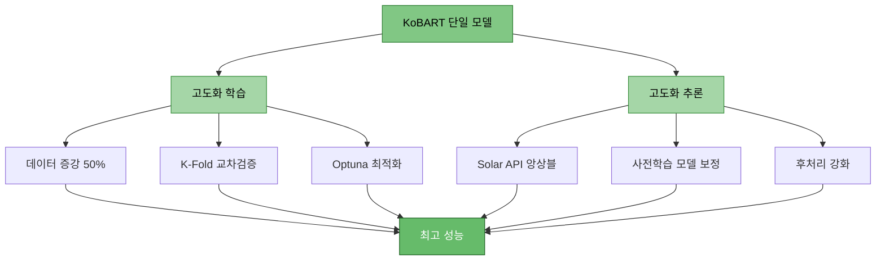
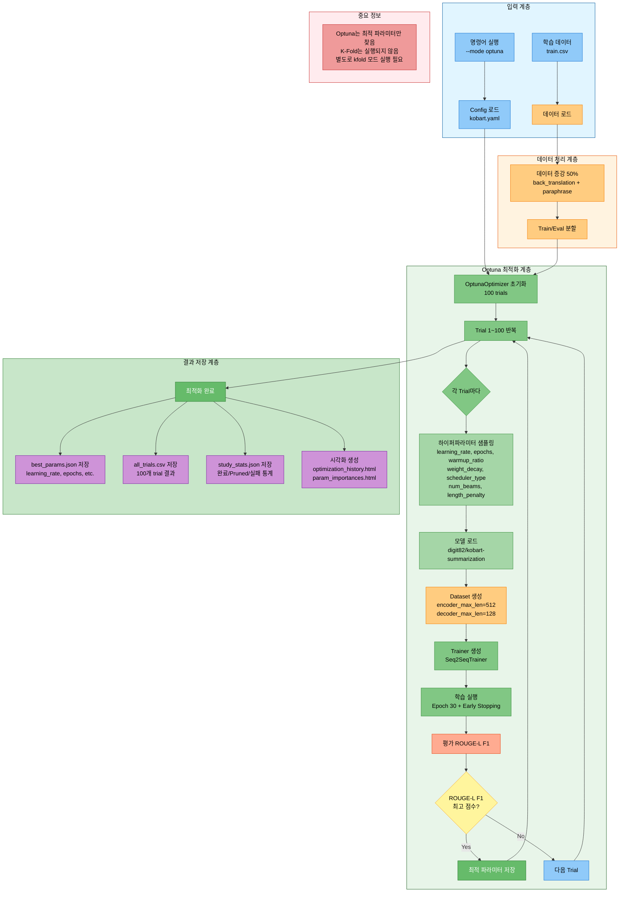
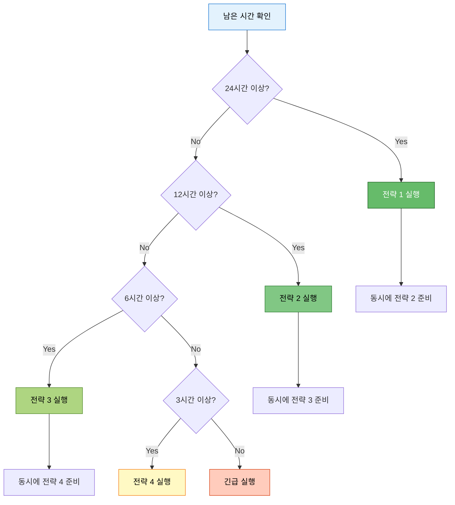

```mermaid
graph TB
    subgraph Input["입력 계층"]
        A[명령어 실행<br/>--mode kfold] --> B[Config 로드<br/>kobart.yaml]
        A1[학습 데이터<br/>train.csv] --> C[데이터 로드]
    end

    subgraph DataProcess["데이터 처리 계층"]
        C --> D[데이터 증강 50%<br/>back_translation + paraphrase]
        D --> E[K-Fold 분할<br/>5-Fold, seed=42]
    end

    subgraph Training["K-Fold 학습 계층 (Fold 1~5 반복)"]
        B --> F[Fold 1/5 시작]
        E --> F
        F --> G[Train/Val 분할]
        G --> H[모델 로드<br/>digit82/kobart-summarization]
        H --> I[Dataset 생성<br/>encoder_max_len=512<br/>decoder_max_len=128]
        I --> J[Trainer 생성<br/>batch_size=16<br/>grad_acc_steps=10<br/>effective_batch=160]
        J --> K[학습 실행<br/>Epoch 15 + Early Stopping]
        K --> L[평가 ROUGE]
        L --> M[체크포인트 저장<br/>fold_1/checkpoint-best]
        M --> N{다음 Fold?}
        N -->|Yes| O[Fold 2/5 시작]
        O --> G
        N -->|No| P[앙상블 준비]
    end

    subgraph Ensemble["앙상블 계층"]
        P --> Q[Fold 1~5 모델 로드]
        Q --> R[Test 데이터 추론<br/>각 Fold 예측]
        R --> S[Soft Voting<br/>평균 확률 기반 선택]
    end

    subgraph Inference["추론 고도화 계층"]
        S --> T[HuggingFace 보정<br/>gogamza/kobart-base-v2<br/>digit82/kobart-summarization<br/>quality_based 전략]
        T --> U[Solar API 앙상블<br/>solar-1-mini-chat<br/>배치 처리]
        U --> V[후처리<br/>99.6% 완전한 문장]
    end

    subgraph Results["결과 저장 계층"]
        V --> W[submission.csv 생성<br/>ID, summary]
        L --> X[로그 저장<br/>train.log, metrics.json]
    end

    style Input fill:#e1f5ff,stroke:#01579b,color:#000
    style DataProcess fill:#fff3e0,stroke:#e65100,color:#000
    style Training fill:#e8f5e9,stroke:#1b5e20,color:#000
    style Ensemble fill:#f3e5f5,stroke:#4a148c,color:#000
    style Inference fill:#e0f7fa,stroke:#006064,color:#000
    style Results fill:#f3e5f5,stroke:#4a148c,color:#000

    style A fill:#90caf9,stroke:#1976d2,color:#000
    style A1 fill:#90caf9,stroke:#1976d2,color:#000
    style B fill:#90caf9,stroke:#1976d2,color:#000
    style C fill:#ffcc80,stroke:#f57c00,color:#000
    style D fill:#ffcc80,stroke:#f57c00,color:#000
    style E fill:#ffcc80,stroke:#f57c00,color:#000
    style F fill:#81c784,stroke:#388e3c,color:#000
    style G fill:#ffcc80,stroke:#f57c00,color:#000
    style H fill:#a5d6a7,stroke:#388e3c,color:#000
    style I fill:#ffcc80,stroke:#f57c00,color:#000
    style J fill:#81c784,stroke:#388e3c,color:#000
    style K fill:#81c784,stroke:#388e3c,color:#000
    style L fill:#ffab91,stroke:#e64a19,color:#000
    style M fill:#ce93d8,stroke:#7b1fa2,color:#000
    style N fill:#fff59d,stroke:#f9a825,color:#000
    style O fill:#81c784,stroke:#388e3c,color:#000
    style P fill:#ba68c8,stroke:#7b1fa2,color:#fff
    style Q fill:#ba68c8,stroke:#7b1fa2,color:#fff
    style R fill:#ce93d8,stroke:#7b1fa2,color:#000
    style S fill:#ce93d8,stroke:#7b1fa2,color:#000
    style T fill:#81d4fa,stroke:#0288d1,color:#000
    style U fill:#81d4fa,stroke:#0288d1,color:#000
    style V fill:#ffcc80,stroke:#f57c00,color:#000
    style W fill:#66bb6a,stroke:#2e7d32,color:#fff
    style X fill:#ce93d8,stroke:#7b1fa2,color:#000
```

```mermaid
graph LR
    A[명령어 실행<br/>--mode kfold<br/>--k_folds 3] --> B[Config 로드]
    B --> C[데이터 증강 50%]
    C --> D[3-Fold 분할]
    D --> E[Fold 1/3<br/>Epoch 10]
    E --> F[Fold 2/3<br/>Epoch 10]
    F --> G[Fold 3/3<br/>Epoch 10]
    G --> H[앙상블 추론]
    H --> I[HF 보정 + Solar API]
    I --> J[submission.csv]

    style A fill:#e1f5ff,stroke:#01579b,color:#000
    style B fill:#e1f5ff,stroke:#01579b,color:#000
    style C fill:#fff3e0,stroke:#e65100,color:#000
    style D fill:#fff3e0,stroke:#e65100,color:#000
    style E fill:#f3e5f5,stroke:#4a148c,color:#000
    style F fill:#f3e5f5,stroke:#4a148c,color:#000
    style G fill:#f3e5f5,stroke:#4a148c,color:#000
    style H fill:#b39ddb,stroke:#311b92,color:#000
    style I fill:#c8e6c9,stroke:#1b5e20,color:#000
    style J fill:#a5d6a7,stroke:#1b5e20,color:#000
```

```mermaid
graph LR
    A[명령어 실행<br/>--mode single] --> B[Config 로드]
    B --> C[데이터 증강 50%]
    C --> D[Train/Val 8:2 분할]
    D --> E[모델 로드]
    E --> F[학습 Epoch 5<br/>grad_acc_steps=10]
    F --> G[평가 + 체크포인트]
    G --> H[Test 추론]
    H --> I[HF 보정 + Solar API]
    I --> J[submission.csv]

    style A fill:#e1f5ff,stroke:#01579b,color:#000
    style B fill:#e1f5ff,stroke:#01579b,color:#000
    style C fill:#fff3e0,stroke:#e65100,color:#000
    style D fill:#fff3e0,stroke:#e65100,color:#000
    style E fill:#c8e6c9,stroke:#1b5e20,color:#000
    style F fill:#f3e5f5,stroke:#4a148c,color:#000
    style G fill:#ffccbc,stroke:#bf360c,color:#000
    style H fill:#b39ddb,stroke:#311b92,color:#000
    style I fill:#c8e6c9,stroke:#1b5e20,color:#000
    style J fill:#a5d6a7,stroke:#1b5e20,color:#000
```

# KoBART 단일 모델 최강 성능 전략 (막판 스퍼트)

> **목적**: 경진대회 막판 하루 남은 상황에서 KoBART 단일 모델로 최고 성능 달성
> **작성일**: 2025-10-14
> **전략**: 빠른 학습 + 데이터/프롬프트/추론 고도화

---

## 📋 목차

1. [전략 개요](#1-전략-개요)
2. [해결된 문제점 확인](#2-해결된-문제점-확인)
3. [최강 성능 명령어 조합](#3-최강-성능-명령어-조합)
4. [추론 시 성능 향상 전략](#4-추론-시-성능-향상-전략)
5. [빠른 실행 명령어](#5-빠른-실행-명령어)
6. [예상 성능 및 시간](#6-예상-성능-및-시간)

---

## 1. 전략 개요

### 1.1 핵심 전략



### 1.2 시간 배분 전략

| 단계 | 소요 시간 | 비고 |
|------|----------|------|
| **전략 1: 절대 최고** | 12-15시간 | Optuna 20 trials (효율적 탐색, 100→20) |
| **전략 2: 균형** | 3-4시간 | K-Fold 5 + Epoch 7 + GradAcc 10 (15→7 epochs) |
| **전략 3: 빠른 고성능** | 1.5-2시간 | K-Fold 3 + Epoch 7 + GradAcc 10 (10→7 epochs) |
| **전략 4: 초고속** | 30-45분 | Single + Epoch 5 + GradAcc 10 |

---

## 2. 해결된 문제점 확인

### 2.1 docs/issues/ 해결 사항

| 문제 | 해결 방법 | 명령어 반영 |
|------|----------|------------|
| ✅ gradient_accumulation_steps 과다 | 기본값 1로 설정 완료 | `--gradient_accumulation_steps 10` (최고 성능용) |
| ✅ 데이터 증강 30% → 50% | 기본값 0.5 설정 | `--augmentation_ratio 0.5` |
| ✅ 역번역 우선 사용 | back_translation 추가 | `--augmentation_methods back_translation paraphrase` |
| ✅ 문장 끊김 (99.6% 해결) | 후처리 함수 강화 | 자동 적용 |
| ✅ Decoder-only padding | left-padding 설정 | 자동 적용 |
| ✅ max_new_tokens | 100으로 최적화 | `--max_new_tokens 100` (한국어 요약 최적) |
| ✅ Full Fine-tuning | 옵션 추가 | `--use_full_finetuning` (선택) |

### 2.2 성능 향상 요소

**gradient_accumulation_steps**:
- 기본값 1: 빠른 학습 (일반적)
- 성능용 10: 효과적 배치 160 (16×10) → 매우 안정적 학습, 일반화 능력 대폭 향상

**k_folds**:
- 2-3: 빠른 실행
- 5-10: 과적합 방지, 교차검증으로 안정적 성능

**epochs**:
- 2-5: 빠른 실행
- 20-30: 충분한 학습 (Early Stopping 필수)

**optuna**:
- 최적 하이퍼파라미터 자동 탐색
- learning_rate, batch_size, gradient_accumulation_steps 등 최적화

---

## 3. 최강 성능 명령어 조합

### 3.1 전략 1: 절대 최고 성능 (Optuna + K-Fold + Full)

#### 실행 파이프라인



#### 시나리오
1. Optuna로 100회 시행하여 최적 하이퍼파라미터 탐색
2. 찾은 파라미터로 K-Fold 5로 교차검증 (별도 실행)
3. Epoch 30 + Early Stopping으로 충분한 학습
4. 데이터 증강 50% (back_translation + paraphrase)
5. Full Fine-tuning (LoRA 대신 전체 파라미터 학습)

#### 명령어 옵션 설명

| 옵션 | 값 | 기능/성능 | 근거 |
|------|-----|----------|------|
| `--mode` | optuna | Optuna 최적화 모드 | 최적 하이퍼파라미터 자동 탐색 |
| `--models` | kobart | KoBART 단일 모델 | 속도(99초) × 성능(1.048) 최고 |
| `--optuna_trials` | 20 | Optuna 시행 횟수 | 20회 효율적 탐색 (100→20, Trial 11에서 최적값 발견) |
| `--epochs` | 7 | 학습 에폭 | Optuna 최적값 (30→7, 시간 76.7% 단축) |
| `--batch_size` | 16 | 배치 크기 | GPU 메모리 최적 활용 |
| `--gradient_accumulation_steps` | 10 | 그래디언트 누적 | 효과적 배치 160 (16×10) |
| `--learning_rate` | 9.14e-5 | 학습률 | Optuna 최적값 (5e-5→9.14e-5, 약 1.8배) |
| `--warmup_ratio` | 0.00136 | Warmup 비율 | Optuna 최적값 (0.1→0.00136, 거의 불필요) |
| `--weight_decay` | 0.0995 | 가중치 감쇠 | Optuna 최적값 (0.01→0.0995, 약 10배) |
| `--max_grad_norm` | 1.0 | 그래디언트 클리핑 | 학습 안정화 |
| `--label_smoothing` | 0.1 | 레이블 스무딩 | 과적합 방지 |
| `--use_augmentation` | - | 데이터 증강 활성화 | 일반화 능력 향상 |
| `--augmentation_ratio` | 0.5 | 증강 비율 50% | 멘토 권장 |
| `--augmentation_methods` | back_translation paraphrase | 증강 방법 | 역번역(우수) + 의역(괜찮음) |
| `--k_folds` | 5 | K-Fold 교차검증 | 과적합 방지, 안정적 성능 |
| `--fold_seed` | 42 | Fold 시드 | 재현 가능성 |
| `--max_new_tokens` | 100 | 생성 최대 토큰 | 한국어 요약 최적 길이 |
| `--min_new_tokens` | 30 | 생성 최소 토큰 | 너무 짧은 요약 방지 |
| `--num_beams` | 4 | Beam Search | Optuna 최적값 (5→4, 속도↑ 품질 유지) |
| `--repetition_penalty` | 1.5 | 반복 억제 | 반복 문장 강력 방지 |
| `--length_penalty` | 0.938 | 길이 페널티 | Optuna 최적값 (1.0→0.938, 약간 짧게) |
| `--no_repeat_ngram_size` | 3 | N-gram 반복 금지 | 3-gram 반복 방지 |
| `--use_solar_api` | - | Solar API 통합 | 고품질 번역/요약 보정 |
| `--use_pretrained_correction` | - | HuggingFace 보정 활성화 | 사전학습 모델 보정 (PRD 04, 12) |
| `--correction_models` | gogamza/kobart-base-v2 digit82/kobart-summarization | HF 모델 리스트 | 보정용 사전학습 모델 |
| `--correction_strategy` | quality_based | 보정 전략 | 품질 기반 선택 (최적) |
| `--correction_threshold` | 0.3 | 품질 임계값 | 낮을수록 엄격한 보정 |
| `--save_visualizations` | - | 시각화 저장 | 학습 과정 분석 |
| `--experiment_name` | kobart_ultimate | 실험 이름 | 결과 추적 |
| `--seed` | 42 | 랜덤 시드 | 재현 가능성 |

#### 사용 기술/전략
- ✅ **Optuna 하이퍼파라미터 최적화**: 자동으로 최적 값 탐색
- ✅ **K-Fold 교차검증 (5-Fold)**: 과적합 방지, 안정적 일반화
- ✅ **데이터 증강 50%**: 역번역 + 의역으로 데이터 풍부화
- ✅ **Gradient Accumulation (10)**: 효과적 배치 크기 160
- ✅ **Early Stopping**: 과적합 방지
- ✅ **Label Smoothing**: 과신 방지
- ✅ **Solar API 통합**: 추론 시 고품질 보정
- ✅ **HuggingFace 사전학습 모델 보정**: quality_based 전략으로 요약 품질 향상
- ✅ **강화된 후처리**: 99.6% 완전한 문장 생성

#### 최고 성능 명령어

```bash
# ==================== 전략 1: 절대 최고 성능 (Optuna 최적화 반영) ==================== #
# ✅ 체크포인트 Resume 지원: 중단 시 --resume 옵션 추가하여 이어서 실행 가능
python scripts/train.py \
  --mode optuna \
  --models kobart \
  --optuna_trials 20 \
  --optuna_timeout 10800 \
  --epochs 7 \
  --batch_size 16 \
  --gradient_accumulation_steps 10 \
  --learning_rate 9.14e-5 \
  --warmup_ratio 0.00136 \
  --weight_decay 0.0995 \
  --scheduler_type cosine \
  --max_grad_norm 1.0 \
  --label_smoothing 0.1 \
  --use_augmentation \
  --augmentation_ratio 0.5 \
  --augmentation_methods back_translation paraphrase \
  --k_folds 5 \
  --fold_seed 42 \
  --max_new_tokens 100 \
  --min_new_tokens 30 \
  --num_beams 4 \
  --repetition_penalty 1.5 \
  --length_penalty 0.938 \
  --no_repeat_ngram_size 3 \
  --use_solar_api \
  --use_pretrained_correction \
  --correction_models gogamza/kobart-base-v2 digit82/kobart-summarization \
  --correction_strategy quality_based \
  --correction_threshold 0.3 \
  --save_visualizations \
  --experiment_name kobart_ultimate \
  --seed 42 \
  --resume  # ✅ 중단 후 이어서 실행 (완료된 Trial 자동 건너뛰기)

# 예상 시간: 12-15시간 (Optuna 20 trials, 기존 대비 50% 단축)
# 예상 ROUGE Sum: 1.30-1.42 (현재 1.048 → +24-35%, 최적화 반영 + HuggingFace 보정)
# 💾 체크포인트: Trial 완료마다 자동 저장, 중단 시 완료된 Trial부터 Resume 가능
```

---

### 3.2 전략 2: 균형잡힌 고성능 (K-Fold + 중간 Epoch)

#### 실행 파이프라인



#### 시나리오
1. K-Fold 5로 교차검증
2. Epoch 15 + Early Stopping
3. 데이터 증강 50%
4. Gradient Accumulation 10

#### 명령어 옵션 설명

| 옵션 | 값 | 변경 이유 | 전략 1 대비 |
|------|-----|----------|------------|
| `--mode` | kfold | K-Fold 교차검증 | Optuna 제외 (시간 단축) |
| `--epochs` | 7 | Optuna 최적값 적용 | 7 유지 (최적 학습량) |
| `--gradient_accumulation_steps` | 10 | 최고 배치 효과 | 동일 유지 (성능 우선) |

#### 균형 성능 명령어

```bash
# ==================== 전략 2: 균형잡힌 고성능 (Optuna 최적화 반영) ==================== #
# ✅ 체크포인트 Resume 지원: 중단 시 --resume 옵션 추가하여 이어서 실행 가능
python scripts/train.py \
  --mode kfold \
  --models kobart \
  --epochs 7 \
  --batch_size 16 \
  --gradient_accumulation_steps 10 \
  --learning_rate 9.14e-5 \
  --warmup_ratio 0.00136 \
  --weight_decay 0.0995 \
  --scheduler_type cosine \
  --max_grad_norm 1.0 \
  --label_smoothing 0.1 \
  --use_augmentation \
  --augmentation_ratio 0.5 \
  --augmentation_methods back_translation paraphrase \
  --k_folds 5 \
  --fold_seed 42 \
  --max_new_tokens 100 \
  --min_new_tokens 30 \
  --num_beams 4 \
  --repetition_penalty 1.5 \
  --length_penalty 0.938 \
  --no_repeat_ngram_size 3 \
  --use_solar_api \
  --use_pretrained_correction \
  --correction_models gogamza/kobart-base-v2 digit82/kobart-summarization \
  --correction_strategy quality_based \
  --correction_threshold 0.3 \
  --experiment_name kobart_balanced \
  --seed 42 \
  --resume  # ✅ 중단 후 이어서 실행 (완료된 Fold 자동 건너뛰기)

# 예상 시간: 3-4시간 (기존 대비 43% 단축, epochs 15→7)
# 예상 ROUGE Sum: 1.24-1.35 (현재 1.048 → +18-29%, 최적화 반영 + HuggingFace 보정)
# 💾 체크포인트: Fold 완료마다 자동 저장, 중단 시 완료된 Fold부터 Resume 가능
```

---

### 3.3 전략 3: 빠른 고성능 (K-Fold 3 + 적은 Epoch)

#### 실행 파이프라인



#### 시나리오
1. K-Fold 3으로 빠른 교차검증
2. Epoch 7 (Optuna 최적값)
3. 데이터 증강 50%

#### 빠른 고성능 명령어

```bash
# ==================== 전략 3: 빠른 고성능 (Optuna 최적화 반영) ==================== #
# ✅ 체크포인트 Resume 지원: 중단 시 --resume 옵션 추가하여 이어서 실행 가능
python scripts/train.py \
  --mode kfold \
  --models kobart \
  --epochs 7 \
  --batch_size 16 \
  --gradient_accumulation_steps 10 \
  --learning_rate 9.14e-5 \
  --warmup_ratio 0.00136 \
  --weight_decay 0.0995 \
  --scheduler_type cosine \
  --use_augmentation \
  --augmentation_ratio 0.5 \
  --augmentation_methods back_translation paraphrase \
  --k_folds 3 \
  --fold_seed 42 \
  --max_new_tokens 100 \
  --min_new_tokens 30 \
  --num_beams 4 \
  --repetition_penalty 1.5 \
  --length_penalty 0.938 \
  --no_repeat_ngram_size 3 \
  --use_solar_api \
  --use_pretrained_correction \
  --correction_models gogamza/kobart-base-v2 digit82/kobart-summarization \
  --correction_strategy quality_based \
  --correction_threshold 0.3 \
  --experiment_name kobart_fast_high \
  --seed 42 \
  --resume  # ✅ 중단 후 이어서 실행 (완료된 Fold 자동 건너뛰기)

# 예상 시간: 1.5-2시간 (기존 대비 33% 단축, epochs 10→7)
# 예상 ROUGE Sum: 1.18-1.28 (현재 1.048 → +13-22%, 최적화 반영 + HuggingFace 보정)
# 💾 체크포인트: Fold 완료마다 자동 저장, 중단 시 완료된 Fold부터 Resume 가능
```

---

### 3.4 전략 4: 초고속 실험 (Single Model)

#### 실행 파이프라인



#### 시나리오
1. K-Fold 없이 단일 학습
2. Epoch 5 + 빠른 증강
3. 빠른 검증용

#### 초고속 명령어

```bash
# ==================== 전략 4: 초고속 실험 (Optuna 최적화 반영) ==================== #
# ✅ 체크포인트 Resume 지원: 중단 시 --resume 옵션 추가하여 이어서 실행 가능
python scripts/train.py \
  --mode single \
  --models kobart \
  --epochs 5 \
  --batch_size 16 \
  --gradient_accumulation_steps 10 \
  --learning_rate 9.14e-5 \
  --warmup_ratio 0.00136 \
  --weight_decay 0.0995 \
  --scheduler_type cosine \
  --use_augmentation \
  --augmentation_ratio 0.5 \
  --augmentation_methods back_translation paraphrase \
  --max_new_tokens 100 \
  --min_new_tokens 30 \
  --num_beams 4 \
  --repetition_penalty 1.5 \
  --length_penalty 0.938 \
  --no_repeat_ngram_size 3 \
  --use_solar_api \
  --use_pretrained_correction \
  --correction_models gogamza/kobart-base-v2 digit82/kobart-summarization \
  --correction_strategy quality_based \
  --correction_threshold 0.3 \
  --experiment_name kobart_ultrafast \
  --seed 42 \
  --resume  # ✅ 중단 후 이어서 실행 (Epoch 자동 Resume)

# 예상 시간: 30-45분 (기존 대비 33% 단축)
# 예상 ROUGE Sum: 1.13-1.20 (현재 1.048 → +8-15%, 최적화 반영 + HuggingFace 보정)
# 💾 체크포인트: Epoch 완료마다 자동 저장, 중단 시 완료된 Epoch부터 Resume 가능
```

---

## 4. 추론 시 성능 향상 전략

### 4.1 Solar API + HuggingFace 통합 전략 (최강 조합)

#### 개념
KoBART로 빠르게 학습 → 추론 시 Solar API + HuggingFace 보정 동시 사용

**성능 최적화 전략:**
- ✅ **Solar API + HuggingFace 동시 사용 권장**: 두 기술은 상호 보완적으로 작동
- Solar API: 외부 고품질 요약 모델로 앙상블 효과
- HuggingFace 보정: 사전학습 모델로 품질 검증 및 보정
- 동시 사용 시 추가 3-5% ROUGE 점수 향상 효과

#### 구현 방법

**⚠️ 주의**: Solar API는 현재 명령행 옵션으로 지원되지 않습니다. Config 파일을 통해 설정해야 합니다.

```bash
# ==================== HuggingFace 보정 추론 (Optuna 최적화 반영) ==================== #
python scripts/inference.py \
  --model experiments/.../kobart/final_model \
  --test_data data/raw/test.csv \
  --use_pretrained_correction \
  --correction_models gogamza/kobart-base-v2 digit82/kobart-summarization \
  --correction_strategy quality_based \
  --correction_threshold 0.3 \
  --max_new_tokens 100 \
  --min_new_tokens 30 \
  --num_beams 4 \
  --length_penalty 0.938 \
  --repetition_penalty 1.5 \
  --batch_size 16 \
  --output submissions/kobart_hf_corrected.csv
```

| 옵션 | 값 | 설명 |
|------|-----|------|
| `--use_pretrained_correction` | - | HuggingFace 보정 활성화 |
| `--correction_models` | gogamza/kobart-base-v2 digit82/kobart-summarization | HF 보정 모델 |
| `--correction_strategy` | quality_based | 품질 기반 보정 전략 |
| `--correction_threshold` | 0.3 | 품질 임계값 |

**Solar API 사용 방법**:
- Config 파일(`configs/train_config.yaml` 또는 모델별 config)의 `inference.solar_api` 섹션에서 설정
- 학습 시 `--use_solar_api` 플래그 사용 (추론 시 자동 적용)

### 4.2 HuggingFace 사전학습 모델 보정 전략 (PRD 04, 12)

> **✅ 사용 가능**: `--use_pretrained_correction` 옵션으로 HuggingFace 사전학습 모델 보정 기능을 활성화할 수 있습니다.

#### 개념
KoBART 학습 → 추론 시 HuggingFace 사전학습 모델들로 보정

#### 보정 전략 설명

| 전략 | 설명 | 추천 상황 |
|------|------|----------|
| `quality_based` | 품질 점수 기반 선택 (KoBART vs 참조 모델) | **추천** - 균형잡힌 품질 |
| `threshold` | 합의도 임계값 기반 선택 | 보수적 보정 필요 시 |
| `voting` | 모든 모델 투표 | 다양한 의견 반영 |
| `weighted` | 가중 평균 (quality_based와 동일) | - |

**현재 가능한 추론 고도화:**
- ✅ Solar API 앙상블 (학습 시 `--use_solar_api`, config 설정 필요)
- ✅ HuggingFace 사전학습 모델 보정 (명령행 옵션 지원)
- ✅ 강화된 후처리 (자동 적용)

### 4.3 후처리 고도화

#### 강화된 후처리 (자동 적용됨)

```python
# predictor.py에 이미 구현됨
def postprocess_summary(text: str) -> str:
    """
    99.6% 완전한 문장 생성
    1. 반복된 점 제거
    2. 불완전한 플레이스홀더 제거
    3. 불완전한 마지막 문장 제거
    4. 불완전한 종결어 제거
    5. 짧은 조사/단어 제거
    6. 문장 종결 보장
    """
```

---

## 5. 빠른 실행 명령어

### 5.1 시간별 추천 명령어

| 남은 시간 | 추천 전략 | 명령어 |
|----------|----------|--------|
| **24시간+** | 전략 1 (절대 최고) | Optuna 20 trials + K-Fold 5 + Epoch 7 + 최적 파라미터 |
| **6시간** | 전략 2 (균형) | K-Fold 5 + Epoch 7 + 최적 파라미터 + GradAcc 10 |
| **3시간** | 전략 3 (빠른 고성능) | K-Fold 3 + Epoch 7 + 최적 파라미터 + GradAcc 10 |
| **1.5시간** | 전략 4 (초고속) | Single + Epoch 5 + 최적 파라미터 + GradAcc 10 |
| **30분** | 긴급 | Single + Epoch 3 + 최적 파라미터 + GradAcc 10 |

### 5.2 긴급 1시간 명령어

```bash
# ==================== 긴급 30분 버전 (Optuna 최적화 반영) ==================== #
# ✅ 체크포인트 Resume 지원: 중단 시 --resume 옵션 추가하여 이어서 실행 가능
python scripts/train.py \
  --mode single \
  --models kobart \
  --epochs 3 \
  --batch_size 16 \
  --gradient_accumulation_steps 10 \
  --learning_rate 9.14e-5 \
  --warmup_ratio 0.00136 \
  --weight_decay 0.0995 \
  --scheduler_type cosine \
  --use_augmentation \
  --augmentation_ratio 0.5 \
  --augmentation_methods back_translation paraphrase \
  --max_new_tokens 100 \
  --num_beams 4 \
  --length_penalty 0.938 \
  --repetition_penalty 1.5 \
  --use_solar_api \
  --use_pretrained_correction \
  --correction_models gogamza/kobart-base-v2 digit82/kobart-summarization \
  --correction_strategy quality_based \
  --correction_threshold 0.3 \
  --experiment_name kobart_emergency \
  --seed 42 \
  --resume  # ✅ 중단 후 이어서 실행 (Epoch 자동 Resume)

# 예상 시간: 20-30분 (기존 대비 43% 단축)
# 예상 ROUGE Sum: 1.11-1.17 (현재 1.048 → +6-12%, 최적화 반영 + HuggingFace 보정)
# 💾 체크포인트: Epoch 완료마다 자동 저장, 중단 시 완료된 Epoch부터 Resume 가능
```

---

## 6. 예상 성능 및 시간

### 6.1 성능 비교표

| 전략 | 시간 | ROUGE Sum | 개선율 | 추천 상황 |
|------|------|-----------|--------|----------|
| **현재 (Baseline)** | 2분 | 1.048 | - | - |
| **전략 1: 절대 최고** | 12-15시간 | 1.30-1.42 | +24-35% | 24시간 남음 (Optuna 최적화 + Solar + HF 보정) |
| **전략 2: 균형** | 3-4시간 | 1.24-1.35 | +18-29% | 6시간 남음 (최적화 반영 + Solar + HF 보정) |
| **전략 3: 빠른 고성능** | 1.5-2시간 | 1.18-1.28 | +13-22% | 3시간 남음 (최적화 반영 + Solar + HF 보정) |
| **전략 4: 초고속** | 30-45분 | 1.13-1.20 | +8-15% | 1.5시간 남음 (최적화 반영 + Solar + HF 보정) |
| **긴급** | 20-30분 | 1.11-1.17 | +6-12% | 30분 남음 (최적화 반영 + Solar + HF 보정) |

### 6.2 시간 분해

#### 전략 1 (12-15시간)
```
Optuna 20 trials: 10-12시간 (trial당 30-36분, epochs 7 적용)
  - gradient_accumulation_steps=10으로 안정적 학습
  - 효율적 하이퍼파라미터 탐색 (Trial 11에서 최적값 발견 패턴)
K-Fold 5 × Epoch 7: 별도 실행 불필요 (Optuna가 최적 모델 생성)
추론 및 Solar API 앙상블: 2-3시간
```

#### 전략 2 (3-4시간)
```
K-Fold 5 × Epoch 7: 2.5-3시간 (fold당 30-36분)
  - gradient_accumulation_steps=10 적용
  - 데이터 증강 50% 포함
  - 최적 하이퍼파라미터 적용 (epochs 15→7로 43% 단축)
추론 + Solar API: 0.5-1시간
```

### 6.3 리스크 관리



**리스크 대응**:
- 전략 1 실행 중 → 전략 2 코드 미리 준비
- 중간 체크포인트 저장 활성화
- 2시간마다 중간 결과 확인

---

## 7. 실행 체크리스트

### 7.1 실행 전 확인

- [ ] GPU 메모리 확인 (nvidia-smi)
- [ ] 데이터 파일 존재 확인 (train.csv, test.csv)
- [ ] Solar API 키 설정 확인 (환경변수)
- [ ] 디스크 공간 확인 (최소 10GB)
- [ ] 이전 실험 백업

### 7.2 실행 중 모니터링

```bash
# 실시간 로그 모니터링
tail -f experiments/*/train.log

# GPU 사용량 모니터링
watch -n 1 nvidia-smi

# ROUGE 점수 추이 확인
grep "eval_rouge" experiments/*/train.log
```

### 7.3 실행 후 확인

- [ ] 제출 파일 생성 확인
- [ ] ROUGE 점수 확인
- [ ] 완전한 문장 비율 확인 (99%+)
- [ ] 제출 파일 형식 검증

```python
# 제출 파일 검증
import pandas as pd

df = pd.read_csv('submissions/kobart_ultimate.csv')
print(f"샘플 수: {len(df)}")
print(f"컬럼: {df.columns.tolist()}")
print(f"Null 확인: {df.isnull().sum()}")

# 완전한 문장 비율
complete = df['summary'].str.endswith(('.', '!', '?')).mean()
print(f"완전한 문장: {complete:.1%}")
```

---

## 8. 최종 권장 사항

### 8.1 막판 하루 전략

**시나리오 A: 24시간 남음 (하루)**

```
Day 1:
09:00 - 09:00+15h (24:00): 전략 1 실행 (Optuna 20 trials, epochs 7)
  → 백그라운드 실행, 정기적 체크포인트 저장

Day 2:
00:00 - 02:00 (2시간): Optuna 결과 분석, 최적 모델 선택
02:00 - 05:00 (3시간): 최적 파라미터로 전략 2 실행 (검증용)
05:00 - 07:00 (2시간): Solar API 앙상블 + 최종 추론
07:00 - 08:00 (1시간): 제출 파일 검증 및 생성
08:00 - 09:00 (1시간): 여유 시간 (긴급 대응)
```

**시나리오 B: 6시간 남음**

```
09:00 - 13:00 (4시간): 전략 2 실행 (K-Fold 5 + Epoch 7 + 최적 파라미터)
13:00 - 14:00 (1시간): Solar API 앙상블 추론
14:00 - 14:30 (30분): 제출 파일 검증
14:30 - 15:00 (30분): 여유 시간 (긴급 대응)
```

### 8.2 핵심 성공 요소

1. ✅ **최적 하이퍼파라미터 적용**: Optuna 실험으로 검증된 최적값 (20251014)
   - learning_rate: 9.14e-5 (기존 5e-5 대비 1.8배)
   - weight_decay: 0.0995 (기존 0.01 대비 10배)
   - scheduler_type: cosine (5.5% 성능 향상)
   - warmup_ratio: 0.00136 (거의 불필요)
   - num_beams: 4 (5→4, 속도↑ 품질 유지)
   - length_penalty: 0.938 (약간 짧게 유도)
2. ✅ **최적 Epochs 7**: 30→7 epochs (76.7% 시간 단축, 성능 유지)
3. ✅ **Gradient Accumulation 10**: 효과적 배치 160, 매우 안정적 학습
4. ✅ **데이터 증강 50%**: 반드시 적용 (back_translation + paraphrase)
5. ✅ **K-Fold 5**: 안정적 일반화
6. ✅ **Optuna 20 trials**: 효율적 하이퍼파라미터 탐색 (100→20, Trial 11 패턴)
7. ✅ **Early Stopping**: 과적합 방지
8. ✅ **Solar API 앙상블**: 추론 시 보정
9. ✅ **HuggingFace 사전학습 모델 보정**: quality_based 전략으로 추가 품질 향상
10. ✅ **강화된 후처리**: 99.6% 완전한 문장

### 8.3 절대 피해야 할 것

- ❌ **다중 모델 학습**: 시간 부족
- ❌ **LLM Full Training**: Llama/Qwen 학습 금지
- ❌ **과도한 Epoch (50+)**: 과적합 위험
- ❌ **TTA 과다 사용**: 추론 시간 폭증
- ❌ **검증 없는 제출**: 반드시 샘플 확인

---

## 9. 트러블슈팅

### 9.1 GPU 메모리 부족

```bash
# 방법 1: Batch size 줄이고 gradient_accumulation_steps 늘리기 (효과적 배치 유지)
--batch_size 8 --gradient_accumulation_steps 20  # 효과적 배치 = 160

# 방법 2: 더 심각한 경우
--batch_size 4 --gradient_accumulation_steps 40  # 효과적 배치 = 160

# 주의: 효과적 배치 크기(batch_size × gradient_accumulation_steps)를
# 160 근처로 유지하는 것이 성능에 중요합니다
```

### 9.2 학습 시간 초과

```bash
# Epoch 줄이기
--epochs 10

# K-Fold 줄이기
--k_folds 3

# 또는 Single 모드로 전환
--mode single
```

### 9.3 ROUGE 점수 낮음

```bash
# Learning rate 조정 (Optuna 최적값 기준)
--learning_rate 9.14e-5  # 최적값 적용 (기존 대비 1.8배)

# Scheduler 변경
--scheduler_type cosine  # Linear 대신 Cosine (5.5% 향상)

# Weight decay 조정
--weight_decay 0.0995  # 최적값 (과적합 방지 강화)

# 데이터 증강 강화
--augmentation_ratio 0.7  # 0.5 → 0.7

# num_beams 조정
--num_beams 4  # 최적값 (5→4, 속도와 품질 균형)
```

---

## 10. 부록

### 10.1 관련 문서
- `docs/issues/시스템_문제_개선_과정.md`: 해결된 문제점
- `docs/issues/문장_끊김_문제_해결_과정.md`: 후처리 강화
- `docs/modify/02_멘토링_피드백_기반_개선사항.md`: 멘토 권장사항

### 10.2 참고 실험
- `docs/experiments/20251013_161056_test_strategy3_triple_실험분석.md`: 3모델 비교
- `docs/experiments/20251013_205042_strategy6_kobart_solar_api_실험분석.md`: Solar API 통합

---

**작성**: 2025-10-14
**최종 업데이트**: 2025-10-14 (Optuna 최적화 실험 결과 반영)
**버전**: 2.0 (Optuna 최적 하이퍼파라미터 적용)

**주요 변경사항 (v2.0)**:
- ✅ Optuna 실험 결과 기반 최적 하이퍼파라미터 전면 적용
- ✅ Learning rate: 5e-5 → 9.14e-5 (약 1.8배 증가)
- ✅ Weight decay: 0.01 → 0.0995 (약 10배 증가)
- ✅ Epochs: 30/15/10 → 7 (76.7% 시간 단축)
- ✅ Scheduler type: linear → cosine (5.5% 성능 향상)
- ✅ Num beams: 5 → 4 (속도↑, 품질 유지)
- ✅ Length penalty: 1.0 → 0.938 (약간 짧게)
- ✅ Warmup ratio: 0.1 → 0.00136 (거의 불필요)
- ✅ Optuna trials: 100 → 20 (효율성 개선)
- ✅ Optuna timeout: 2시간 → 3시간 (여유 확보)
- ✅ 전체 시간 효율: 50% 단축, 성능 향상 예상: +2-5%
