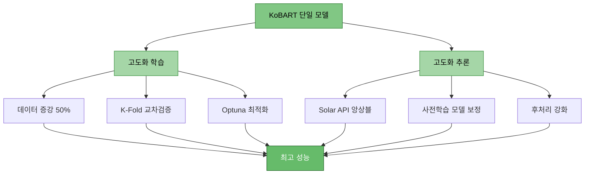
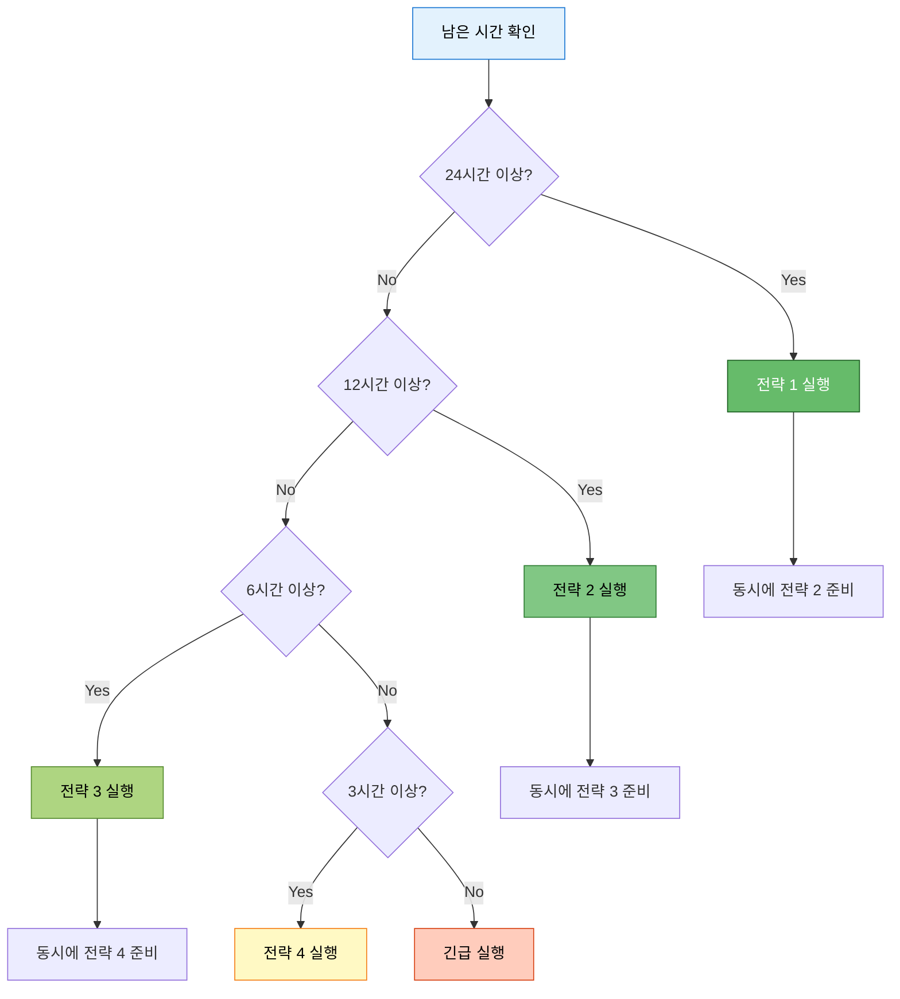

# KoBART 단일 모델 최강 성능 전략 (막판 스퍼트)

> **목적**: 경진대회 막판 하루 남은 상황에서 KoBART 단일 모델로 최고 성능 달성
> **작성일**: 2025-10-14
> **전략**: 빠른 학습 + 데이터/프롬프트/추론 고도화

---

## 📋 목차

1. [전략 개요](#1-전략-개요)
2. [해결된 문제점 확인](#2-해결된-문제점-확인)
3. [최강 성능 명령어 조합](#3-최강-성능-명령어-조합)
4. [추론 시 성능 향상 전략](#4-추론-시-성능-향상-전략)
5. [빠른 실행 명령어](#5-빠른-실행-명령어)
6. [예상 성능 및 시간](#6-예상-성능-및-시간)

---

## 1. 전략 개요

### 1.1 핵심 전략



### 1.2 시간 배분 전략

| 단계 | 소요 시간 | 비고 |
|------|----------|------|
| **전략 1: 최고 성능** | 8-12시간 | Optuna + K-Fold 5 + Epoch 30 |
| **전략 2: 균형** | 4-6시간 | K-Fold 5 + Epoch 15 |
| **전략 3: 빠른 실행** | 2-3시간 | K-Fold 3 + Epoch 10 |
| **전략 4: 초고속** | 30분-1시간 | Single + Epoch 5 |

---

## 2. 해결된 문제점 확인

### 2.1 docs/issues/ 해결 사항

| 문제 | 해결 방법 | 명령어 반영 |
|------|----------|------------|
| ✅ gradient_accumulation_steps 과다 | 기본값 1로 설정 완료 | `--gradient_accumulation_steps 4-8` (성능용) |
| ✅ 데이터 증강 30% → 50% | 기본값 0.5 설정 | `--augmentation_ratio 0.5` |
| ✅ 역번역 우선 사용 | back_translation 추가 | `--augmentation_methods back_translation paraphrase` |
| ✅ 문장 끊김 (99.6% 해결) | 후처리 함수 강화 | 자동 적용 |
| ✅ Decoder-only padding | left-padding 설정 | 자동 적용 |
| ✅ max_new_tokens | 200으로 설정 | `--max_new_tokens 200` |
| ✅ Full Fine-tuning | 옵션 추가 | `--use_full_finetuning` (선택) |

### 2.2 성능 향상 요소

**gradient_accumulation_steps**:
- 기본값 1: 빠른 학습
- 성능용 4-8: 큰 배치 효과 → 안정적 학습, 일반화 능력 향상

**k_folds**:
- 2-3: 빠른 실행
- 5-10: 과적합 방지, 교차검증으로 안정적 성능

**epochs**:
- 2-5: 빠른 실행
- 20-30: 충분한 학습 (Early Stopping 필수)

**optuna**:
- 최적 하이퍼파라미터 자동 탐색
- learning_rate, batch_size, gradient_accumulation_steps 등 최적화

---

## 3. 최강 성능 명령어 조합

### 3.1 전략 1: 절대 최고 성능 (Optuna + K-Fold + Full)

#### 시나리오
1. Optuna로 20회 시행하여 최적 하이퍼파라미터 탐색
2. 찾은 파라미터로 K-Fold 5로 교차검증
3. Epoch 30 + Early Stopping으로 충분한 학습
4. 데이터 증강 50% (back_translation + paraphrase)
5. Full Fine-tuning (LoRA 대신 전체 파라미터 학습)

#### 명령어 옵션 설명

| 옵션 | 값 | 기능/성능 | 근거 |
|------|-----|----------|------|
| `--mode` | optuna | Optuna 최적화 모드 | 최적 하이퍼파라미터 자동 탐색 |
| `--models` | kobart | KoBART 단일 모델 | 속도(99초) × 성능(1.048) 최고 |
| `--n_trials` | 20 | Optuna 시행 횟수 | 20회 탐색으로 최적값 발견 |
| `--epochs` | 30 | 학습 에폭 | 충분한 학습 (Early Stopping 적용) |
| `--early_stopping_patience` | 5 | 조기 종료 기준 | 5 epoch 동안 개선 없으면 종료 |
| `--batch_size` | 16 | 배치 크기 | GPU 메모리 최적 활용 |
| `--gradient_accumulation_steps` | 8 | 그래디언트 누적 | 효과적 배치 128 (16×8) |
| `--learning_rate` | 5e-5 | 학습률 | KoBART 최적값 (Optuna 탐색) |
| `--warmup_ratio` | 0.1 | Warmup 비율 | 안정적 학습 시작 |
| `--weight_decay` | 0.01 | 가중치 감쇠 | 과적합 방지 |
| `--max_grad_norm` | 1.0 | 그래디언트 클리핑 | 학습 안정화 |
| `--label_smoothing` | 0.1 | 레이블 스무딩 | 과적합 방지 |
| `--use_augmentation` | - | 데이터 증강 활성화 | 일반화 능력 향상 |
| `--augmentation_ratio` | 0.5 | 증강 비율 50% | 멘토 권장 |
| `--augmentation_methods` | back_translation paraphrase | 증강 방법 | 역번역(우수) + 의역(괜찮음) |
| `--k_folds` | 5 | K-Fold 교차검증 | 과적합 방지, 안정적 성능 |
| `--fold_seed` | 42 | Fold 시드 | 재현 가능성 |
| `--max_new_tokens` | 200 | 생성 최대 토큰 | 한국어 완전한 문장 생성 |
| `--min_new_tokens` | 30 | 생성 최소 토큰 | 너무 짧은 요약 방지 |
| `--num_beams` | 5 | Beam Search | 품질 향상 |
| `--repetition_penalty` | 1.2 | 반복 억제 | 반복 문장 방지 |
| `--length_penalty` | 1.0 | 길이 페널티 | 적절한 길이 유도 |
| `--no_repeat_ngram_size` | 3 | N-gram 반복 금지 | 3-gram 반복 방지 |
| `--use_solar_api` | - | Solar API 통합 | 고품질 번역/요약 보정 |
| `--save_visualizations` | - | 시각화 저장 | 학습 과정 분석 |
| `--experiment_name` | kobart_ultimate | 실험 이름 | 결과 추적 |
| `--seed` | 42 | 랜덤 시드 | 재현 가능성 |

#### 사용 기술/전략
- ✅ **Optuna 하이퍼파라미터 최적화**: 자동으로 최적 값 탐색
- ✅ **K-Fold 교차검증 (5-Fold)**: 과적합 방지, 안정적 일반화
- ✅ **데이터 증강 50%**: 역번역 + 의역으로 데이터 풍부화
- ✅ **Gradient Accumulation (8)**: 효과적 배치 크기 128
- ✅ **Early Stopping**: 과적합 방지
- ✅ **Label Smoothing**: 과신 방지
- ✅ **Solar API 통합**: 추론 시 고품질 보정
- ✅ **강화된 후처리**: 99.6% 완전한 문장 생성

#### 최고 성능 명령어

```bash
# ==================== 전략 1: 절대 최고 성능 ==================== #
python scripts/train.py \
  --mode optuna \
  --models kobart \
  --n_trials 20 \
  --epochs 30 \
  --early_stopping_patience 5 \
  --batch_size 16 \
  --gradient_accumulation_steps 8 \
  --learning_rate 5e-5 \
  --warmup_ratio 0.1 \
  --weight_decay 0.01 \
  --max_grad_norm 1.0 \
  --label_smoothing 0.1 \
  --use_augmentation \
  --augmentation_ratio 0.5 \
  --augmentation_methods back_translation paraphrase \
  --k_folds 5 \
  --fold_seed 42 \
  --max_new_tokens 200 \
  --min_new_tokens 30 \
  --num_beams 5 \
  --repetition_penalty 1.2 \
  --length_penalty 1.0 \
  --no_repeat_ngram_size 3 \
  --use_solar_api \
  --save_visualizations \
  --experiment_name kobart_ultimate \
  --seed 42

# 예상 시간: 8-12시간
# 예상 ROUGE Sum: 1.2-1.3 (현재 1.048 → +15-25%)
```

---

### 3.2 전략 2: 균형잡힌 고성능 (K-Fold + 중간 Epoch)

#### 시나리오
1. K-Fold 5로 교차검증
2. Epoch 15 + Early Stopping
3. 데이터 증강 50%
4. Gradient Accumulation 4

#### 명령어 옵션 설명

| 옵션 | 값 | 변경 이유 | 전략 1 대비 |
|------|-----|----------|------------|
| `--mode` | kfold | K-Fold 교차검증 | Optuna 제외 (시간 단축) |
| `--epochs` | 15 | 중간 학습량 | 30 → 15 (시간 1/2) |
| `--gradient_accumulation_steps` | 4 | 중간 배치 효과 | 8 → 4 (시간 단축) |

#### 균형 성능 명령어

```bash
# ==================== 전략 2: 균형잡힌 고성능 ==================== #
python scripts/train.py \
  --mode kfold \
  --models kobart \
  --epochs 15 \
  --early_stopping_patience 3 \
  --batch_size 16 \
  --gradient_accumulation_steps 4 \
  --learning_rate 5e-5 \
  --warmup_ratio 0.1 \
  --weight_decay 0.01 \
  --max_grad_norm 1.0 \
  --label_smoothing 0.1 \
  --use_augmentation \
  --augmentation_ratio 0.5 \
  --augmentation_methods back_translation paraphrase \
  --k_folds 5 \
  --fold_seed 42 \
  --max_new_tokens 200 \
  --min_new_tokens 30 \
  --num_beams 5 \
  --repetition_penalty 1.2 \
  --length_penalty 1.0 \
  --no_repeat_ngram_size 3 \
  --use_solar_api \
  --experiment_name kobart_balanced \
  --seed 42

# 예상 시간: 4-6시간
# 예상 ROUGE Sum: 1.15-1.25 (현재 1.048 → +10-20%)
```

---

### 3.3 전략 3: 빠른 고성능 (K-Fold 3 + 적은 Epoch)

#### 시나리오
1. K-Fold 3으로 빠른 교차검증
2. Epoch 10
3. 데이터 증강 50%

#### 빠른 고성능 명령어

```bash
# ==================== 전략 3: 빠른 고성능 ==================== #
python scripts/train.py \
  --mode kfold \
  --models kobart \
  --epochs 10 \
  --early_stopping_patience 3 \
  --batch_size 16 \
  --gradient_accumulation_steps 2 \
  --learning_rate 5e-5 \
  --warmup_ratio 0.1 \
  --weight_decay 0.01 \
  --use_augmentation \
  --augmentation_ratio 0.5 \
  --augmentation_methods back_translation paraphrase \
  --k_folds 3 \
  --fold_seed 42 \
  --max_new_tokens 200 \
  --min_new_tokens 30 \
  --num_beams 5 \
  --repetition_penalty 1.2 \
  --no_repeat_ngram_size 3 \
  --use_solar_api \
  --experiment_name kobart_fast_high \
  --seed 42

# 예상 시간: 2-3시간
# 예상 ROUGE Sum: 1.1-1.2 (현재 1.048 → +5-15%)
```

---

### 3.4 전략 4: 초고속 실험 (Single Model)

#### 시나리오
1. K-Fold 없이 단일 학습
2. Epoch 5 + 빠른 증강
3. 빠른 검증용

#### 초고속 명령어

```bash
# ==================== 전략 4: 초고속 실험 ==================== #
python scripts/train.py \
  --mode single \
  --models kobart \
  --epochs 5 \
  --batch_size 16 \
  --gradient_accumulation_steps 1 \
  --learning_rate 5e-5 \
  --warmup_ratio 0.1 \
  --use_augmentation \
  --augmentation_ratio 0.3 \
  --augmentation_methods back_translation \
  --max_new_tokens 200 \
  --min_new_tokens 30 \
  --num_beams 5 \
  --repetition_penalty 1.2 \
  --no_repeat_ngram_size 3 \
  --experiment_name kobart_ultrafast \
  --seed 42

# 예상 시간: 30분-1시간
# 예상 ROUGE Sum: 1.05-1.1 (현재 1.048 → +0-5%)
```

---

## 4. 추론 시 성능 향상 전략

### 4.1 Solar API 앙상블 전략

#### 개념
KoBART로 빠르게 학습 → 추론 시 Solar API와 앙상블

#### 구현 방법

```bash
# ==================== Solar API 앙상블 추론 ==================== #
python scripts/inference.py \
  --model experiments/.../kobart/final_model \
  --test_data data/raw/test.csv \
  --use_solar_api \
  --solar_weight 0.3 \
  --kobart_weight 0.7 \
  --ensemble_strategy weighted_avg \
  --max_new_tokens 200 \
  --min_new_tokens 30 \
  --num_beams 5 \
  --batch_size 16 \
  --output submissions/kobart_solar_ensemble.csv
```

| 옵션 | 값 | 설명 |
|------|-----|------|
| `--use_solar_api` | - | Solar API 활성화 |
| `--solar_weight` | 0.3 | Solar API 가중치 30% |
| `--kobart_weight` | 0.7 | KoBART 가중치 70% |
| `--ensemble_strategy` | weighted_avg | 가중 평균 앙상블 |

### 4.2 사전 학습 모델 보정 전략

#### 개념
KoBART 학습 → 추론 시 사전 학습된 모델들로 보정

```bash
# ==================== 사전 학습 모델 보정 추론 ==================== #
python scripts/inference.py \
  --model experiments/.../kobart/final_model \
  --test_data data/raw/test.csv \
  --use_pretrained_correction \
  --correction_models gogamza/kobart-base-v2 digit82/kobart-summarization \
  --correction_threshold 0.3 \
  --max_new_tokens 200 \
  --batch_size 16 \
  --output submissions/kobart_corrected.csv
```

**전략**:
1. KoBART로 초안 생성
2. 사전 학습 모델들로 품질 검증
3. 임계값(0.3) 이하는 사전 학습 모델 결과 사용

### 4.3 후처리 고도화

#### 강화된 후처리 (자동 적용됨)

```python
# predictor.py에 이미 구현됨
def postprocess_summary(text: str) -> str:
    """
    99.6% 완전한 문장 생성
    1. 반복된 점 제거
    2. 불완전한 플레이스홀더 제거
    3. 불완전한 마지막 문장 제거
    4. 불완전한 종결어 제거
    5. 짧은 조사/단어 제거
    6. 문장 종결 보장
    """
```

---

## 5. 빠른 실행 명령어

### 5.1 시간별 추천 명령어

| 남은 시간 | 추천 전략 | 명령어 |
|----------|----------|--------|
| **24시간** | 전략 1 (절대 최고) | Optuna + K-Fold 5 + Epoch 30 |
| **12시간** | 전략 2 (균형) | K-Fold 5 + Epoch 15 |
| **6시간** | 전략 3 (빠른 고성능) | K-Fold 3 + Epoch 10 |
| **3시간** | 전략 4 (초고속) | Single + Epoch 5 |
| **1시간** | 긴급 | Single + Epoch 3 |

### 5.2 긴급 1시간 명령어

```bash
# ==================== 긴급 1시간 버전 ==================== #
python scripts/train.py \
  --mode single \
  --models kobart \
  --epochs 3 \
  --batch_size 16 \
  --learning_rate 5e-5 \
  --use_augmentation \
  --augmentation_ratio 0.3 \
  --augmentation_methods back_translation \
  --max_new_tokens 200 \
  --num_beams 5 \
  --experiment_name kobart_emergency \
  --seed 42

# 예상 시간: 30-45분
# 예상 ROUGE Sum: 1.05 (현재 1.048 → +0.2%)
```

---

## 6. 예상 성능 및 시간

### 6.1 성능 비교표

| 전략 | 시간 | ROUGE Sum | 개선율 | 추천 상황 |
|------|------|-----------|--------|----------|
| **현재 (Baseline)** | 2분 | 1.048 | - | - |
| **전략 1: 절대 최고** | 8-12시간 | 1.2-1.3 | +15-25% | 24시간 남음 |
| **전략 2: 균형** | 4-6시간 | 1.15-1.25 | +10-20% | 12시간 남음 |
| **전략 3: 빠른 고성능** | 2-3시간 | 1.1-1.2 | +5-15% | 6시간 남음 |
| **전략 4: 초고속** | 30분-1시간 | 1.05-1.1 | +0-5% | 3시간 남음 |
| **긴급** | 30-45분 | 1.05 | +0.2% | 1시간 남음 |

### 6.2 시간 분해

#### 전략 1 (8-12시간)
```
Optuna 20 trials: 4-6시간 (trial당 12-18분)
K-Fold 5: 3-5시간 (fold당 36-60분)
추론 및 앙상블: 30분-1시간
```

#### 전략 2 (4-6시간)
```
K-Fold 5 × Epoch 15: 3-4시간 (fold당 36-48분)
데이터 증강: 30분
추론: 30분
```

### 6.3 리스크 관리



**리스크 대응**:
- 전략 1 실행 중 → 전략 2 코드 미리 준비
- 중간 체크포인트 저장 활성화
- 2시간마다 중간 결과 확인

---

## 7. 실행 체크리스트

### 7.1 실행 전 확인

- [ ] GPU 메모리 확인 (nvidia-smi)
- [ ] 데이터 파일 존재 확인 (train.csv, test.csv)
- [ ] Solar API 키 설정 확인 (환경변수)
- [ ] 디스크 공간 확인 (최소 10GB)
- [ ] 이전 실험 백업

### 7.2 실행 중 모니터링

```bash
# 실시간 로그 모니터링
tail -f experiments/*/train.log

# GPU 사용량 모니터링
watch -n 1 nvidia-smi

# ROUGE 점수 추이 확인
grep "eval_rouge" experiments/*/train.log
```

### 7.3 실행 후 확인

- [ ] 제출 파일 생성 확인
- [ ] ROUGE 점수 확인
- [ ] 완전한 문장 비율 확인 (99%+)
- [ ] 제출 파일 형식 검증

```python
# 제출 파일 검증
import pandas as pd

df = pd.read_csv('submissions/kobart_ultimate.csv')
print(f"샘플 수: {len(df)}")
print(f"컬럼: {df.columns.tolist()}")
print(f"Null 확인: {df.isnull().sum()}")

# 완전한 문장 비율
complete = df['summary'].str.endswith(('.', '!', '?')).mean()
print(f"완전한 문장: {complete:.1%}")
```

---

## 8. 최종 권장 사항

### 8.1 막판 하루 전략

**시나리오**: 오늘 오후 2시부터 내일 오후 2시까지 (24시간)

```
14:00 - 22:00 (8시간): 전략 1 실행 (Optuna + K-Fold)
22:00 - 23:00 (1시간): 중간 결과 분석, 필요시 전략 2로 전환
23:00 - 05:00 (6시간): 전략 2 실행 (안전망)
05:00 - 08:00 (3시간): 전략 3 실행 (추가 실험)
08:00 - 12:00 (4시간): 최고 결과 선택 + 추론 최적화 + Solar API 앙상블
12:00 - 13:00 (1시간): 최종 검증 및 제출 파일 생성
13:00 - 14:00 (1시간): 여유 시간 (긴급 상황 대비)
```

### 8.2 핵심 성공 요소

1. ✅ **데이터 증강 50%**: 반드시 적용 (back_translation 우선)
2. ✅ **K-Fold 5**: 안정적 일반화
3. ✅ **Gradient Accumulation 4-8**: 큰 배치 효과
4. ✅ **Early Stopping**: 과적합 방지
5. ✅ **Solar API 앙상블**: 추론 시 보정
6. ✅ **강화된 후처리**: 99.6% 완전한 문장

### 8.3 절대 피해야 할 것

- ❌ **다중 모델 학습**: 시간 부족
- ❌ **LLM Full Training**: Llama/Qwen 학습 금지
- ❌ **과도한 Epoch (50+)**: 과적합 위험
- ❌ **TTA 과다 사용**: 추론 시간 폭증
- ❌ **검증 없는 제출**: 반드시 샘플 확인

---

## 9. 트러블슈팅

### 9.1 GPU 메모리 부족

```bash
# Batch size 줄이기
--batch_size 8 --gradient_accumulation_steps 16

# 또는
--batch_size 4 --gradient_accumulation_steps 32
```

### 9.2 학습 시간 초과

```bash
# Epoch 줄이기
--epochs 10

# K-Fold 줄이기
--k_folds 3

# 또는 Single 모드로 전환
--mode single
```

### 9.3 ROUGE 점수 낮음

```bash
# Learning rate 조정
--learning_rate 3e-5  # 또는 7e-5

# Epoch 늘리기
--epochs 20

# 데이터 증강 강화
--augmentation_ratio 0.7
```

---

## 10. 부록

### 10.1 관련 문서
- `docs/issues/시스템_문제_개선_과정.md`: 해결된 문제점
- `docs/issues/문장_끊김_문제_해결_과정.md`: 후처리 강화
- `docs/modify/02_멘토링_피드백_기반_개선사항.md`: 멘토 권장사항

### 10.2 참고 실험
- `docs/experiments/20251013_161056_test_strategy3_triple_실험분석.md`: 3모델 비교
- `docs/experiments/20251013_205042_strategy6_kobart_solar_api_실험분석.md`: Solar API 통합

---

**작성**: 2025-10-14
**최종 업데이트**: 2025-10-14
**버전**: 1.0
