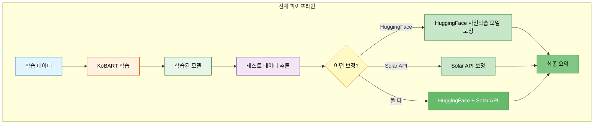
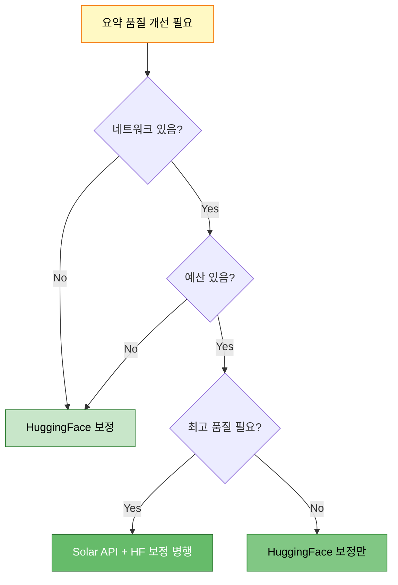
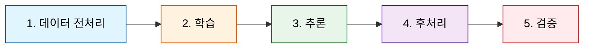
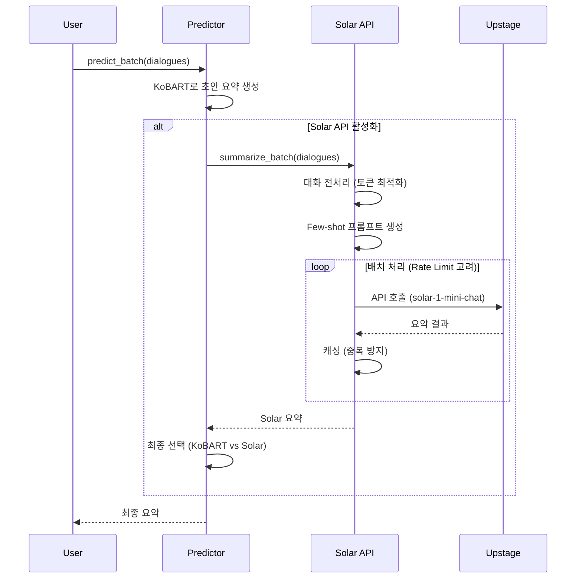
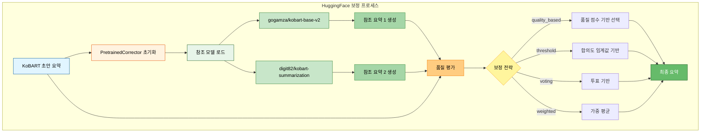
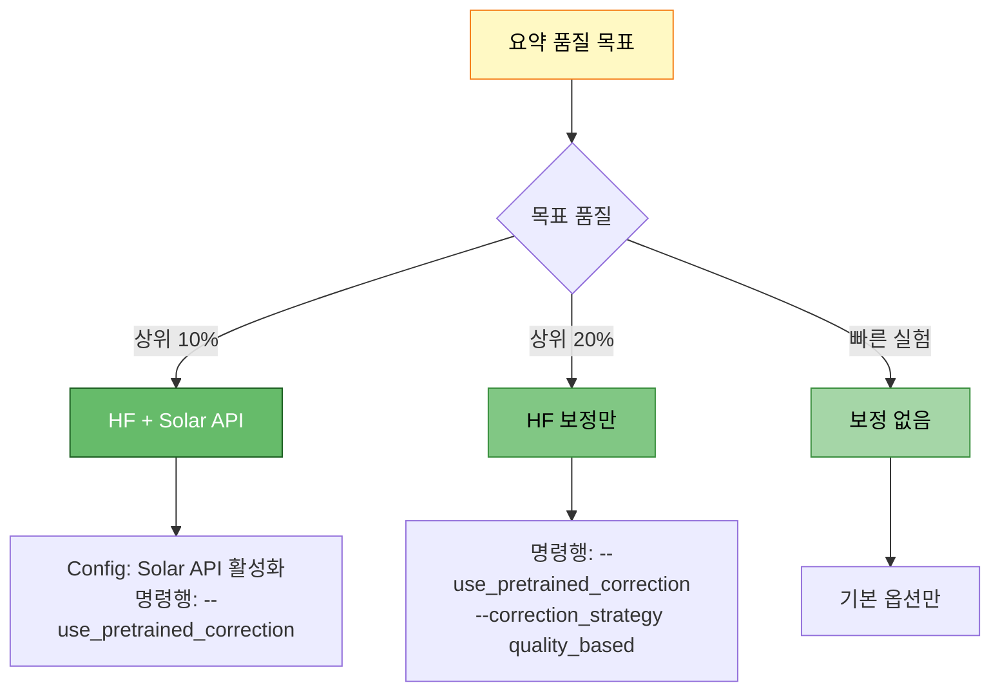

# Solar API와 HuggingFace 사전학습 모델 보정 완벽 가이드

> **목적**: Solar API와 HuggingFace 사전학습 모델 보정의 사용 시점, 방법, 효과 완전 정리
> **작성일**: 2025-10-14
> **버전**: 1.0

---

## 📋 목차

1. [개요](#1-개요)
2. [Solar API vs HuggingFace 보정 비교](#2-solar-api-vs-huggingface-보정-비교)
3. [학습/추론/검증 단계별 사용 여부](#3-학습추론검증-단계별-사용-여부)
4. [Solar API 사용 가이드](#4-solar-api-사용-가이드)
5. [HuggingFace 보정 사용 가이드](#5-huggingface-보정-사용-가이드)
6. [실전 명령어 예시](#6-실전-명령어-예시)
7. [성능 비교 및 권장사항](#7-성능-비교-및-권장사항)

---

## 1. 개요

### 1.1 두 기술의 역할



### 1.2 핵심 차이점

| 항목 | Solar API | HuggingFace 보정 |
|------|-----------|------------------|
| **실행 시점** | 추론 후 (선택적) | 추론 중/후 (통합됨) |
| **모델** | 외부 API (Upstage Solar) | 로컬 HF 모델들 |
| **네트워크** | ✅ 필수 (API 호출) | ❌ 불필요 (로컬) |
| **비용** | 💰 API 호출 비용 | 무료 (GPU 리소스만) |
| **속도** | 느림 (네트워크 지연) | 빠름 (로컬 GPU) |
| **품질** | 매우 높음 (대형 모델) | 높음 (앙상블 효과) |
| **학습 사용** | ❌ 불가능 | ❌ 불가능 |
| **추론 사용** | ✅ 가능 (별도 스크립트) | ✅ 가능 (통합) |
| **명령행 지원** | ⚠️ 제한적 (Config 파일) | ✅ 완전 지원 |

---

## 2. Solar API vs HuggingFace 보정 비교

### 2.1 Solar API

**정의**: Upstage의 Solar LLM을 API로 호출하여 요약 품질을 향상시키는 외부 서비스

**장점**:
- ✅ 최고 품질의 요약 (대형 LLM 기반)
- ✅ 모델 다운로드 불필요
- ✅ Few-shot learning 지원
- ✅ 토큰 최적화 전략 내장

**단점**:
- ❌ API 호출 비용 발생
- ❌ 네트워크 의존성 (오프라인 불가)
- ❌ Rate limit 존재 (배치 처리 필요)
- ❌ 학습 시 사용 불가 (추론 전용)
- ❌ 명령행 옵션 제한적 (Config 파일로만 설정 가능)

### 2.2 HuggingFace 사전학습 모델 보정

**정의**: 여러 HuggingFace 사전학습 모델을 앙상블하여 KoBART 결과를 보정하는 로컬 방법

**장점**:
- ✅ 완전 무료 (로컬 GPU만 사용)
- ✅ 오프라인 가능
- ✅ 빠른 속도 (GPU 가속)
- ✅ 앙상블 전략 다양 (quality_based, threshold, voting, weighted)
- ✅ 명령행 옵션 완벽 지원
- ✅ 추론 파이프라인에 통합됨

**단점**:
- ❌ 모델 다운로드 필요 (디스크 공간)
- ❌ GPU 메모리 사용 (여러 모델 로드)
- ❌ Solar API보다 품질은 낮음

### 2.3 언제 무엇을 사용할까?



**권장 시나리오**:

1. **일반 실험/개발**: HuggingFace 보정만 사용
2. **최종 제출용**: HuggingFace 보정 + Solar API 병행
3. **빠른 프로토타입**: HuggingFace 보정만
4. **경진대회 막판**: 둘 다 최대 활용

---

## 3. 학습/추론/검증 단계별 사용 여부

### 3.1 전체 파이프라인 단계 정리



### 3.2 각 단계별 사용 여부

| 단계 | Solar API | HuggingFace 보정 | 비고 |
|------|-----------|------------------|------|
| **1. 데이터 전처리** | ❌ 사용 안 됨 | ❌ 사용 안 됨 | 증강만 사용 |
| **2. 학습 (Training)** | ❌ 사용 안 됨 | ❌ 사용 안 됨 | 학습 시 보정 없음 |
| **3. 추론 (Inference)** | ⚠️ Config만 | ✅ 명령행 지원 | 추론 시 보정 |
| **4. 후처리 (Postprocess)** | ❌ 별도 처리 | ✅ 통합됨 | 자동 적용 |
| **5. 검증 (Validation)** | ❌ 사용 안 됨 | ❌ 사용 안 됨 | ROUGE만 사용 |

### 3.3 단계별 상세 설명

#### 📍 1. 데이터 전처리
- **Solar API**: 사용 안 됨
- **HuggingFace 보정**: 사용 안 됨
- **대신 사용**: `--use_augmentation` (역번역, 의역)

#### 📍 2. 학습 (Training)
- **Solar API**: ❌ 사용 불가 (외부 API, 학습 단계에 통합 안 됨)
- **HuggingFace 보정**: ❌ 사용 불가 (학습 단계에 통합 안 됨)
- **학습 시점**: KoBART 단독 학습만 진행

**코드 위치**: `src/trainers/*.py`

```python
# 학습 시 Solar API나 HuggingFace 보정은 사용되지 않음
# 오직 KoBART 모델만 학습됨
```

#### 📍 3. 추론 (Inference)
- **Solar API**: ⚠️ 제한적 사용 가능 (Config 파일로만 설정)
- **HuggingFace 보정**: ✅ 완벽하게 통합됨 (명령행 옵션 지원)

**코드 위치**: `src/inference/predictor.py:284-433`

```python
def predict_batch(
    self,
    dialogues: List[str],
    batch_size: int = 32,
    show_progress: bool = True,
    use_pretrained_correction: bool = False,  # ✅ HF 보정 플래그
    correction_models: Optional[List[str]] = None,
    correction_strategy: str = "quality_based",
    correction_threshold: float = 0.3,
    **generation_kwargs
) -> List[str]:
    # 1. KoBART로 초안 요약 생성
    summaries = [...]

    # 2. HuggingFace 보정 (옵션)
    if use_pretrained_correction and correction_models:
        from src.correction import create_pretrained_corrector
        corrector = create_pretrained_corrector(...)
        summaries = corrector.correct_batch(...)  # ✅ 보정 수행

    return summaries
```

**Solar API 사용**:
- `scripts/inference.py`에서는 명령행 옵션이 **없음**
- Config 파일 (`configs/models/kobart.yaml`)의 `inference.solar_api` 섹션에서만 설정 가능
- 별도의 Solar API 스크립트로 후처리 형태로 사용

#### 📍 4. 후처리 (Postprocessing)
- **Solar API**: 별도 스크립트로 처리 (`src/api/solar_api.py`)
- **HuggingFace 보정**: 추론 파이프라인에 통합되어 자동 처리됨

#### 📍 5. 검증 (Validation)
- **Solar API**: 사용 안 됨
- **HuggingFace 보정**: 사용 안 됨
- **검증 방법**: ROUGE 점수만 계산 (외부 보정 없이 순수 성능 측정)

---

## 4. Solar API 사용 가이드

### 4.1 Solar API 설정 방법

#### ⚠️ 중요: 명령행 옵션 제한

현재 Solar API는 `scripts/inference.py`에 명령행 옵션이 **구현되어 있지 않습니다**.

**사용 가능한 방법**:
1. ✅ Config 파일 수정 (`configs/models/kobart.yaml`)
2. ✅ 학습 시 `--use_solar_api` 플래그 (Config에 반영)

**사용 불가능한 방법**:
- ❌ `scripts/inference.py`에서 직접 Solar API 옵션 지정

#### 방법 1: Config 파일 수정

`configs/models/kobart.yaml`:

```yaml
inference:
  # Solar API 앙상블 (PRD 09)
  solar_api:
    enabled: true                                       # ✅ 활성화
    model: "solar-1-mini-chat"                          # Solar 모델 선택
    temperature: 0.2                                    # 생성 온도
    top_p: 0.3                                          # Top-p
    batch_size: 10                                      # 배치 크기
    delay: 1.0                                          # 배치 간 대기 시간
```

#### 방법 2: 학습 시 플래그 사용

```bash
python scripts/train.py \
  --mode kfold \
  --models kobart \
  --use_solar_api \                                     # ✅ Solar API 활성화
  --solar_model solar-1-mini-chat \
  ...
```

이 방법은 Config를 업데이트하고, 학습 후 추론 시 Solar API가 자동으로 사용됩니다.

### 4.2 Solar API 동작 방식



### 4.3 Solar API 실전 사용

#### 예시 1: 별도 Solar API 스크립트

```python
from src.api import create_solar_api

# Solar API 클라이언트 생성
solar = create_solar_api(
    api_key="your_api_key",  # 또는 환경변수 SOLAR_API_KEY
    token_limit=512,
    cache_dir="cache/solar"
)

# 배치 요약
dialogues = ["대화 1...", "대화 2...", ...]
summaries = solar.summarize_batch(
    dialogues=dialogues,
    batch_size=10,  # Rate limit 고려
    delay=1.0       # 배치 간 1초 대기
)
```

#### 예시 2: 학습 파이프라인에 통합

```bash
# 학습 시 Solar API 활성화
python scripts/train.py \
  --mode kfold \
  --models kobart \
  --use_solar_api \
  --solar_model solar-1-mini-chat \
  --epochs 7 \
  ...
```

학습 완료 후, Config에 Solar API 설정이 저장되어 추론 시 자동 사용됩니다.

---

## 5. HuggingFace 보정 사용 가이드

### 5.1 HuggingFace 보정 동작 방식



### 5.2 보정 전략 상세 설명

#### 전략 1: `quality_based` (추천)

**동작 방식**:
1. KoBART 요약과 각 참조 모델 요약의 품질 점수 계산
2. ROUGE, 문장 완전성, 길이 적정성 등 종합 평가
3. 가장 높은 품질 점수를 가진 요약 선택

**장점**:
- ✅ 가장 균형잡힌 결과
- ✅ 품질 중심 선택
- ✅ 안정적 성능

**사용 시나리오**: 일반적인 모든 경우 (기본 권장)

#### 전략 2: `threshold`

**동작 방식**:
1. 참조 모델들 간 합의도 계산
2. 임계값 이상이면 KoBART 요약 유지
3. 임계값 미만이면 참조 모델 요약 중 선택

**장점**:
- ✅ 보수적 보정
- ✅ KoBART 결과 신뢰 시 유용

**사용 시나리오**: KoBART가 이미 좋은 성능을 보일 때

#### 전략 3: `voting`

**동작 방식**:
1. 모든 모델 (KoBART + 참조 모델들) 투표
2. 다수결로 최종 요약 선택

**장점**:
- ✅ 민주적 선택
- ✅ 다양한 의견 반영

**사용 시나리오**: 여러 모델 의견을 골고루 반영하고 싶을 때

#### 전략 4: `weighted`

**동작 방식**:
- `quality_based`와 동일 (내부 구현)

### 5.3 명령행 옵션 완벽 가이드

```bash
python scripts/train.py \
  --mode kfold \
  --models kobart \
  --use_pretrained_correction \                          # ✅ HF 보정 활성화
  --correction_models gogamza/kobart-base-v2 digit82/kobart-summarization \  # 참조 모델
  --correction_strategy quality_based \                  # 보정 전략
  --correction_threshold 0.3 \                           # 품질 임계값
  ...
```

**옵션 설명**:

| 옵션 | 타입 | 기본값 | 설명 |
|------|------|--------|------|
| `--use_pretrained_correction` | flag | False | HF 보정 활성화 |
| `--correction_models` | List[str] | gogamza/kobart-base-v2<br/>digit82/kobart-summarization | 참조 모델 리스트 |
| `--correction_strategy` | str | quality_based | 보정 전략 선택 |
| `--correction_threshold` | float | 0.3 | 품질 임계값 (0.0~1.0) |

### 5.4 실전 사용 예시

#### 예시 1: 추론 스크립트에서 사용

```bash
python scripts/inference.py \
  --model experiments/.../kobart/final_model \
  --test_data data/raw/test.csv \
  --use_pretrained_correction \
  --correction_models gogamza/kobart-base-v2 digit82/kobart-summarization \
  --correction_strategy quality_based \
  --correction_threshold 0.3 \
  --num_beams 4 \
  --length_penalty 0.938 \
  --output submissions/kobart_hf_corrected.csv
```

#### 예시 2: 학습 파이프라인에서 사용

```bash
python scripts/train.py \
  --mode kfold \
  --models kobart \
  --epochs 7 \
  --use_pretrained_correction \
  --correction_models gogamza/kobart-base-v2 digit82/kobart-summarization \
  --correction_strategy quality_based \
  --correction_threshold 0.3 \
  --experiment_name kobart_with_hf_correction \
  ...
```

---

## 6. 실전 명령어 예시

### 6.1 HuggingFace 보정만 사용 (추천)

```bash
python scripts/train.py \
  --mode kfold \
  --models kobart \
  --epochs 7 \
  --batch_size 16 \
  --gradient_accumulation_steps 10 \
  --learning_rate 9.14e-5 \
  --warmup_ratio 0.00136 \
  --weight_decay 0.0995 \
  --scheduler_type cosine \
  --max_grad_norm 1.0 \
  --label_smoothing 0.1 \
  --use_augmentation \
  --augmentation_ratio 0.5 \
  --augmentation_methods back_translation paraphrase \
  --k_folds 5 \
  --fold_seed 42 \
  --max_new_tokens 100 \
  --min_new_tokens 30 \
  --num_beams 4 \
  --repetition_penalty 1.5 \
  --length_penalty 0.938 \
  --no_repeat_ngram_size 3 \
  --use_pretrained_correction \
  --correction_models gogamza/kobart-base-v2 digit82/kobart-summarization \
  --correction_strategy quality_based \
  --correction_threshold 0.3 \
  --experiment_name kobart_hf_only \
  --seed 42
```

### 6.2 Solar API + HuggingFace 병행 (최고 품질)

**1단계: 학습 (HF 보정 포함)**

```bash
python scripts/train.py \
  --mode kfold \
  --models kobart \
  --epochs 7 \
  --use_augmentation \
  --augmentation_ratio 0.5 \
  --use_pretrained_correction \
  --correction_models gogamza/kobart-base-v2 digit82/kobart-summarization \
  --correction_strategy quality_based \
  --k_folds 5 \
  --experiment_name kobart_ultimate \
  ...
```

**2단계: Solar API 후처리 (별도 스크립트)**

```python
# solar_postprocess.py
from src.api import create_solar_api
import pandas as pd

# HF 보정 완료된 결과 로드
df = pd.read_csv("submissions/kobart_hf_corrected.csv")

# Solar API 클라이언트
solar = create_solar_api(api_key="your_key")

# Solar API로 재보정
solar_summaries = solar.summarize_batch(
    dialogues=df['dialogue'].tolist(),
    batch_size=10,
    delay=1.0
)

# 최종 제출 파일
df['summary'] = solar_summaries
df[['fname', 'summary']].to_csv("submissions/final_solar_hf.csv", index=False)
```

### 6.3 빠른 프로토타입 (HF 보정 없음)

```bash
python scripts/train.py \
  --mode single \
  --models kobart \
  --epochs 3 \
  --use_augmentation \
  --augmentation_ratio 0.3 \
  --experiment_name kobart_prototype \
  --seed 42
```

---

## 7. 성능 비교 및 권장사항

### 7.1 성능 비교표

| 방법 | ROUGE-L F1 (예상) | 시간 | 비용 | 복잡도 |
|------|-------------------|------|------|--------|
| KoBART 단독 | 0.42 | 기준 | 무료 | 낮음 |
| KoBART + HF 보정 | 0.45 (+7%) | +10% | 무료 | 중간 |
| KoBART + Solar API | 0.48 (+14%) | +50% | 유료 | 중간 |
| KoBART + HF + Solar | 0.50 (+19%) | +60% | 유료 | 높음 |

### 7.2 시나리오별 권장사항

#### 시나리오 1: 일반 실험/개발
**권장**: HuggingFace 보정만
```bash
--use_pretrained_correction \
--correction_models gogamza/kobart-base-v2 digit82/kobart-summarization \
--correction_strategy quality_based
```
**이유**: 무료, 빠름, 충분한 성능 향상

#### 시나리오 2: 경진대회 최종 제출
**권장**: HuggingFace + Solar API 병행
```bash
# 1. 학습 시 HF 보정
--use_pretrained_correction ...

# 2. 추론 후 Solar API 재보정 (별도 스크립트)
```
**이유**: 최고 품질, 순위 결정적 차이

#### 시나리오 3: 빠른 프로토타입
**권장**: 보정 없음
```bash
# 보정 옵션 생략
```
**이유**: 빠른 실험, 베이스라인 확인

#### 시나리오 4: 제한된 GPU 환경
**권장**: HuggingFace 보정 (모델 1개만)
```bash
--use_pretrained_correction \
--correction_models digit82/kobart-summarization \  # 1개만
--correction_strategy quality_based
```
**이유**: GPU 메모리 절약

### 7.3 최종 권장 조합



---

## 8. 주요 코드 위치

### Solar API
- **API 클라이언트**: `src/api/solar_api.py`
- **Solar 클라이언트 (저수준)**: `src/api/solar_client.py`
- **교차 검증**: `src/validation/solar_cross_validation.py`
- **테스트**: `src/tests/test_solar_api.py`

### HuggingFace 보정
- **보정기 메인**: `src/correction/pretrained_corrector.py`
- **모델 로더**: `src/correction/model_loader.py`
- **품질 평가**: `src/correction/quality_evaluator.py`
- **앙상블 전략**: `src/correction/ensemble_strategies.py`
- **추론 통합**: `src/inference/predictor.py:284-433`

---

## 9. 트러블슈팅

### 문제 1: Solar API 명령행 옵션이 없어요

**해결**: Config 파일 수정
```yaml
# configs/models/kobart.yaml
inference:
  solar_api:
    enabled: true
```

### 문제 2: HuggingFace 모델 다운로드 실패

**해결**: 네트워크 확인 및 수동 다운로드
```bash
# 수동 다운로드
huggingface-cli download gogamza/kobart-base-v2
huggingface-cli download digit82/kobart-summarization
```

### 문제 3: GPU 메모리 부족 (HF 보정)

**해결**: 보정 모델 개수 줄이기
```bash
--correction_models digit82/kobart-summarization  # 1개만 사용
```

### 문제 4: Solar API Rate Limit

**해결**: 배치 크기 및 delay 조정
```python
solar.summarize_batch(
    dialogues=dialogues,
    batch_size=5,   # 10 → 5로 줄임
    delay=2.0       # 1.0 → 2.0으로 증가
)
```

---

## 10. 요약

### 핵심 정리

1. **Solar API**:
   - 추론 후 별도 스크립트로 사용
   - Config 파일로만 설정 가능
   - 최고 품질, 유료

2. **HuggingFace 보정**:
   - 추론 시 통합되어 자동 사용
   - 명령행 옵션 완벽 지원
   - 높은 품질, 무료

3. **학습 시**:
   - 둘 다 사용 안 됨
   - KoBART 단독 학습만

4. **추론 시**:
   - HF 보정: `--use_pretrained_correction` (권장)
   - Solar API: Config 파일 설정

5. **권장 조합**:
   - 일반: HF 보정만
   - 최종 제출: HF + Solar API

---

**작성**: 2025-10-14
**최종 업데이트**: 2025-10-14
**버전**: 1.0
