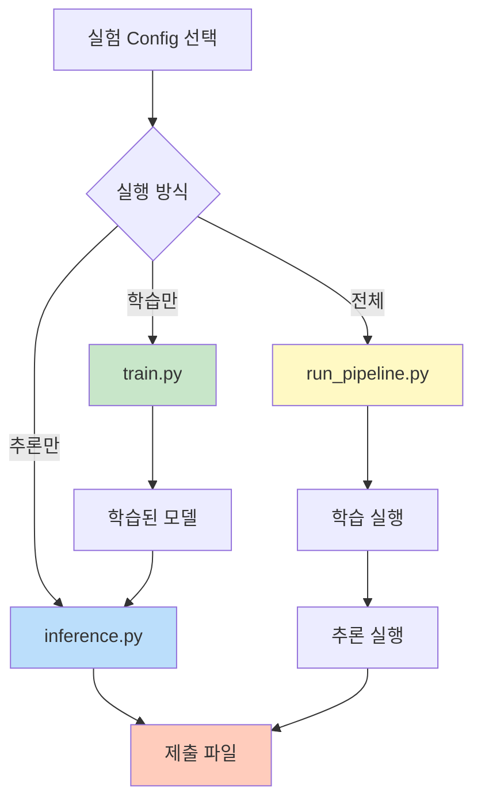

# 스크립트 사용법 가이드

## 📋 목차
1. [스크립트 개요](#스크립트-개요)
2. [학습 스크립트](#학습-스크립트)
3. [추론 스크립트](#추론-스크립트)
4. [전체 파이프라인](#전체-파이프라인)

---

## 📝 스크립트 개요

### 사용 가능한 스크립트

| 스크립트 | 설명 | 용도 |
|---------|------|------|
| `train.py` | 모델 학습 | Config 기반 학습 실행 |
| `inference.py` | 추론 및 제출 파일 생성 | 학습된 모델로 예측 |
| `run_pipeline.py` | 전체 파이프라인 | 학습 + 추론 한 번에 실행 |

### 실행 플로우



---

## 🚀 학습 스크립트

### 기본 사용법

```bash
# 가상환경 활성화
source ~/.pyenv/versions/nlp_py3_11_9/bin/activate

# 학습 실행
python scripts/train.py --experiment baseline_kobart
```

### 명령어 옵션

```bash
python scripts/train.py --help
```

**옵션:**
- `--experiment` (필수): 실험 이름 (Config 파일명)
- `--debug`: 디버그 모드 (작은 데이터셋, 2 에포크, WandB 비활성화)

### 사용 예시

#### 1. 기본 학습

```bash
python scripts/train.py --experiment baseline_kobart
```

**실행 단계:**
1. Config 로딩 (`configs/experiments/baseline_kobart.yaml`)
2. 데이터 로딩 (train.csv, dev.csv)
3. 모델 로딩 (KoBART)
4. Dataset 생성
5. 학습 실행 (WandB 로깅)
6. 모델 저장 (`outputs/baseline_kobart/`)

#### 2. 디버그 모드 (빠른 테스트)

```bash
python scripts/train.py --experiment baseline_kobart --debug
```

**디버그 모드 설정:**
- 데이터: 학습 100개, 검증 20개만 사용
- 에포크: 2회
- 배치 크기: 4
- WandB: 비활성화

**출력 예시:**
```
============================================================
학습 시작: baseline_kobart
============================================================

[1/6] Config 로딩...
  ⚠️ 디버그 모드 활성화
  ✅ Config 로드 완료 (seed: 42)

[2/6] 데이터 로딩...
  ⚠️ 디버그: 학습 100개, 검증 20개
  ✅ 학습 데이터: 100개
  ✅ 검증 데이터: 20개

[3/6] 모델 로딩...
============================================================
모델 및 토크나이저 로딩 시작
============================================================
토크나이저 로딩: digit82/kobart-summarization
모델 로딩: digit82/kobart-summarization
  → 디바이스: cuda
  → 전체 파라미터: 123,859,968
  → 학습 가능 파라미터: 123,859,968
============================================================
✅ 모델 및 토크나이저 로딩 완료
============================================================
  ✅ 모델 로드 완료

[4/6] Dataset 생성...
  ✅ 학습 Dataset: 100개
  ✅ 검증 Dataset: 20개

[5/6] 학습 시작...
============================================================
모델 학습 시작
============================================================

학습 진행 중...
[학습 로그...]

최종 모델 저장 중...
  → 모델 저장 위치: outputs/baseline_kobart/final_model

최종 평가 중...

최종 평가 결과:
  eval_rouge1: 0.3456
  eval_rouge2: 0.1234
  eval_rougeL: 0.2890
  eval_rouge_sum: 0.7580

============================================================
✅ 학습 완료!
============================================================

[6/6] 학습 완료!
  최종 모델 저장: outputs/baseline_kobart/final_model
  최상 체크포인트: outputs/baseline_kobart/checkpoint-100

  최종 평가 결과:
    eval_rouge1: 0.3456
    eval_rouge2: 0.1234
    eval_rougeL: 0.2890
    eval_rouge_sum: 0.7580

============================================================
🎉 학습 완료!
============================================================
```

---

## 🔮 추론 스크립트

### 기본 사용법

```bash
python scripts/inference.py \
    --model outputs/baseline_kobart/final_model \
    --output submissions/submission.csv
```

### 명령어 옵션

```bash
python scripts/inference.py --help
```

**옵션:**
- `--model` (필수): 모델 체크포인트 경로
- `--output` (필수): 제출 파일 출력 경로
- `--test_data`: 테스트 데이터 경로 (기본: `data/raw/test.csv`)
- `--batch_size`: 추론 배치 크기 (기본: 32)
- `--num_beams`: Beam search 빔 개수 (기본: 4)
- `--experiment`: Config 이름 (생성 파라미터용, 기본: `baseline_kobart`)

### 사용 예시

#### 1. 기본 추론

```bash
python scripts/inference.py \
    --model outputs/baseline_kobart/final_model \
    --output submissions/submission.csv
```

#### 2. 특정 체크포인트 사용

```bash
python scripts/inference.py \
    --model outputs/baseline_kobart/checkpoint-1000 \
    --output submissions/checkpoint_1000.csv
```

#### 3. 추론 파라미터 조정

```bash
python scripts/inference.py \
    --model outputs/baseline_kobart/final_model \
    --output submissions/submission.csv \
    --batch_size 16 \
    --num_beams 8
```

**출력 예시:**
```
============================================================
추론 시작
============================================================

[1/5] Config 로딩...
  ✅ Config 로드 완료: baseline_kobart

[2/5] 모델 로딩: outputs/baseline_kobart/final_model
  ✅ 모델 로드 완료
  모델 파라미터: 123,859,968

[3/5] 테스트 데이터 로딩: data/raw/test.csv
  ✅ 테스트 샘플: 2500개

[4/5] 추론 실행...
============================================================
제출 파일 생성 시작
============================================================

샘플 수: 2500
Predicting: 100%|██████████| 79/79 [02:15<00:00,  1.71s/it]

✅ 제출 파일 저장 완료: submissions/submission.csv
============================================================

[5/5] 추론 완료!
  ✅ 제출 파일 생성: submissions/submission.csv
  샘플 수: 2500

  샘플 예측 결과 (처음 3개):
    [test_001]: 두 사람이 인사를 나누었다...
    [test_002]: 날씨가 좋아서 산책을 가기로 했다...
    [test_003]: 점심 메뉴로 김치찌개를 선택했다...

============================================================
🎉 추론 완료!
============================================================
```

---

## 🔄 전체 파이프라인

### 기본 사용법

```bash
python scripts/run_pipeline.py --experiment baseline_kobart
```

### 명령어 옵션

**옵션:**
- `--experiment` (필수): 실험 이름
- `--skip_training`: 학습 건너뛰기 (기존 모델 사용)
- `--model_path`: 추론에 사용할 모델 경로 (skip_training 시 필수)
- `--output`: 제출 파일 출력 경로 (기본: `submissions/submission.csv`)

### 사용 예시

#### 1. 전체 파이프라인 실행 (학습 + 추론)

```bash
python scripts/run_pipeline.py --experiment baseline_kobart
```

**실행 플로우:**
```
[단계 1/2] 학습 시작
  → train.py 실행
  → 모델 저장: outputs/baseline_kobart/final_model

[단계 2/2] 추론 시작
  → inference.py 실행
  → 제출 파일: submissions/submission.csv

🎉 전체 파이프라인 완료!
```

#### 2. 추론만 실행 (학습 건너뛰기)

```bash
python scripts/run_pipeline.py \
    --experiment baseline_kobart \
    --skip_training \
    --model_path outputs/baseline_kobart/final_model \
    --output submissions/submission_v2.csv
```

---

## 📊 실행 시간 예상

### 학습 (train.py)

| 설정 | 데이터 크기 | 에포크 | 예상 시간 (A6000) |
|------|-----------|--------|------------------|
| 디버그 모드 | 100개 | 2 | ~2분 |
| 전체 (baseline) | 12,457개 | 20 | ~4-6시간 |

### 추론 (inference.py)

| 데이터 크기 | 배치 크기 | 예상 시간 (A6000) |
|-----------|---------|------------------|
| 2,500개 | 32 | ~3-5분 |
| 2,500개 | 16 | ~5-7분 |

---

## 🐛 문제 해결

### 문제 1: CUDA out of memory (학습)

```bash
# 해결: 디버그 모드로 테스트
python scripts/train.py --experiment baseline_kobart --debug

# 또는 Config 수정
# configs/experiments/baseline_kobart.yaml
training:
  batch_size: 16  # 50 → 16으로 줄이기
```

### 문제 2: WandB 로그인 필요

```bash
# 해결 1: WandB 로그인
wandb login

# 해결 2: 디버그 모드 사용 (WandB 자동 비활성화)
python scripts/train.py --experiment baseline_kobart --debug
```

### 문제 3: 모델 경로 찾을 수 없음 (추론)

```bash
# 해결: 정확한 경로 확인
ls -la outputs/baseline_kobart/

# 올바른 경로 사용
python scripts/inference.py \
    --model outputs/baseline_kobart/final_model \
    --output submissions/submission.csv
```

---

## 💡 실전 활용 패턴

### 패턴 1: 빠른 프로토타입 테스트

```bash
# 1. 디버그 모드로 빠른 학습
python scripts/train.py --experiment baseline_kobart --debug

# 2. 학습된 모델로 추론 테스트
python scripts/inference.py \
    --model outputs/baseline_kobart/final_model \
    --output submissions/debug_test.csv \
    --batch_size 4
```

### 패턴 2: 여러 체크포인트 비교

```bash
# 각 체크포인트로 추론 실행
for checkpoint in checkpoint-500 checkpoint-1000 checkpoint-1500 final_model
do
    python scripts/inference.py \
        --model outputs/baseline_kobart/$checkpoint \
        --output submissions/${checkpoint}.csv
done
```

### 패턴 3: 하이퍼파라미터 실험

```bash
# 실험 1: 높은 learning rate
python scripts/train.py --experiment high_lr_kobart

# 실험 2: 큰 배치 크기
python scripts/train.py --experiment large_batch_kobart

# 각 실험 결과 추론
python scripts/inference.py --model outputs/high_lr_kobart/final_model --output submissions/high_lr.csv
python scripts/inference.py --model outputs/large_batch_kobart/final_model --output submissions/large_batch.csv
```

---

## 🔗 관련 문서

- [00_전체_시스템_개요.md](./00_전체_시스템_개요.md) - 시스템 아키텍처
- [빠른_시작_가이드.md](./빠른_시작_가이드.md) - 5분 안에 시작하기

---